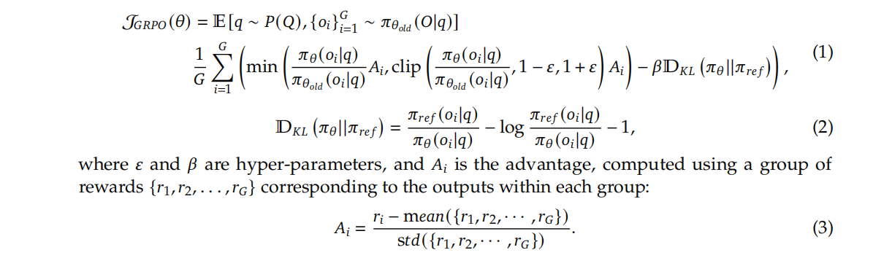

这篇论文的核心在于探索了**纯强化学习**在不依赖大规模监督微调（SFT）的情况下，提升模型推理能力的潜力。

**主要贡献可以概括为以下几点：**

*   **提出 DeepSeek-R1-Zero**：这是一个“纯粹”的强化学习模型，直接在基础模型上进行训练，没有经过任何有监督的微调。它证明了仅通过强化学习，模型就能够自发学习到复杂的推理行为，如思维链（CoT）、自我验证和反思。
*   **发布 DeepSeek-R1**：这是在 DeepSeek-R1-Zero 的基础上，通过多阶段训练和引入少量“冷启动”数据进一步优化得到的模型。它在多个推理任务上达到了与 OpenAI-o1-1217（据信是 GPT-4o 的早期版本）相媲美的性能。
*   **验证了蒸馏的有效性**：研究表明，将 DeepSeek-R1 这样强大模型的推理能力蒸馏到更小的模型中，效果显著。例如，经过蒸馏的 14B 模型在性能上甚至超过了开源的 Qwen-32B-Preview 模型。
*   **开源贡献**：团队开源了 DeepSeek-R1-Zero、DeepSeek-R1 以及一系列从 1.5B 到 70B 的蒸馏模型，极大地推动了社区在模型推理能力方面的研究。

---

#### **2. 方法论：从 R1-Zero 到 R1**

##### **2.1 DeepSeek-R1-Zero：纯粹的强化学习探索**

*   **动机**：摆脱对大规模、高质量监督数据的依赖，探索模型自我进化的可能性。
*   **训练方式**：
    *   **算法**：采用名为 **GRPO (Group Relative Policy Optimization)** 的强化学习算法，这是一种无需评论家（Critic）模型的策略优化方法，可以节省训练成本。

    *  **奖励模型**：使用基于规则的奖励系统，主要分为两部分：
        1.  **准确性奖励**：针对有确定答案的问题（如数学、编程），直接判断最终答案是否正确。
        2.  **格式奖励**：强制模型将思考过程和最终答案分别放入 `<think>` 和 `<answer>` 标签中，便于分析。
*   **“Aha Moment”**：在训练过程中，模型展现出了一个有趣的“顿悟时刻”，即模型会主动地重新评估自己的解题步骤，并进行修正，这表明模型在自主学习如何进行更深层次的思考。
*   **存在的问题**：虽然推理能力强大，但 DeepSeek-R1-Zero 生成的内容可读性差，并且会出现语言混杂的问题。

##### **2.2 DeepSeek-R1：更实用、性能更强的版本**

为了解决 R1-Zero 的问题并进一步提升性能，DeepSeek-R1 采用了**多阶段的训练流程**：

1.  **冷启动 (Cold Start)**：收集了数千条高质量的思维链数据对基础模型进行微调。这一步旨在让模型初步具备生成结构清晰、可读性强的推理过程的能力。
2.  **面向推理的强化学习**：在冷启动微调后的模型上，进行大规模的强化学习训练，专注于提升其在编码、数学、科学和逻辑推理等方面的能力。引入 language consistency reward
3.  **拒绝采样与监督微调**：去掉混乱、难阅读、错误的，筛选出正确的推理轨迹，并结合其他领域的有监督数据，对模型进行新一轮的监督微调，以增强模型的通用能力。
4.  **面向所有场景的强化学习**：最后，再次引入强化学习，旨在提升模型在通用场景下的有用性（Helpfulness）和无害性（Harmlessness），同时进一步优化其推理能力。

---

#### **3. 实验结果**
!!! note
    研究者首先选择了涵盖数学、编程、通用知识和开放式问答等多个维度的权威基准。在评估方法上，他们为了测试模型最纯粹的、不受干扰的推理能力，特意采用了 0-shot 设置，因为实验发现少样本提示反而会损害性能。同时，为了获得更稳定和可靠的评估结果，他们放弃了容易出错的贪心解码，转而使用非零温度生成多个候选答案，并以 pass@1 作为核心指标。最后，通过与 OpenAI、Claude 等业界顶尖模型以及优秀的开源模型进行对比，有力地证明了 DeepSeek-R1 在推理能力上的领先地位。

在向模型提问时，只给出任务描述和问题本身，不提供任何解题范例（Example）。
选择理由（这一点对 DeepSeek-R1 至关重要）：
避免干扰模型的“自然”推理：论文在第3节和第5节都明确提到，少样本（Few-shot）提示反而会损害 DeepSeek-R1 的性能。这是因为 DeepSeek-R1 通过强化学习形成了自己独特的、内在的推理模式。如果给它一个固定的范例，反而会限制或干扰它自己的最优解题路径。
测试模型的泛化能力：0-shot 最能体现模型在没有任何“拐杖”的情况下，独立理解和解决问题的能力。这是一种更严格、更纯粹的能力测试。

- 温度 (Temperature)：一个控制生成文本随机性的参数。温度为 0（即 Greedy Decoding）意味着模型在每一步总是选择概率最高的词，输出是确定的。非零温度（论文中设为 0.6）则引入了随机性，使得模型可以生成多样化的输出。
- pass@k：一种评估指标。首先，使用非零温度为同一个问题生成 k 个不同的答案，然后检查这 k 个答案中是否有至少一个是正确的。pass@1 则是基于这 k 次尝试来估算单次尝试的成功率。
- 选择理由：避免“贪心陷阱”，评估更稳定：论文明确指出，使用温度为 0 的贪心解码来评估长推理模型时，会导致高重复率和结果的巨大波动。有时候，正确的推理路径可能不是每一步都由最高概率的词构成，贪心策略可能会早早地走上一条错误的死路。
更真实地反映模型能力：非零温度允许多次采样，pass@k 这种方式可以更稳定、更鲁棒地衡量模型解决问题的“真实本领”，而不是仅仅依赖单次生成的“运气”。这对于复杂的推理任务尤为重要。
*   **推理任务**：在 AIME 2024（美国数学邀请赛）和 MATH-500 等数学基准测试中，DeepSeek-R1 的表现与 OpenAI-o1-1217 相当，甚至略有超出。在编程任务上，其 Codeforces 评分也达到了顶尖水平。
*   **知识密集型任务**：在 MMLU、MMLU-Pro 等知识类基准上，DeepSeek-R1 也展现出了强大的性能。
*   **蒸馏模型**：通过将 DeepSeek-R1 的能力蒸馏到更小的模型上，例如 DeepSeek-R1-Distill-Qwen-32B，其性能在多个基准上显著优于 OpenAI-o1-mini。

---

#### **4. 讨论与结论**

*   **强化学习 vs. 蒸馏**：研究发现，对于较小的模型而言，直接从一个强大的“教师模型”那里进行蒸馏，比自己从头开始进行大规模强化学习训练，效果更好且更经济。
*   **局限性**：尽管 DeepSeek-R1 在推理方面表现出色，但在某些通用能力（如函数调用、多轮对话）上仍不及 DeepSeek-V3。此外，它对提示词比较敏感，且在处理非中英文的语言时可能会出现语言混杂。

---

### PRM (Process Reward Model) 讲解

在论文的 4.2 节“不成功的尝试”中，作者提到了过程奖励模型（Process Reward Model, PRM），并解释了为什么他们最终没有采用这种方法。

#### **什么是 PRM？**

PRM，即过程奖励模型，是一种旨在**评估语言模型在解决问题过程中的每一步推理的正确性，而不仅仅是看最终结果**的奖励模型。

*   **传统奖励模型 (Outcome Reward Model - ORM)**：只关心最终答案是否正确。例如，一道数学题，无论中间过程多么离谱，只要最终答案对了，ORM 就会给出高分。这可能导致模型“碰巧”蒙对答案，而没有真正学会解题方法。
*   **过程奖励模型 (PRM)**：会将模型的整个“思维链”（Chain-of-Thought）分解成一步一步，然后对每一步的正确性、合理性进行打分。这样做的目的是引导模型学习正确的解题**过程**，而不仅仅是产出正确的**结果**。

#### **PRM 的主要局限性（根据论文）**

作者在实践中发现 PRM 存在三大挑战，这也是他们放弃该方案的原因：

1.  **难以定义“细粒度的步骤”**：对于复杂的推理任务，如何清晰、统一地将一个完整的推理过程划分为独立的、可评估的“步骤”本身就是一个巨大的挑战。
2.  **难以判断中间步骤的正确性**：判断一个中间步骤是否正确非常困难。如果使用模型自动标注，效果可能不佳；而人工标注的成本又太高，难以规模化。
3.  **容易导致“奖励作弊 (Reward Hacking)”**：一旦引入一个基于模型的 PRM，语言模型在训练过程中很可能会找到这个 PRM 的漏洞并加以利用，从而获得高分，但实际上并没有提升真正的推理能力。同时，PRM 的引入和迭代也让整个训练流程变得更加复杂。

**结论**：尽管 PRM 在理论上是一种引导模型学习正确推理过程的合理方法，但在大规模强化学习的实践中，其固有的挑战和复杂性使其难以发挥预期的效果。因此，DeepSeek 团队最终选择了基于规则的、更侧重于最终结果的奖励模型。
