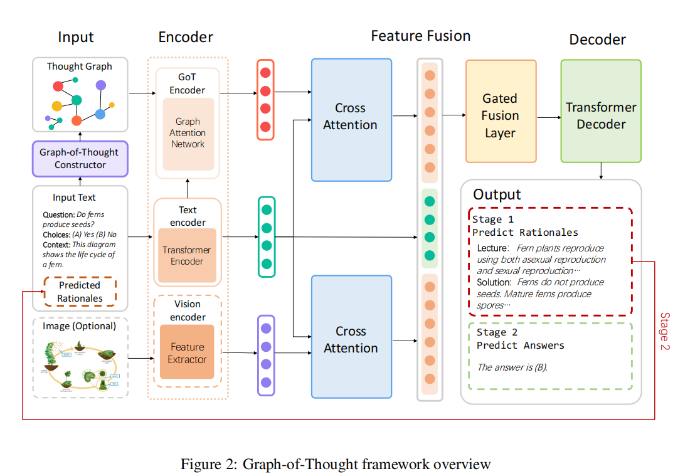
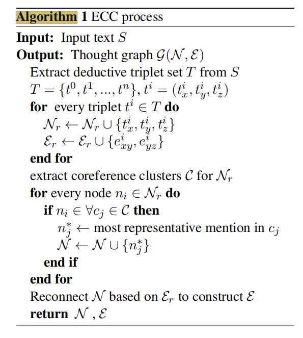

# GoT: Effective Graph-of-Thought Reasoning in Language Models
[GoT: Effective Graph-of-Thought Reasoning in Language Models](https://aclanthology.org/2024.findings-naacl.183/)

!!! warning 记得去学 softmax
## 1 Introduction
这篇论文提出了一种名为 **思维图(Graph-of-Thought, GoT)** 的新型推理框架，旨在提升语言模型在复杂推理任务中的表现。该框架的核心思想是：人类的思维过程并非如当前的 **思维链(Chain-of-Thought, CoT)** 方法所假设的那样，是一个简单的线性步骤序列，而是更加复杂和非线性的，包含跳跃、联想和并行处理。

为了更精确地模拟人类的思维模式，**思维图(GoT)** 将思维单元表示为图中的节点，节点之间的连接表示为边，从而构建出一个图结构。这种图结构能够捕捉人类思维的非连续性，从而实现更灵活和更接近人类的推理过程。

**思维图(GoT)** 采用一个**两阶段推理框架**，具体如下：

1.  **Rationale Generation (理由/依据生成):**  首先，模型生成解决问题的中间推理步骤或理由。这一步类似于 **思维链(CoT)**，但 **思维图(GoT)** 的关键在于它并非简单地生成一个线性链，而是生成构成图结构的各个节点。
2.  **Answer Inference (答案推断):**  然后，模型基于生成的理由图来推断最终答案。

为了实现上述框架，该论文引入了一个额外的 **思维图编码器(GoT Encoder)**。这个编码器的作用是学习 **思维图(GoT)** 的表示，并将其与原始输入表示相融合。具体的融合机制是**门控融合(Gated Fusion)**：

*   **思维图编码器(GoT Encoder):**  该编码器很可能基于 **图神经网络(Graph Neural Network, GNN)**，例如 **图注意力网络(Graph Attention Network, GAT)**。 文中提到使用了图注意力网络来编码 **GoT**。 **图注意力网络(GAT)** 能够学习图中每个节点的重要性，并根据其邻居节点的信息来更新节点的表示。
*   **门控融合(Gated Fusion):** 门控机制允许模型自适应地控制来自 **思维图(GoT)** 表示和原始输入表示的信息流。 这种机制可以有效地平衡两种表示的贡献，从而提高模型的推理能力。

在构建 **思维图(GoT)** 的过程中，论文提出了一种 **提取-聚类-共指(Extract-Cluster-Coreference, ECC)** 方法，用于模拟人类推理中的演绎过程。

该论文使用了 **T5 (Text-to-Text Transfer Transformer)** 预训练语言模型作为其骨干模型 (Backbone Model)。**T5** 模型以其强大的文本生成能力而闻名，非常适合用于生成推理步骤和最终答案。论文中使用了 **FLAN-Alpaca (T5)-base** 和 **FLAN-Alpaca (T5)-large** 作为骨干模型进行了实验。

为了评估 **思维图(GoT)** 的性能，研究者在以下两个数据集上进行了实验：

*   **AQUA-RAT:** 一个纯文本推理数据集.
*   **ScienceQA:** 一个多模态推理数据集，包含文本和视觉信息。

实验结果:

    > GoT demonstrates exceptional performance on both text only AQUA-RAT (Ling et al., 2017) and multimodal ScienceQA (Lu et al., 2022) benchmarks,surpassing the accuracy of online system ChatGPT (OpenAI, 2023) by 9.28%, strong baseline Multimodal-CoT (Zhang et al., 2023) by 2.40%, and even exceeding human performance, establishing a new state-of-the-art on ScienceQA test set with far fewer parameters.

**主要创新点：**

*   提出了 **思维图(GoT)** 框架，将人类的思维过程建模成图结构，而非简单的链式结构。
*   设计了一个基于 **图注意力网络(GAT)** 的 **思维图编码器(GoT Encoder)**，用于学习图的表示。
*   采用**门控融合(Gated Fusion)** 机制，将图的表示与原始输入表示相融合。
*   提出了 **提取-聚类-共指(ECC)** 方法，用于构建 **思维图(GoT)**。
*   在文本和多模态推理任务上都取得了显著的性能提升，证明了 **思维图(GoT)** 的优越性。

## 2 Graph-of-Thought

**整体架构**

**思维图(GoT)** 遵循一个两阶段的框架，灵感来源于 **Multimodal-CoT**。

1.  **理由生成阶段 (Rationale Generation Stage):**
    *   模型接受输入文本（包括问题、上下文和选项）、视觉特征（如果存在）以及生成的**思维图(GoT)**。
    *   **多模态处理:** 对于多模态任务，论文采用一种常见的策略，即使用独立的编码器来处理来自不同模态的输入数据。
        *   **文本编码器 (Text Encoder):** 使用 **Transformer** 编码器对输入文本进行编码。
        *   **视觉编码器 (Vision Encoder):** 使用视觉编码器对图像进行编码。
        *   **图编码器 (Graph Encoder):** 使用 **图注意力网络(Graph Attention Network, GAT)** 对 **思维图(GoT)** 进行编码。
    *   **跨注意力 (Cross-Attention):** 编码后的文本特征、视觉特征和图特征会被传递到跨注意力层，用于将文本 tokens 与图像 patches 和图节点对齐。  **跨注意力机制** 允许模型学习不同模态之间的关联性。例如，模型可以学习到某个文本 token 对应于图像中的某个特定区域，或者对应于图中的某个特定节点。
    *   **门控融合层 (Gated Fusion Layer):**  使用门控融合层进一步融合这三种特征。
    *   **Transformer 解码器 (Transformer Decoder):**  融合后的特征被传递到 **Transformer** 解码器，以预测目标理由 (rationales)。
2.  **答案生成阶段 (Answer Generation Stage):**
    *   该阶段与理由生成阶段类似，主要区别在于输入文本会与第一阶段预测的理由连接在一起。
    *   模型使用与第一阶段相同的编码器和解码器结构来生成最终答案。

**需要注意的是**，上述描述的是一个通用的多模态推理框架。对于纯文本推理任务，不需要图像特征，因此可以省略图像编码和视觉特征融合的过程。

### 2.1 GoT 构建 (GoT Construction)

**思维图(GoT)** 的构建旨在模拟人类的演绎推理能力，从而捕捉人类思维的跳跃性。

*   **基本思想:**  利用演绎推理的基本原则。例如，如果存在 "x -> y" 和 "y -> z" 这两个关系，那么可以推断出 "x -> z" 这个关系。论文中使用 **提取-聚类-共指(Extract-Clustering-Coreference, ECC)** 过程来构建 **思维图(GoT)**。

*   **提取-聚类-共指(Extract-Clustering-Coreference, ECC) 过程：**
    1.  **提取 (Extract):**  首先，**提取-聚类-共指(ECC)** 过程提取演绎三元组 $T = \{t_i = (t_i^x, t_i^y, t_i^z)\}$ 作为离散的原始图。
        *   $t_i^x$, $t_i^y$, 和 $t_i^z$ 是第 i 个三元组的思维单元。
        *   存在边 $e_{xy}^i$ 连接 $t_i^x$ 和 $t_i^y$，以及边 $e_{yz}^i$ 连接 $t_i^y$ 和 $t_i^z$。
        *   **实现方法:**  论文使用 **开放信息抽取(Open Information Extraction, OpenIE)** 系统（例如，Angeli et al., 2015）来提取 **主语-谓语-宾语 (subject-verb-object)** 三元组作为思维单元节点。

    2.  **聚类 (Clustering):**  然后，**提取-聚类-共指(ECC)** 过程对指向相同提及 (mentions) 的节点进行聚类，以进行共指消解。  **共指消解** 旨在识别文本中指向同一实体的不同提及。例如，“the company” 和 “it” 可能指向同一家公司。

    3.  **共指 (Coreference):**  具体来说，模型将每个属于共指簇 (coreference cluster) 的图节点替换为该簇中最具代表性的提及。  **代表性提及** 可以是簇中最常出现的提及，或者是最早出现的提及。

*   **算法 1 (Algorithm 1):** **提取-聚类-共指(ECC)** 过程。
  

*   **GoT 构建中的输入:**
    *   **理由生成阶段:** 输入文本由问题、上下文和选项连接而成。
    *   **多模态GoT:**  图像描述 (image caption) 会被添加到输入文本中，以便 **思维图(GoT)** 能够整合图像信息。
    *   **答案推断阶段:**  在理由生成阶段预测的理由会进一步与输入文本连接，用于构建相应的 **思维图(GoT)**。

*   **Stanford CoreNLP:**  论文使用 **Stanford CoreNLP** 系统 (Manning et al., 2014) 来进行共指消解。

*   **图的表示:**  构建的 **思维图(GoT)** 表示为 $G(N, E)$。
    *   $N$ 代表由 **开放信息抽取(OpenIE)** 提取的节点。
    *   $E$ 代表邻接矩阵 (adjacency matrix)。邻接矩阵的行和列对应于图中的节点。如果两个节点之间存在边，则对应的矩阵元素为 1；否则，为 0。

### 2.2 GoT 编码和整合 (GoT Encoding and Integration)

**思维图(GoT)** 推理利用独立的编码器来编码每种模态的输入数据。**图注意力网络(GAT)** 用于编码思维图，**Transformer** 编码器用于编码输入文本。在多模态 **思维图(GoT)** 推理中，还会使用一个额外的视觉编码器来编码图像。

!!! danger 发电
    先码住，好多公式，有时间再看，先填周报了呜呜

#### **2.2.1 基础编码器 (Base Encoder)**

*   **文本编码器 (Text Encoder):**  对于文本表示，使用 **Transformer** 编码器（例如，T5）来编码输入文本。

    *   给定输入句子 $S = \{w_0, ..., w_l\}$，从 **Transformer** 编码器的最后一层提取隐藏状态，以获得文本表示 $H_T$：
    $$
    H_T = \{h_0, h_1, ..., h_l\} = Encoder_{text}(S) \quad (1)
    $$
    *   其中，$h_i$ 是 token $i$ 的隐藏表示，$l$ 表示文本输入的长度。

*   **视觉编码器 (Vision Encoder) (可选):**  对于具有视觉模态的多模态推理，遵循 (Zhang et al., 2023)，使用现成的视觉提取模型作为视觉编码器 $Encoder_{vision}$ 来提取图像 $I$ 的 patch-level 特征，然后使用一个可训练的投影矩阵 $W_I$ 将提取的特征投影到视觉表示 $H_I$，使其与 $H_T$ 具有相同的形状。
    $$
    H_I = W_I Encoder_{vision}(I) \quad (2)
    $$

#### **2.2.2 GoT 编码器 (GoT Encoder)**

*   **节点嵌入 (Node Embedding):**  首先，使用特殊 token `<s>` 和 `</s>` 来突出显示每个思维图节点。

    *   对于具有 $j$ 个节点的节点集合 $N = \{n_0, ..., n_j\}$，构建节点输入 $p$：
    $$
    p = [\texttt{<s>}, n_0, \texttt{</s>}, ..., \texttt{<s>}, n_j, \texttt{</s>}] \quad (3)
    $$
    *   然后将 $p$ 输入到与文本编码器相同的编码器中，并利用特殊 token `<s>` 的输出表示作为初始节点表示。 形式上，
    $$
    [h_s^0, h_n^0, h_e^0, ..., h_s^j, h_n^j, h_e^j] = Encoder_{text}(p) \quad (4)
    $$
    *   其中，$h_s^i$ 和 $h_e^i \in \mathbb{R}^D$ 分别是节点 $n_i$ 的 `<s>` 和 `</s>` 的表示，$D$ 是节点嵌入的维度，$h_n^i = \{h_{n_{i,1}}, ..., h_{n_{i,m}}\}$ 是具有 $m$ 个 token 的节点 $n_i$ 的表示。 使用 $h_s^i$ 来表示节点 $n_i$ 的节点表示。  **这样做的目的是利用预训练语言模型的知识来初始化节点表示。**

*   **图注意力网络编码器 (GAT Encoder):**  使用 **图注意力网络(Graph Attention Network, GAT)** (Velickovic et al., 2018; Chen and Yang, 2021) 来编码思维图。 对于图 $G(N, E)$ 中的每个节点 $n_i$，图注意力层设计如下：

    *   **注意力权重计算:** 首先，利用一个共享的注意力机制 $Attention(.): \mathbb{R}^{D'} \times \mathbb{R}^{D'} \rightarrow \mathbb{R}$ 计算注意力权重。
    $$
    a_{ij} = Attention(W h_s^i || W h_s^j) \quad (5)
    $$
       $$
    q_{ij} = LeakyReLU(a_{ij}) \quad (6)
    $$
    $$
    \alpha_{ij} = Softmax(q_{ij}) = \frac{exp(q_{ij})}{\sum_{k \in K_i} exp(q_{ik})} \quad (7)
    $$
    *   其中，$||$ 表示连接操作，$W$ 是可训练的权重集合，$K_i$ 包含节点 $n_i$ 在思维图 $G$ 中的邻居节点。
    *   注意力权重 $a_{ij}$ 衡量节点 $n_i$ 的特征对于节点 $n_j$ 的特征的重要性。 通过仅计算邻居节点之间的注意力权重，图注意力层展示了感知图的结构信息的能力。在这个实现中，采用了一个单层前馈神经网络 (FFNN) 作为注意力机制，它既简单又直接。

    *   **节点表示更新:**  使用计算出的注意力权重来聚合邻居节点的特征，从而更新节点表示。
    $$
    h_i^{g'} = GELU \left( \sum_{j \in K_i} \alpha_{ij} W h_s^j \right) \quad (8)
    $$
    *   其中，$GELU$ 是 **高斯误差线性单元(Gaussian Error Linear Units)** 激活函数。

*   **多头注意力 (Multi-Head Attention):**  **思维图(GoT)** 编码器采用多头图注意力层。遵循 (Velickovic et al., 2018)，将每个图注意力层的输出连接起来，并将其传递到具有相同架构的输出图注意力层：
    $$
    h_i^{g'} = \parallel_{k=1}^K GELU \left( \sum_{j \in N_i} \alpha_{ij}^k W^k h_s^j \right) \quad (9)
    $$
    $$
    h_i^{g''} = GELU \left( \sum_{j \in N_i} \alpha_{ij} W h_j^{g'} \right) \quad (10)
    $$
    *   其中，$K$ 是注意力头的数量，$||$ 是连接操作，$n$ 是思维图中的节点数。

*   **最终图嵌入 (Final Graph Embedding):** 之后，使用一个单层前馈神经网络 (FFNN) 获得最终的思维图嵌入 $H_G$：
    $$
    h^{g''} = [h_0^{g''}, ..., h_n^{g''}]; \quad H_G = FFNN(h^{g''}) \quad (11)
    $$

### **2.3 特征融合 (Feature Fusion) 总结**

在获得文本表示 $H^T$, 图像表示 $H^I$ (如果存在), 和思维图表示 $H^G$ 之后，需要将这些信息融合起来，以便模型能够综合利用不同模态的信息进行推理。**思维图(GoT)** 使用以下步骤进行特征融合：

1.  **单头注意力对齐 (Single-Head Attention Alignment):**
    *   使用单头注意力机制将文本表示 $H^T$ 分别与图像表示 $H^I$ 和思维图表示 $H^G$ 对齐。
    *   图像注意力输出 $H'^I$ 和思维图注意力输出 $H'^G$ 的计算方式如下：
        $$
        H'^I = Softmax \left( \frac{H^T (H^I)^T}{\sqrt{d}} \right) H^I \quad (12)
        $$
        $$
        H'^G = Softmax \left( \frac{H^T (H^G)^T}{\sqrt{d}} \right) H^G \quad (13)
        $$

        *   **公式解读:**
            *   $H^T (H^I)^T$ 和 $H^T (H^G)^T$ 分别计算文本表示与图像表示和图表示之间的相似度矩阵。
            *   $\sqrt{d}$ 是一个缩放因子，其中 $d$ 是 $H^T$ 的维度，用于防止 Softmax 函数的输入过大，从而导致梯度消失。
            *   $Softmax(\cdot)$ 函数将相似度矩阵转换为注意力权重，表示文本中的每个 token 对图像或图中的每个元素的关注程度。
            *   最终的 $H'^I$ 和 $H'^G$ 是通过注意力权重对 $H^I$ 和 $H^G$ 进行加权平均得到的，这相当于根据文本信息对图像和图信息进行选择性地提取和整合。

2.  **门控融合 (Gated Fusion):**
    *   使用门控融合机制将注意力输出 $H'^I$ 和 $H'^G$ 与原始文本表示 $H^T$ 结合起来，以生成最终的融合特征 $H$。
    *   首先，计算一个门控值 $\lambda$，用于控制不同特征的贡献程度：
        $$
        \lambda =
        \begin{cases}
        Sigmoid(W_T H^T + W_G H'^G) & \text{text-only} \\
        Sigmoid(W_T H^T + W_I H'^I + W_G H'^G) & \text{multimodal}
        \end{cases}
        $$

        *   **公式解读:**
            *   对于纯文本任务，门控值 $\lambda$ 是由文本表示 $H^T$ 和图表示 $H'^G$ 经过线性变换 ($W_T$ 和 $W_G$ 是可训练的权重矩阵) 和 Sigmoid 函数得到的。
            *   对于多模态任务，门控值 $\lambda$ 是由文本表示 $H^T$、图像表示 $H'^I$ 和图表示 $H'^G$ 经过线性变换 ($W_T$、$W_I$ 和 $W_G$ 是可训练的权重矩阵) 和 Sigmoid 函数得到的。
            *   Sigmoid 函数将线性变换的结果映射到 0 到 1 之间，表示不同特征的相对重要性。

    *   然后，使用门控值 $\lambda$ 对不同特征进行加权融合：
        $$
        H =
        \begin{cases}
        (1 - \lambda) \cdot H^T + \lambda \cdot H'^G & \text{text-only} \\
        (1 - \lambda) \cdot H^T + \lambda \cdot H'^I + \lambda \cdot H'^G & \text{multimodal}
        \end{cases}
        $$

        *   **公式解读:**
            *   对于纯文本任务，融合特征 $H$ 是文本表示 $H^T$ 和图表示 $H'^G$ 的加权平均，权重分别为 $(1 - \lambda)$ 和 $\lambda$。
            *   对于多模态任务，融合特征 $H$ 是文本表示 $H^T$、图像表示 $H'^I$ 和图表示 $H'^G$ 的加权平均，权重分别为 $(1 - \lambda)$、$\lambda$ 和 $\lambda$。

3.  **解码器输入 (Decoder Input):**
    *   最后，将融合后的特征 $H$ 输入到解码器中，以预测理由或最终答案。

