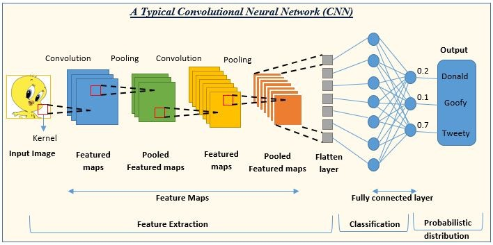

# 卷积神经网络
CNN 是一类专门用于处理具有网格状拓扑结构数据（如图像）的深度学习模型，是计算机视觉任务（如图像分类、目标检测和分割）的核心技术。



- 输入图像（Input Image）：网络接收的原始图像数据。图像通常被表示为一个三维数组，其中两个维度代表图像的宽度和高度，第三个维度代表颜色通道（例如，RGB图像有三个通道）。

- 卷积（Convolution）：使用卷积核（Kernel）在输入图像上滑动，提取特征，生成特征图（Feature Maps）。

$$
y[i, j]=\Sigma_m \Sigma_n x[i+m, i+n]\times k[m, n] + b
$$

- 池化（Pooling）：通常在卷积层之后，通过最大池化或平均池化减少特征图的尺寸，同时保留重要特征，生成池化特征图（Pooled Feature Maps）。
  - 常用：Max Pooling / Average Pooling

- 特征提取（Feature Extraction）：通过多个卷积和池化层的组合，逐步提取图像的高级特征。

- 展平层（Flatten Layer）：将多维的特征图转换为一维向量，以便输入到全连接层。
- 归一化层（Normalization Layer，可选）

- 全连接层（Fully Connected Layer）：类似于传统的神经网络层，用于将提取的特征映射到输出类别。

- 分类（Classification）：网络的输出层，根据全连接层的输出进行分类。

- 概率分布（Probabilistic Distribution）：输出层给出每个类别的概率，表示输入图像属于各个类别的可能性。
- 正则化（Regularization，可选）包括 Dropout、L1/L2 正则化等技术，用于防止模型过拟合
    - 线性回归L1 正则化损失函数(Lasso回归)
$$
min[\Sigma_{i=1}^N (\omega^T x_i-y_i)^2_\lambda||\omega||_1]
$$
    - 线性回归L2 正则化损失函数（岭回归）
$$
min[\Sigma_{i=1}^N (\omega^T x_i-y_i)^2_\lambda||\omega||_2^2]
$$

!!! note
    L1 正则化的主要特点是它会产生稀疏的权重。也就是说，在优化的过程中，它倾向于将许多不那么重要的特征的权重 w 直接压缩成 0。因此，Lasso 回归不仅可以防止过拟合，还可以自动进行特征选择 (Feature Selection)，找出对结果影响最大的那些特征。

    L2 正则化的主要特点是它会惩罚绝对值较大的权重。它会使权重 w 的值都趋向于变小，但通常不会让它们变为 0。它使得模型的权重分布更加平滑和分散。岭回归在处理特征之间存在多重共线性（即特征高度相关）时非常有效。


## **PyTorch 实现 CNN**

```py
import torch
import torch.nn as nn
import torch.nn.functional as F
import torch.optim as optim
from torchvision import datasets, transforms


# 1. 数据加载与预处理
transform = transforms.Compose([
    transforms.ToTensor(),  # 转为张量
    transforms.Normalize((0.5,), (0.5,))  # 归一化到 [-1, 1]
])

# 加载 MNIST 数据集
train_dataset = datasets.MNIST(root='./data', train=True, transform=transform, download=True)
test_dataset = datasets.MNIST(root='./data', train=False, transform=transform, download=True)

train_loader = torch.utils.data.DataLoader(dataset=train_dataset, batch_size=64, shuffle=True)
test_loader = torch.utils.data.DataLoader(dataset=test_dataset, batch_size=64, shuffle=False)

# 2. 定义 CNN 模型
class SimpleCNN(nn.Module):
    def __init__(self):
        super(SimpleCNN, self).__init__()
        # 定义卷积层
        self.conv1 = nn.Conv2d(1, 32, kernel_size=3, stride=1, padding=1)  # 输入1通道，输出32通道
        self.conv2 = nn.Conv2d(32, 64, kernel_size=3, stride=1, padding=1)  # 输入32通道，输出64通道
        # 定义全连接层
        self.fc1 = nn.Linear(64 * 7 * 7, 128)  # 展平后输入到全连接层
        self.fc2 = nn.Linear(128, 10)  # 10 个类别

    def forward(self, x):
        x = F.relu(self.conv1(x))  # 第一层卷积 + ReLU
        x = F.max_pool2d(x, 2)     # 最大池化
        x = F.relu(self.conv2(x))  # 第二层卷积 + ReLU
        x = F.max_pool2d(x, 2)     # 最大池化
        x = x.view(-1, 64 * 7 * 7) # 展平
        x = F.relu(self.fc1(x))    # 全连接层 + ReLU
        x = self.fc2(x)            # 最后一层输出
        return x

# 创建模型实例
model = SimpleCNN()

# 3. 定义损失函数与优化器
criterion = nn.CrossEntropyLoss()  # 多分类交叉熵损失
optimizer = optim.SGD(model.parameters(), lr=0.01, momentum=0.9)

# 4. 模型训练
num_epochs = 5
model.train()  # 设置模型为训练模式

for epoch in range(num_epochs):
    total_loss = 0
    for images, labels in train_loader:
        outputs = model(images)  # 前向传播
        loss = criterion(outputs, labels)  # 计算损失

        optimizer.zero_grad()  # 清空梯度
        loss.backward()  # 反向传播
        optimizer.step()  # 更新参数

        total_loss += loss.item()

    print(f"Epoch [{epoch+1}/{num_epochs}], Loss: {total_loss / len(train_loader):.4f}")

# 5. 模型测试
model.eval()  # 设置模型为评估模式
correct = 0
total = 0

with torch.no_grad():  # 关闭梯度计算
    for images, labels in test_loader:
        outputs = model(images)
        _, predicted = torch.max(outputs, 1)
        total += labels.size(0)
        correct += (predicted == labels).sum().item()

accuracy = 100 * correct / total
print(f"Test Accuracy: {accuracy:.2f}%")
```