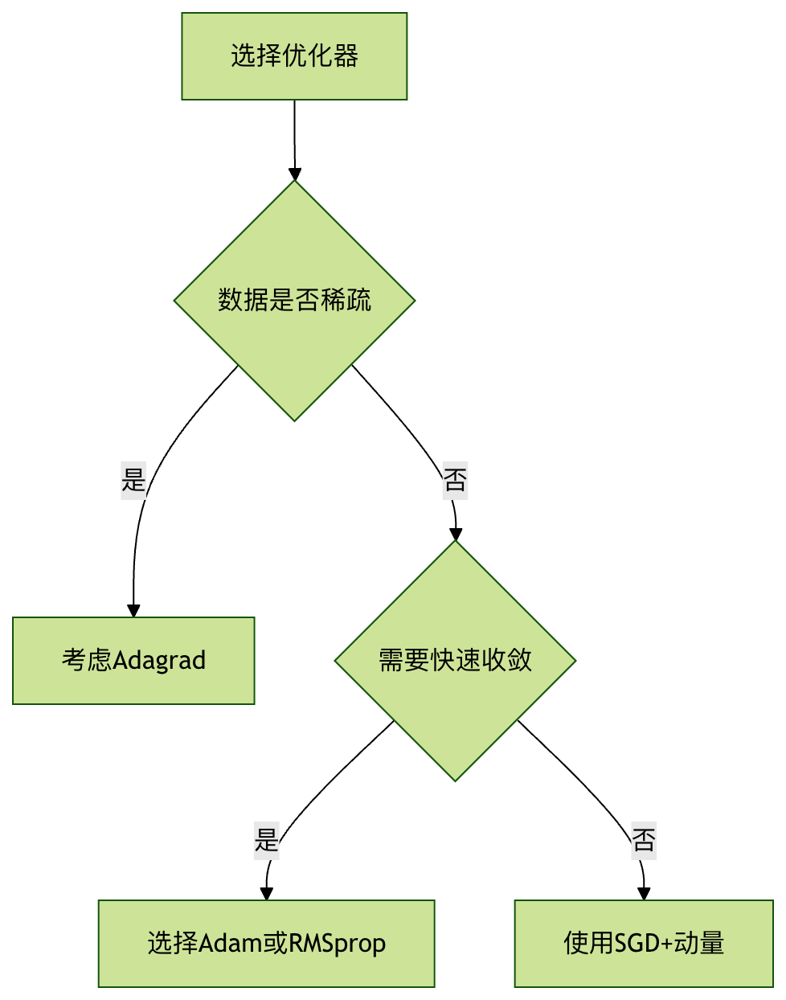

# torch.optim 优化器
## 1 SGD 随机梯度下降

!!! note
    在每次迭代中，不再使用全部样本，而是随机选取一个样本来计算梯度并更新模型参数。收敛路径曲折，速度比BG'd快，可能跳出局部最小值

```py
optim.SGD(params, lr = 0.01, momentum = 0, dampening = 0, weight_decay = 0, nesterov = False)
```

- lr：学习率，默认0.01
- momentum：动量因子 $v_t=\gamma v_{t-1}+\eta\nabla_\theta J(\theta_t)$中的 $\gamma$
- weight_decay：L2正则化系数（防止过拟合，$...+\lambda \omega^2$）

## 2 Adam 自适应矩估计
```py
optim.Adam(params, lr=0.001, betas=(0.9, 0.999), 
           eps=1e-08, weight_decay=0, amsgrad=False)
```

- betas (Tuple[float, float])：用于计算梯度和梯度平方的移动平均系数
- eps (float)：数值稳定项（默认1e-8）
- amsgrad (bool)：是否使用AMSGrad变体（默认False）

??? note
    ### **Adam (Adaptive Moment Estimation) 优化算法详解**

    Adam（Adaptive Moment Estimation，自适应矩估计）是一种在深度学习领域中被广泛应用的优化算法。它将两种主流优化算法的优点结合起来：**动量（Momentum）** 和 **RMSprop**，从而为不同参数设计独立的自适应学习率，并能利用梯度的历史信息加速收敛。

    #### **1. 核心思想：结合动量与自适应学习率**

    为了理解 Adam，我们首先需要回顾一下它的两个前身：

    *   **动量（Momentum）**：该方法旨在加速梯度下降。它引入一个“动量”变量，该变量是过去梯度的指数衰减移动平均。这使得参数更新在梯度方向一致的维度上加速，而在梯度方向振荡的维度上减速，从而有助于更快地穿越平坦区域并抑制振荡。

    *   **RMSprop (Root Mean Square Propagation)**：该方法旨在为每个参数自适应地调整学习率。它通过计算梯度的平方的指数衰减移动平均，来估计梯度的二阶矩（方差）。对于梯度较大的参数，其对应的学习率会变小；对于梯度较小的参数，其学习率会变大。这在处理稀疏数据或具有不同尺度特征的问题时尤其有效。

    **Adam 的核心创新在于，它同时计算并存储了梯度的“一阶矩”（均值，即动量项）和“二階矩”（未中心的方差，即 RMSprop 项），并利用这两者来为每个参数动态地调整学习率。**

    #### **2. Adam 算法的执行步骤**

    假设 $t$ 是当前的迭代步数，$\theta_t$ 是在第 $t$ 步的模型参数，$\eta$ 是学习率，$g_t$ 是在第 $t$ 步计算出的关于参数 $\theta_t$ 的梯度。Adam 算法的更新流程如下：

    1.  **计算梯度**：
        在当前的小批量数据上计算损失函数关于参数的梯度 $g_t$。
        $g_t = \nabla_{\theta} J(\theta_{t-1})$

    2.  **更新有偏的一阶矩估计 (动量项)**：
        计算梯度 $g_t$ 的指数衰减移动平均 $m_t$。$m_t$ 是对过去梯度均值的估计。
        $m_t = \beta_1 \cdot m_{t-1} + (1 - \beta_1) \cdot g_t$
        *   $\beta_1$ 是一个超参数，通常设置为 0.9。它控制着过去梯度信息衰减的速度。

    3.  **更新有偏的二阶矩估计 (方差项)**：
        计算梯度平方 $g_t^2$ 的指数衰减移动平均 $v_t$。$v_t$ 是对过去梯度平方均值的估计。
        $v_t = \beta_2 \cdot v_{t-1} + (1 - \beta_2) \cdot g_t^2$
        *   $g_t^2$ 表示元素级别的平方。
        *   $\beta_2$ 是另一个超参数，通常设置为 0.999。

    4.  **修正一阶矩和二阶矩的偏差**：
        在算法初始阶段（$t$ 较小时），$m_t$ 和 $v_t$ 的初始值（通常为0）会导致它们向零偏差。为了修正这个问题，Adam 引入了偏差校正步骤。
        *   修正一阶矩：$\hat{m}_t = \frac{m_t}{1 - \beta_1^t}$
        *   修正二阶矩：$\hat{v}_t = \frac{v_t}{1 - \beta_2^t}$

    5.  **更新模型参数**：
        最后，使用修正后的一阶矩和二阶矩来更新参数 $\theta$。
        $\theta_t = \theta_{t-1} - \eta \cdot \frac{\hat{m}_t}{\sqrt{\hat{v}_t} + \epsilon}$
        *   $\eta$ 是学习率（步长）。
        *   $\epsilon$ 是一个非常小的常数（例如 $10^{-8}$），用于防止分母为零，增加数值稳定性。
        *   分母 $\sqrt{\hat{v}_t} + \epsilon$ 起到了为每个参数规范化学习率的作用。对于梯度历史平方较大的参数（$\hat{v}_t$ 较大），其有效学习率会减小；反之，则会增大。

    #### **3. Adam 的优点**

    *   **实现简单，计算高效**：算法本身直观且易于实现。
    *   **内存需求低**：它只需要为每个参数额外存储一阶和二阶矩的移动平均值。
    *   **对角线重缩放梯度的不变性**：Adam 算法的更新规则使其对于梯度乘以一个对角矩阵的操作是不变的，这意味着它对梯度的重新缩放不敏感。
    *   **适用于非平稳目标**：由于其自适应性，Adam 能够很好地处理损失函数在不同区域具有不同特性的问题。
    *   **结合了 Momentum 和 RMSprop 的优点**：它既能像 Momentum 一样在梯度方向一致时加速，又能像 RMSprop 一样为每个参数自适应调整学习率。
    *   **超参数具有直观的解释且通常无需调整**：作者建议的默认值（$\beta_1=0.9, \beta_2=0.999, \epsilon=10^{-8}$）在大多数情况下表现良好。

    #### **4. Adam 的潜在缺点与变体**

    尽管 Adam 非常流行且有效，但它并非完美无缺：

    *   **可能不收敛**：在某些情况下，由于二阶矩估计的变化，Adam 可能无法收敛到最优解。有研究指出，在某些场景下，自适应学习率方法（如 Adam）的泛化能力可能不如经过精心调参的 SGD+Momentum。
    *   **对学习率依然敏感**：虽然 Adam 能够自适应调整学习率，但初始学习率 $\eta$ 的选择仍然对模型训练至关重要。

    为了解决这些问题，一些 Adam 的变体被提出来：

    *   **AdamW**：这个变体主要修正了 Adam 中权重衰减（Weight Decay）的实现方式。在传统的 Adam 中，权重衰减与梯度更新耦合在一起，可能导致效果不佳。AdamW 将权重衰减与梯度更新解耦，直接在参数更新步骤中减去一个与参数自身成比例的量，这种方式在许多任务中被证明更有效。
    *   **Nadam**：Nadam 将 Nesterov 加速梯度（Nesterov Accelerated Gradient, NAG）的思想融入到 Adam 中，通过在计算梯度之前就考虑动量的影响，理论上可以获得更优的更新方向。

## 3 优化器选择


**性能对比**

|优化器|收敛速度|内存占用|超参数敏感度|
|---|---|---|---|
|SGD|慢|低|高|
|Adam|快|中|低|
|RMSprop|中|中|中|