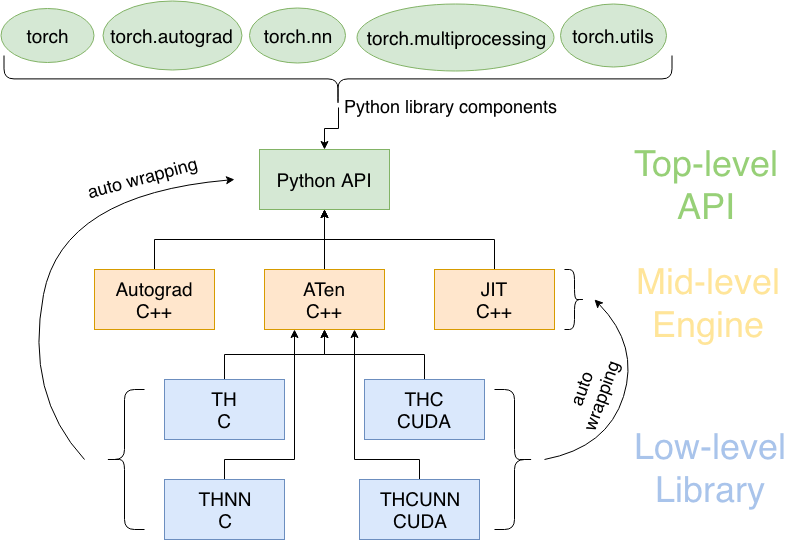
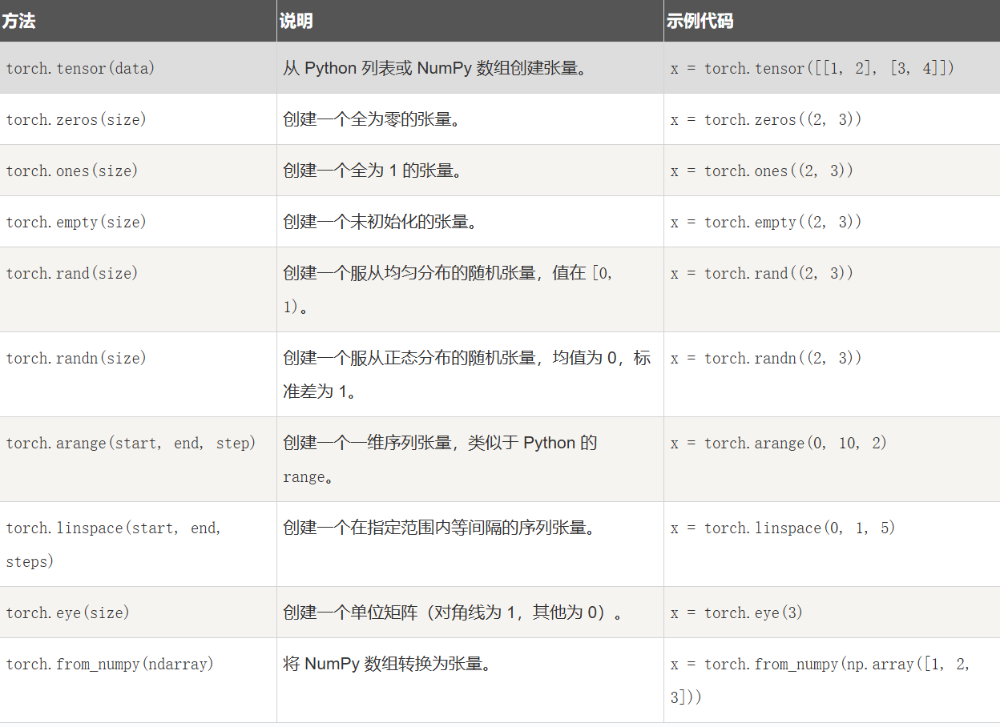
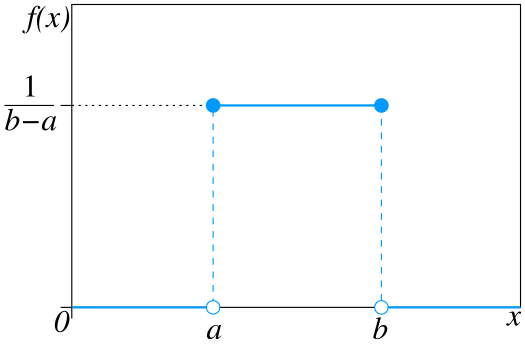
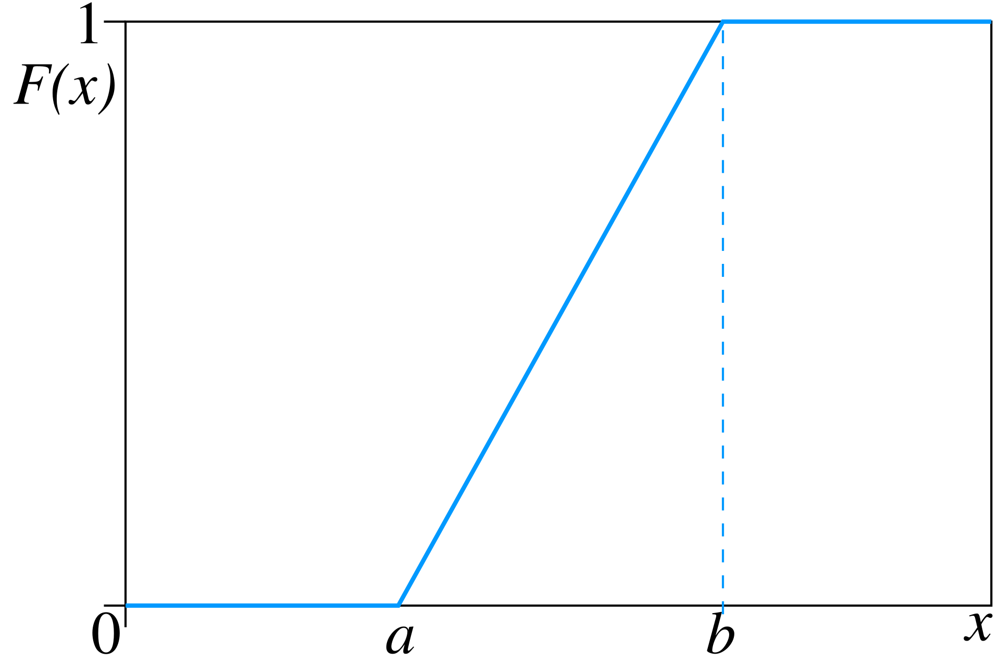
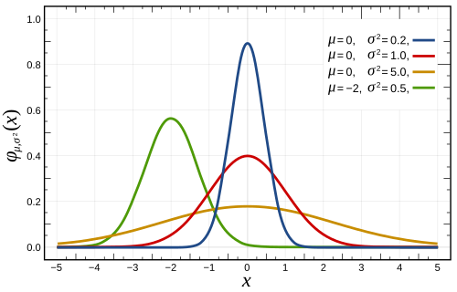
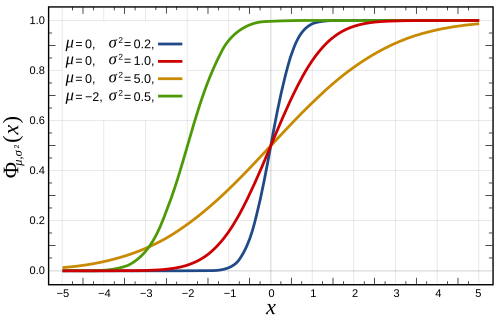
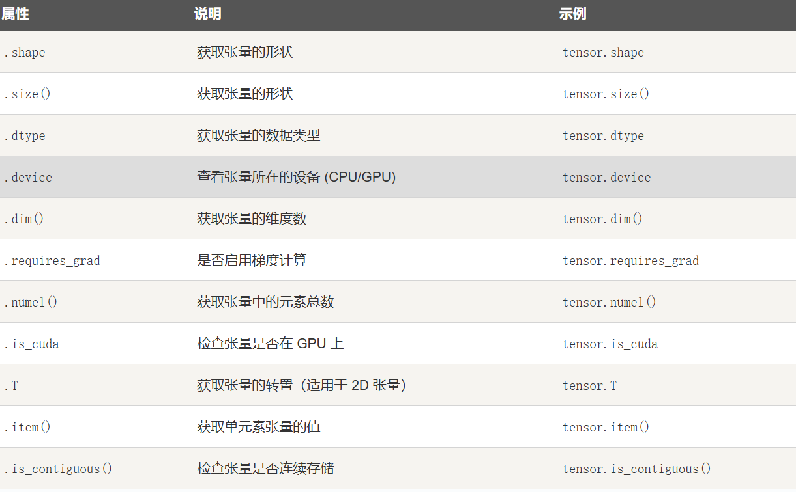
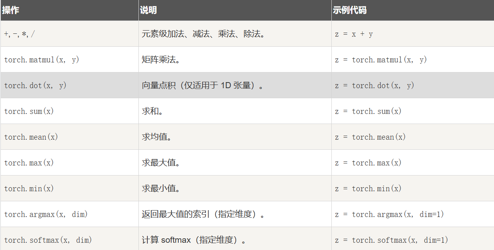
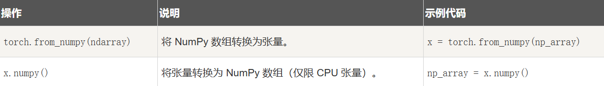

# PyTorch
[torch API 手册](https://www.runoob.com/pytorch/pytorch-torch-ref.html)
## 1 执行流程
Python代码 → C++核心计算 → 底层CUDA/C库加速 → 返回结果



## 2 张量（Tensor）
### 2.1 张量的创建

👉 range
```py
range(start, stop[, step])
```
??? note "均匀分布vs正态分布"
    **均匀分布（连续）**：值域之内的每个等长区间上取值的概率皆相等

    - 概率质量函数
  
    

    - 累积分布函数

    

    **正态分布（高斯分布）**：$X\sim N(\mu,\sigma^2)$
    
    - 概率密度函数：

        $$
        f(x)=\frac{1}{\sigma \sqrt{2\pi}}e^{-\frac{(x-\mu)^2}{2\sigma^2}}
        $$
        

    - 累积分布函数：

        

??? example "linspace vs arange"
    ```py
    torch.arange(0, 10, 2) #tensor([0, 2, 4, 6, 8])->通过指定步长
    torch.linspace(0, 1, 5) #tensor([0, 0.25, 0.5, 0.75, 1])->通过指定点的数量

    >>>torch.randn(4)
    tensor([-2.1436,  0.9966,  2.3426, -0.6366])
    >>>torch.randn(2, 3)
    tensor([[ 1.5954,  2.8929, -1.0923],
        [ 1.1719, -0.4709, -0.1996]])
    ```
### 2.2 张量的属性


### 2.3 张量的操作


!!! note "softmax"
    有限项离散概率分布的梯度对数归一化。表征了不同类别之间的相对概率
    $$
    P(y|x)=\frac{e^{h(x,y_i)}}{\Sigma^n_{j=1}e^{h(x, y_i)}}
    $$

### 2.4 张量的 GPU 加速

```py
device = torch.device('cuda' if torch.cuda.is_available() else 'cpu')
x = torch.tensor([1.0, 2.0, 3.0], device=device)
```
### 2.5 张量与 Numpy



## 3 torch.nn
### 3.1 关键组成部分
1. **nn.Module 类**：（所有自定义神经网络模型的基类）`class RNNModel(nn.Module):`
2. **预定义层(Modules)**：层组件，如卷积（nn.Convld, nn.Conv2d, Conv3d）、全连接层（nn.Linear）、激活函数(nn.ReLU, nn.Signoid, nn.Tanh)
3. **容器类**
   1. nn.Sequential：将多个层按顺序组合，形成简单的线性堆叠网络
   2. nn.ModuleList, nn.ModuleDict：动态存储和访问子块，支持可变长度命名
4. **损失函数**
5. **实用函数接口**
6. **初始化方法**