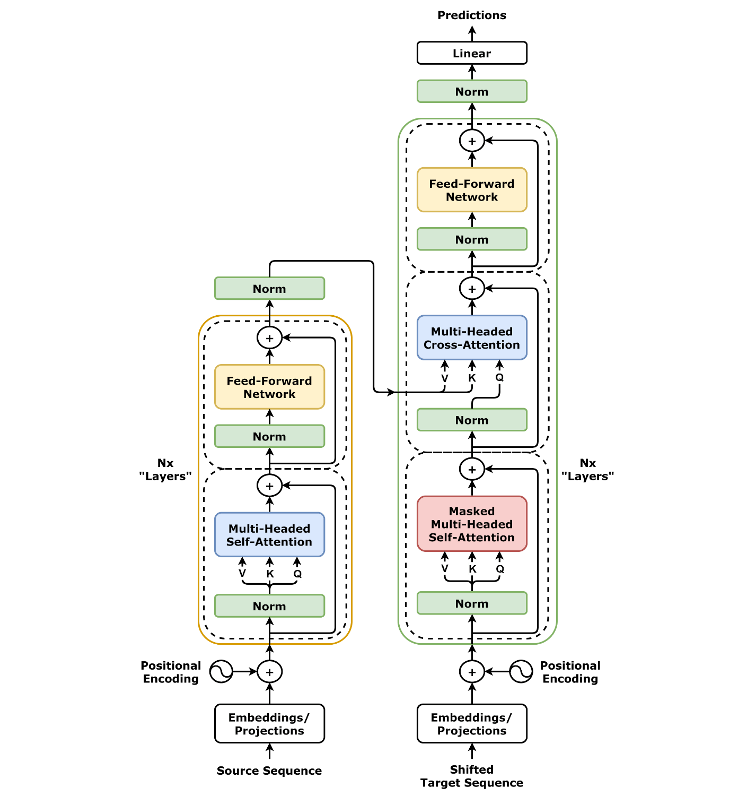
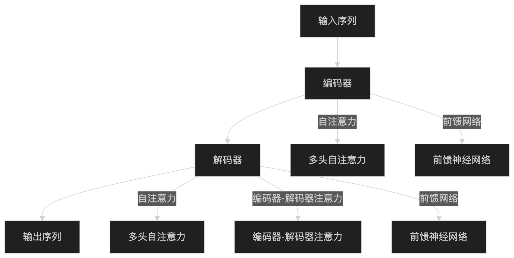

# **transformer**
!!! note
    解决了 RNN 架构的以下问题

    - 梯度消失问题：长距离依赖关系难以捕捉。
    - 顺序计算的局限性：无法充分利用现代硬件的并行计算能力，训练效率低下
  
    **Transformer的可扩展性**：Transformer 模型可以通过堆叠更多的层来提升性能，例如 BERT 和 GPT 等模型。
  

## **编码器**
### **自注意力机制（Multi-Head Self-Attention）**

!!! note
    当模型处理一个序列（例如一个句子）时，它能够动态地、有选择性地关注序列中其他相关部分，从而更好地理解当前正在处理的词的上下文含义。换句话说，对于序列中的每一个词，自注意力机制都会计算出序列中所有其他词（包括它自己）对理解这个词的“重要性得分”，即注意力权重。

**第一步：词嵌入（Word Embedding）**
输入序列中的每个词或标记 (token) 首先需要被转换成一个固定维度的向量，这个过程称为词嵌入。这个初始向量表示了该词的静态语义信息。

**第二步：注意力权重计算**

- 查询向量 (Query, Q): 代表当前正在处理的词，它主动地去“查询”序列中其他词与它的关系。
- 键向量 (Key, K): 代表序列中可以被查询的词，它与查询向量进行匹配，以衡量相关性。
- 值向量 (Value, V): 代表序列中每个词的实际内容或信息。

!!! note "权重计算过程"
    - 计算相关性得分 (Score): 对于一个特定的查询向量 (Q)，我们计算它与序列中所有键向量 (K) 的点积 (dot product)。这个点积的结果可以看作是查询词与每个键词之间的原始相关性得分。如果 Q 和某个 K 的方向越接近，它们的点积就越大，意味着相关性越强。在矩阵运算中，这一步对应于 QK^T。
    - 缩放 (Scaling): 为了防止在向量维度 (dk) 较大时点积结果过大，导致梯度在通过 softmax 函数时变得非常小（即梯度消失），从而影响模型训练的稳定性，需要对点积得分进行缩放。标准的做法是将其除以键向量维度 dk 的平方根 (√dk)。
    - 归一化 (Normalization): 将缩放后的得分通过一个 Softmax 函数。Softmax 会将所有得分转换成一个概率分布，即所有得分的和为 1，且每个得分都在 0 到 1 之间。这样，我们就得到了最终的注意力权重 (Attention Weights)，它清晰地表示了在当前上下文中，每个词对于查询词的重要程度

**第三步：加权求和**
将上一步得到的注意力权重与每个词对应的值向量 (V) 相乘，然后将所有加权后的值向量求和。将注意力更多地集中在那些与当前词高度相关的词的“信息”（即它们的 V 向量）上，而忽略那些不太相关的词。

**公式：**

$$
\text{Attention}(Q, K， V) = \text{softmax}(\frac{QK^T}{\sqrt{d_k}})V
$$

### **多头注意力（Multi-Head Attention）**
为了捕捉更丰富的特征，Transformer 使用多头注意力机制。它将输入分成多个子空间，每个子空间独立计算注意力，最后将结果拼接起来。
- 允许模型关注序列中不同的部分，例如语法结构、语义关系等。
- 并行计算：多个注意力头可以并行计算，提高效率。
### **前馈神经网络（Feed-Forward Neural Network）**
每个编码器和解码器层都包含一个前馈神经网络，通常由两个全连接层组成，中间使用 ReLU 激活函数。对每个词进行独立的非线性变换

### **位置编码（Positional Encoding）**
为每个位置生成唯一的编码: 由于不同位置 pos 的 sin 和 cos 函数值不同，每个位置都会得到一个独一无二的位置编码向量。

$$
PE_{(pos, 2i)}=sin(\frac{pos}{10000^{2i/d_{model}}})
$$

$$
PE_{(pos, 2i+1)}=cos(\frac{pos}{10000^{2i/d_{model}}})
$$

## 解码器
- **掩码多头自注意力机制（Masked Multi-Head Self-Attention）**：计算输出序列中每个词与前面词的相关性（使用掩码防止未来信息泄露）。
- **编码器-解码器注意力机制（Encoder-Decoder Attention）**：计算输出序列与输入序列的相关性。
- **前馈神经网络（Feed-Forward Neural Network）**：对每个词进行独立的非线性变换。