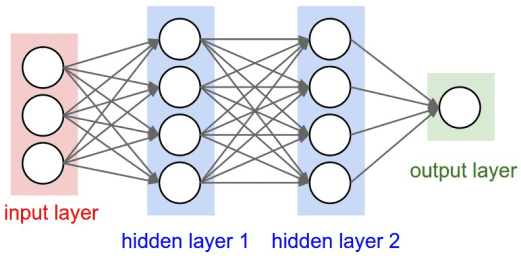
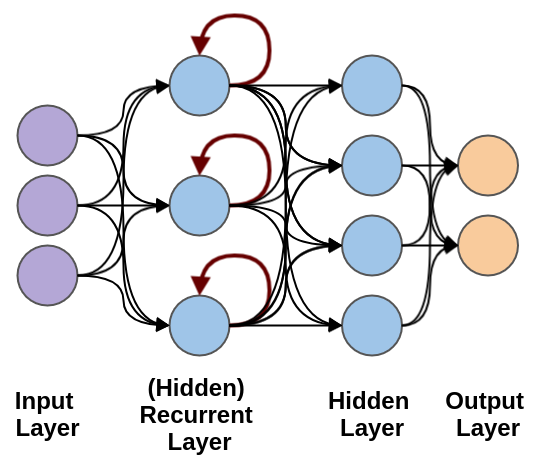
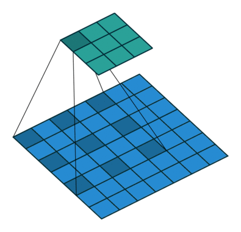
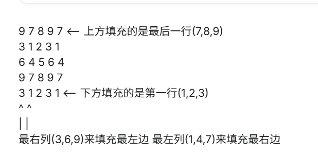
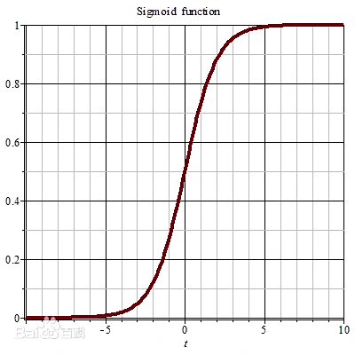
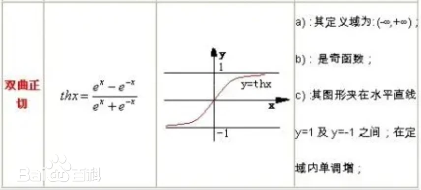

# 神经网络
## **1 神经元的数学表示**
$$Output = \Sigma_j\omega_j x_j+Bias$$
## **2 前馈神经网络（Feedforward Neural Network，FNN）**
从输入层开始，经过一个或多个隐藏层，最后到达输出层，全过程没有循环或反馈。


## **3 循环神经网络（Recurrent Neural Network, RNN）**
具有“记忆能力”，可以在隐藏状态保存之前时间步的信息，**用于处理随时间变化的数据模式**


## 4 **PyTorch.nn**
!!! inline note "nn.Module"
    nn.Module 是所有神经网络模块的基类，需要定义以下两个部分：

    `__init__()`：定义网络层。

    `forward()`：定义数据的前向传播过程。


??? example "简单的 Fully Connected Network"
    ```py
    import torch
    import torch.nn as nn

    # 定义一个简单的神经网络模型
    class SimpleNN(nn.Module):
        def __init__(self):
            super(SimpleNN, self).__init__()
            # 定义一个输入层到隐藏层的全连接层
            self.fc1 = nn.Linear(2, 2)  # 输入 2 个特征，输出 2 个特征
            # 定义一个隐藏层到输出层的全连接层
            self.fc2 = nn.Linear(2, 1)  # 输入 2 个特征，输出 1 个预测值
    
        def forward(self, x):
            # 前向传播过程
            x = torch.relu(self.fc1(x))  # 使用 ReLU 激活函数
            x = self.fc2(x)  # 输出层
            return x

    ```
!!! note "Fully Connected Network" 
    每个神经元都与前一层和后一层的所有神经元相连接

### **4.1 神经网络层函数**
- nn.Linear(in_features, out_features)：全连接层，输入 in_features 个特征，输出 out_features 个特征。
- Conv2d(in_channels, out_channels, kernel_size, stride=1,padding=0, dilation=1, groups=1,bias=True, padding_mode=‘zeros’) 卷积层，用于图像处理。
??? note "Conv2d"
    - in_channels参数代表输入特征矩阵的深度即channel，比如输入一张RGB彩色图像，那in_channels = 3；
    - out_channels参数代表卷积核的个数，使用n个卷积核输出的特征矩阵深度即channel就是n；
    - kernel_size参数代表卷积核的尺寸，输入可以是int类型如3 代表卷积核的height = width = 3，也可以是tuple类型如(3, 5)代表卷积核的height = 3，width = 5；
    - stride参数代表卷积核的步距默认为1，输入 int / tuple，tuple一个int用于高度尺寸，第二个int用于宽度尺寸；
    - padding参数代表在输入特征矩阵四周补零的情况默认为0，输入 int / tuple，若为 int，上下左右都补 int.
    - dilation：Pytorch中默认1（不膨胀）,下图为dilation=2，目的是**不降低空间分辨率、不增加计算成本的情况下，指数级地扩大感受野。**

        

    - groups 必须可以被 in_channels 和 out_channels 整除
    - bias：把学习到的 bias 添加到 output
    - padding_mode：'zeros'（padding 0）, 'reflect'（像镜子一样反射边缘的像素内容进行填充。注意：它不会重复边缘像素本身）, 'replicate'（重复使用图像最边缘的像素值进行填充） or 'circular'. 
      - circular
  
        

        $$
        H_{out}=\lfloor \frac{H_{in}+2\times\text{padding[0]}-\text{dilation[0]}\times(kernel_{size}[0]-1)}{\text{stride[0]}+1}\rfloor
        $$
- nn.MaxPool2d(kernel_size, stride=None, padding=0, dilation=1, return_indices=False, ceil_mode=False)2D 最大池化层，用于降维: 选取每个“视野”中的最大值
- nn.ReLU()：ReLU 激活函数，常用于隐藏层。
- nn.Softmax(dim)：Softmax 激活函数，通常用于输出层，适用于多类分类问题。

### **4.2 激活函数**

- Sigmoid：用于二分类问题，输出值在 0 和 1 之间。
  
    
$$
Sig(x)=(1+e^{-x})^{-1}
$$


- Tanh：输出值在 -1 和 1 之间，常用于输出层之前。

    

    $$
    tanh(x)=\frac{e^x-e^{-x}}{e^x+e^{-x}}
    $$
    
- ReLU（Rectified Linear Unit）：目前最流行的激活函数之一，定义为 f(x) = max(0, x)，有助于解决梯度消失问题。
- Softmax：常用于多分类问题的输出层，将输出转换为概率分布。

### **4.2 损失函数（Loss Function）**
- **均方误差（MSELoss）**：回归问题常用
- **交叉熵损失（CrossEntropyLoss）**：分类常用(P 为真实值)

$$
H(P,Q)=H(P)+D_{KL}(P||Q)=-\Sigma P(x_i)\log Q(x_i)
$$

- BCEWithLogitsLoss：二分类，结合 Sigmoid 和二元交叉熵损失

### **4.3 优化器（Optimizer）**
优化器负责在训练过程中更新网络的权重和偏置。

- SGD（随机梯度下降）
- Adam（自适应矩估计）
- RMSprop（均方根传播）

