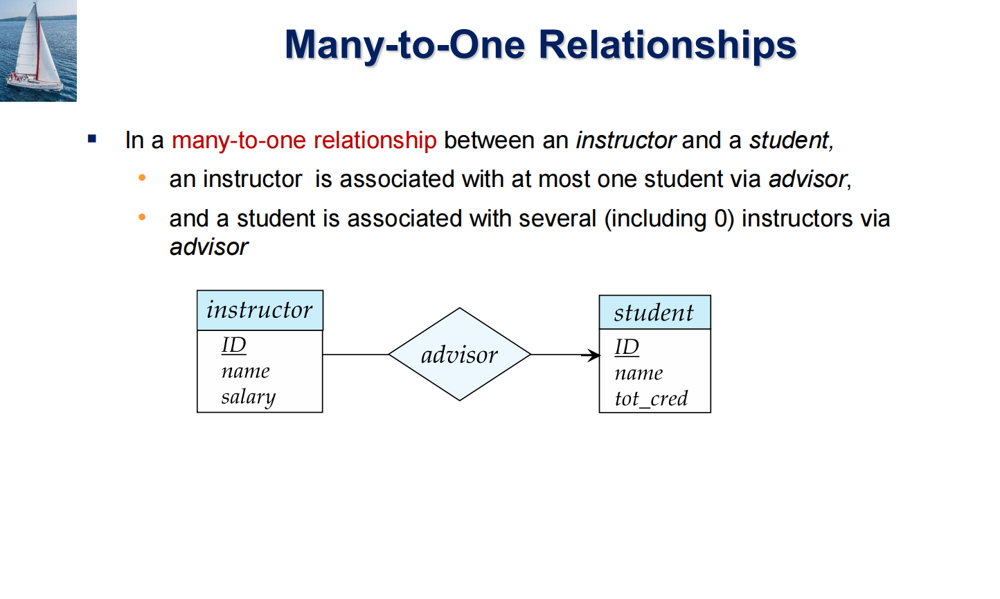
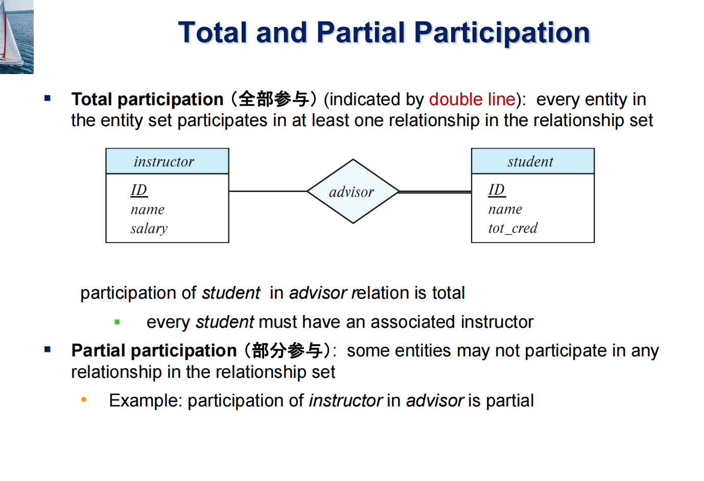
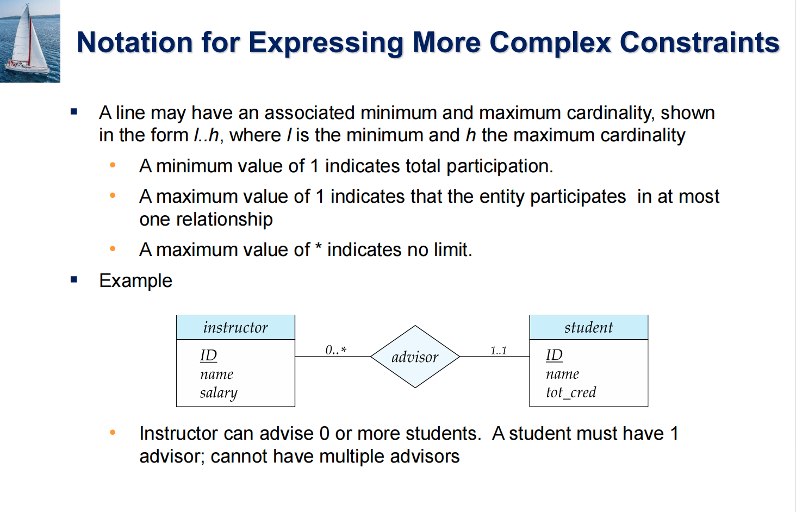

# Part 6: Database Design using the E-R Model

- We express cardinality constraints by drawing either a directed line (->), signifying “one,” or an undirected line (—), signifying “many,” between the 
relationship set and the entity set

