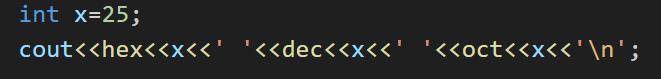
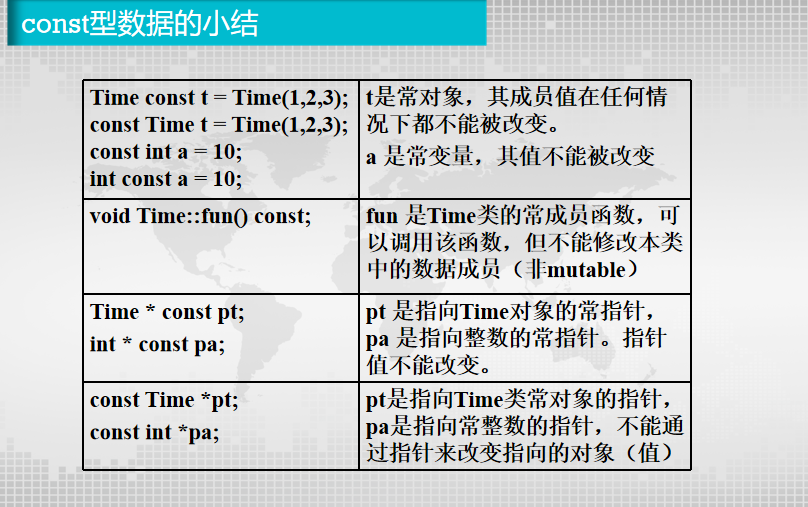
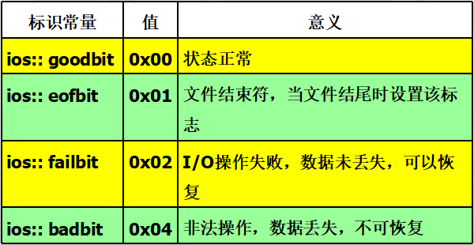
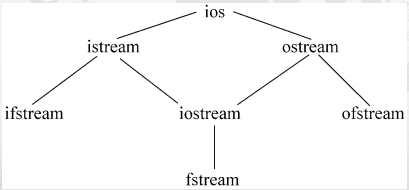

# OOP
<font color="skyblue">参考 ljj 的 ppt </font> 
## 一、基础知识
### （一）C++在非面向对象方面的一些特性
#### 1.1 注释与续行
1. `/*`和`*/`不可嵌套；`// `和`/**/`可嵌套
   1. <font color="blue">/*下面程序将在终端上输出/ * 你好 * /的字样*/,错</font>
    
   2. <font color="blue">/ * //输出字符 * /,对</font>
    
2. 续行符：`\`当一个语句太长时可以用该符号把它分段写在几行中
#### 1.2 输入输出流


输出：19 25 31
#### 1.3 变量说明
1. 结构名、联合名、枚举名都是类型名。在定义变量时，不必在结构名、联合名或枚举名前冠以struct、union或enum。
```cpp
/*in C*/
enum  boole  done;
struct string  str;
union  number  x;

/*in cpp*/
boole  done;
string  str;
number  x;
```
#### 1.4 函数原型
1. 函数原型的参数表中可不包含参数的名字，而只包含它们的类型。例如： `long  Area(int ,int);`
#### 1.5 const 修饰符
 `const 数据类型标识符 常数名=常量值`
1. 若省略数据类型，默认 `int`
2. 消除 `#define`的不安全性
```cpp
/*in C*/
int a = 1;
#define T1 a+a
#define T2  T1-T1
cout<<"T2 is "<<T2<<endl;//输出：T2 is 2

/*in C++*/
int a=1;
const T1=a+a;
const T2=T1-T1;
cout <<"T2 is"<<T2<<endl;//输出：T2 is 0
```
3. 与指针一起使用
   1. 指向常量的指针` const char*  pc="abcd"; `
      1. <font color="blue">可`pc = "efgh"`</font>
      2. <font color="blue">不可`pc[3] = "x"`</font>
   2. 常指针`char* const pc="abcd";`
      1. <font color="blue">可`pc[3] = "x"`</font>
      2. <font color="blue">不可`pc = "efgh"`</font>
   3. 指向常量的常指针`const char* const pc="abcd"; `
      1. <font color="blue">不可`pc[3] = "x"`</font>
      2. <font color="blue">不可`pc = "efgh"`</font>
4. 如果被声明为常对象（变量），只能用指向常对象（变量）的指针变量指向它，而不能非const型指针变量去指向它。
   `const int a = 10, b = 20;

	const int *pa = &a;  // 正确

	int *pb = &a;  // 错误：非 const 型指针
`

#### 1.6 void 型指针
<font color="red">将void作为指针的类型，表示不确定的类型</font>
1. 任何类型的指针值都可以赋给void类型的指针变量。
2. void 型指针输出或传递指针值时，则必须进行强制类型转换
```cpp
void  pa;  //错误，不能声明void 类型的指针变量
void* pc; //正确，可以声明void类型的指针
int i = 456;
char  c= 'a'; 
pc=&i;
cout<<*(int *)pc<<endl;
pc=&c;
cout << *(char*)pc << endl;
```
#### 1.7 内联函数
1. 消除`#define`的不安全性
2. 一般不能有循环语句和开关语句
3. 类结构中所有在类说明体内定义的函数都是内联函数
4. 通常较短的函数才定义为内联函数

```cpp
inline double circle(double r){
  return 3.14159*r*r; 
}
int main(){
  for(int i = 1; i <= 10; i++){
    cout << i << "area = " << circle(i) << endl;
  }
  return 0;
}
```
#### 1.8 带有缺省参数值的函数

1. 函数的缺省参数，是在函数原型中给定的。
2.  在函数原型中，所有取缺省值的参数必须出现在不取缺省值的参数的右边。`int fun(int I,int k,int j=5); `
3. 在函数调用时，若某个参数省略，则其后的参数皆应省略而采用缺省值。

   <font color="blue">   编写一个带有默认参数的函数，使得在默认情况下显示两个整数的较大者，否则显示两个整数的较小者。</font>

```cpp
void showValue(int x, int y, bool Max = true);
```

#### 1.9 函数重载

1. **同一作用域**中的其他函数具有相同的名字，但这些同名函数的**参数类型、参数个数不同**，即用函数参数来区别到底调用哪个函数<font color="red">（不能通过返回值类型来区分）</font>
2. 匹配重载函数顺序
   1. 寻找一个**严格的匹配**，即：调用与实参的数据类型、个数完全相同的那个函数
   2. 通过**内部转换**寻求一个匹配，即：通过（1）的方法没有找到相匹配的函数时，则由C++系统对实参的数据类型进行内部转换，转换完毕后，如果有匹配的函数存在，则执行该函数。
      1. 如 float -> double
      2. 如 char -> int
   3. 通过用户定义的转换寻求一个匹配，若能查出有唯一的一组转换，就调用那个函数。即：在函数调用处由程序员对实参进行强制类型转换，以此作为查找相匹配的函数的依据。
      1. 如 `print(double(z));`

<font color="blue">编写一个程序，用来求两个整数或3个整数中的最大数。</font>
```cpp
int max(int a,int b,int c) 
{
    if(b>a) a=b;
    if(c>a) a=c;
    return a;
}
int max(int a,int b) 
{
    if(a>b) return a;
    else return b;
}
cout<<"max(a,b,c)="<<max(a,b,c)<<endl;   
cout << "max(a,b)=" << max(a,b) << endl;  
```
#### 1.10 函数模板

```cpp
#include <iostream>
using namespace std;
template<typename T>   // 模板声明，其中T为类型参数
T max(T a, T b)               // 定义一个通用函数，T作为虚拟的类型名
{
    if(b>a) return b;
    else return a;
}

int main( )
{
     int i1=111, i2=222, i;
     double d1=12.34, d2=56.78,d;
     i=max(i1,i2);                     // 调用模板函数，此时T被 int 取代
     d=max(d1,d2);            	// 调用模板函数，此时T被 double 取代
     cout<<"i_max=" << i <<endl;
     cout<<"f_max=" <<f<<endl;
     return 0;
}
```
#### 1.11 作用域标示符 `::`
1. 局部变量在其作用域内具有较高的优先权
2. 如果希望在局部变量的作用域内使用同名的全局变量，可以在全局变量加上`::`
3. 作用域运算符使用方法
   1. [作用域] :: 属性（或方法）//【】可以省略
      1. 作用域为类名
      2. 作用域缺省（表示全局变量）
#### 1.12 无名联合
1. union 大小为最大成员大小
2. 在任何时间点，union 只能存储一个成员的值。访问当前未存储值的成员会导致未定义行为。
#### 1.13 强制类型转换
1. C 和 C++ 都支持：`int a = (int)3.14;`
2. C++ 支持：`int a = int(3.14);`
#### 1.14 动态内存分配
1. 替换C语言中 malloc 和 free；引进 `new` 和 `delete`
   1. 自动计算需要分配和释放类型的长度
   2. 自动返回需分配类型的指针
   3. 能初始化所分配的类型变量
   4.  new和delete都能可以被重载
2.  使用new动态分配内存时，如果没有足够的内存满足分配要求，new将返回空指针`NULL`
3.  用法：
```cpp
int * p;
p = new int(100);//100是初始化值,可以省略

p = new int[10];//分配10个int型的内存空间

delete p;//释放p所指向的内存空间

delete [] p;//释放p所指向的数组内存空间
```
#### 1.15 引用&
1. 引用名可以是任何合法的变量名。除了用作函数的参数或返回类型外，在声明时，必须立即对它进行初始化，不能声明完后再赋值。引用保证参数传递中不产生副本，提高传递的效率，且通过const的使用，保证了引用传递的安全性。
```cpp
int i;
int &j;
j=i; 
```
2. 引用不能重新赋值，不能再把该引用名作为其他变量名的别名
3. 指针变量的引用:`int *& p= a`
4. 不能声明引用的引用，也不能定义引用的指针
5. 不能建立数组的引用
6. 不能建立空指针的引用
7. 不能建立空类型void的引用
8. 引用仅在声明时带有引用运算符&，以后就像普通变量一样使用，不能再带&。其他场合使用的&都是地址操作符。
9. 用引用作为函数参数（可用于需返回多值的函数）
```cpp
void swap(int &p1, int &p2) //形参p1, p2都是引用
    {   int p;      
        p=p1;      
        p1=p2;      
        p2=p;
    }
```
10. 用引用返回函数值，可放在赋值符号左边
```cpp
void main()
{
    cout<<index(2)<<endl;
    index(2)=25; 	// 将a[2]重新赋值为25
    cout<<index(2)<<endl;         
}
int& index(int i)
{ 
    return a[i];
}
```
11. <font color="blue">如何使一个被调函数同时返回多个值</font>
a. 全局变量
b. 指针或数组
c. 引用
12. const 限定引用
- 不能通过引用对目标变量的值进行修改,从而使引用的目标成为const
```cpp
double &fn(const double &pd)
```
13. 引用与指针的区别：
指针通过某个指针变量指向一个对象后，对它所指向的变量间接操作，程序中使用指针，程序的可读性差；而引用本身就是目标变量的别名，对引用的操作就是对目标变量的操作。
## 二、面向对象&类
### （一）类和对象的概念
1. 在面向对象程序设计中，程序模块是由类构成的。类是对逻辑上相关的函数与数据的封装，它是对问题的抽象的描述。
2. 类（class）是面向对象系统中最基本的组成元素，是一种自定义数据类型。
### （二）类的定义
#### 2.1 类头和类体
   1. 类头：`class 类名`
   2. 类体：用于对类的数据成员和成员函数进行声明，并指定相应成员的访问级别。
```cpp
class   类名 {
     private://私有访问权限
     数据成员或成员函数 
     protected://保护访问权限
     数据成员或成员函数 
     public://公有访问权限
     数据成员或成员函数
};
```
#### 2.2 类的定义格式
1. 由于类是一种数据类型，系统不会为其分配存储空间，所以不能在类声明中给数据成员赋初值。
2. 类声明完成后一定要以“;”结束。
#### 2.3 类成员访问控制权限
1. public
   1. 公有成员通常都是成员函数。
   2. 对外是完全公开的，即提供了外部对象与类对象相互之间交互的接口。在类外只能访问该类的公有成员。
2. private
   1. 对类外是完全保密的，只能被它本类中的成员函数或该类的友元函数访问。其他来自类外部任何访问都是非法的。
   2. 保护数据安全性
3. protected
   1. 只能被它所在类及从该类派生的子类的成员函数及友元函数访问。
   2. 和私有成员的性质相似，其差别在继承过程中对产生的新类影响不同。
 
|访问限定符|自身的类成员是否可访问|子类的类成员是否可访问|自身的类对象是否可访问|
|---|---|---|---|
|public|是|是|是|
|private|是|否|否|
|protected|是|是|否|

4. 类的定义
   1. 在类中进行原型说明，类外进行定义（必须用作用域符`::`表明所属类），如`void Clock::setTime(int newH,int newM,int newS) `
   2. 类内直接进行，用于代码较少的成员函数，默认为内联函数
5.  内联函数:不是在调用时发生控制转移，而是在编译时将函数体嵌入到每一个调用处。这样就节省了参数传递、控制转移等开销。**不能含有循环和 switch**
    1. 以空间换时间
    2. 常用在结构简单、语句少、使用多的情况下
    3. 类外给出定义的成员函数，若定义为内联函数，需关键字`inline`
    4. 递归函数不能定义为内联函数
### （三）对象的创建与使用
#### 3.1 对象的定义
1. 对象是类的实际变量，创建一个对象称为实例化一个对象或创建一个对象实例。只有定义了类的对象后，系统才为其对象分配存储空间。 
2. 在声明类的同时定义的类对象是一种全局对象，它的生存期一直到整个程序运行结束。 
#### 3.2 对象成员的访问
1. 只能访问其的公有（public）成员
2. 通过对象名和成员运算符访问对象的成员`对象名.数据成员/成员函数`
3. 通过指向对象的指针访问对象中的成员`指向对象的指针->数据成员/成员函数`
   1. 例：`Book *p1;   p1->title="C++";`
4. 通过对象的引用访问对象中的成员`&引用变量名=变量名`

## 三、构造函数和析构函数
### （一）构造函数
#### 1.1 定义和功能
1. 在声明对象的同时，对对象中的数据成员进行初始化。
2. 构造函数的名称必须与类名相同。
3. 没有返回值类型，也不能指定为void；可以有任意个任意类型的参数。
4. 如果没有显式的定义构造函数，系统会自动生成一个默认的构造函数。这个构造函数不含有参数，也不对数据成员进行初始化，只负责为对象分配存储空间；如果显式的为类定义了构造函数，系统将不再为类提供默认构造函数。
5. 定义对象时，系统会自动调用构造函数。
6. 可重载：一个类可以定义多个构造函数，参数个数/类型不同
7. 一般被定义为公有访问权限

```cpp
类名（形参）；//类内

类名::类名（形参） //类外
```

#### 1.2 带默认参数的构造函数
1. 默认参数只能在原型声明中指定，不能在构造函数的定义中指定
2. 给默认值的参数都必须在不给默认值的参数的**右面**；在对象定义时，若省略构造函数的某个参数的值，则其**右面**所有参数的值都必须省略，而采用默认值。

```cpp
class Date
{
private:
	    int year;
	    int month;
	    int day;
public:
	    Date(int y,int m=1,int d=1);    //定义带默认参数的构造函数
	    void Output();
};
```
#### 1.3 构造函数与初始化列表
```cpp
Date::Date(int y,int m,int d)
{
        year=y;
	    month=m;
	    day=d;
}
//等价于
Date::Date(int y,int m,int d) : year(y),month(m),day(d)
{
}
```
### （二）析构函数
#### 2.1 系统执行析构函数的四种情况：
1. 在一个函数中定义了一个对象，当这个函数被调用结束时，该对象应该释放，在对象释放前会自动执行析构函数。
2. 具有static属性的对象，在函数调用结束时该对象并不释放，因此也不调用析构函数。只在main函数结束或调用exit函数结束程序时，其生命期将结束，这时才调用析构函数。
3. 全局对象，在main函数结束时，其生命期将结束，这时才调用其的析构函数。
4. 用new运算符动态地建立了一个对象，当用delete运算符释放该对象时，调用该对象的析构函数。
#### 2.2 定义及说明
1. 定义格式 `~类名（）;`
2. 没有参数、没有返回值，而且**不能重载**
3. 一个类**有且仅有**一个析构函数，且应为public。
4. 如果没有定义析构函数，系统会自动生成一个默认的析构函数，这个析构函数不做任何事情。

### （三）构造函数和析构函数的调用顺序
1. 一般情况下，调用析构函数的次序与调用构造函数的次序相反，最先被调用的构造函数，其对应的析构函数最后被调用。
2. 全局对象：构造函数在文件中的所有函数(包括main函数)执行之前调用。
    1. 如果一个程序中有多个文件，不同的文件中都定义了全局对象，则这些对象的构造函数的执行顺序是不确定的。
    2. 当main函数执行完毕或调用exit函数时(此时程序终止)，调用其的析构函数。
3. 局部对象：构造函数在创建对象时调用，析构函数在函数调用结束、对象释放前调用。
   1. 若函数多次调用，每次都构造
4. 静态局部对象：
   1. 只在程序第一次调用此函数建立对象时调用构造函数一次
   2. 调用结束时不调用析构函数
   3. 在main函数结束或调用exit函数结束程序时，调用析构函数。

### （四）对象数组与对象指针
#### 4.1 对象数组
1. 对象指针在使用之前必须先进行初始化。
   1. 让它指向一个已定义的对象
   2. 或用new运算符动态建立堆对象。
#### 4.2 this指针
1. 当对一个对象调用成员函数时，编译程序先将对象的地址赋给this指针，然后调用成员函数。
2. 成员函数存取数据成员，C++编译器将根据this指针所指向的对象来确定应该引用哪一个对象的数据成员。

#### 4.3 向函数传递对象
引用传递参数的效率高和所占存储空间更小。
#### 4.4 对象的赋值和复制
1. 赋值语句
   1. `对象名1 = 对象名2;`（1、2属于同一个类的两个对象）
      1. 只对其中的数据成员赋值，不对成员函数赋值
      2. 数据成员中**不能包括动态分配的数据**，否则在赋值时可能出现意想不到的严重后果。
2. 拷贝构造函数
   1. 初始化的两种方法
      1. 构造函数
      2. 同类对象赋值（实际上是通过类的拷贝构造函数来完成的。）
   2. 拷贝构造函数是一种特殊的构造函数，它具有一般构造函数的所有特性，但其形参是本类对象的引用。
   3. 作用：使用一个已经存在的对象去初始化同类的另一个对象。
   4. 注意问题
      1. 不是所有的类声明都需要拷贝构造函数
      2. 名字必须与类名相同，并且没有返回值
      3. 只有一个参数，必须是本类对象的引用
      4. 每一个类必须至少有一个拷贝构造函数。如果用户在定义类时没有给出拷贝构造函数，系统会自动产生一个缺省的拷贝构造函数。
   5. 调用拷贝构造函数的情况（系统自动调用）
      1. 初始化对象 `Point B(A);`
      2. 当对象作为函数实参
      3. 对象作为返回值
```cpp
class B
{
    public:
       B();
       B(B &);
}
int main()
{ B b1;
  B b2=b1;
}
```
#### 4.5 对象的组合
1. 类的数据成员可以是类的对象
2. 各个内嵌对象应首先被自动创建
3. 构造函数调用顺序：内嵌对象构造函数（按内嵌对象在组合类声明中出现顺序） -> 外围对象构造函数；
4. 析构函数：与构造相反
5. 组合类同样有拷贝构造函数。若无则调用默认的拷贝构造函数。

#### 4.6 对象指针
1. 可以将成员的指针存入指针变量，直接指向对象成员
2. 可在类外定义指向类的成员的指针来控制对象的成员，只能访问公有数据成员和成员函数。
3. 指向数据成员的指针
   1. 声明：`int A∷*pc2;`
   2. 赋值：` pc2 = &A∷z;`
   3. 使用：`对象名. *数据成员指针名/对象指针名-> *数据成员指针名
`
4. 指向成员函数的指针
   1. 声明：`类型说明符  (类名∷ *指针名)(参数表);int(Coord∷*pc_getx)();`
   2. 赋值：`成员函数指针名 = 类名∷成员函数名;pc_getx=Coord∷getx; `
   3. 使用`(对象名.*成员函数指针名)(参数表);（对象指针名 -> *成员函数指针名）(参数表) ;`
## 四、类的设计
### （一）自引用指针 this
1. 常量指针，不能修改它或给它赋值
2. 类型就是成员函数所属的类的类型，被初始化为被调函数所在类的对象的地址，通过它可以访问当前对象的所有成员。
3. 局部数据，作用域在对象内部，可访问所有成员，**private、protected、public都可以**
4. 隐式使用的，它是作为参数被传递给成员函数的。
### （二） 向函数传递对象
#### 2.1 对象指针作为函数参数
1. 传址调用，即可在被调用函数中改变调用函数的参数对象的值，实现函数之间的信息传递。
2. 仅将对象的地址值传给形参，而不进行副本的拷贝，这样可以**提高运行效率，减少时空开销。**
3. 当函数的形参是对象指针时，调用函数的对应实参应该是某个对象的地址值。
#### 2.2 引用作为函数参数
1. 具有用对象指针作函数参数的优点，且**更简单、更直接**。

### （四） 静态成员
1. **一个类**的不同对象之间数据和函数共享;
#### 4.1 静态数据成员
   1. `static`声明
   2. 必须在类外定义和初始化，用(::)来指明所属的类; 定义对象之前，一般在类定义后，main()前进行。
   3. 只有应该静态数据拷贝
   4. 访问（public）
      1. `类名::静态数据成员名`
      2. `对象名.静态数据成员名`
      3. `对象名->静态数据成员名`
#### 4.2 静态成员函数
   1. 只能引用属于该类的静态数据成员或静态成员函数; 访问非静态数据成员，必须通过参数传递方式得到对象名，然后通过对象名来访问。 
   2. 对公有静态成员函数，可以通过类名或对象名来调用；而一般的非静态公有成员函数只能通过对象名来调用。
   3. 作用：在对象建立之前处理静态数据成员或全局变量 
   4. 定义
      1. 内嵌
      2. 类外定义时<font color="red">不用 static 关键字</font>
   5. 静态成员函数中没有指针this
### （五）友元
#### 5.1 友元函数
1. 提供了不同类的成员函数之间、类的成员函数与一般函数之间进行数据共享的机制。
2. 可以访问该类的所有对象的成员，包括私有、保护和公有成员。
3. 定义
   1. 类体外：同一般函数（函数名前不能加类名::）
   2. 类体内：函数名前加friend
4. 友元函数没有this指针，通过入口参数（该类对象）来访问对象的成员
5. 可以是
   1. 一般函数
   2. 另一个类的成员函数
   3. 整个类
#### 5.2 友元类
1. 将一个类声明为另一个类的朋友
2. 友元类B中的所有函数都是A类的友元函数，可以访问A类中的所有成员。
3. 友元的关系是单向的而不是双向的，不能传递。
### （六） 对象成员
1. 一个类的对象是另一个类的数据成员
2. 初始化
```cpp
 B(int x1,float y1,int z1):a(x1,y1)//a是B的对象成员
     { z=z1; }
```
### （七） const
#### 7.1 公用数据的保护
1. 类型名 const 对象名[(构造实参表列)];
   const 类型名 对象名[(构造实参表列)];
   <font color="red">常对象必须要有初值（因为以后不能改值了）</font>
2. mutable 成员（易变的）：即使是const对象，仍然可以修改该数据成员值。
#### 7.2 常对象成员
用 const 声明的常数据成员，其值是不能改变的。只能通过构造函数的参数初始化表对常数据成员进行初始化。
```cpp
Time(int h):hour(h){}   // 通过参数初始化表对常数据成员hour初始化
Time(int h)  {
        hour = h;      // 错误
    }

```
#### 7.3 常成员函数
1. 该函数只能引用本类中的数据成员，而不能修改它们。**注意：可以改mutable成员**，即成员数据不能作为语句的左值。
2. 定义
```cpp
void show_Time( ) const;   		// 注意const的位置在函数名和括号之后
```
3. 如果已定义了一个常对象，则只能调用其中的const成员函数，而不能调用非const成员函数(不论这些函数是否会修改对象中的数据)
<font color="red">形参是指向非const型变量的指针，实参只能用指向非const变量的指针;形参是指向const型变量的指针，实参均可</font>

#### 7.4 小结


### （八） 多文件
1. 源程序
   1. 类声明文件（.h文件）
   2. 类实现文件（.cpp文件）
   3. 类的使用文件（main()所在的.cpp文件）

### （九） 嵌套类
1. 作用域：只能在外围类中使用
2. 访问权限：与外围类对象成员名具有相同访问权限
3. 嵌套类中的成员函数可以在它的类体外定义
4. 嵌套类中说明的成员不是外围类中对象的成员，成员函数对外围类的成员没有访问权
5. 嵌套类中说明的友元对外围类的成员没有访问权。
6. **嵌套类可以直接引用外围类的静态成员、类型名和枚举成员，即使这些是private的。**

### （十） 局部类
1. 定义在一个函数内部的类，这个类只能在这个函数内部使用。
2. 函数不能嵌套

## 五、继承和派生类
- 面向对象 4 个特征：抽象、封装、继承、多态
- 继承目的：代码的重用和代码的扩充
### （一）继承与派生类
#### 1.1 概念
- 继承：保持已有类的特性而构造新类的过程
- 派生：新增自己的特性而产生新类的过程
- 被继承的已有类称为基类（或父类）
- 派生出的新类称为派生类
#### 1.2 继承的访问控制
1. 派生类的成员包括
   1. 继承基类的成员
   2. 派生类定义时声明的成员
2. 派生类内功能
   1. 增加数据成员
   2. 增加成员函数
   3. 重新定义已有成员函数
   4. 改变现有成员属性
3. 访问规则
   1. 内部访问：新增成员访问继承来的成员
   2. 对象访问：派生类外部 通过派生类的对象对从基类继承来的成员的访问。
4. 继承方式决定的不同访问控制权限体现在
   1. 派生类成员对基类访问
   2. 派生类对象对基类成员的访问
5. 私有继承的访问规则<font color="red">（默认定义）</font>
   1. 基类的public、protected成员对派生类是private
   2. 基类的private成员在私有派生类中不可直接访问
   3. 通过派生列的对象不能访问基类中的任何成员
6. 公有继承的访问规则 
   1. 基类的public、protected成员对派生类是public、protected
   2. 基类的private成员在公有派生类中不可直接访问
   3. 通过派生类的对象可以访问基类的public成员
7. 保护继承的访问规则
   1. 基类的public、protected成员对派生类是protected，派生类其它成员可访问，类外部使用者不能
   2. 基类的private成员在私有派生类中是不可直接访问
   3. 通过派生类的对象不能访问基类中的任何成员
8. <font color="red">派生类不能继承构造函数和析构函数</font>
9. <font color="red">派生的对象可以赋值给基类对象、初始基类的引用、赋值指向基类的指针</font>
10. protected 成员的特点与作用
    1. 对所在类对象（水平访问）：与private相同
    2. 对派生类（垂直访问）：与protected相同
```cpp
 //定义一个基类
    class  person{ 
    protected:
        char  name[10];
        int  age;
        char  sex;
    public:
        //……
    };
     //定义一个派生类
    class  employee:public  person {
     protected:
         char  department[20];
         float  salary;
     public:
       //……　　    
};
```
### （二） 派生类的构造函数和析构函数
#### 2.1 派生类的构造函数和析构函数
1. 基类的构造函数和析构函数不能被继承，一般派生类要加入自己的构造函数。
2. 执行顺序
   1. 创建对象：先执行基类构造函数，再派生类构造函数
   2. 撤销对象：先执行派生类析构函数，再基类析构函数
#### 2.2 派生类构造函数和析构函数的构造规则
1. 当基类含有带参数的构造函数时，派生类必须定义构造函数，以提供把参数传递给基类构造函数的途径。
2. 基类构造函数的参数，通常来源于派生类构造函数参数总表，也可以用常量值
3. 格式 `派生类名（参数表）：基类名（参数表）`
#### 2.3 内嵌对象成员的构造函数和析构函数
1. 形式：`派生类名(参数总表):基类名(参数表1),内嵌对象名1(内嵌对象参数表1),…,内嵌对象名n(内嵌对象参数表n)`
2. 顺序：（构造函数）基类、内嵌成员、派生类
3. 若基类使用缺省构造函数或不带参数的构造函数，则在派生类中定义构造函数时可略去`：基类构造函数名（参数表）`，即省略对基类构造函数的调用
4. 如果派生类的基类也是一个派生类，每个派生类只需负责其直接基类的构造，依次上溯。
5. 基类的析构函数不会因为派生类没有析构函数而得不到执行，基类和派生类的析构函数是各自独立的。
### （三） 多继承
#### 3.1 基本概念
1. 单继承
2. 多继承
3. 多重派生
4. 多层派生
### （四）虚基类
#### 4.1 虚基类
1. 当某一个类的多个直接基类是从另一个共同基类派生而来时，这些直接基类中从上一级基类继承来的成员就拥有相同的名称。在派生类的对象中，这些同名成员在内存中同时拥有多个拷贝。
   1. 作用域标示符来唯一表示他们
   2. 虚基类，保留一份拷贝
2. 格式：`class 派生类名：virtual 继承方式 类名`
3. 允许一个基类作为某些派生类的虚基类，另一些的非虚基类
#### 4.2 虚基类的初始化
1. 如果这个对象中含有从虚基类继承来的成员,则虚基类的成员是由**最远派生类**的构造函数通过调用虚基类的构造函数进行初始化的。该派生类的其他基类对虚基类构造函数的调用都自动被忽略。 
2. 调用虚基类的构造函数,再调用非虚基类的构造函数,最后调用派生类构造函数;
3. 多个虚基类的构造函数：先左后右，自上而下
4. 非虚基类：同上
### （五） 赋值兼容规则
（上面都写过了）
## 六、多态性与虚函数
### （一） 多态性
#### 1.1 基本概念
1. 多态性：对象收到相同消息，产生不同动作
2. 两种描述
   1. 不同功能的函数具有相同的名称
   2. 向不同的对象发送同一个消息，不同的对象在接收时会产生不同的行为
3. 形态多态性：函数重载和运算符重载
4. 动态多态性：继承和虚函数
#### 1.2 分类
1. 参数多态：与类属函数和类属类相关联
   1. 函数模板
   2. 类模板
2. 包含多态：定义于不同类中的同名成员函数的多态行为
   1. 虚函数
3. 重载多态：函数重载、运算符重载
4. 强制多态：将一个变元的类型加以变化，以符合一个函数或操作的要求
   1. 把整型数变为浮点数再相加的情况
#### 1.3 实现
1. 联编
   1. 静态：编译阶段完成，对于通病的重载函数根据参数差异区分
   2. 动态：运行阶段完成，用到某一函数名，采取寻找和连接程序代码
   3. 编译型语言多用静态联编，解释型语言多用动态联编
2. 编译时的多态通过**静态联编**实现（函数和运算符重载），运行时通过**动态联编**实现（虚函数）
### （二） 虚函数
#### 2.1 基本概念
1. 函数调用与函数体之间的联系在运行时才建立，动态联编
2. 非static
3. 说明方式：`virtual<类型说明符><函数名>(<参数表>)`
4. 动态联编**只能通过指针或引用标识**对象来操作虚函数，或由成员函数调用。如果采用一般类型的标识对象来操作虚函数，则将采用静态联编方式调用虚函数（未充分利用特性）。
5. 构造函数中调用虚函数，采用静态联编调用自己类的虚函数；若自己类未实现，则调用基类的虚函数
#### 2.2 用法
1. 派生类中说明的虚函数与基类中的被替换的虚函数之间满足：
   1. 相同参数个数
   2. 对应参数类型相同
   3. 返回值与基类虚函数相同，或返回的指针/引用是基类虚函数返回值的子类型
#### 2.3 说明
1. 内联函数不能是虚函数
2. 构造函数不能是虚函数
3. <font color="red">析构函数可以是虚函数，且通常说明为虚函数</font>
#### 2.4 虚析构函数
1. 析构函数设置为虚函数后，在使用指针引用时可以动态联编，实现运行时的多态，保证使用基类类型的指针能够对不同的对象进行清理工作。
2. 如果一个类的析构函数是虚函数，所有派生类的析构函数也是虚析构函数，不管它是否使用了关键字virtual进行说明
3. 格式：`virtual ~类名() {}`
### （三） 纯虚函数
### 3.1 基本概念
1. 纯虚函数是一个在基类中说明的虚函数，它在该基类中没有定义，但要求在它的派生类中必须定义自己的版本，或重新说明为纯虚函数。
2. 格式：`virtual  <函数类型>  <函数名> ( 参数表 ) = 0`<font color="red">（=0表示纯虚函数,没有函数体）</font>
3. 如果在一个类中声明了纯虚函数，而在其派生类中没有对该函数定义，则该虚函数在派生类中仍然为纯虚函数。
4. 不能被调用
#### 3.2 抽象类
1. 如果一个类至少有一个纯虚函数，那么就称该类为抽象类。
2. 只能用作基类，<font color="red">不能建立抽象类对象</font>
3. 派生类必须重载基类的纯虚函数，否则仍是抽象类
4. 不允许从具体类派生抽象类
5. 不能用作参数类型、返回类型、显示转换类型
6. 可以声明指针/引用，指向派生类，实现多态性
7. 抽象类的析构函数可以被声明为纯虚函数，但至少提供析构函数的一个实现
## 七、运算符重载
### （一） 运算符重载
#### 1.1 基本概念
1. 同一个类型或运算符在不同的类中代表不同的意思或者实施不同的运算
2. 实质：将运算对象转化为运算函数的实参，根据实参的类型来确定重载的运算函数。
3. 多态的表现形式
4. 格式：`函数类型 operator <运算符>(形参){处理}`
   1. 例`Complex operator+ (Complex& c1,Complex& c2);`
5. 说明
   1. 只能重载已有运算符
   2. `. :: *(指针) sizeof ?:(三目运算)`不能重载
   3. 重载后优先级和结合性不变
   4. 单双目不变
   5. 无默认参数
   6. 用于类对象的运算符一般必须重载，但运算符“=”和“&”不必用户重载。
   7. 形式
      1. 重载为类的成员函数
      2. 重载为类的友元函数
#### 1.2 将运算符重载为类的成员函数
1. 格式：`<类型> <类名>:: operator <要重载的运算符>（形参表）`
### （二） 运算符重载为友元函数
#### 2.1 基本概念
1. 格式：`friend  <函数类型>  operator  <运算符>(形参表);`
2. 重载函数作为友元普通函数时，重载函数不能用对象调用；在二元运算符重载函数为友元函数时，形参通常为二个参加运算的对象。 
3. <font color="red">赋值运算符重载：首先检查是不是自赋值，若是应立即返回</font>
### （三） 其它运算符重载
#### 3.1 注意事项
1. 若不需要改变函数参数，应按 const 引用传参
   1. 例：+- bool
2. 赋值运算：左侧参数不是常量，因为参数将被改变，所以参数仍然按地址传递。
3. 例：`A = B = C`，编译器是从右向左分析这个表达式，所以并非一定要返回一个nonconst值来支持链式赋值
4. 对刚刚赋值的对象进行运算，返回值对于左值应该是nonconst引用。例：`(A = B). foo( )`
5. 重载逗号、取地址、逻辑与、逻辑或等操作符通常不是好做法。
6. 如果类定义了相等操作符，也应该定义不等操作符!=。同样，如果定义了<，则可能应该定义四个关系操作符（>，>=，<，<=）。
#### 3.2 成员函数 vs 友元函数
1. 赋值（=）、下标（[]）、调用（( )）和成员访问箭头（->）等操作符必须定义为成员，非成员函数**编译错误**
2. 复合赋值操作符通常应定义为类的成员函数，**不会报错**
3. 自增、自减等通常定义为类成员函数；
4. **对称的操作符**，如算术操作符、相等操作符、关系操作符和位操作符，最好定义为**非成员函数**。
#### 3.3 重载流输入和流输出运算符
1. <font color="red">必须定义友元函数</font>
2. 格式：
   1. `ostream & operator << (ostream &,const 自定义类 &);`
   2. `istream & operator >> (istream &, 自定义类 &);`
#### 3.4 类型重载
1. <font color="red">必须定义成员函数</font>
2. 将一种类类型对象转换成另一种类类型的对象
3. 格式：`<类名1>::operator <类名2>()`，将类型1的对象转换成类型2的对象，类型转换函数必须是非静态的成员函数，不能定义成友元函数，**无返回值类型且不带参数。**

```cpp
Time::operator float()
{
    float sec;
    sec=hour*3600+minute*60+second;
    return sec;
}
s2=float(t);
```
#### 3.5 重载转换运算符
1. 格式：`operator <类型>();`
   1. 没有返回值
   2. 功能类似强制转换
```cpp
operator double (){ 
   return yuan+fen/100.0;
}
r3 = RMB((double)r1);
```
2. 对于r3 = r1 + 2.4的系统工作
   1. 寻找重载的成员函数+运算符
	2. 寻找重载的友元函数+运算符
	3. 寻找转换运算符		
	4. 验证转换后的类型是否支持+运算。
## 八、流类库与输入输出
### （一）I/O输入输出流
#### 1.1 标准错误输出流
1. cerr（无缓冲标准错误输出流）
   1. 不能重定向，只能输出到显示器
   2. 不能被缓冲，直接输出到显示器
   `cerr << "Error" << "\n`;
2. clog（有缓冲标准错误输出流）
   1. clog能被缓冲，缓冲区满时输出
#### 1.2 流错误状态
1. 流的状态存储在状态字中,不同标志位中存储不同的错误状态位;包含在类ios的enum成员中 
   
#### 1.3 流类层次结构

#### 1.4 输入输出流分类
1. 标准流
   1. 对指定标准设备IO操作
   2. 文件流
      1. 以外存中的文件为对象进行输入和输出，包括从硬盘读写
   3. 字符串流
      1. 对内存中指定空间进行输入和输出；通常指定一个字符数组作为存储空间；
#### 1.5 格式控制
```cpp
     char *s = "Hello";
     cout.fill( '*' ) ;			// 置填充符
     cout.width( 10 ) ;			// 置输出宽度
     cout.setf( ios :: left ) ;		// 左对齐
     cout << s << endl ;
     cout.width( 15 ) ;			// 置输出宽度
     cout.setf( ios :: right, ios :: left ) ;	// 清除左对齐标志位，置右对齐
     cout << s << endl ;
     cin.setf( ios :: dec , ios :: basefield ) ; cin >> a ; // 置十进制输入
      cin >> dec >> a;//十进制输入
```
1. 常用控制符
   1. ends：输出一个空格符，并清空流
   2. flush：清空缓冲区
   3. ws：提取空白字符
### （二）文件输入输出流
（看不进去了...）
## 九、模板
### （一）模板的概念
1. 关键字 template
2. 分类
   1. 函数模板
   2. 类模板
```cpp
Tempplate <class T>
T abs(T value){
   return value > 0 ? value : -value;
}
```
### (二) 函数模板与模板函数
<font color="red">没有隐式的类型转换</font>

#### 2.1 解决不能隐式转换
1. 强制类型转换`max(i, int(c));`
2. 用非模板函数重载函数模板
   1. 声明一个非模板函数的原型`T max(T x, T y); int max(int, int);`，类型不一致时，转为int
   2. 定义一个完整的非模板函数重载模板函数
#### 2.2 模板函数重载的调用顺序
1. 寻找参数完全匹配的函数
2. 寻找函数模板，实例化，产生模板函数
3. 若都失败，对函数重载
4. 1~3失败，错误
### （三）类模板与模板类
```cpp
template <class Type>
class ClassName
{
	类的定义体
};
或
template <typename Type>
class ClassName
{
   //具体内容
};

ClassName<类型实参表> object;//调用形式
```
## 十、类库和C++的标准模板库STL
### (一) 类库
#### 1.1 泛型程序设计
1. STL是泛型程序设计的一个范例
   1. 容器 container
   2. 迭代器 iterator
   3. 算法 algorithms
   4. 函数对象 function object
#### 1.2 类库的概念
1. 类的集合
2. 特点
   1. 通用性
   2. 可扩充性
   3. 概念性与层次性
   4. 灵活性
### （二）名字空间namespace
#### 2.1 名字冲突
1. 同一源文件名字冲突：编译器检查出来
2. 不同编译单元：链接器检查出来
#### 2.2 作用域
1. 局部作用域
   1. 块作用域
   2. 函数作用域
   3. 文件作用域
2. 全局作用域
   1. 全局标识符：全局变量名、全局函数名、全局类型名
   2. 在整个程序范围有效
#### 2.3 namespace
1. 划分全局名字空间避免冲突
2. 关键字 using 将该名字空间的名字添加到当前名字空间中；
```cpp
namespace myown1
{
	string user_name = "myown1";
}

int main(){
   cout << myown1::user_name << endl;
}
```
### （三）STL
#### 3.1 标准模板库 STL 
1. 容器：容纳、包含一组元素或元素集合的对象
   1. 向量 vector，list, queue, map, set, string, stack等
2. 算法
   1. sort, find, replace, merge, reverse, count等
3. 迭代器
   1. 一种类似于指针的对象。可以使用迭代器来访问容器中的元素
   2. 随机访问迭代器  RandIter，双向迭代器  BiIter，前向迭代器  ForIter，输入迭代器  InIter，输出迭代器  OutIter
#### 3.2 应用举例
1. vector: 支持动态数组（大小可变）
      `vector <int> iv;`
2. list: 双向链表 `list <int> il;`
3. set：排序好的集合
   1. 如果要修改 set 容器中某个元素的值: 是先删除该元素，再插入新元素。
4. multiset：允许重复元素的集合
5. map: 使用唯一的关键字来映射相应的值，容器中的元素是按关键字排序的，并且不允许有多个元素的关键字相同。
   1. first: 关键字
   2. second：值
   3. 关键字之间用 less 比较大小
6. multimap：允许重复关键字的 map
7. queue: 先进先出队列
8. priority_queue: 队头元素总是最大的——即执行 pop 操作时，删除的总是最大的元素；执行 top 操作时，返回的是最大元素的引用。
   1. 用堆排序实现
   2. 时间复杂度 O(log n), 比 set 快
9. stack
10. pair:  map 和 multimap 容器中的元素都是 pair 对象，pair实例化出来的类都有两个成员变量，一个是 first, 一个是 second。
11. bitset：不必通过位运算就能很方便地访问、修改数据的任意一位
12. string：字符串处理方法

## 十一、异常处理
### （一） 异常处理概述
#### 1.1 概述
1. 异常：如被 0 除、数组越界访问或空闲存储内存耗尽等
2. 异常处理：两个独立程序组件在遇到异常时相互通信的机制
3. 异常指软件异常
### （二） 异常处理的实现机制
#### 2.1 实现结构
1. 抛掷异常的程序段：`throw 表达式；（异常抛出）`
2. 捕获并处理异常：

```cpp
try
   复合语句（保护段）
catch（异常类型声明）
    复合语句（处理段）
catch（异常类型声明）
    复合语句（处理段）
```
3. 执行过程
   1. 执行try内保护段
   2. 无异常：从最后一个catch语句后面的语句继续执行下去
   3. 有异常：通过throw创建的对象中创建一个异常对象(隐含调用拷贝构造函数)，程序转到catch处理段 。
   4. 如果匹配的catch处理器未找到，则terminate()将被自动调用，该函数的默认功能是调用abort终止程序。
   5. 如果找到了一个匹配的catch处理程序，且它通过值进行捕获，则其形参通过拷贝异常对象进行初始化。在形参被初始化之后，“展开栈”的过程开始。这包括对那些在与catch处理器相对应的try块开始和异常丢弃地点之间创建的（但尚未析构的）所有局部对象的析构。
```cpp
double triangle(double,double,double) throw(double);//只能抛出double类型的异常信息
double triangle(double,double,double) throw();//不能抛出异常的函数
``` 
4. 说明
   1. 在一个try块中，异常处理程序是按照它出现的顺序被检查的。只要找到一个匹配的异常类型，后面的异常处理都将被忽略。
   2. atch(...)可以捕获任何异常，在它首发的情况下，其它的catch语句都不被检查。因此，catch(...)应该放在最后。
### （三）异常处理中的构造与析构
1. 异常处理：在异常抛掷前为构造的所有局部对象自动调用析构函数
2. 如果catch语句的异常类型声明是一个值参数，则其初始化方式是复制被抛掷的异常对象；如果catch语句的异常类型声明是一个引用，则其初始化方式是使该引用指向异常对象。
3. 当throw抛出异常信息后，首先在本函数中寻找与之匹配的catch，如果在本函数中无trycatch结构或找不到与之匹配的catch，就转到离开出现异常最近的trycatch结构去处理。
4. 以下可捕捉所有异常
```cpp
try{
//可能抛出异常的语句
}catch(exception &e){
//处理异常的语句
}
```


