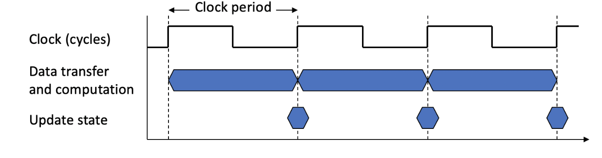
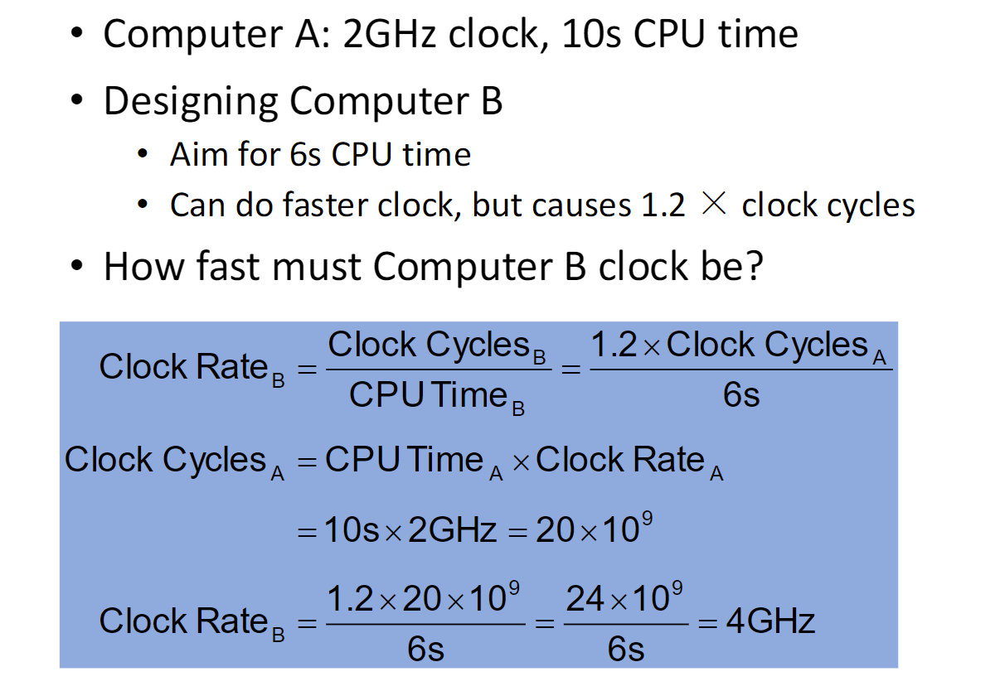
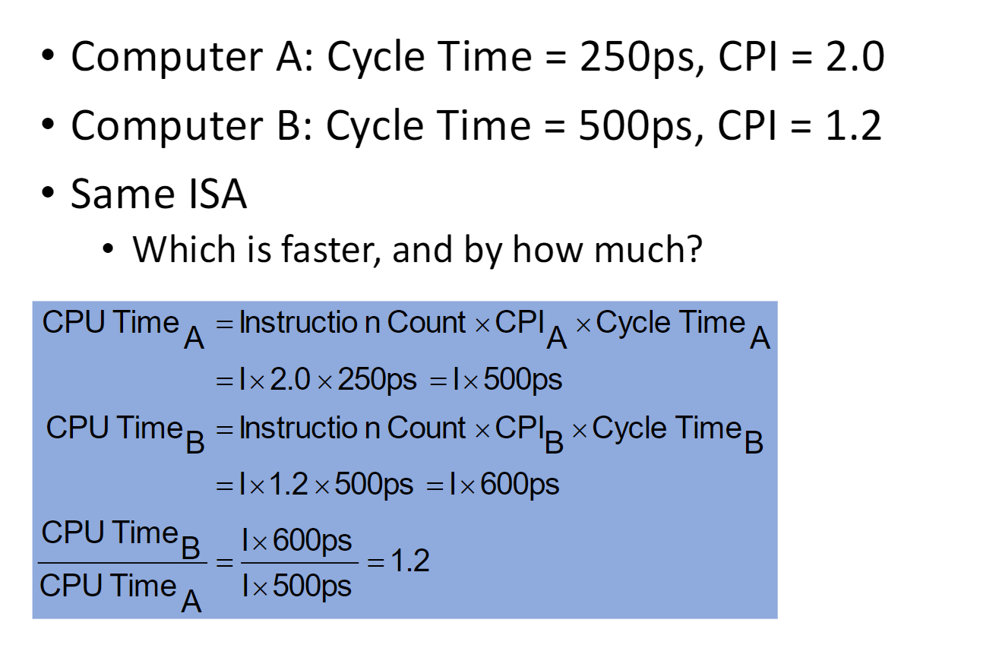

# Chapter 1
## 1 Performance
1. Define: Performance = 1 / Execution Time

!!! example X is n time faster than Y
    $$
    Performance_x / Performance_y = Execution\ time_y / Execution\ time_x = n
    $$
## 2 Quantitative approaches
### 2.1 CPU Performance
$$
CPU\ Execution\ Time = CPU\ Clock\ Cycles \times Clock\ Period
$$

$$ 
CPU\ Execution\ Time = \frac{CPU\ Clock\ Cycles}{Clock\ Rate}
$$

### 2.2 CPU Clocking
- Operation of digital hardware governed by a constant-rate clock

!!! note
    

### 2.3 CPU Time
$$
\begin{aligned}
CPU\ Time&= CPU\ Clock \ Cycles\times Clock\ Cycle\ Time\\
\ \\
&=\frac{CPU\ Clock\ Cycles}{Clock\ Rate}
\end{aligned}
$$

- Performance improved by
  - Reducing number of clock cycles
  - Increasing clock rate
  - Hardware designer must often trade off clock rate against cycle count

??? example
    

### 2.4 Instruction Count and CPI
- Instruction count
  - Determined by program, ISA and compiler
- CPI
  - Determined by CPU hardware
  - If different instructions have different CPI
    - Average CPI affected by instruction mix

1. 
$$
CPU\ CLock \ Cycles=Instructions for a Program \times Average\ Clock\ Cycles\ Per\ Instruction
$$
2. 
$$
\begin{aligned}
CPU\ Time&=Instruction \ Count\times CPI\times Clock\\
&=\frac{Instruction\ Count\times CPI}{Clock\ Rate}
\end{aligned}
$$
3. 
$$
\begin{aligned}
Weighted\ average\ CPI&=\frac{Clock\ Cycles}{Instruction\ Count}\\&=\sum^n_{i=1}(CPI_i\times \frac{Instruction\ Count_i}{Instruction\ Count})
\end{aligned}
$$

??? example
    
### 2.5 Summary
$$
CPU \ Time = \frac{Instructions}{Program}\times \frac{Clock\ cycles}{Instruction}\times \frac{Seconds}{Clock\ cycle}
$$

- Performance depends on
  - Algorithm:affects IC（总指令数）, possibly CPI
  - Programming language: affects IC, CPI
  - Compiler: affects IC, CPI
  - Instruction set architecture: affects IC, CPI, $T_c$（时钟周期）

### 2.6 Amdahl's Law（阿姆达尔定律）
$$
Improved\ Eexcution\ Time=\frac{Affected\ Execution\ Time}{Amount\ of\ Improvement}+Unaffected\ Execution\ Time
$$

- Affected Execution Time：表示能通过加速模式得到改善的执行时间部分。
- Amount of Improvement：表示在加速模式下的性能提升量。
- Unaffected Execution Time：表示无法通过加速模式改进的执行时间部分。
