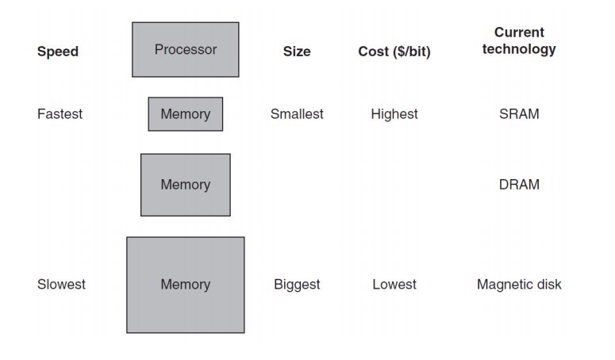
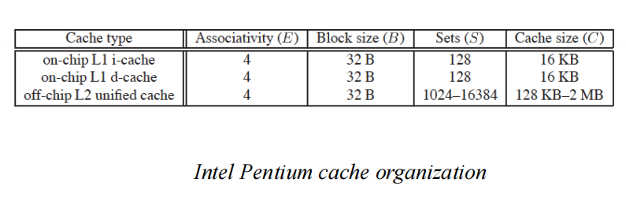
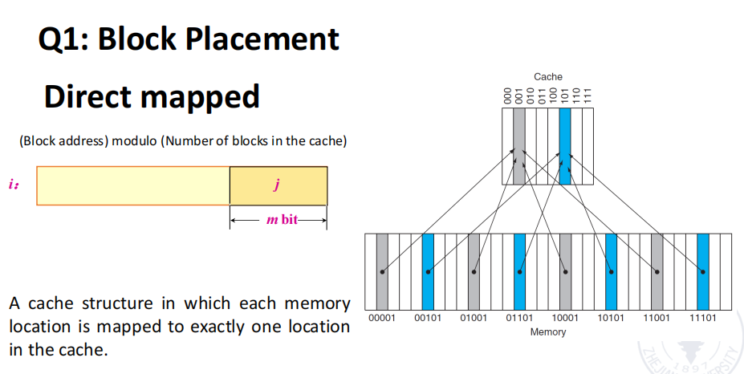
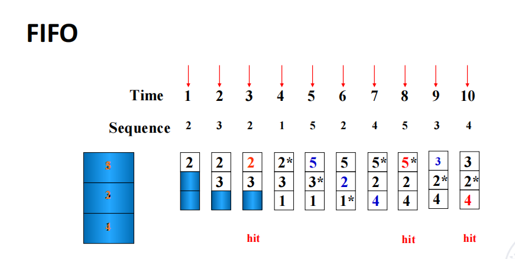
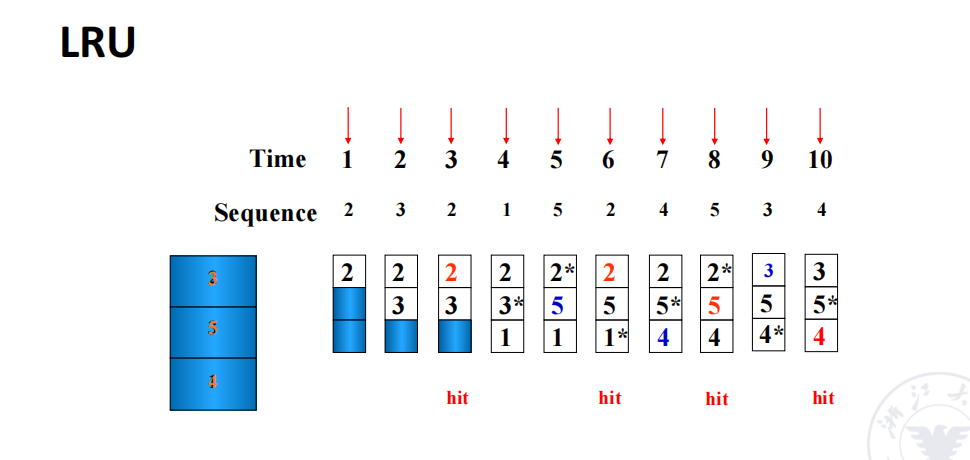
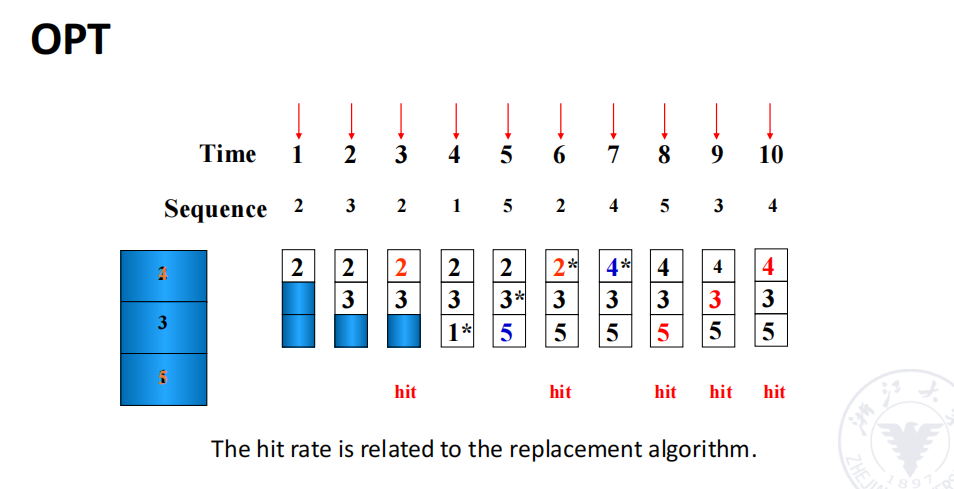

# Chapter3 Memory Hierarachy
## 1 Introduction
- Temporal locality: 如果某个数据项被访问，那么它在不久的将来很可能会再次被访问
- Spatial locality: 如果某个数据项被访问，那么它附近的其他数据项很可能在不久的将来也会被访问。
- SRAM：静态RAM
- DRAM：动态RAM

### Cache
- 当地址离开处理器后，遇到最高或第一级存储层次。  
- 利用缓冲（Buffering）来重用常见的数据项。
- Hit/Miss：processor can / cannot 在cache中找到所需的数据项。
- block/line：存储层次结构中最小的数据传输单位，特别是在缓存（Cache）和主存（Memory）之间的数据交换中使用。
  - 大小固定，包含多个字（word），其中某个字是CPU请求的数据

## 2 Technology Trend and Memory Hierarchy
### Cache Locality
- Temporal locality
- Spatial locality 
### Cache Miss
- 所需时间取决于
  - Latency：time to retrieve the first word
  - Bandwidth：time to retrieve the entire block 
- miss的原因
  - Compulsory：当一个块第一次被访问时，由于之前没有存入缓存，因此必须从主存加载
  - Capacity: 缓存容量有限，某些块可能被替换掉，如果后续程序又需要访问这些被替换的块，就会导致未命中，需要重新从主存加载
  - Conflict：由于多个块映射到相同的缓存位置，导致数据不断被替换。

### Three classes of computers with different concerns in memory hierarchy
- Desktop computers:
  - one application for single user
  - Are concerned more with **average latency** from the memory hierarchy.
- Server computers:
  -  hundreds of users running potentially dozens of applications simultaneously
  -  Are concerned about **memory bandwidth**
-  Embedded computers:
   -  Real-time applications.
   -  Are concerned more about power and battery life.
   -  Running single app & use simple OS
   -  Main memory is very small (often no disk storage)

### Split vs unified caches
- Unified cache:
  - 所有的内存请求（指令和数据）都经过同一个缓存。
  - 硬件开销小，但性能低
- Split cache: 
  - 将指令（Instruction）和数据（Data）存储在两个独立的缓存中。
  - 硬件开销大，提高性能，读取指令的I-Cache 只读，可能简化设计并优化性能。
  
!!! note
    

## 3 Four Questions for Cache Designers
### 3.1 Where can a block be placed in the upper level/main memory?
- **Direct Mapped（直接映射）**
  - 每个内存块只能映射到缓存中的唯一位置
  - Cache Index=(Block Address)mod(Number of Blocks in Cache)
    
- **Fully Associative （全相联）**
  - 每个内存块可以被放置到缓存中的任何位置。
- **Set Associative （组相联缓存）**
  - 2-way set-associative
    - 每个缓存组 (Set) 由 2 个缓存块 (Ways) 组成。
    - 一个内存块可以被映射到特定的组，但在该组内，它可以放入任意 2 个块之一
  - 4-way Set-Associative 
    - 这里的缓存分成多个组 (Sets)，每个组包含 4 个缓存块 (Ways)。

    !!! question 为什么使用“中间位索引” (Middle Bits Indexing)
           如果使用高阶地址位作为索引，某些连续的内存块会映射到相同的缓存组，导致冲突增加。

### 3.2 How is a block found if it is in the upper level/main memory?
- Tag：用于匹配主存中的地址
- a valid bit: block内容是否有效
### 3.3 Which block should be replaced on a Cache/main memory miss?
- random
- FIFO
    

- LRU
    

- OPT 
    
### 3.4 What happens on a write?
- Write Back or Write Through (with Write Buffer)

  1 2 3 4 5 6 7 8 9 10
  2 3 2 1 5 2 4 5 3 2 
s1 
s2
s3
s4
s5
