# 概统
1. mutually exclusive

    $A\cap{B}=\emptyset, i\neq{j}$

2. collectively exhaustive

    $A_1\cup{A_1}\cup\cdots\cup{A_i}=S$

3. 贝叶斯公式、全概率、条件概率
4. 互斥且独立的条件：至少其中一个的发生概率为0
5. Random values: capital letters (X)

   Consistant values: x
   
6. probability mass funcion
   
   $P_X(x)=P[X=x]$

   1. $For\ any\ x, P_X（x）\geq0$

   2. $\sum_{x\in{X}}{P_X(x)}=1$
   3. For any event $B\subset{S(x)}$
7. $k-permutations\ of\ n: P(n, k)$
8. $Factorial:n!$
9. Bernoulli Random Variable
    $$P_X(x)=\left\{\begin{matrix}1-p,\ x=0\\
    \\
    p,\    x=1\\
    \\
    0,others
    \end{matrix}\right.$$

10. Geometric Random Variable
11. Binomial Random Variable
    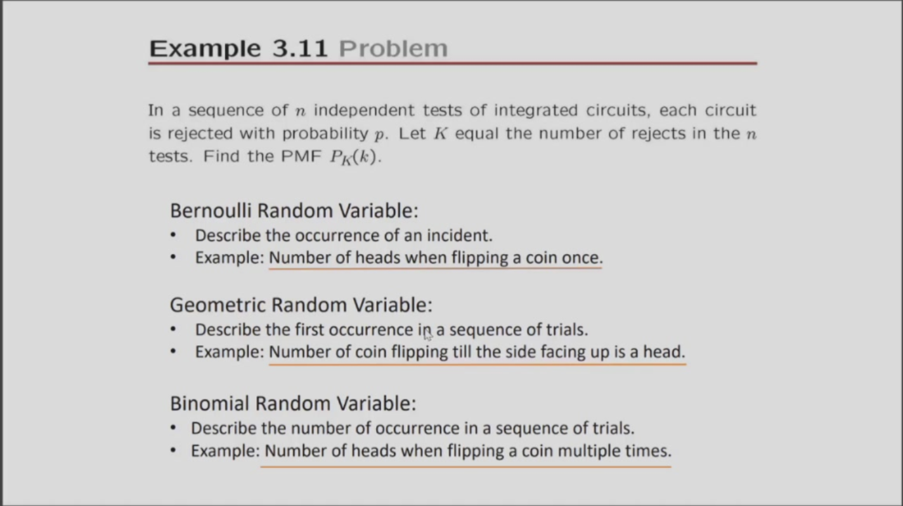
12. $Var[X]=E[X^2]-E[X]^2$
13. moment(矩)
    
    For random variable X:
    1.  The nth moment is $E[X^n]$
    2.  The nth central moment is $E[(X-\mu _X)^n]$

#### Classical Distribution
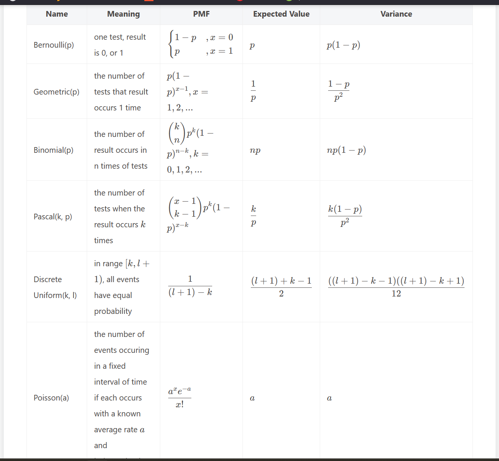
- Pascal: 第次k成立发生在第n次

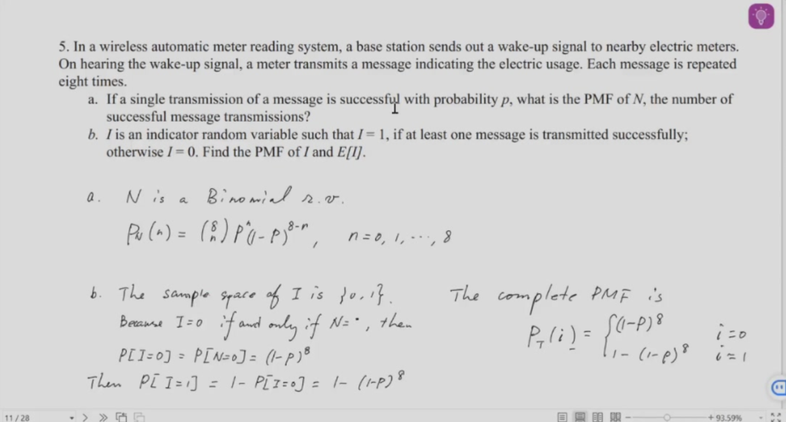

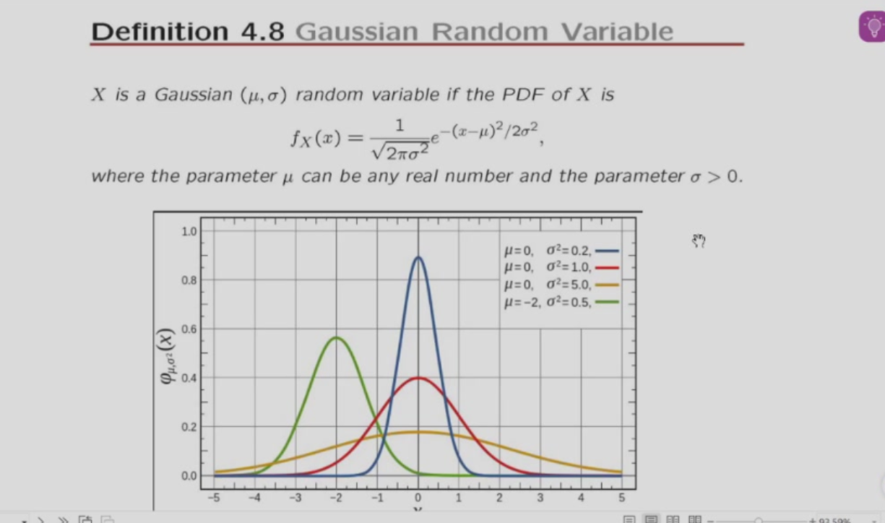

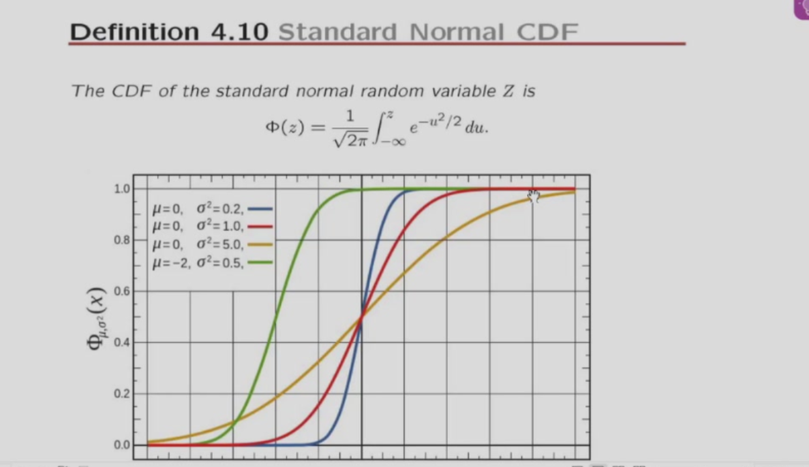

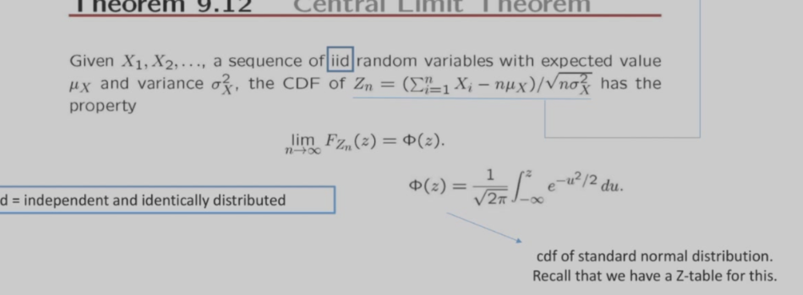

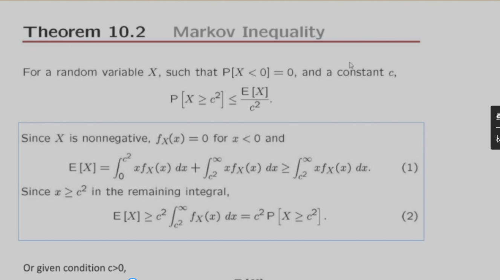

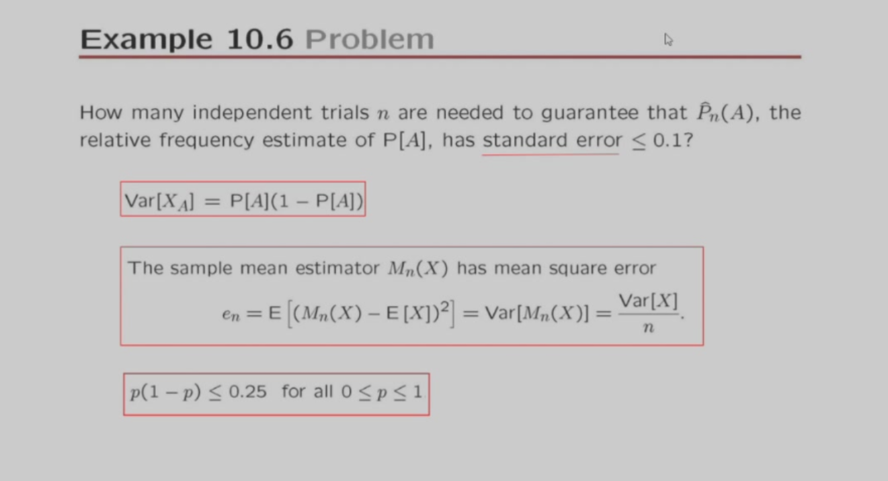

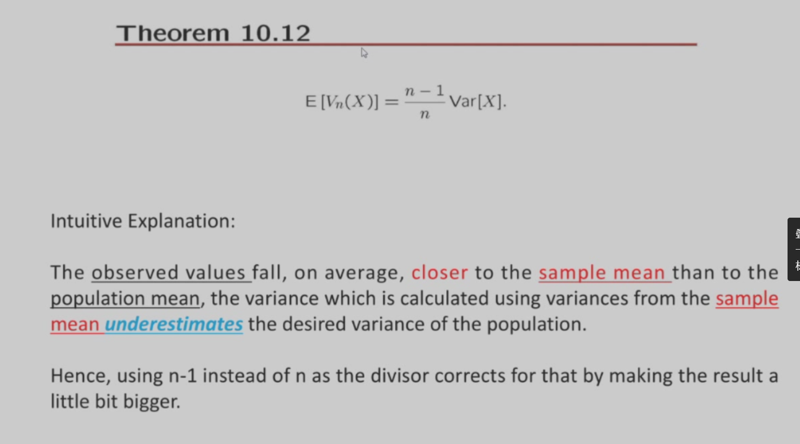

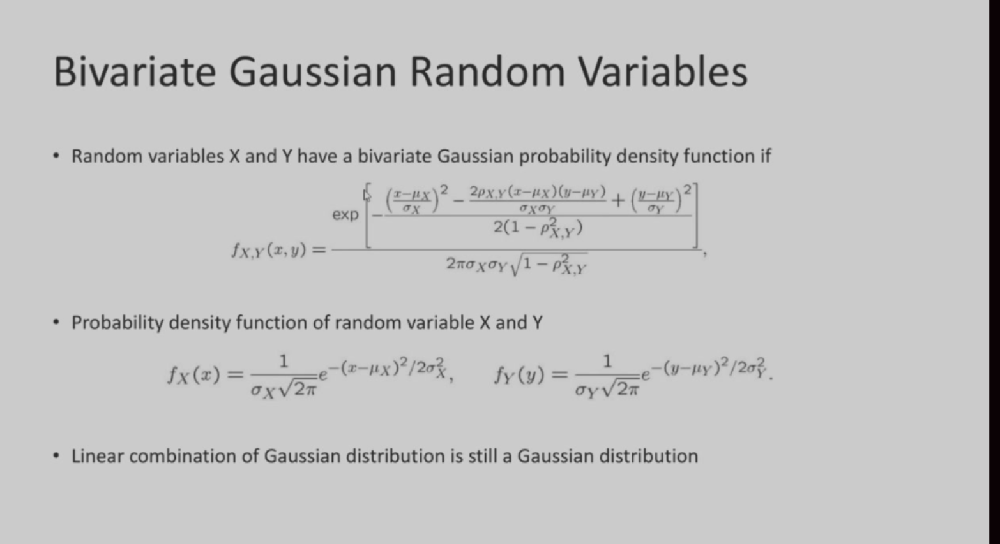

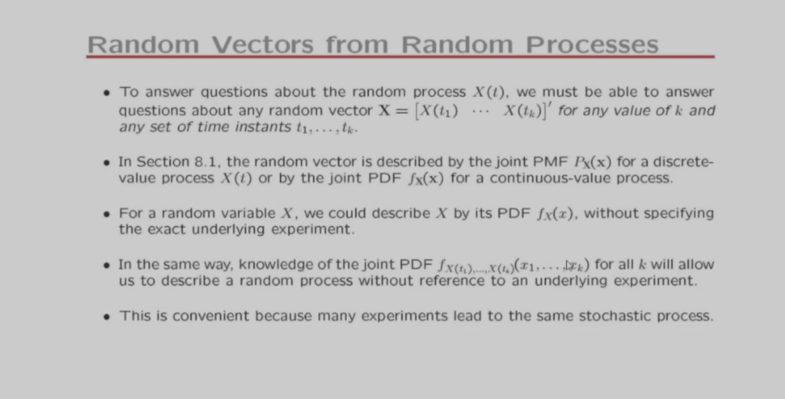

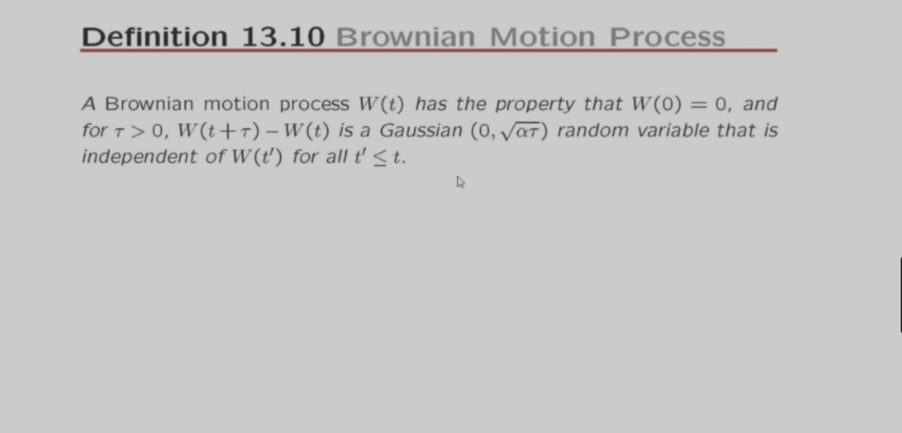
