!!! warning
    补天的产物，非常不全
# 离散
#### 逻辑等价式
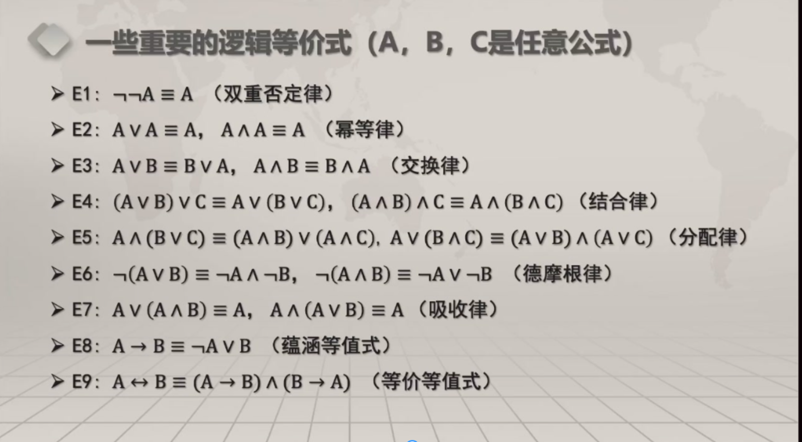
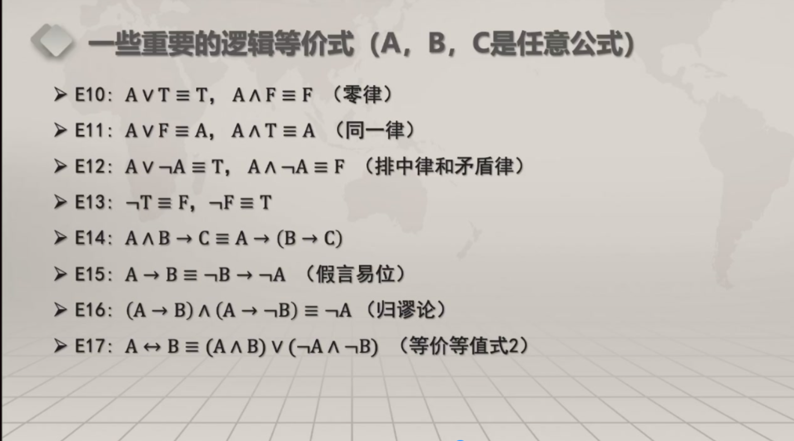
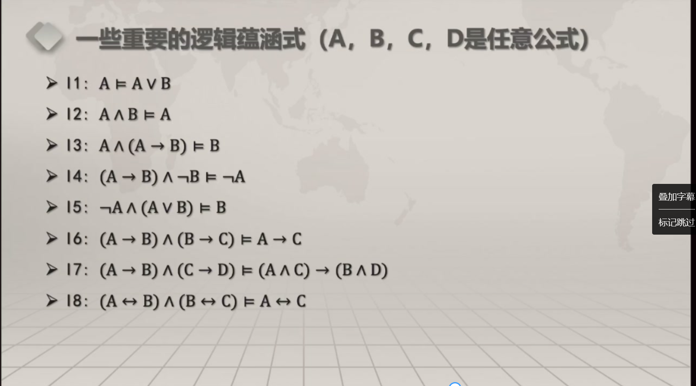
#### 重言式代入原理
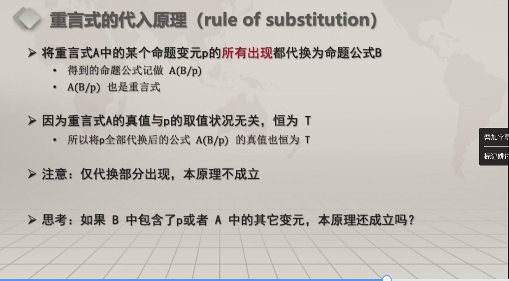
#### 重言式替换原理
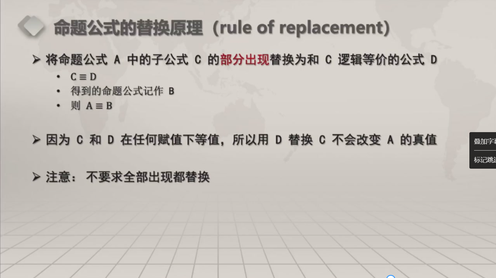
#### 证明
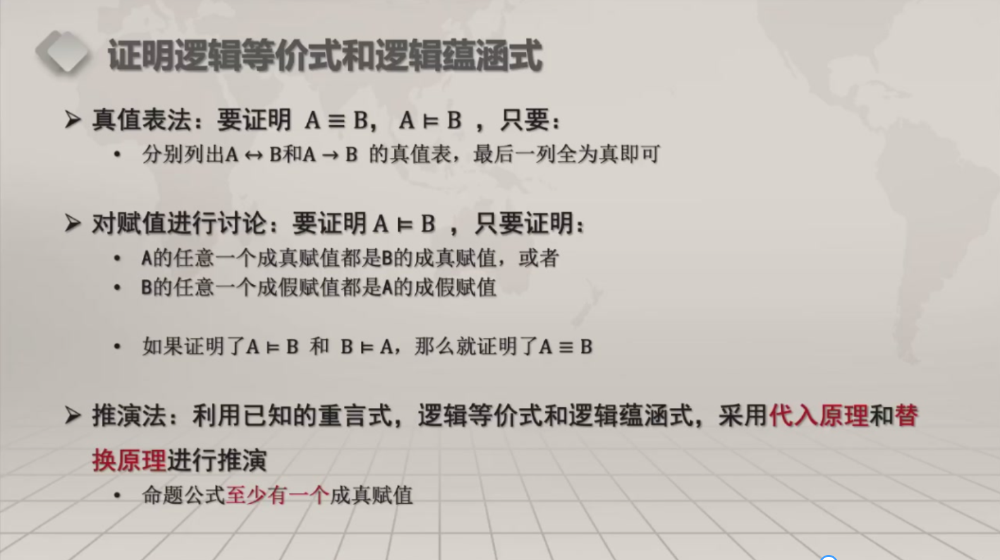
#### 谓词演算的永真式
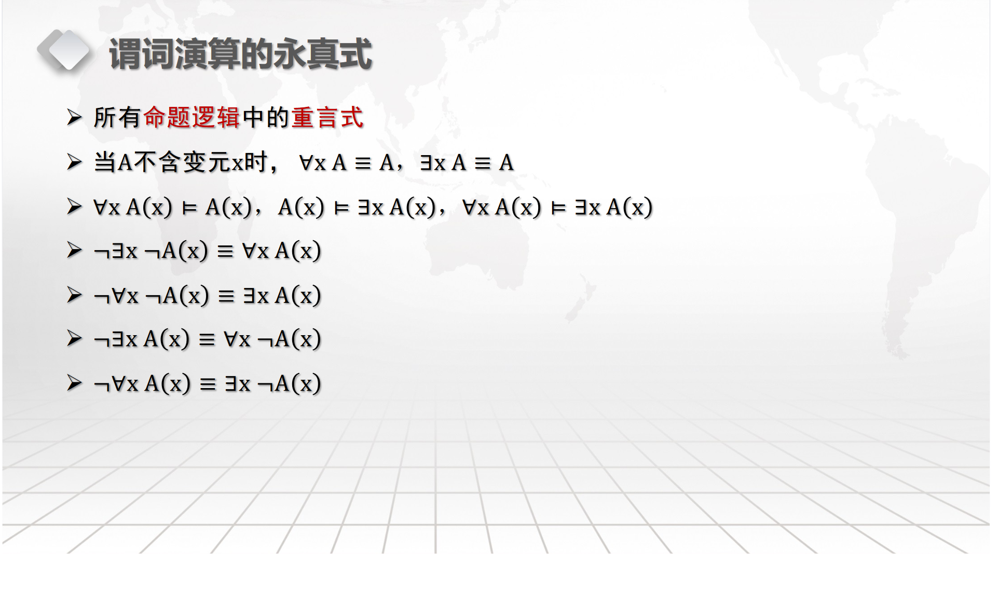
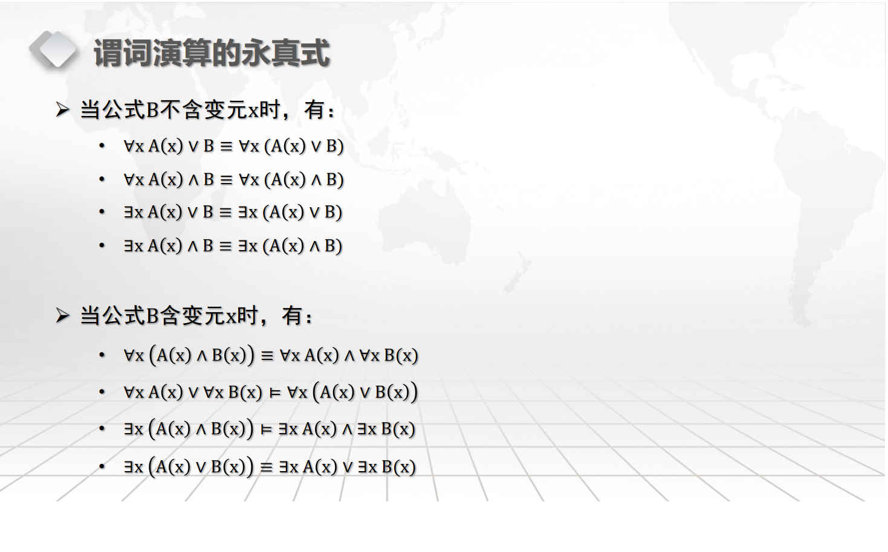
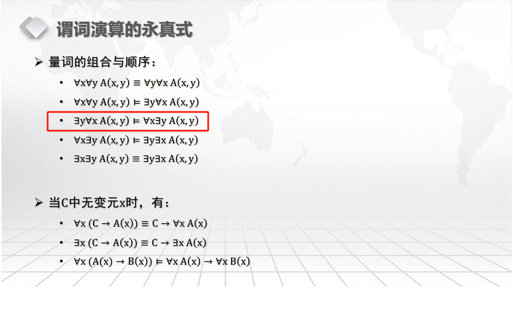
#### 逻辑联结词的优先级
- 非
- 析取、合取
- 蕴含
- 双向蕴含
#### 成真赋值和成假赋值
#### 命题公式的分类
- 永真式都是可满足式
- 矛盾式
- 非永真式并不都是永假式
#### 范式
- 文字：命题常元、变元和它们的否定
- 析取字句
- 合取子句
- 互补文字对：指一对正文字和负文字
  - 如p和非p
- 析取范式DNF
  - 例：$p\rightarrow q$的析取范式为非$p\vee q$
- 合取范式CNF
  - 析取子句或若干析取子句的合取
- 重言式识别
  - 合取范式中每个析取子句都包含至少一个互补文字对
    - $(p\vee 非p\vee q)\wedge(p\vee q\vee 非q)$
- 矛盾式识别
  - 析取范式每个合取子句包含至少一个互补文字对
- 析取范式或合取范式不唯一
- 析取范式可能同时又是合取范式
- 主范式
  - 主析取范式：A'是A的析取范式，且每个合取子句里p1, p2...pn均恰出现一次
  - 主合取范式
  - 存在性和唯一性
#### 功能完备集
- 冗余联结词
- 极小的功能完备集：不含冗余联结词
#### 逻辑等价式
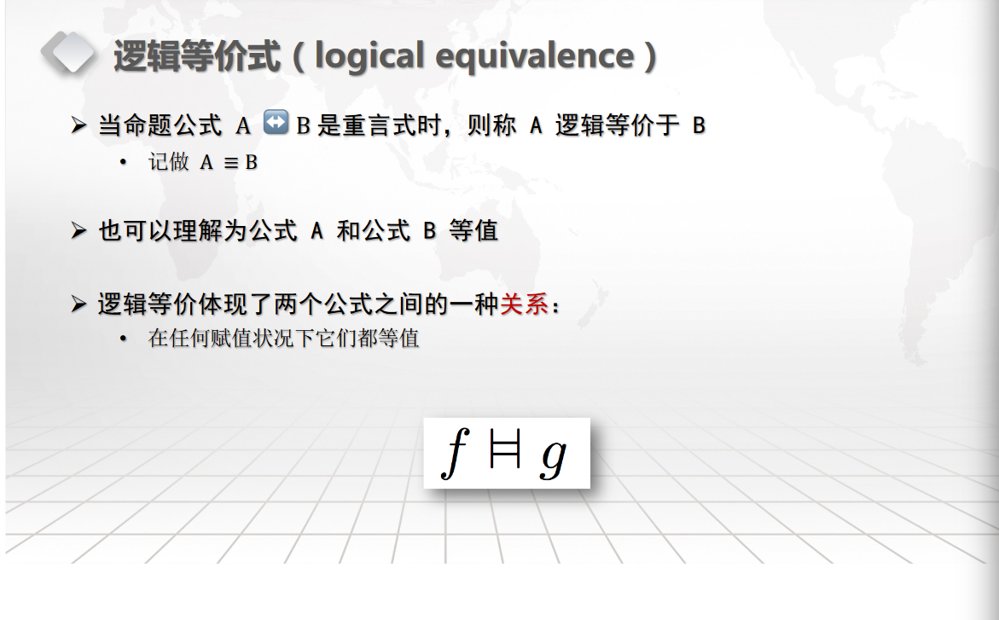
## 集合论
#### 公理化集合论
- 空集
- 有限集：空集和只含有限元素的集合
- 无限集
- 基数：有限集合中成员的个数
##### 集合论三大基本原理
- 外延公理：集合A 和 B相等当且仅当具有相同元素
  - 无序性
- 概括公理
    - $S=\{x|x\in U\wedge P(x)\}$
  - 确定性
    - 空集：P(x)为永假式
- 正规公理：集合的有限可分，个体域的元素是"基本粒子"
  - 集合不能是自己的成员
  - 排除$A=\{A\}$这样病态的集合
  - 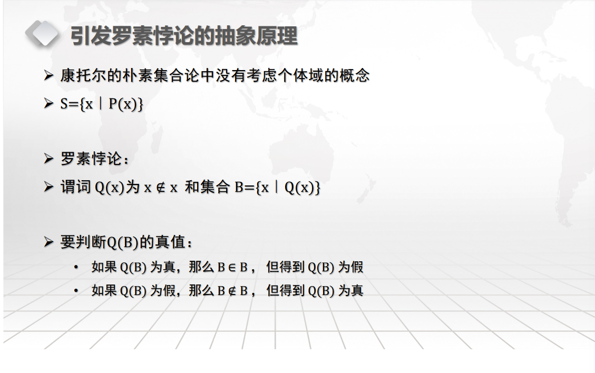
##### 幂集
- A的所有子集作为元素构成的集合
- 基数：$2^A$
##### 集合族
- 集合族：C中的每个元素都是集合
- 标志集：如果集合族C可以表示为下标的形式$C=\{S_d|d\in D\}$,这些下标组成的集合称作C的标志集
- 运算
  - 广义并
  - 广义交
  - 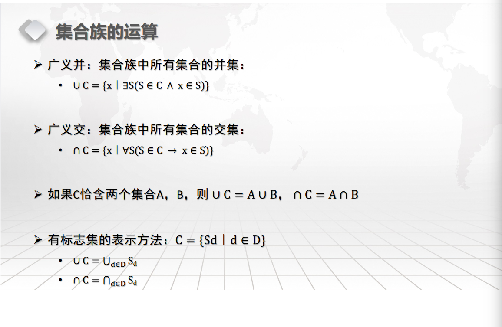
#### 归纳定义
- 基础条款
- 归纳条款
- 终极条款
### 等价类
- 不会是空集，因为总有aRa（等价关系的自反性）
- 不同元素可能有相同的等价类
- R是A上的等价关系，任意a, b$\in$A, 要么$[a]_R=[b]_R$, 要么$[a]_R\cap[b]_R=\emptyset$
- 自反性、传递性、对称性（反对称）
### 划分
- 不空、不漏、不交
#### 等价与划分的关系
- $\{[x]_R|x\in{A}\}$元素个数可能小于A中元素个数，所有等价类的集合是一个划分
- 等价关系与划分一一对应
  - 对应$\pi$的等价关系R，当且仅当R对应的划分为$\pi$
- 划分之间的关系
  - $|\pi|$越大，越细
  - 如果$\pi_1$的每一个单元都包含于$\pi_2$的某一个单元，称为$\pi_1<\pi_2$ “真细于”
  - $\pi_1,\pi_2$分别是等价关系$R_1,R_2$对应的划分，那么$R_1\subset{R_2}\harr\pi_1\leq\pi_2$
#### 划分的运算
- 积划分：$R_1,R_2$对应划分$\pi_1,\pi_2$ , $\pi_1\cdot\pi_2$是等价关系$R_1\cap{R_2}$对应的划分
- 和划分：
  - $\pi_1和\pi_2均细于\pi_1+\pi_2$
- 二元关系R的传递闭包t(R)
- 商集：
- 序关系：（ordered relation）
  - 集合A上的自反、反对称、传递的二元关系
  - 序在序关系R的集合A称作有序集（ordered set）
  - 一般的有序集表示成$<A,\leq>$
  - 哈斯图
    - 由于序关系自反，各节点都有环，省去
    - 有序关系反对称且传递，所以任何两个不同结点之间不会有双向的边或通路
  - 有序集集合元素中的排序
    - $a\leq{b}$, 称a先于或者等于b;
    - 如果$\lnot(a\leq{b})$不可比较或不可排序

- 上下界
  - $<A,\leq>$为有序集, $B\subset{A}$
    - 例:$A={a,b,c,d,e,f,g,h}, B={b,c,d}$
        上(确)界h, 下(确)界a
  - 如果b是B的最大元, 则b是B的上确界

### 链和反链
- 链:子集B中任意两个元素都可以比较
- 反链:子集B中任意两个元素都不可以比较
- $<A,\leq>$为有序集,$B\subset{A}$, 如果A最长链长度n, 

### 半序关系
### 函数
- 列表法
- 图表法(用平面直角坐标系的点表示)
- 解析法
- 归纳定义和递归定义(调用自身部分)
#### 函数的相等和包含
#### 映像
#### 函数的合成
- 习惯上f(x)和g(x)合成,记作$g(f(x))$, 多记作$g\circ{f}$, 有时会反
#### 函数类型
- 若f(x)不是单射, $g\circ{f}$不是单射
- 一个函数f:A→B 被称为单射，如果对于每一对不同的元素$a_1, a_2 \in A$，它们在函数 f(x)下的像也是不同的，即 $f ( a_1 ) \neq f ( a_2 )$
- 满射
- 双射(单射加满射)
- 逆函数(inverse function): 函数求逆是不是函数无法确定
  - $f^{-1}$是函数, 需$f$单射
  - $f^{-1}\circ{f}=x$

### 图论(Graph)
- 默认有向图
- 科尼斯堡七桥问题
- 一笔画问题
- 结点(v): 非空
- 边集: 可空, 可重
  - 有向边$<a, b>$:无多重边, 有环
  - 无向边{a, b}:允许有环, 有多重边 $\{\{a, c\}, \{a, c\}\}$
- 重图:边集E中至少一个元素重数>1
- 简单图: 无环无重边无向图
- 赋权图: 
  - $G=<V,E,f,g>$
  - 结点权函数:$f:V\rightarrow{W}$
  - 边权函数: $g:E\rightarrow{W}$
  - W可以为任何集合, 常为实数的子集
- 正则图: 所有顶点的度均相同
  - k-正则图: 顶点个数为 k
- 子图(subgraph)
  - $G_1=<V_1,E_1>,G_2=<V_2,E_2>,V_1\sub V_2,E_1\sub E_2,G_1是G_2的子图$，如果$G_1\neq G_2$，真子图
- 生成子图
    - 子图，且$V_1=V_2$
- 补图

  - $V_1=V_2,E_1\cap{E_2}=\emptyset,<V_1,E_1\cup{E_2}>$
- 图的同构
  - $G_1=<V_1,E_1>,G_2=<V_2,E_2>$
  - $|V_1|=|V_2|,|E_1|=|E_2|$
  - 如果可以将$G_1$中$V_1$所有结点一一对应地置换为$V_2$中结点名后得到的图等于$G_2$
- 拟路径(pseudo-path)
  - $v_1到v_m$的拟路径：$v_1,e_1,v_2,e_2,...,v_{m-1},e_{m-1},v_m$,其中$e_1=<v_i,v_{i+1}>或\{v_i,v_{i+1}\}$
  - 拟路径中的边数目称作拟路径的长度
- 路径（walk）与通路（path）
   - 如果拟路径中的边各不相同, 称作路径
   - 路径中顶点各不相同，称作通路
   - $v_1=v_m$的路径称为闭路径
   - $v_1=v_m$的通路称为回路
   - 在n个顶点的G中，如果有u到v的拟路径，那么u到v必有路径，且有长度不大于n-1的通路
   - 在n个顶点的G中，如果有v到v的闭路径，必定有v到v的长度不大于n的回路
- 图的连通性
  - u可达v：u=v，或存在一条u到v的路径
  - 连通的无向图：任意两顶点连通
  - 强连通的有向图：有向图中任意两个顶点都是互相可达的
  - 单项连通的有向图：任意两个顶点，至少从一个顶点到另一个顶点是可达的
  - 弱连通的有向图：蒋有向图看作无向图时是连通的
- 连通分支(connected component)
  - 图G的连通子图G'，而且G'不是任何其它连通子图的真子图（最大性）

#### 欧拉图及欧拉路径
- 欧拉图：如果G上有一条经过所有顶点、所有边的闭路径（边不重复，顶点允许重复）
- 欧拉路径：经过所有顶点、所有边的路径（边不重复，顶点允许重复）
- 欧拉图的充分必要条件
  - 无向图：G连通，所有顶点的度都是偶数
  - 有向图：G弱连通，每个顶点的出度与入度相等
- 欧拉路径的充分必要条件
  - 无向图：G连通，恰有两个顶点的度是奇数
  - 有向图：G弱连通，恰有两个顶点的出度与入度不相等，其中一个出度比入度多1，另一个入度比出度多1
#### 哈密顿图
- 哈密顿图：如果图G上有一条经过所有顶点的回路（不要求经过所有边）
- 哈密顿路径：经过所有顶点，不要求回路
- 判定定理（充分非必要）：如果具有n个顶点的图G的每一对顶点的度数之和都不小于n-1，那么G中有一条哈密顿通路
- 如果G的每一对顶点度数之和不小于n，且$n\geq3$，则G为一哈密图

#### 邻接矩阵（adjacency matrix）
- 无重边有向图$G=<V,E>$，其邻接矩阵A[G]
- 顶点的度
  - 入度
  - 出度
- 关于拟路径
  - 邻接矩阵自乘 L 次：$A^L$，则乘积结果矩阵中每个分量$a_{ij}^{(L)}$的含义为G中顶点$v_i到v_j$的长度为L的拟路径条数
#### 关联矩阵（简单无向图）
- 表示顶点和边的关联关系，n*m矩阵
- 通过矩阵的秩来判定图的连通分支个数
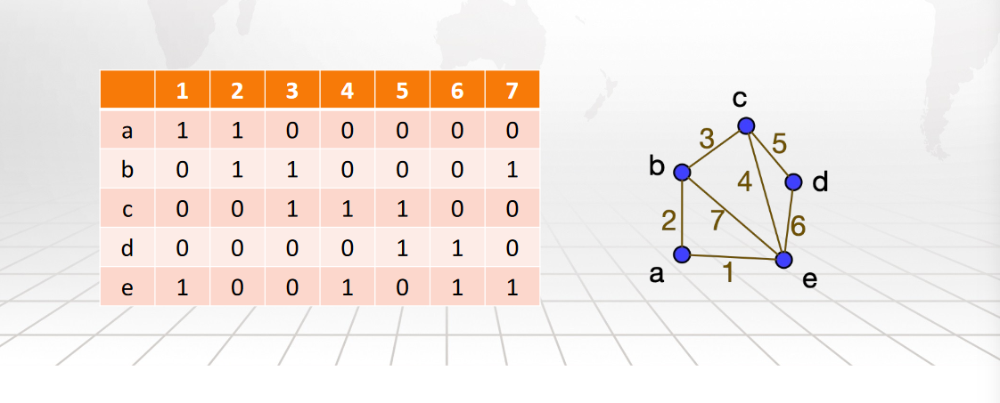
#### 路径矩阵
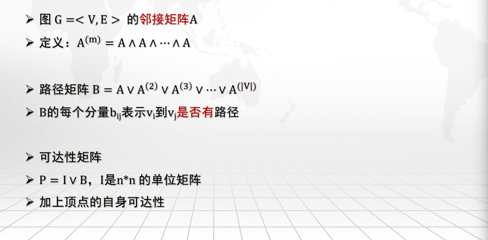
#### 二分图（bipartite graph）
- 无向图$G=<V,E>$ , 非空集合$X,Y$:$X\cup Y=V,$$X\cap{Y}=\emptyset$,且$\{v_i, v_j\}\in E,都有v_i\in X析取v_j\in Y,可以用G=<X,E,Y>$表示二分图，如果X,Y种任意两个顶点之间都有边，称为完全二分图，记作$K_{|X|,|Y|}$
- 不空不漏不交
- 同一侧元素间无边
- 等价条件
  - 至少两个顶点，G中所有回路的长度都是偶数
  - 证明$V_1,V_2$内部顶点间没有边（反证法）

- 最大匹配：匈牙利算法
  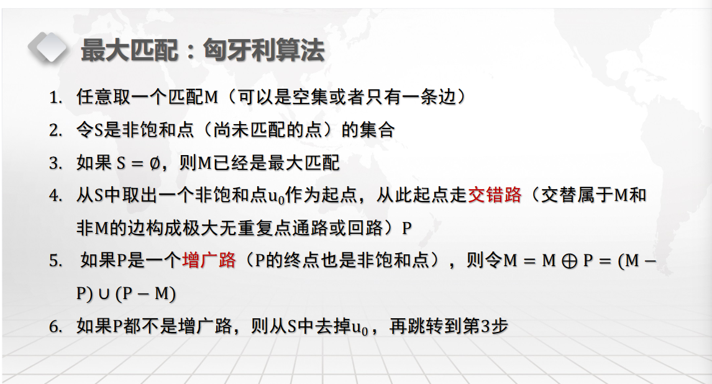
- 平面图的定义
  - **无向图**G可以在一个平面上图示出来，而且各边仅在顶点处相交，称作平面图，否则不是平面图
  - $K_5和K_{3,3}$都不是平面图（均为正则图，任意去掉一边，成为平面图）（顶点数/边数最少的非平面图）
  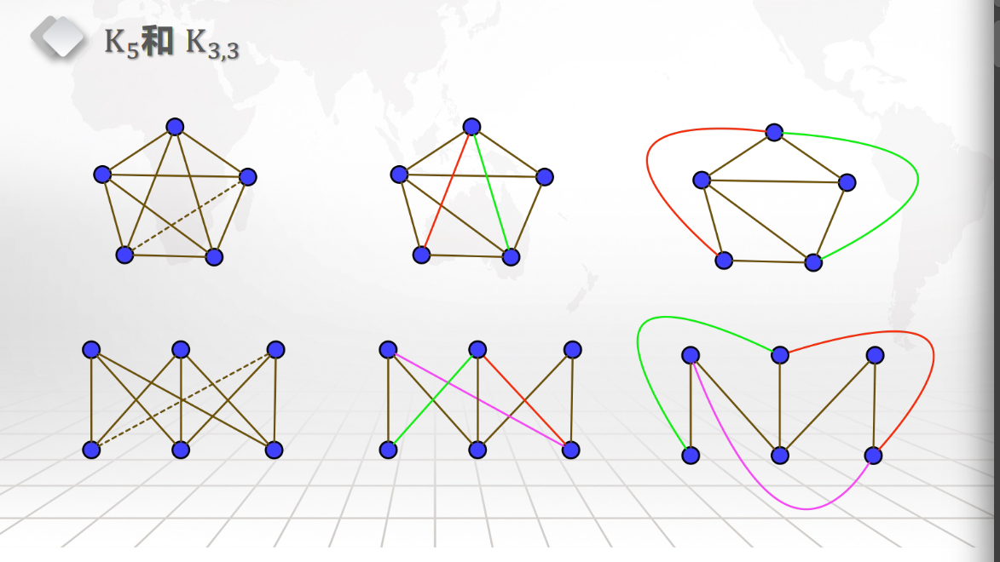

  - 等价条件：G 或 G 的子图作任何*同胚操作*（在原图的边上增加或删除二度结点）后均不以$K_5和K_{3,3}$为子图。

### 树（tree）
- 连通的无回路的无向图
- 树叶leaf
- 分支点：非树叶结点
- 空树
- 每个连通分支都是树的图称为森林
  - 树是森林
- 奇数层与偶数层构成二分图
- 二元有序树
  - 左子节点表示第一个子节点
  - 右子节点表示下一个兄弟结点

## 代数
#### 运算（operator）
- 二元运算：*(x,y)或x*y
  - 结合律
  - 交换律
  - *运算对#运算满足分配律：$x*(y\#z)=(x*y)\#(x*z)$
- 一元运算：$\triangle$
#### 代数结构
- 非空集合S，称作代数结构的载体，载体S上的若干运算，刻画载体上各运算性质的公理
  - 例：$<N,+>$
- 幺元：$x*e=e*x=x$
  - 例：<N,+>中的0是幺元
  - $<P(A),\cup>$中$\emptyset$是幺元
  - 右幺元：$x*e=x$
  - 左右幺元可能是不同元素，也可能有多个
  - 如果存在幺元，那么幺元唯一，同时是左右幺元
- 零元
  - 任意$x(x*0=0*x=0)$
  - 左右零元可能是不同元素，也可能有多个
  - 如果存在零元，那么零元唯一，同时是左右零元
- 逆元（$x^{-1}$）
  - 如果x*y=e（幺元），x称为y的左逆元
  - 如果x * y = y * x = e，x,y互称逆元
  - 逆元通常记作$x^{-1}$,如果运算为加法，x的逆元可以记作-x
  - 如果S的元素个数超过1，零元没有逆元
  - 满足结合律的代数结构中，逆元是唯一的
- 可约元素
  - 左可约：$a*x=a*y$可推出$x=y$
  - 右可约
  - 可约：$<S,*>$中的元素a, 如果对任意$x, y\in{S}$,左可约且右可约，称a为可约的
  - 性质：满足结合律的代数结构中，有逆元的元素是可约的
- 两个代数结构
  - 同类型（运算的元数相同）/同构
  1. 同构
    - 除符号之外，结构完全相同$<\{A,\emptyset\},\cup>$和$<\{1,0\},\vee>$
    - 存在S->S'的一一映射h，$h(x*y)=h(x)\circ{h(y)}$(其中*是S上的运算，而$\circ$是S'上的运算)
  2. 同态(homomorphism)
  - 对于 $<S,\triangle,\#>$ 和 $<S',\triangle',\#'>$, 如果有函数h：S->S'，对S中任意元素a，$h(\triangle(a))=\triangle'(h(a)),h(a\#b)=h(a)\#'h(b)$,函数h就称作代数结构S到S'的同态映射
    - h是单射函数，单一同态
    - h是满射函数，满同态
    - h是双射函数，同构映射
- 同余关系
  - 运算保持等价类的性质
  - 等价类$[x]_{~}$~称作同余类
- 代数结构的类型
  - 半群
    - 满足结合律的代数结构
  - 独异点
      - 含有幺元的半群
  - 群
    - 半群，有幺元，每个元素都有逆元
    - 没有零元（零元没有逆元）
  - 交换群/阿贝尔群
    - 满足交换律的群
  - 环
    - <R,+,*>有两个二元运算
    - <R,+>是阿贝尔群
    - <R,*>是半群
    - *对+可分配
  - 域
    - <F, +, *>, 有两个二元运算
    - <F, +, *>是环
    - <F - {o}, *>为阿贝尔群
#### 字符串集合的运算
- 乘积：$AB=\{st|s\in A\wedge t\in B \}$
## 正则表达式
- V上的正则表达式对应和描述了V*的一个子集（正则子集）
- $ab*b$描述了$\{ab, abb, abbb, ...\}$
- $(ab)*$描述了$\{ab, abab, ...\}$
### 短语结构语法
- V是字符集
- $S\sub{V}$称作终结符
- 导出树
#### 语法分类
- 对于短语结构语法G， 讨论其产生式集合
- 无约束：0型语言
#### BNF范式
- BNF可以表示2、3型语言（上下文相关、正则表达式）
- 主导图翻译成正则表达式：
  - 串联：ab
  - 并联：a | b
  - 循环：ab*
### 图灵机
#### 接受
#### 识别与枚举
#### 判定
- 属于语言的串被接受，且不属于的被拒绝，不存在永不停机的可能
- 只有L和L的补语言都是图灵机可识别的情况，L才是图灵可判定的
- 存在语言是图灵可识别但不可判定的

- 哥德尔编码
  - 首先定义函数P（n）为第n个素数（n > 0），我们知道，素数有无限多个，而且任何正整数都能唯一的写成素数的乘机
- 程序和通用图灵机
  - 每个程序执行待定的计算，实现特定的功能
  - 通用图灵机：
    - 接受两个输入整数a, k
      - a是图灵机的哥德尔数
      - k是图灵机输入的哥德尔数
    - 计算结果是M（a）在输入I（k）下的输出结果的哥德尔数G（o）
    - U所计算的函数是U：$N\times N->N$
  - 停机问题
