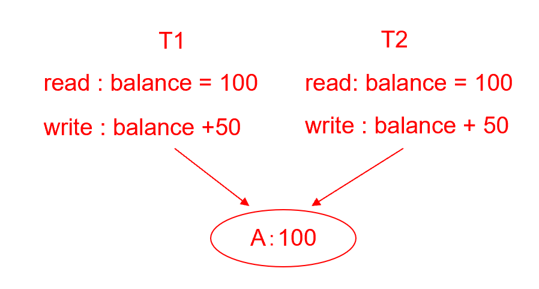
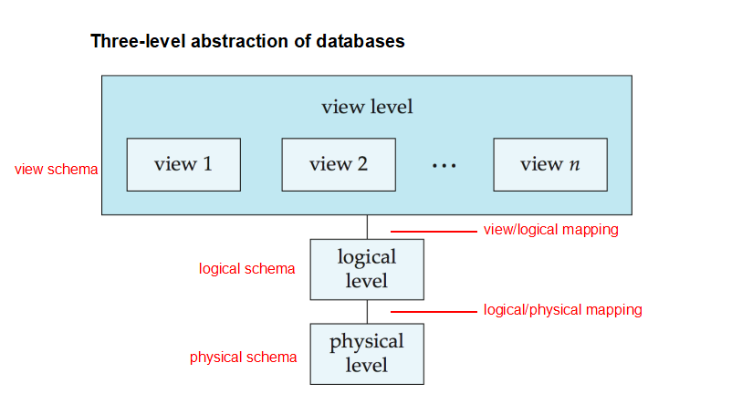
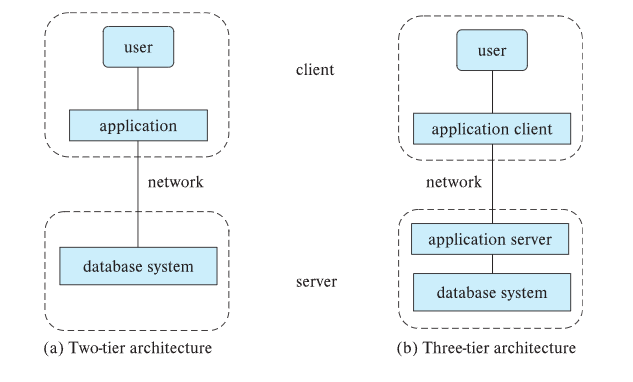

!!! info
    ## Course Pracitce
    - 数据库系统实验要求
    - 图书管理系统实验
    - minisql
    ## Grading Policy
    - assignments 10
    - quizs 10
    - experiments 30
    - final 50

## 1 Purpose of Database Systems
- Data redundancy and inconsistency 数据冗余与不一致
- Difficulty in accessing data 存取数据困难
  - need to write a new program to carry out each new task
- Data isolation 数据孤立
- Integrity problems 完整性问题
  - 约束条件没有显示声明
- Atomicity of updates 原子性问题

    ??? example 
        transfer of funds from one account to another should either complete or not happen at all

- Concurrent access anomalies 并发访问异常

    ??? example 
        
- Security problems
  - Authentication (认证), Priviledge (权限), Audit (审计)

## 2 Characteristics of Databases
- data persistence
- convenience in accessing data
- data integrity
- concurrency control for multiple user
- failure recovery 
- security control
## 3 Levels of Abstraction（抽象层次）
- Physical level（物理层）: describes how a record (e.g., instructor) is stored.
- Logical level（逻辑层）: describes data stored in database, and the relationships among the data.
- View  level（视图层）: application programs hide details of data types.  Views can also hide information (such as an employee’s salary) for security purposes. 
## 4 View of Data

## 5 Schema and Instance
### 5.1 Schema
-  the logical structure of the database 
-  Analogous to type information of a variable in a program
-  Physical schema（物理模式）: database design at the physical level
-  Logical schema（逻辑模式）: database design at the logical level
### 5.2 Instance(实例)
- the actual content of the database **at a particular point** in time
- Analogous to the value of a variable
## 6 Data Independence
- Physical data independence: the ability to modify the physical schema without changing the logical schema
- Logical data independence: the ability to modify the logical schema without changing the user view schema
## 7 Data Models
### 7.1 A collection of tools for describing
- data  数据
- data relationships 联系
- data semantic 语义
- data constraints 约束
### 7.2 Relational Model
- columns / attributes 列/属性
- rows / tuples 行/元组
## 8 Database Languages
### 8.1 Data defimition language (DDL) 定义语言
!!! example 
    ```
    create table instructor(
      ID        char(5),
      name      varchar(20),
      dept_name varchar(20),
      salary    numeric(8,2)
    )
    ```

- DDL compiler generates a set of table templates stored in a data dictionary（数据字典）
- Data dictionary contains metadata (元数据， i.e., data about data)
  - database schema/integrity constraints/authorization
### 8.2 data manipulation language (DML) 操作语言
- SQL is the most widely used query language
- two classes of languages  
  - procedural 过程式 （user specifies what data is required and how to get those data）
  - declarative 陈述式 （without specifying how to get those data）
### 9 Transaction Management
- A transaction is a collection of operations that performs **a single logical function** in a database application.
- Ensures that the database remains in a consistent (correct) state despite system failures (e.g., power failures and operating system crashes) and transaction failures.
- **Concurrency-control manager** controls the interaction among the concurrent transactions, to ensure the **consistency** of the database. 
## 10 Database Architecture
- Centralized databases（集中式数据库） :
  - 一到少数几个核心，共享内存。
- 客户端-服务器架构：一台服务器代表多个客户端执行任务。
- Parallel databases（并行数据库） :
  - 多 core 共享内存。
  - Shared disk（共享磁盘）(集群): 所有节点共享访问相同的磁盘存储。
  - Shared nothing（无共享）: 每个节点拥有自己的磁盘存储，节点之间通过网络通信。
- Distributed databases（分布式数据库） :
  - 地理分布。
  - 模式/数据异构性。
## 11 Database Applications
- Two-tier architecture: 应用程序驻留在客户端机器上，并在客户端调用服务器端的数据库系统功能。
- Three-tier architecture: 客户端机器充当前端，不包含任何直接的数据库调用。客户端通过某种界面（通常是表单界面）与应用服务器通信。应用服务器再与数据库系统通信以访问数据。

??? note
    


## 12 Database Administrator(DBA)

### Functions
- Schema definition
- Storage structure and access-method definition
- Schema and physical-organization modification
- Granting of authorization for data access
- Routine maintenance
## Homework
### 1.7 List four signifcant differences between a file-processing system and a DBMS
||file-processing system|DBMS|
|---|---|---|
|1|Difficulty in accessing data(need to write a new program to carry out each new task)|convenience in accessing data|
|2|Integrity problems|data integrity|
|3|Concurrent access anomalies|concurrency control for multiple user|
|4|Security problems|security control|


### 1.8 Explain the concept of physical data independence and its importance in database systems.
- The ability to modify the physical schema without changing the logical schema
- Importance: changes in some parts do not seriously influence others
### 1.9 List five responsibilities of a database-management system. For each responsibility, explain the problems that would arise if the responsibility were not discharged.
1. Data integrity: Ensures that the data is accurate and consistent. If not, the system cannot be able to detect and the errors.
2. Concurrency control: Ensures that multiple users can access the data simultaneously without interfering with each other. If not, the system may lead to unpredictable results.
3. Security: Ensures that the data is protected from unauthorized access and modification. If not, the system may be vulnerable to attacks.
4. Recovery: Ensures that the system can recover from failures and maintain its integrity. If not, the system may be unable to recover and the data may be lost.
5. Data persistence: Ensures that the data is stored permanently. If not, the data may be lost permanently.
### 1.15 Describe at least three tables that might be used to store information in a social-networking system such as Facebook.
Table 1:

|ID|user names|ages|emails|passwords|
|-|-|-|-|-|
||||||

Table 2:

|post_id|post_title|post_content|post_date|post_author|
|-|-|-|-|-|
||||||

Table 3:

|comment_id|comment_content|comment_date|comment_author|post_id|
|-|-|-|-|-|
||||||