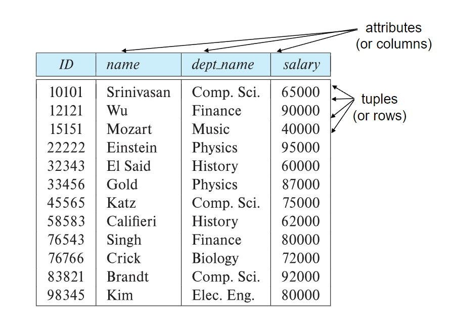
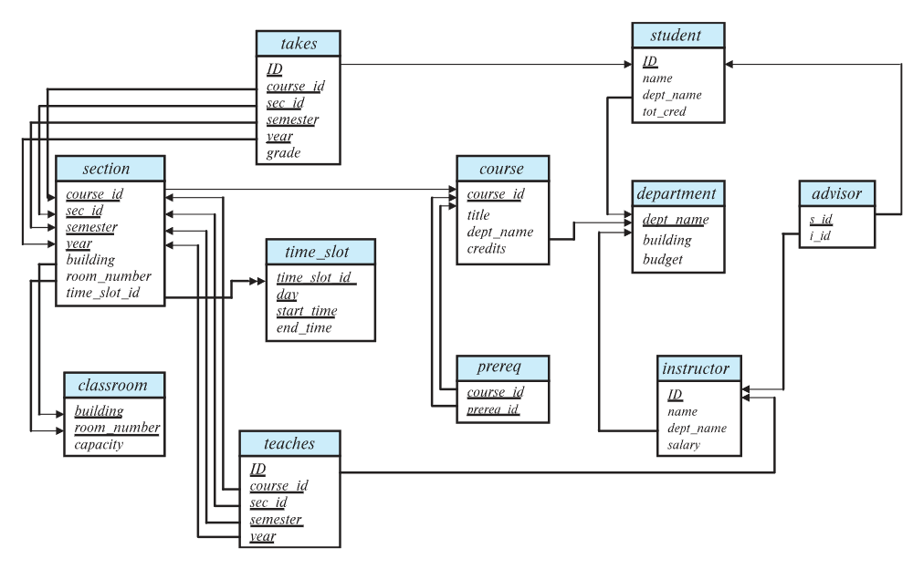
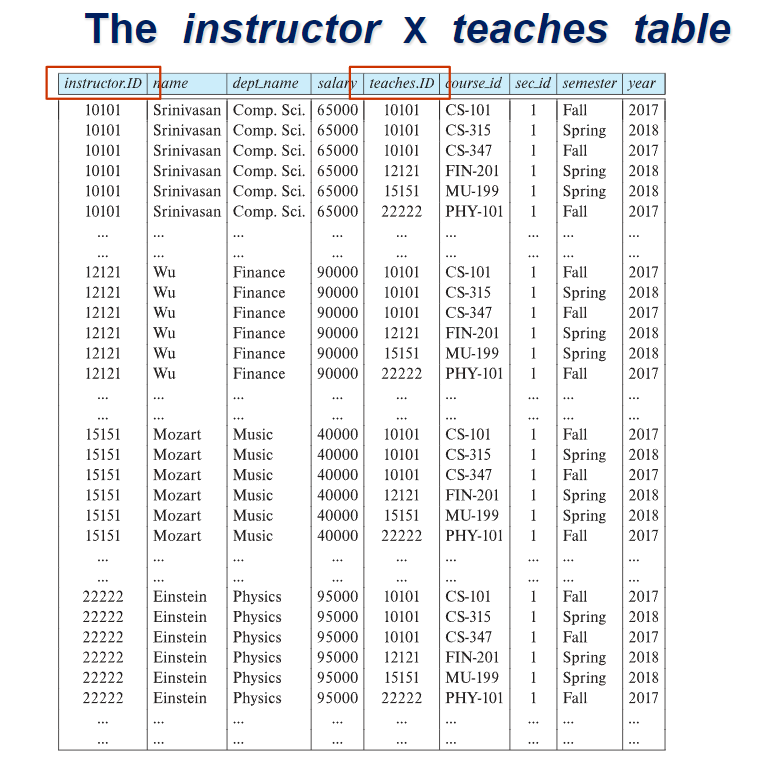

# Part 2: Intro to Relational Model
## 1 Structure of Relational Databases
!!! example Instructor Relation
    

### 1.1 Attributes
- **domain（域）：** the set of allowed values for this attribute
- indivisible (atomic 原子的)
- **null** is a member of **every** domain
### 1.2 Relations are Unordered

## 2 Database Schema
- database schema: the logical structure of a database
  - instructor(ID, name, dept_name, salary)
- database instance: a snapshot（快照） of the data（即数据+表头等）
## 3 Keys
- superkey（超键）：sufficient to identify a unique tuple
- candidate key（候选键）：minimal superkey
- primary key（主键）：One of the candidate keys is selected to be the primary key
- foreign key（外键）：Value in one relation must appear in another
### 3.1 Schema Diagram

## 4 Relational Query Languages
### 4.1 Six basic operators
- select: $\sigma$
  - $\sigma_{\text{dept\_name="Physics"}}(\text{instructor})$
- project: $\Pi$
  - $\Pi_{A_1, A_2, A_3\dots A_k}$(r)
  - 从r中选取attributes A1等，**不含重复元素，relations是集合**
- union: $\cup$
  - r, s有相同元数（attributes数相同）
  - The attribute domains must be compatible(example: 2nd column of r deals with the same type of values as does the 2nd column of s)
- set difference: $-$
- Cartesian product: $\times$
  - 两个表中任意两行信息的组合

!!! example         
    $\text{instructor}\times \text{teaches}$
    

- rename: $\rho$
  - $\rho_x(E)$
### 4.2 Select Operation
- comparison: $=,\neq,>,\geq,<,\leq$
- connectives: $\wedge, \vee, \urcorner$
## 5 The Relational Algebra（关系代数）
!!! example
    $\Pi_{\text{name}}(\sigma_{\text{{dept\_name="Physics"}}}(\text{instructor}))$

- Join Operation : $r\bowtie_\theta s=\sigma_\theta(r\times s)$
- Assignment Operation:
  $$
  \begin{aligned}
  &\text{Physics}\leftarrow\sigma_\text{dept\_name="Physics"}(\text{instructor})\\
  &\text{Physics}\cup\text{Music}
  \end{aligned}
  $$
