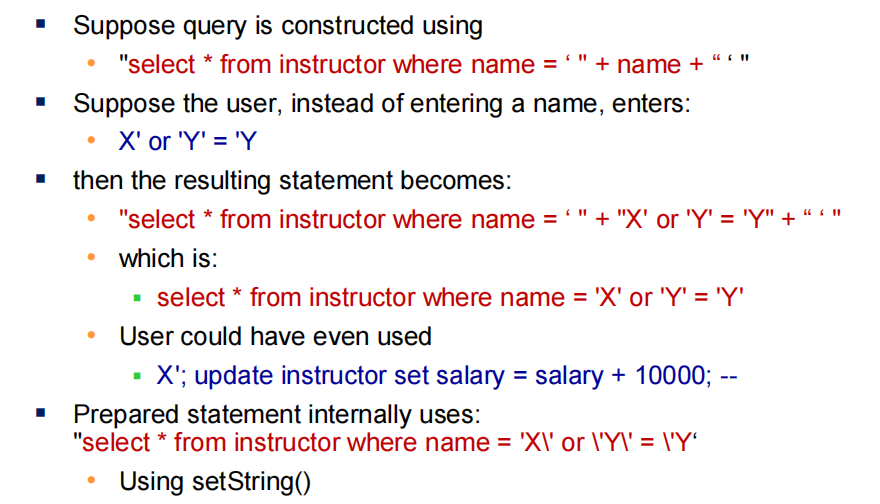

# Part5: Advanced SQL
## 1 Accessing SQL from a Programming Language
- change: **missmatch** in the was these languages manipulate data.
- two approaches: 
  - Dynamic SQL: 通过函数库与数据库服务器交互；允许程序在运行时构建并提交sql查询；ODBC & JDBC & Python Database API等
  - Embedded SQL: 预编译sql与数据库交互；sql在编译时被转换为函数调用；运行时通过动态SQL的API连接数据库
## 2 JDBC(dynamic)
- vs SQLJ: embedded SQL in Java
### 2.1 SQL Injection

**Always use prepared statements, with user inputs as  parameters**
### 2.2 Transactions
- conn.commit();
- conn.rollback();
- conn.setAutoCommit(false)/conn.setAutoCommit(true);