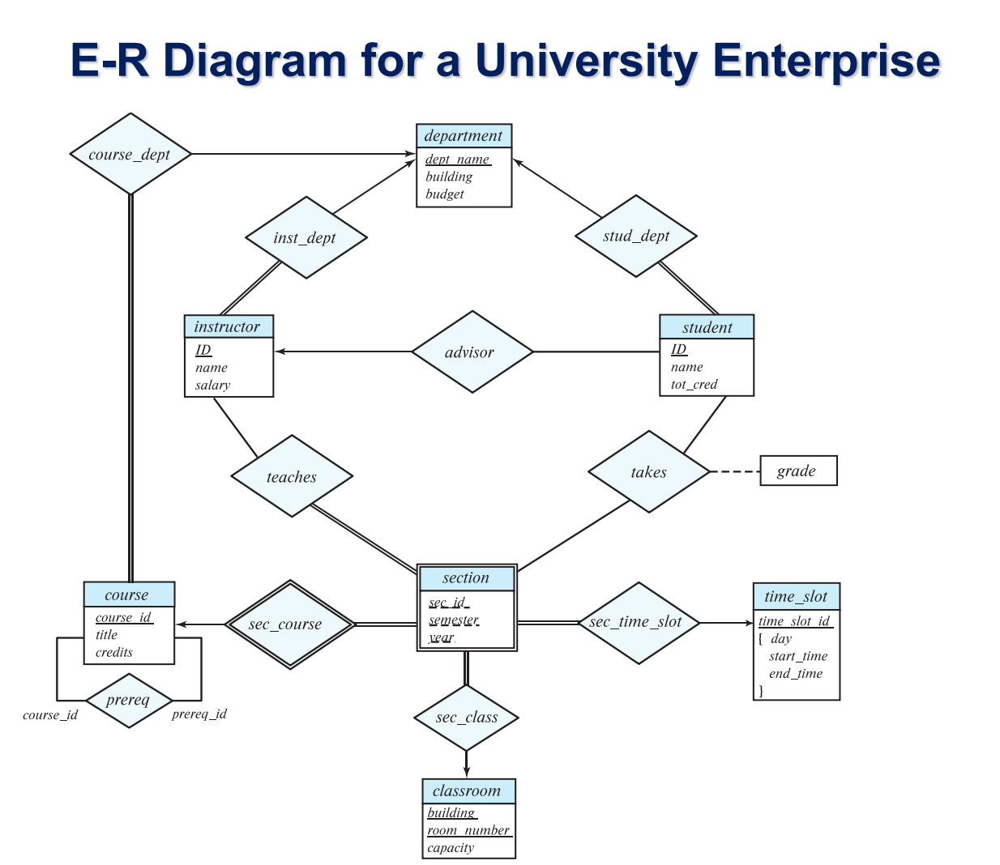
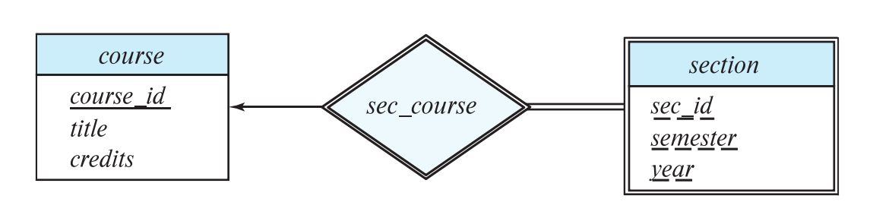
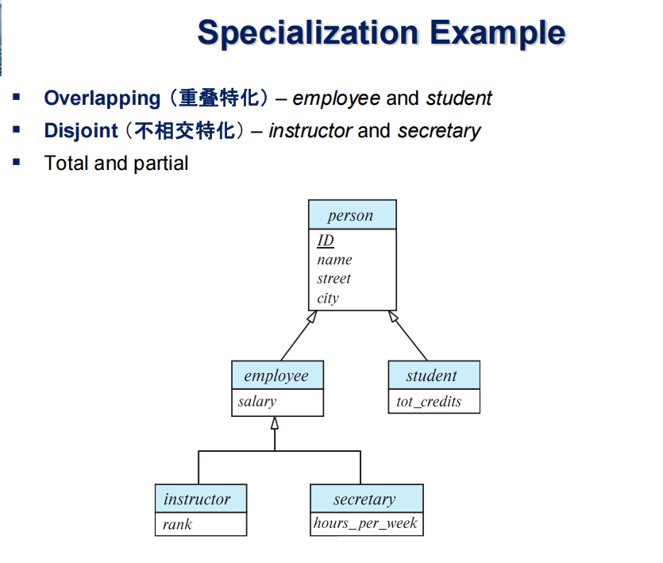

# Part 6: Database Design using the E-R Model

- We express cardinality constraints by drawing either a directed line (->), signifying “one,” or an undirected line (—), signifying “many,” between the 
relationship set and the entity set

## 1 Choice of primary key for binary relationship
- many-to-many relationship: The preceding union of the primary keys
- one-to-many / many-to-one relationship: The primary key of the “Many” side
- one-to-one relationship: The primary key of either one of the participating entity sets 

## 2 Weak entity sets
- A weak entity set is one whose existence is dependent on another entity, called its identifying entity 
- Every weak entity must be associated with an identifying entity; that is, the weak entity set is said to be existence dependent on the identifying entity set.
- We underline the discriminator of a weak entity set with a dashed line.
- In E-R diagrams, a weak entity set is depicted via a double rectangle.The relationship set connecting the weak entity set to the identifying strong entity set is depicted by a double diamond.

## 3 Extended E-R Features
### 3.1 特化 （Specialization）
- 自顶向下的数据库设计方法，用于在高层实体集中划分子分组（子实体集）。这些子分组具有独特的属性或参与的关系，而高层实体集不具备这些特性。

### 3.2 泛化 （Generalization）
- 自底向上的数据库设计方法，通过将多个共享相同特征的低层实体集合并为一个高层实体集，实现数据的抽象与简化。