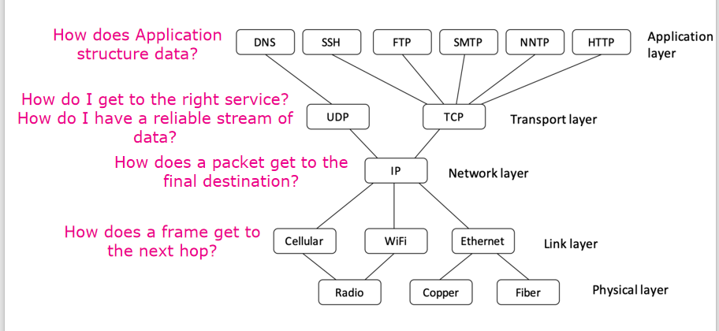
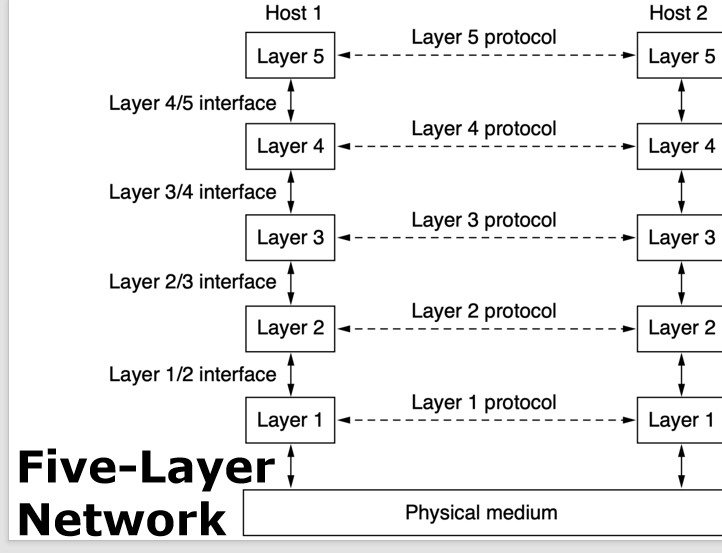
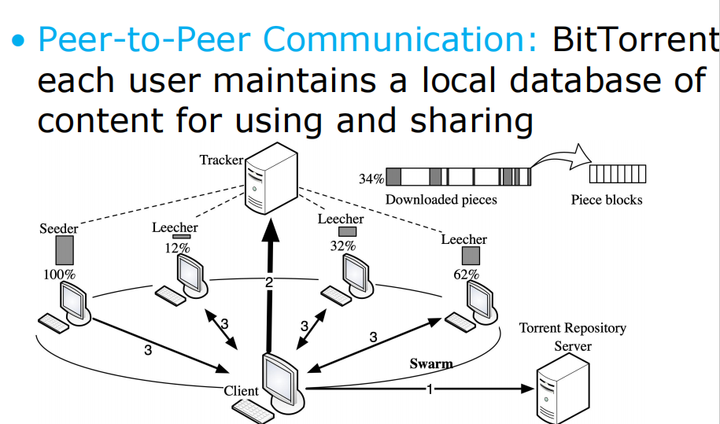
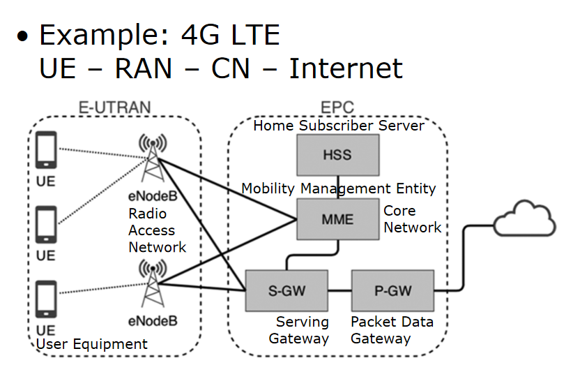

# **Intro**
## **1 communication**
1. what channel
      1. wired
      2. wireless
2. how far (Hop是指数据包在从源头到目的地的路径上，从一个网络设备（如路由器）传输到下一个网络设备的节点。)
      1. single-hop
      2. multi-hop
3. how many routes
      1. single-path
      2. multi-path
4. who to reach
      1. unicast(到1个设备)
      2. multicast（到多个特定设备）
      3. broadcast(广播)
5. what data

## **2 How a network protocol stack works**

## **3 Protocol Layering**

- Protocol: 通信双方就如何进行通信所达成的一种约定。
- Layer n protocol:两台机器上，第n层之间在“对话”时所使用的规则和约定。

### **相关概念**

#### **1. 对等实体 (Peers)**

*   **定义**: 对等实体（Peers）指的是位于不同机器上、网络模型中**相应层**的实体。
*   **形式**: 这些实体可以是软件进程、硬件设备，甚至是人。
*   **举例**:
    *   发送方机器的应用层（如浏览器）和接收方机器的应用层（如Web服务器）就是一对对等实体。
    *   发送方机器的网络层和接收方机器的网络层也是一对对-等实体。

#### **2. 通信方式：虚拟通信 (Virtual Communication) vs 物理通信 (Actual Communication)**

*   **虚拟通信 (Virtual Communication)**
    *   **概念**: 指的是在概念上，一台机器的第 `n` 层与另一台机器的第 `n` 层之间直接进行的通信。
    *   **要点**: 实际上，数据**并不会**从一台机器的 `n` 层直接传输到另一台机器的 `n` 层。这是一种为了简化网络模型和设计而采用的逻辑视图。对等实体之间认为它们在直接“对话”。

*   **物理通信 (Actual Communication)**
    *   **概念**: 实际的数据传输路径。
    *   **过程**:
        1.  在发送端，每一层都会将数据和控制信息传递给它的**下一层**（即紧邻的下层）。
        2.  这个过程一直持续到最底层的物理层（Layer 1）。
        3.  最终，实际的通信是通过**物理媒介**（如网线、光纤、无线电波）进行的。
        4.  在接收端，数据会从物理层开始，逐层向上传递，直到目标层。

#### **3. 接口 (Interface)**

*   **定义**: 接口定义了**下层向上层**提供哪些基本操作和服务。
*   **作用**:
    *   它是相邻层之间进行交互的规范。
    *   上层通过调用下层提供的接口来使用其服务，而无需关心下层是如何实现这些服务的。
    *   这实现了网络分层结构中的“封装”和“解耦”。

#### **4. 协议栈 (Protocol Stack)**

*   **定义**: 协议栈（Protocol Stack）是指某个特定系统所使用的一系列协议的集合。
*   **结构**: 在这个集合中，每一层都对应一个协议。
*   **举例**: 常见的 `TCP/IP` 协议栈就包括了应用层协议（如HTTP）、传输层协议（如TCP）、网络层协议（如IP）和链路层协议（如Ethernet）。

## **4 Five-Layer Hybrid Model**
- 物理层 (Physical layer): 定义了如何将比特流作为电子（或其他模拟）信号在不同类型的介质上传输。
- 链路层 (Link layer): 定义了如何在直接连接的计算机之间以特定的可靠性水平发送有限长度的消息。
- 网络层 (Network layer): 定义了如何将多个链路组合成网络，以及如何将网络组合成互联网，从而可以在远距离的计算机之间发送数据包。
- 传输层 (Transport layer): 增强了网络层的传输保障，通常具有更高的可靠性，并提供了不同的传输抽象。
- 应用层 (Application layer): 包含了利用网络进行通信的应用程序
## **5 Security**
- Confidentiality（机密性）
- Authentication（身份验证）
- Integrity（完整性）

## **6 Access to Information**

### 1. **客户端-服务器模型 (Client-Server Model)**

*   **核心思想**: 这是一种集中式的网络架构。网络中的计算机被分为两类：客户端 (Client) 和服务器 (Server)。
*   **角色分工**:
    *   **服务器 (Server)**: 功能强大的计算机，负责存储和管理信息/资源（如网页、文件、数据库），并随时等待处理来自客户端的请求。
    *   **客户端 (Client)**: 用户直接操作的计算机（如个人电脑、手机），负责向服务器发起明确的请求以获取信息或服务。
*   **工作流程**:
    1.  客户端向服务器发送一个“请求”(Request)消息。
    2.  客户端进入等待状态，直到收到服务器的响应。
    3.  服务器接收并处理这个请求。
    4.  服务器将处理结果打包成一个“回复”(Reply)消息，并发送回客户端。
*   **特点**: 角色固定，信息集中存储在服务器上，易于管理和维护。

### 2. **对等网络通信 (Peer-to-Peer Communication, P2P)**

*   **核心思想**: 这是一种去中心化的网络架构。网络中的所有参与者（称为“对等点”或“节点”，Peer）地位平等。
*   **角色**:
    *   在P2P网络中，**没有固定的客户端或服务器**。
    *   **每个节点既是客户端也是服务器**。它既可以向其他节点请求信息，也可以向其他节点提供自己拥有的信息。
*   **工作流程**:
    *   网络中的任何一个节点原则上都可以直接与其他节点进行通信和数据交换，无需通过中央服务器。
*   **应用实例：BitTorrent (BT下载)**
    *   **内容共享**: 每个用户都在本地维护一个可供使用和分享的内容数据库（文件片段）。
    *   **协同下载**:
        *   当一个用户（下载者，Leecher）需要某个文件时，它会从一个追踪器 (Tracker) 获取其他拥有该文件的用户（做种者，Seeder 和其他下载者）列表。
        *   然后，它会同时从多个节点下载文件的不同片段 (Piece blocks)。
        *   同时，它也会将自己已经下载完成的片段上传给其他正在下载的节点。
    *   **群体 (Swarm)**: 所有正在下载和上传同一个文件的用户共同组成一个“群体”，协同完成整个文件的分发。

## **7 网络类型与功能划分**

### 1. 内容提供商网络 (Content Provider Networks)

内容提供商网络主要分为两大类：数据中心网络和内容分发网络(CDN)。

#### a) 数据中心网络 / 云 (Data-Center Networks / Cloud)

*   **定义与规模**:
    *   为众多互联网服务（如云计算）提供支持的核心基础设施。
    *   通常由单个地点内的成百上千甚至数百万台服务器组成，以满足日益增长的计算需求。

*   **核心功能**:
    *   在数据中心的服务器之间，以及数据中心与外部互联网之间，传输海量数据。

*   **关键考量因素**:
    *   **网络吞吐量 (Network Throughput)**: 指网络中任意两台服务器之间可以传输的数据速率，这是衡量数据中心性能的关键指标。
    *   **能源消耗 (Energy Usage)**: 数据中心是“吃电”大户，其巨大的能耗是设计和运营中的一个主要挑战。服务器即便在空转时也会消耗大量电力，因此提高CPU利用率和采用高效制冷技术至关重要。

#### b) 内容分发网络 (Content Delivery Network - CDN)

*   **核心理念**:
    *   通过在全球范围内部署大量地理上分散的服务器（也称为边缘节点或PoP），来提升内容交付速度和可靠性。
    *   其基本原则是将内容复制并缓存到离请求用户最近的服务器上，从而显著减少延迟。

*   **工作机制**:
    *   当用户请求访问网站内容时，DNS系统会将请求智能地重定向到最合适的CDN节点。
    *   这个“最合适”的节点选择基于一套复杂的策略，综合考虑以下因素：
        *   **地理距离**: 用户与各节点服务器的物理距离。
        *   **服务器负载**: 每个CDN服务器当前的繁忙程度。
        *   **网络负载与拥堵状况**: 整体网络流量和拥塞情况。

*   **优势**:
    *   **加速网站加载**: 大幅缩短页面加载时间，提升用户体验。
    *   **降低带宽成本**: 通过边缘缓存减少源服务器的数据传输量，为网站所有者节省成本。
    *   **增强可用性与安全性**: 分布式特性可以处理更高的流量并抵御DDoS等网络攻击。

### 2. 传输网络 (Transit Networks)

*   **核心功能**:
    *   扮演着互联网“骨干”或“中介”的角色。
    *   主要任务是**承载不同网络之间的流量**。特别是当内容提供商与用户的互联网服务提供商 (ISP) 没有直接连接时，传输网络负责将数据从一方传递到另一方。

*   **商业模式**:
    *   传输网络通常会向流量的发送方（如内容提供商）和接收方（用户的ISP）**双向收费**。
    *   因此，如果双方之间的数据交换量足够大，他们更倾向于建立**直接互联 (Direct Interconnection)**，以绕开传输网络，降低成本。

*   **角色的演变**:
    *   过去，传输网络是互联网的绝对骨干。
    *   如今，随着大型内容提供商（如谷歌、Netflix）和大型ISP不断扩大其全球网络覆盖范围并建立广泛的直接对等互联，传输网络在某些场景下被视为一种**备份或次要连接**。然而，对于连接到全球互联网的无数小型网络而言，它们依然至关重要。

### 3. 企业网络 (Enterprise Networks) 

#### 1. 核心定义与目标

*   **基本定义**: 企业网络是一种用于连接组织内部所有计算机和设备的专用网络。
*   **主要目标**: 使员工能够方便、安全地共享数据、信息和计算资源，实现协同工作。

#### 2. 网络架构与连接

*   企业网络通常以**数据中心 (Data Center)** 为核心。
*   它负责连接地理上分散的各个**分支机构 (Branch Office)** 和**移动办公人员 (Mobile Worker)**。
*   同时，企业网络也作为内部系统与外部服务的桥梁，安全地接入**互联网 (Internet)**、**公共云 (Public Cloud)** 以及**软件即服务 (SaaS)** 等应用。

#### 3. 主要功能与应用

企业网络不仅是连接工具，更是支撑现代商业运作的基础平台，其主要功能体现在以下几个方面：

*   **资源与信息共享 (Resource/Information Sharing)**:
    *   这是企业网络最基本也是最核心的功能，允许员工访问共享服务器、数据库、文件等内部资源。
    *   **虚拟专用网络 (VPNs)**: 一项关键技术，它能将不同物理位置的多个独立网络（如不同城市的分公司）安全地连接成**一个统一的逻辑网络**，保障远程访问和跨地区数据传输的私密性和完整性。

*   **通信媒介 (Communication Medium)**:
    *   企业网络是内部通信的基石，支持多种现代通信方式：
        *   **电子邮件 (Email)**
        *   **网络电话 (IP Telephony / VoIP)**
        *   **视频会议 (Video Meeting/Conference)**
        *   **桌面共享 (Desktop Sharing)**
        *   **远程医疗 (Telemedicine)** 等特定行业应用

*   **业务电子化 (Business Electrification)**

## **8 其他概念**

#### 1. 计算机网络的用途、类型与普及原因

*   **用途 (Uses)**: 资源共享（文件、打印机）、信息交换（邮件、即时通讯）、远程通信（视频会议）、娱乐（在线游戏、流媒体）以及电子商务等。
*   **类型 (Types)**: 根据覆盖范围，主要分为个人局域网 (PAN)、局域网 (LAN)、城域网 (MAN) 和广域网 (WAN)。
*   **普及原因 (Pervasiveness)**: 极大地提高了信息传递的效率，降低了通信成本，促进了全球范围内的协作与连接，是现代社会信息化的基石。

### 按覆盖范围划分的网络类型

#### 1. 个人局域网 (Personal Area Networks - PAN)

*   **定义**: 在个人范围（约几米内）内连接各种电子设备的网络。
*   **形式**:
    *   **有线 PAN**: 如通过 USB 连接电脑和打印机。
    *   **无线 PAN**: 如使用**蓝牙 (Bluetooth)** 连接手机、耳机、鼠标等。

#### 2. 局域网 (Local Area Networks - LAN)

*   **定义**: 通常位于单一建筑物内（如家庭、办公室、工厂）的私有网络。
*   **主要分为有线局域网和无线局域网。**

##### a) 无线局域网 (Wireless LAN - WLAN)

*   **核心设备**: 计算机通过一个称为**接入点 (Access Point - AP)**、无线路由器或基站的设备进行通信。
*   **工作原理**: AP 负责在无线设备之间，以及无线设备与互联网之间中继数据包。
*   **技术标准**: 主流标准为 **IEEE 802.11** 系列，即我们熟知的 **Wi-Fi**。
*   **速率**: 速度范围很广，从早期 802.11b 的 11 Mbps 到 802.11ad 的 7 Gbps 甚至更高。
*   **特殊拓扑**:
    *   **网状网络 (Mesh Network)**: 一种特殊的WLAN组网方式，其中邻近的设备可以互相中继数据包，扩大网络覆盖范围。

##### b) 有线局域网 (Wired LAN)

*   **技术标准**: 主流标准为 **IEEE 802.3**，即**以太网 (Ethernet)**。
*   **传输介质**: 通常使用铜线（双绞线）、同轴电缆或光纤。
*   **速率**: 速度通常在 100 Mbps 到 40 Gbps 或更高。
*   **优势**: 相比WLAN，通常具有**更低延迟、更低丢包率和更高吞吐量**的优点。
*   **核心技术**:
    *   **交换式以太网 (Switched Ethernet)**: 每台计算机通过一个**点对点**的链路连接到交换机的一个端口。交换机根据数据包中的目标地址，智能地将数据包仅转发到目标计算机所在的端口。
    *   **虚拟局域网 (Virtual LAN - VLAN)**: 一种网络管理技术，可以将一个大型的物理局域网在逻辑上划分为多个较小的、相互隔离的逻辑局域网。

##### c) 局域网资源分配

*   **静态资源分配**: 将信道使用时间划分为固定的时间片，并按**轮询 (Round-Robin)** 算法依次分配给每个设备。
    *   **缺点**: 如果设备在其时间片内没有数据发送，会造成信道容量的浪费。
*   **动态资源分配**: 根据设备的实际需求，以集中或分布式的方式动态地分配信道。效率更高。

##### d) 家庭网络 (Home Networks)

*   **定义**: 局域网的一种特殊形式，连接了大量多样的互联网家电和消费电子产品。
*   **特点**:
    *   安装和维护简单。
    *   对安全性和可靠性要求高。
    *   设备种类和数量随时间有机增长。
    *   相关产品利润率较低。

#### 3. 城域网 (Metropolitan Area Networks - MAN)

*   **定义**: 覆盖范围为一个城市的网络。
*   **示例**:
    *   有线电视网络 (Cable Television Network)。
    *   无线技术，如 **WiMAX** (IEEE 802.16)、**LTE / 4G LTE** 以及 **5G** 移动通信网络。

#### 4. 广域网 (Wide Area Networks - WAN)

*   **定义**: 跨越很大地理范围的网络，如一个国家或一个大洲。
*   **核心组成 (子网 Subnet)**:
    *   **传输线路 (Transmission Lines)**: 负责在机器之间移动比特流。
    *   **交换元件 (Switching Elements)**: 如**路由器 (Router)**，用于连接两条或多条传输线路。
*   **关键算法**:
    *   **路由算法 (Routing Algorithm)**: 网络如何决定连接两个路由器的**最佳路径**。
    *   **转发算法 (Forwarding Algorithm)**: 每个路由器如何决定将一个收到的数据包的**下一跳**发送到哪里。
*   **构建方式**:
    *   **使用虚拟专用网络 (VPN)**: 在公共互联网上建立加密的、安全的逻辑链路。
    *   **使用互联网服务提供商 (ISP)**: 通过 ISP 提供的网络接入服务来连接不同地点的客户网络。
*   **其他传输媒介**: 卫星系统、蜂窝电话网络 (1G~5G)、软件定义广域网 (SD-WANs)。

---

### 2. 互联网络 (Internetworks / Internet)

*   **定义**: 由多个独立的、不同类型的网络互相连接而成的网络集合。我们熟知的“互联网”就是全球最大的互联网络。
*   **关键设备**: **网关 (Gateway)** 负责连接两个或多个不同的网络，并提供必要的硬件和软件层面的协议转换。

!!! history
    互联网的前身是 **ARPANET** 和 **NSFNET**。

#### 2.1 ARPANET

*   **初始目标**: 建立一个能在核战争中幸存的**指挥与控制网络**。
*   **设计思想**: 与传统电话系统（低冗余度、中心化）不同，ARPANET 采用了保罗·巴兰（Paul Baran）提出的**高度分布式**和**高容错性**的设计。

!!! success "核心创新：分组交换 (Packet Switching)"
    ARPANET 是世界上第一个**存储转发 (Store-and-Forward)** 的**分组交换**网络。

!!! contrast "三种交换技术对比"
    *   **分组交换 (Packet Switching)**:
        *   将数据拆分成多个独立传输的**数据包 (Packet)**。每个包可以走不同的路径。
        *   这是 ARPANET 和现代互联网的基础。
    *   **电路交换 (Circuit Switching)**:
        *   在通信前建立一条专用的、固定的物理路径。通信期间该路径被独占。
        *   **示例**: 传统电话网络。
    *   **报文交换 (Message Switching)**:
        *   将整个消息作为一个单元在网络中发送，采用存储转发机制。

*   **存储转发 (Store-and-Forward)**: 网络中的每个中间设备（如路由器）必须完整接收整个数据包，并将其临时存储下来，然后再决定转发到下一个节点。

#### 2.2 NSFNET

*   **全称**: National Science Foundation Network (美国国家科学基金会网络)。
*   **重要意义**: 它是**第一个基于 TCP/IP 协议的广域网 (WAN)**，是互联网从军用研究走向民用和商用的关键一步。
*   **后续发展**: 后来升级为 ANSNET (Advanced Networks and Services)。

---

#### 2.3 互联网架构

!!! info "关键术语"

    *   **Modem (调制解调器)**:
        *   全称 Modulator/Demodulator。
        *   负责在**数字比特流**（计算机语言）和**模拟信号**（传输介质语言，如电话线、光纤）之间进行转换的设备。

    *   **POP (Point of Presence)**:
        *   **接入点**。用户的数据包从这里进入 ISP (互联网服务提供商) 的网络。

    *   **ISP Backbone (骨干网)**:
        *   连接不同 POP 的高速、长距离传输线路，是 ISP 网络的核心。

    *   **IXP (Internet eXchange Point)**:
        *   **互联网交换中心**。一个物理设施，不同的 ISP 在这里将其网络互相连接，以便**交换流量**。

!!! tip "网络间的流量交换：对等互联 vs. 传输"

    *   **对等互联 (Peering)**:
        *   在 IXP 直接连接的 ISP 之间可以互相免费或低成本地交换流向对方网络的数据。这种关系称为 "peer with each other"。
    *   **传输 (Transit)**:
        *   如果两个 ISP 没有直接互联，那么其中一个 ISP 可能需要**付费**给一个中间的 ISP（传输网络），让它帮忙把数据“传输”到目的地。

!!! warning "路由选择并非只看距离"
    一个数据包在互联网中选择的路径，可能不是物理上**最短**的，而可能是**最不拥堵**或**成本最低**的路径。

#### 2.4 互联网的结构演变

*   **传统分层结构 (Hierarchical Structure)**:
    *   **一级 (National Backbone)**: 全国/国际骨干运营商。
    *   **二级 (Regional)**: 区域性 ISP。
    *   **三级 (Local)**: 本地 ISP，直接向终端用户提供服务。
*   **现代扁平化结构 (Flat Structure)**:
    *   随着大型内容提供商 (如 Google, Netflix) 和 CDN 的发展，它们会构建自己的全球网络，并在各个层级与 ISP 进行广泛的**对等互联**，使得网络结构变得更加扁平化和网状化。

---

### 3. 移动网络 (Mobile Networks)

!!! example "以 4G LTE 为例"
    移动设备接入互联网的数据流路径为：
    **UE → RAN → CN → Internet**

    *   **UE (User Equipment)**: 用户设备，如手机。
    *   **RAN (Radio Access Network)**: 无线接入网 (如 E-UTRAN)，主要由基站 (eNodeB) 组成，负责无线信号的收发。
    *   **CN (Core Network)**: 核心网 (如 EPC)，负责用户身份管理、移动性管理和数据路由。
        *   **MME**: 移动性管理实体。
        *   **HSS**: 归属用户服务器，存储用户信息。
        *   **S-GW/P-GW**: 网关，负责连接 RAN 和外部互联网。

    
#### 3.1 移动性管理：切换 (Handover / Handoff)

当用户从一个基站的覆盖范围移动到另一个时，数据流必须被平滑地重新路由，这个过程称为切换。

!!! contrast "硬切换 vs. 软切换"
    *   **软切换 (Soft Handover)**:
        *   **先连后断 (Make-before-break)**。移动设备会先连接到新的基站，然后再与旧的基站断开连接。切换过程更平滑，不易掉线。
    *   **硬切换 (Hard Handover)**:
        *   **先断后连 (Break-before-make)**。移动设备先与旧基站断开连接，然后再连接到新基站。中间有短暂的中断。

#### 3.2 移动网络关键技术

*   **安全与隐私 (Security & Privacy)**:
    *   **SIM 卡 (Subscriber Identity Module)**: 存储用户身份和账户信息，用于网络对用户的**身份验证**。
    *   卡内的**加密密钥 (Cryptographic Keys)** 用于加密无线传输的数据，保护用户隐私。
*   **频率复用 (Frequency Reuse)**:
    *   蜂窝网络的核心理念。将服务区域划分为多个**蜂窝 (Cell)**。
    *   **不相邻**的蜂窝可以重复使用相同的频率，从而在有限的频谱资源下极大地提升网络容量。

---

### 4. 无线网络 (Wi-Fi)

*   **技术标准**: **IEEE 802.11** 系列。
*   **工作频段**: 通常工作在**免许可频段 (Unlicensed Bands)**，如 ISM (工业、科学、医疗) 频段。所有设备都可以使用这些频段，但必须限制发射功率以保证共存。

!!! tip "Wi-Fi 的两种工作模式"
    *   **AP-Based (基础设施模式)**:
        *   所有客户端都连接到一个**接入点 (AP)**。
        *   AP 作为桥梁，负责客户端之间的通信以及连接到有线网络。这是最常见的模式。
    *   **Ad hoc (自组网模式)**:
        *   无线范围内的客户端**直接相互通信**，无需中心 AP。

#### 4.1 无线信号传播挑战与对策

*   **多径衰落 (Multipath Fading)**:
    *   无线电信号会被物体（墙壁、家具等）反射，导致同一个信号的多个“回声”通过不同路径到达接收端。
    *   这些回声可能会相互增强或抵消，导致接收到的信号强度剧烈波动，影响通信质量。
*   **路径分集 (Path Diversity)**:
    *   对抗多径衰落的策略，核心思想是将信息通过**多条独立的路径**发送，以提高成功接收的概率。让接收方能收到多个相互独立的、不相关的 (Uncorrelated) 信号副本
    *   **实现方式**:
        1.  在不同**频率**上传输。
        2.  使用多对天线，形成不同的**空间路径** (MIMO 技术的基础)。
        3.  在不同的**时间段**重复发送比特。

#### 4.2 Wi-Fi 关键技术

*   **OFDM (正交频分复用)**:
    *   将一个宽的频谱带分割成许多个窄的子信道，在这些子信道上并行发送数据。能有效抵抗多径衰落，并提高频谱利用率。
*   **CSMA (载波侦听多路访问)**:
    *   一种“先听再说”的媒体访问控制协议。设备在发送前先侦听信道是否空闲，如果空闲则等待一个随机时间后发送。
    *   **问题**: 存在**隐藏终端问题** (A 和 C 互相听不到，但它们同时向中间的 B 发送数据时会产生冲突)。
*   **安全保护 (Security Protection)**:
    *   **WEP** (已不安全)
    *   **WPA / WPA2 / WPA3**
    *   **802.1X** (企业级认证)