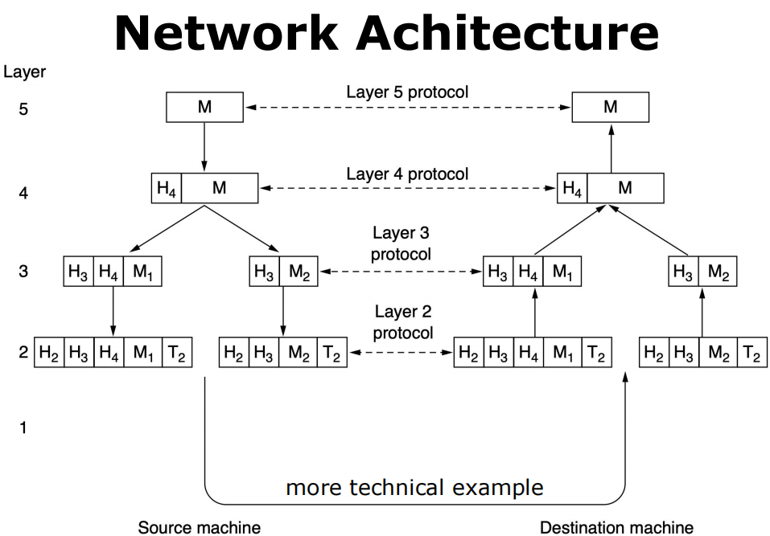
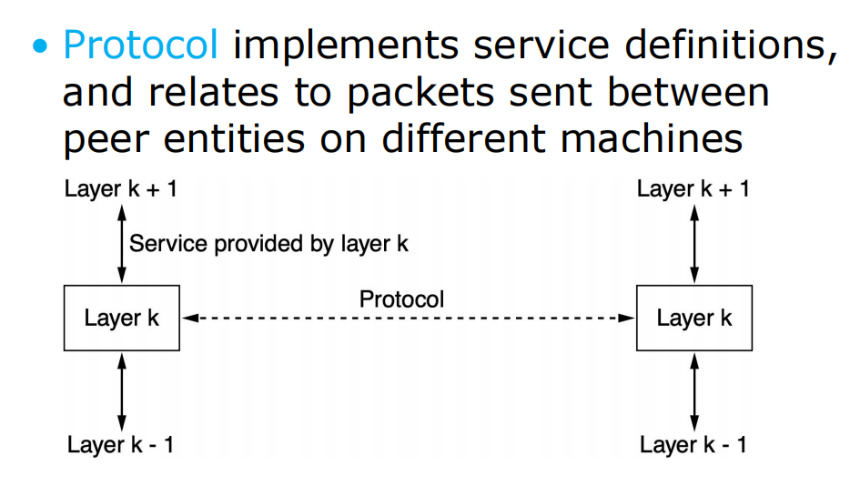

# 规则与协议

!!! abstract 
    *   **网络协议 (Network Protocols)**: 通信的语言和规则。
    *   **参考模型 (Reference Models)**: 理解网络分层的框架。
    *   **标准化 (Standardization)**: 确保互操作性的基础。
    *   **策略 (Policies)**: 网络行为的高级指导方针。
    *   **度量 (Metrics)**: 衡量网络性能的指标。

## 1. 网络设计目标 (Design Goals)

### a) 可靠性 (Reliability)

!!! success "定义"
    **可靠性**是指网络从错误、故障或失效中恢复的能力。

*   **实现方式**:
    *   **差错控制**: 通过添加冗余信息（如校验码），实现对数据的**错误检测 (Error Detection)** 和**错误纠正 (Error Correction)**。
    *   **动态路由**: 当某条链路或路由器损坏时，**路由算法 (Routing Algorithms)** 能够自动地重新规划路径，绕开故障点。

### b) 资源分配 (Resource Allocation)

!!! info "定义"
    **资源分配**旨在解决多个用户如何公平、高效地共享**共同且有限**的网络资源（如带宽、交换机缓存等）的问题。一个好的设计必须是**可扩展的 (Scalable)**，即在网络规模急剧增大时依然能良好工作。

*   **关键机制**:
    *   **统计多路复用 (Statistical Multiplexing)**: 根据用户需求的统计特性，动态地共享网络带宽，而非固定分配，从而提高资源利用率。
    *   **流量控制 (Flow Control)**: 接收方通过反馈机制告知发送方自己的处理能力，以调整发送速率，防止因接收方处理不过来而导致数据丢失。
    *   **拥塞控制 (Congestion Control)**: 当网络发生拥塞（过载）时，要求网络中的主机主动降低其资源需求（如发送速率），以缓解网络压力。
    *   **服务质量 (Quality of Service - QoS)**: 通过特定机制来协调竞争性的资源需求，以满足不同应用的服务等级要求。

!!! question "QoS 示例：实时视频 vs. 文件下载"
    一个网络如何同时满足实时视频会议（要求**低延迟**）和后台大文件下载（要求**高吞吐量**）这两种相互冲突的需求？这就是 QoS 需要解决的核心问题。

### c) 可演化性 (Evolvability)

!!! success "定义"
    **可演化性**是指网络架构应支持协议的**增量式部署和升级**，允许网络技术随时间不断发展。

*   **关键思想**:
    *   **协议分层 (Protocol Layering)**: 将复杂的网络问题分解为多个独立的层次，每一层隐藏其实现细节。这样，对某一层协议的修改不会影响到其他层。
    *   **寻址/命名 (Addressing/Naming)**: 提供一种机制来唯一标识通信中的发送方和接收方。
    *   **互联网络 (Internetworking)**: 制定统一的规则来规定消息的顺序和大小，使得不同的网络可以互相连接。

### d) 安全性 (Security)

!!! info "定义"
    **安全性**旨在保护网络免受各种类型的攻击。其核心支柱通常被称为 **CIA 三元组**。

*   **核心组成**:
    *   **机密性 (Confidentiality)**: 防止通信内容被窃听。
    *   **身份验证 (Authentication)**: 防止攻击者冒充他人。
    *   **完整性 (Integrity)**: 防止消息在传输过程中被篡改。

---

## 2. 协议分层 (Protocol Layering)

!!! abstract "核心思想"
    为了降低网络设计的复杂性，绝大多数网络都组织为一系列的**层次 (Layers)**。

    *   每一层都构建于其下一层之上。
    *   每一层都向其上一层提供特定的**服务 (Service)**，同时隐藏实现该服务的具体细节。这就像一个“虚拟机”，上层只需调用下层提供的功能，无需关心其内部工作原理。

#### 2.1 关键概念定义

*   **协议 (Protocol)**: 通信双方就如何进行通信而达成的一系列约定。
*   **第 n 层协议 (Layer n Protocol)**: 两台机器上**对等**的第 n 层之间进行“对话”时所使用的规则和约定。

!!! note "分层模型中的重要术语"
    *   **对等实体 (Peers)**: 位于不同机器上、相同层次中的实体（可以是软件进程、硬件设备甚至人类）。
    *   **接口 (Interface)**: **同一台机器**上，相邻层次之间进行交互的地方。它定义了下层向上层提供哪些服务和操作。
    *   **虚拟通信 vs. 实际通信**:
        *   **虚拟通信 (Virtual Communication)**: 每一层的对等实体之间看起来像是在直接通信（如上图中的水平虚线）。
        *   **实际通信 (Actual Communication)**: 实际上，数据必须在发送端**自上而下**逐层传递，通过物理媒介传输到接收端，再**自下而上**逐层传递。**只有最底层的物理层才存在真实的物理通信**。

*   **网络体系结构 (Network Architecture)**: 一个网络所使用的**层次和协议的集合**。
*   **协议栈 (Protocol Stack)**: 特定系统中各层所使用的协议列表，每层一个协议。

#### 2.2 数据封装过程

当数据在发送端自顶向下传输时，每一层都会在前一层数据的基础上添加自己的控制信息，这个过程称为**封装 (Encapsulation)**。

*   **第4层 (传输层)**: 在原始消息 `M` 前添加一个头部 `H4`。如果消息过长，可能会将其分割为 `M1` 和 `M2`。
*   **第3层 (网络层)**: 在 `H4 M1` 前添加头部 `H3`。
*   **第2层 (数据链路层)**: 在 `H3 H4 M1` 前添加头部 `H2`，并在末尾添加一个尾部 `T2`（用于差错校验）。
*   **第1层 (物理层)**: 将最终形成的比特流通过物理介质发送出去。

---

## 3. 网络服务模型

### a) 面向连接的服务 (Connection-Oriented)

*   **模型**: 模仿**电话系统**。
*   **流程**:
    1.  **建立连接**: 通信双方首先建立一个连接。
    2.  **使用连接**: 在此连接上传输数据。
    3.  **释放连接**: 通信结束后拆除连接。
*   **特点**: 在建立连接时，通信双方可以协商服务参数，如最大消息尺寸、所需的服务质量 (QoS) 等。

### b) 无连接的服务 (Connectionless)

*   **模型**: 模仿**邮政系统**。
*   **流程**: 每个消息（数据包）都携带完整的目的地址，并被网络独立地进行路由。
*   **特点**: 每个数据包的路径可能都不同，且不保证按序到达。
*   **相关术语**:
    *   **数据包 (Packet)**: 网络层消息的通用术语。
    *   **数据报 (Datagram)**: 特指**不可靠的**（即不保证送达，不进行确认）无连接服务。

!!! contrast "存储转发 vs. 直通交换 (无连接服务中的交换方式)"
    *   **存储转发 (Store-and-forward Switching)**:
        *   中间节点（如路由器）必须**完整接收**整个消息后，才能将其转发到下一个节点。
    *   **直通交换 (Cut-through Switching)**:
        *   中间节点在**接收完消息的目标地址部分后**，就开始向上一个节点转发该消息，无需等待整个消息被接收完毕。延迟更低。

---

## 4. 服务类型与实现

### 可靠性实现

*   **确认机制 (Acknowledgement)**: 可靠服务通常通过让接收方**确认 (Acknowledge)** 收到每一条消息来实现。发送方只有在收到确认后，才能确定消息已成功送达。这种服务称为**经确认的数据报 (Acknowledged Datagram)**。
*   **消息流 vs. 字节流**:
    *   **消息流 (Message sequences)**: 保持消息的边界。发送方发送了两个 1KB 的消息，接收方也会收到两个 1KB 的消息。
    *   **字节流 (Byte Stream)**: 不保留消息边界。发送方发送了两个 1KB 的消息，接收方可能会一次性收到一个 2KB 的字节块，需要应用层自己去解析。

### 服务类型总结表

| 服务类别 | 服务名称 | 示例 |
| :--- | :--- | :--- |
| **面向连接** | 可靠的消息流 (Reliable message stream) | 网页序列加载 |
| | 可靠的字节流 (Reliable byte stream) | 电影下载 |
| | 不可靠的连接 (Unreliable connection) | 网络电话 (VoIP) |
| **无连接** | 不可靠的数据报 (Unreliable datagram) | 垃圾邮件 |
| | 经确认的数据报 (Acknowledged datagram) | 短信 |
| | 请求-应答 (Request-reply) | 数据库查询 |

### 服务原语 (Service Primitives)

!!! info "定义"
    一个**服务 (Service)** 是由一组可供上层用户进程调用的**原语 (Primitives)** 或操作来正式定义的。原语指示服务执行某个动作，或报告一个对等实体已执行的动作。

!!! example "面向连接服务的原语示例"
    | 原语 | 含义 |
    | :--- | :--- |
    | `LISTEN` | 阻塞并等待一个传入的连接请求。 |
    | `CONNECT` | 与一个正在等待的对等实体建立连接。 |
    | `ACCEPT` | 接受一个来自对等实体的传入连接。 |
    | `RECEIVE` | 阻塞并等待一个传入的消息。 |
    | `SEND` | 向对等实体发送一个消息。 |
    | `DISCONNECT` | 终止一个连接。 |

---

## 5. 服务 vs. 协议

!!! contrast "服务 (Service) 与 协议 (Protocol) 的核心区别"
    
    *   **服务 (Service)**:
        *   定义了**某一层为它的上一层提供什么功能**。
        *   它与**层与层之间的接口 (Interface)** 相关，是一种**垂直关系**。
        *   服务只关心功能，不关心如何实现。
    *   **协议 (Protocol)**:
        *   定义了**不同机器上对等实体之间如何通信**的规则。
        *   它与**对等实体之间交换的数据包格式和含义**相关，是一种**水平关系**。
        *   协议是服务的具体实现。

    

    

## 6. 网络参考模型 (Reference Models)

### a) OSI 参考模型 (OSI Reference Model)

!!! abstract "定义"
    **OSI (Open Systems Interconnection)** 模型是由 ISO 提出的一个理论上非常完善的七层网络模型，旨在成为全球计算机网络都遵循的标准。

| 层号 | 名称 | 数据单元 | 功能简介 |
| :---: | :--- | :--- | :--- |
| **7** | **应用层 (Application)** | APDU | 为应用程序提供网络服务。 |
| **6** | **表示层 (Presentation)** | PPDU | 规范对等实体间交换的数据格式（如数据加密、压缩）。 |
| **5** | **会话层 (Session)** | SPDU | 提供命名空间，将不同的传输流绑定到同一会话中。 |
| **4** | **传输层 (Transport)** | TPDU | 实现**端到端 (Process-to-Process)** 的信道，交换报文。 |
| **3** | **网络层 (Network)** | **Packet** | 在分组交换网络中处理**数据包路由**。 |
| **2** | **数据链路层 (Data Link)** | **Frame** | 将比特流组织成一个更大的聚合体，称为**帧**。 |
| **1** | **物理层 (Physical)** | Bit | 处理原始比特流在物理通信链路上的传输。 |

!!! note "设备与分层"
    *   **终端主机 (End Hosts)**: 通常需要实现完整的七层协议栈。
    *   **中间设备 (Switches/Routers)**: 只关心网络的底层。
        *   **交换机 (Switch)** 通常工作在第 2 层（数据链路层）。
        *   **路由器 (Router)** 通常工作在第 3 层（网络层）。

---

### b) TCP/IP 参考模型 (TCP/IP Reference Model)

!!! contrast "OSI vs. TCP/IP"
    *   TCP/IP 将 OSI 的**表示层**和**会话层**的功能合并到了**应用层**。
    *   TCP/IP 将 OSI 的**数据链路层**和**物理层**合并为了一个**链路层**。
    *   TCP/IP 模型在实践中被证明更实用、更高效。
    

| TCP/IP 层级 | 对应 OSI 层级 | 核心功能与协议 |
| :--- | :--- | :--- |
| **应用层 (Application)** | 7, 6, 5 | 包含所有直接为用户应用提供服务的高级协议。 **协议示例**: `HTTP`, `SMTP`, `DNS` |
| **传输层 (Transport)** | 4 | 允许源和目的主机上的对等实体进行对话（端到端通信）。 |
| **网络层 (Internet)** | 3 | 允许主机将数据包注入任何网络，并使其独立地传输到目的地。 **协议示例**: `IP`, `ICMP` |
| **链路层 (Link)** | 2, 1 | 作为主机和传输链路之间的接口，处理物理连接。 **协议示例**: `Ethernet`, `802.11 (WiFi)` |

#### TCP/IP 传输层两大核心协议

1.  **TCP (Transmission Control Protocol - 传输控制协议)**
    *   **可靠的、面向连接的**端到端协议。
    *   **功能**:
        *   确保从一台机器发出的**字节流 (Byte Stream)** 无差错地传送到另一台机器。
        *   在发送端，将字节流**分段 (Segment)** 成离散的消息。
        *   在接收端，将收到的消息重新组装成原始的输出流。

2.  **UDP (User Datagram Protocol - 用户数据报协议)**
    *   **不可靠的、无连接的**端到端协议。
    *   **适用场景**: 适用于那些**追求及时交付**而非精确交付的应用。
    *   **示例**: 视频直播、网络电话 (VoIP)。（丢失几个数据包比等待重传更可取）。

---

### c) 五层混合模型 (Five-Layer Hybrid Model)

!!! note "教学模型"
    为了结合 OSI 模型的完整层次划分和 TCP/IP 模型的实用性，许多教科书采用了一个五层的混合模型。

| 层号 | 名称 | 功能简介 |
| :---: | :--- | :--- |
| **5** | **应用层 (Application)** | 包含利用网络的应用程序。 |
| **4** | **传输层 (Transport)** | 增强网络层的传输保障，提供可靠性。 |
| **3** | **网络层 (Network)** | 将多个链路组合成网络和互联网，实现远程通信。 |
| **2** | **链路层 (Link)** | 在直接相连的计算机之间发送有限长度的消息（帧）。 |
| **1** | **物理层 (Physical)** | 将比特作为电信号或其他模拟信号在介质上传输。 |

---

## 7. 标准化 (Standardization)

!!! abstract "定义"
    **标准 (Standards)** 定义了实现**互操作性 (Interoperability)** 所需的最少必要条件。
    *   **互操作性**: 不同计算机系统或软件之间能够交换并有效使用信息的能力。
    *   **协议标准**: 通常只定义“在线路上”的协议，而不规定设备内部的服务接口。

!!! contrast "事实标准 vs. 法定标准"
    *   **事实标准 (De facto)**: 没有经过正式规划，但在实践中被广泛采用而形成的。**示例**: `TCP/IP`。
    *   **法定标准 (De jure)**: 由正式的标准化组织通过特定程序采纳和发布的。

#### 主要标准化组织

| 领域 | 组织 | 简介 |
| :--- | :--- | :--- |
| **电信** | **ITU** (国际电信联盟) | 联合国下属机构。其 **ITU-T** 部门负责电信标准化。 |
| **国际** | **ISO** (国际标准化组织) | 制定各类国际标准，包括 OSI 模型。 |
| | **IEEE** (电气和电子工程师协会) | 制定电气工程和计算领域的标准，其 **IEEE 802 委员会** 负责制定局域网和城域网标准（如 `802.3 Ethernet`, `802.11 WiFi`, `802.15 Bluetooth`, `802.16 WiMAX`）。 |
| **互联网** | **IETF** (互联网工程任务组) | 负责制定互联网标准，其成果以 **RFC (Request for Comments)** 文档发布。 |
| | **W3C** (万维网联盟) | 负责制定 Web 相关的标准（如 `HTML`, `CSS`）。 |

---

## 8. 政策、法律与社会问题

### a) 网络中立性 (Net Neutrality)

!!! info "核心原则"
    ISP (互联网服务提供商) 应该对特定类型应用的所有流量**一视同仁**，无论这些内容由谁发送。

*   **具体规则**:
    1.  **禁止阻塞 (No Blocking)**: 不得阻止用户访问合法的网络内容。
    2.  **禁止限流 (No Throttling)**: 不得故意降低特定应用的网速。
    3.  **禁止付费优先 (No Paid Prioritization)**: 不得创建“快车道”，即向内容提供商收费以换取更快的速度。
*   **零费率 (Zero Rating)**:
    *   指 ISP 可能根据使用情况向用户收费，但对其用户使用特定服务（如某个音乐或视频 App）所产生的数据流量不收费。
    *   这被广泛视为违反网络中立性原则，因为它给予了这些被豁免的服务相对于其他服务的竞争优势。

### b) 其他问题

*   **在线言论 (Online Speech)**: 社交网络等平台在**言论自由**与**内容审查**之间的平衡问题。
*   **安全 (Security)**:
    *   **DDoS (分布式拒绝服务攻击)**: 大量机器同时向一个目标发送流量，耗尽其资源。
    *   **垃圾邮件 (Spam)**
    *   **网络钓鱼 (Phishing)**: 诱骗用户泄露个人信息。
*   **隐私 (Privacy)**: 用户网络行为数据被用于**画像分析和追踪**（如 Cookies、浏览器指纹），以及如何通过技术手段（如流量混淆）保护隐私。
*   **虚假信息 (Disinformation)**: 互联网上充斥着大量误导性或完全错误的信息。

---

## 9. 度量单位 (Metric Units)

!!! warning "注意区分：存储容量 vs. 传输速率"
    *   **存储容量**: 通常使用 **2 的幂** (二进制)。
        *   `1 KB = 2^10 = 1024` 字节 (Bytes)
        *   `1 MB = 2^20` 字节
    *   **传输速率**: 通常使用 **10 的幂** (十进制)。
        *   `1 kbps = 10^3 = 1000` 比特/秒 (bits per second)
        *   `1 Mbps = 10^6` 比特/秒

| 前缀 | 符号 | 10 的幂 |
| :--- | :--- | :--- |
| Kilo | k | 10³ |
| Mega | M | 10⁶ |
| Giga | G | 10⁹ |
| Tera | T | 10¹² |