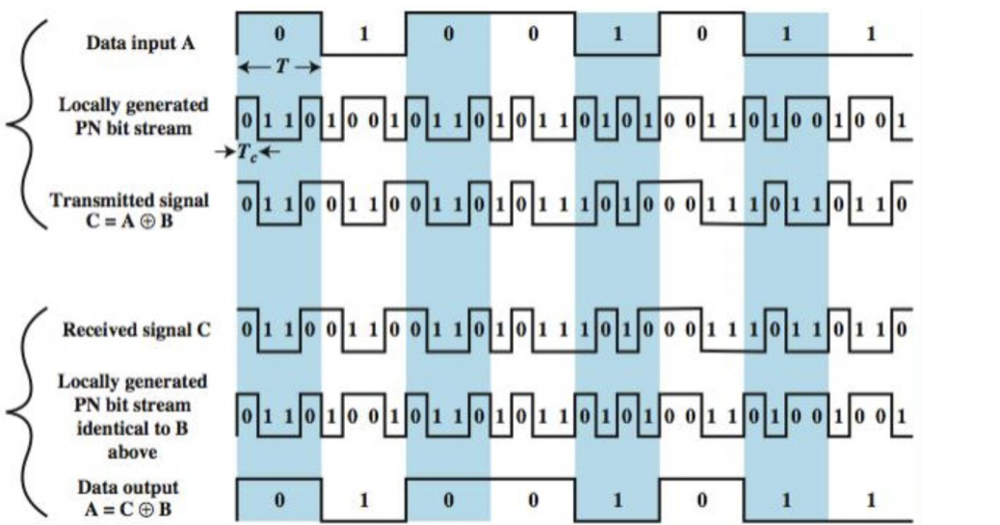
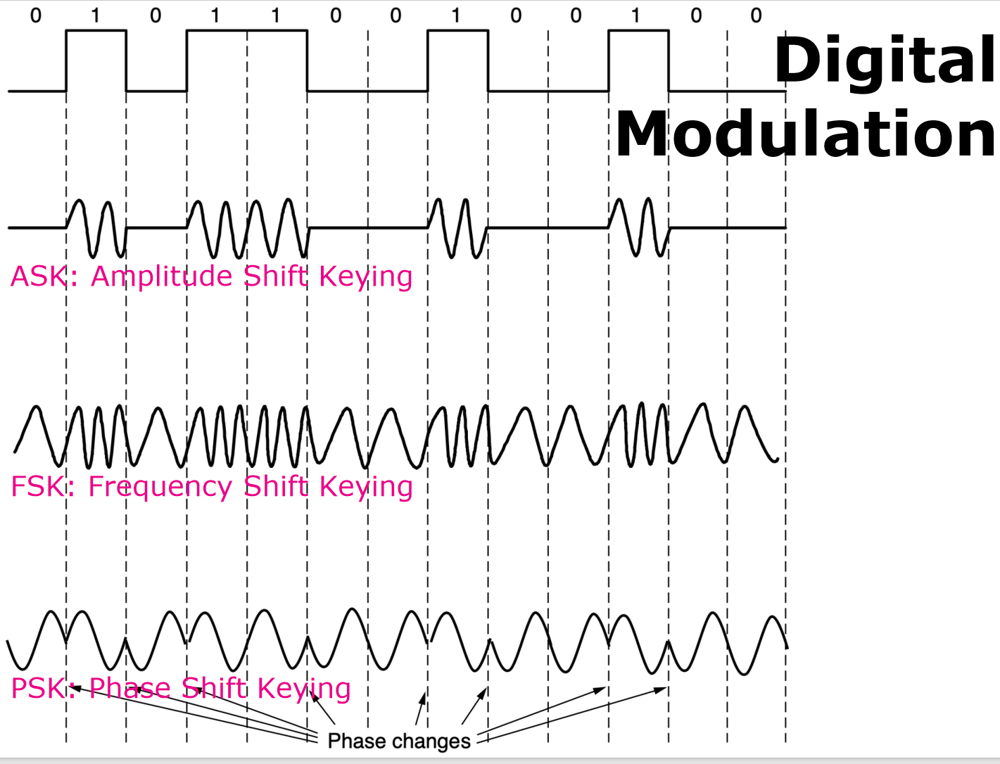
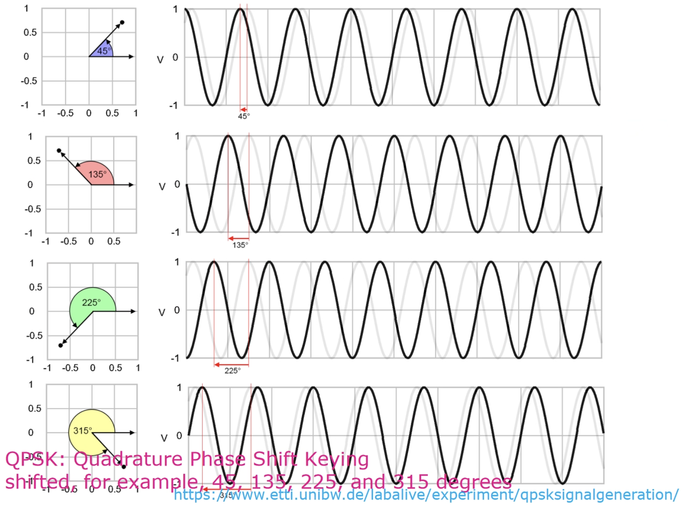
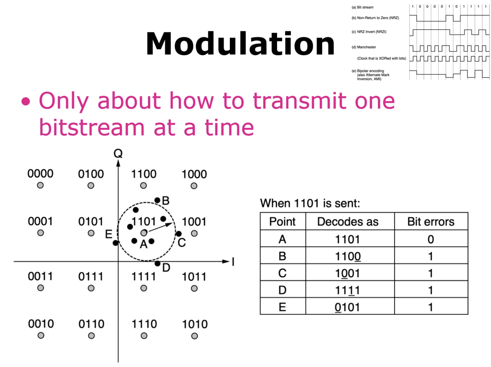
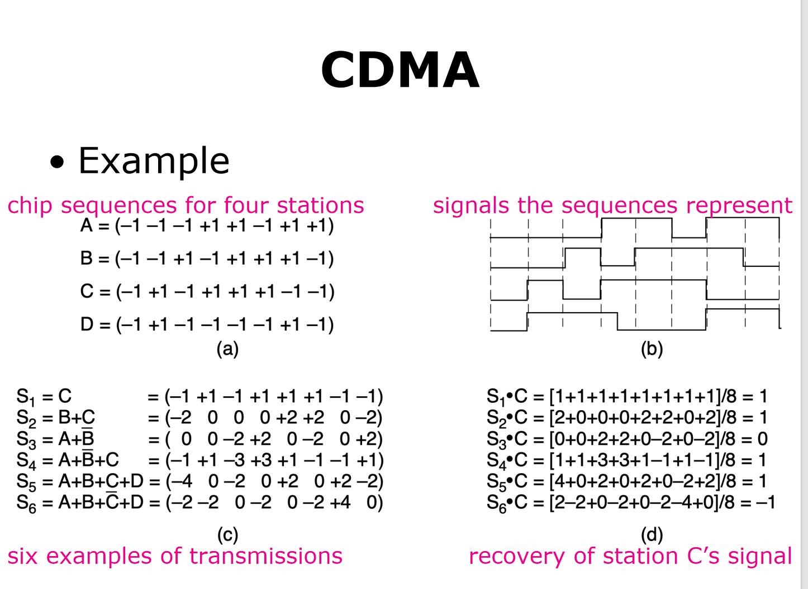

# 物理层传输 (The Physical Layer Transmission)

!!! summary "核心内容"
    *   传输介质 (Transmission Media)
    *   传输理论 (Transmission Theories)

---

## 一、传输介质 (Transmission Media)

传输介质可以分为三大类：

1.  **有线或导向介质 (Guided or Wired)**
    *   铜缆 (Copper)
    *   同轴电缆 (Coaxial Cable)
    *   光纤 (Fiber Optics)
2.  **无线介质 (Wireless)**
    *   地面无线电 (Terrestrial Radio)
3.  **卫星 (Satellite)**

### 1. 导向传输介质 (Guided Transmission Media)

*   依赖于物理线缆或导线进行数据传输。
*   在频率、带宽、延迟、成本以及安装维护的便捷性方面需要进行权衡。

!!! note "持久存储 (Persistent Storage)"
    对于海量数据传输，可以采用一种物理方式：
    1.  将数据写入持久性存储设备（如磁带或固态硬盘）。
    2.  通过物理运输将设备送达目的地。
    3.  在目的地机器上读取数据。
    这种方法适用于追求高数据传输速率或极低单位比特传输成本的应用场景。

---

### 2. 双绞线 (Twisted Pair)

双绞线是一种常见的有线传输介质。

#### **物理特性**
*   由两根相互绝缘的铜导线组成，通常直径约为1毫米。
*   两根导线以类似DNA分子的螺旋形态绞合在一起。
*   **优点**：绞合结构可以使不同扭绞处产生的电磁波相互抵消，从而有效减少信号辐射。

#### **信号传输**
*   信号通常通过两根导线之间的**电压差**来承载，而非绝对电压。
*   **优点**：能有效抵抗外部噪声。因为外部噪声对两根导线的影响趋于一致，所以电压差基本保持不变，信号受干扰较小。

#### **传输属性**
*   可传输模拟信号或数字信号。
*   带宽取决于导线的粗细和传输距离。
*   长距离传输会导致信号衰减严重，因此需要**中继器 (Repeaters)** 来放大信号。

#### **常见应用**
*   **示例**: `Cat 5e` (超五类线) 是常见的双绞线标准。
*   **100-Mbps 以太网**: 使用两对线，一对用于发送，一对用于接收。
*   **1-Gbps 以太网**: 同时使用全部四对线进行双向数据传输。

!!! info "数据传输模式"
    *   **单工 (Simplex)**: 数据只能在一个方向上传输，只有一个发送方。
        `发送方 Sender` -> `接收方 Receiver`
    *   **半双工 (Half-Duplex)**: 数据可以在两个方向上传输，但不能同时进行。
        `发送方 Sender` <=> `接收方 Receiver` (交替进行)
    *   **全双工 (Full-Duplex)**: 数据可以同时在两个方向上传输。
        `发送方 Sender` <=> `接收方 Receiver` (同时进行)

#### **分类**
*   **UTP (Unshielded Twisted Pair)**: 非屏蔽双绞线
*   **STP (Shielded Twisted Pair)**: 屏蔽双绞线
*   **SFTP (Shielded Foiled Twisted Pair)**: 屏蔽箔式双绞线

---

### 3. 同轴电缆 (Coaxial Cable)

*   **优点**: 相比非屏蔽双绞线，同轴电缆拥有更好的屏蔽效果和更大的带宽。
*   可以在更长的距离上以更高的速度传输数据。
*   具有高带宽（可达 6 GHz）和出色的抗噪声能力。

**结构**:
1.  **铜芯 (Copper Core)**: 中心导体。
2.  **绝缘材料 (Insulating Material)**: 包围铜芯。
3.  **编织外导体 (Braided Outer Conductor)**: 金属屏蔽层。
4.  **保护塑料外皮 (Protective Plastic Covering)**: 最外层。

---

### 4. 电力线 (Power Lines)

*   利用现有的电力线网络进行数据通信。
*   最初用于远程抄表、家庭设备控制等低速率通信。
*   现在对通过电力线进行高速通信的兴趣重燃，可用于家庭局域网（LAN）和宽带互联网接入。
*   **原理**: 将高频数据信号叠加在低频的电力信号上进行传输。

---

### 5. 光纤 (Fiber Optics)

光纤是长距离、高速传输的核心技术。

*   **应用**: 网络骨干、高速局域网和高速互联网接入。
*   **光传输三要素**:
    1.  **光源 (Light Source)**: 利用光的脉冲或缺失来表示二进制的1和0。
    2.  **传输介质 (Transmission Medium)**: 超细的玻璃纤维，用于传输光脉冲。
    3.  **探测器 (Detector)**: 当光照射到其上时，产生电脉冲。

#### **光源对比**

| 特性 (Item)         | LED (发光二极管) | Semiconductor Laser (半导体激光器) |
| ----------------- | -------------- | -------------------------------- |
| **数据速率 (Data Rate)** | 低 (Low)         | 高 (High)                          |
| **光纤类型 (Fiber Type)** | 多模 (Multi-mode) | 多模或单模 (Multi-mode or single-mode) |
| **距离 (Distance)**     | 短 (Short)       | 长 (Long)                          |
| **寿命 (Lifetime)**     | 长 (Long life)   | 短 (Short life)                    |
| **温度敏感性**          | 轻微 (Minor)     | 显著 (Substantial)                 |
| **成本 (Cost)**         | 低 (Low cost)    | 昂贵 (Expensive)                   |

*   **接收端**: 通常由一个**光电二极管 (Photodiode)** 组成，当被光照射时会产生电脉冲（速率可达约100 Gbps）。

#### **工作原理：全内反射**
*   当光从光密介质（如石英玻璃）射向光疏介质（如空气）时，折射角会大于入射角。
*   当入射角超过某个**临界值**时，光线会完全被反射回原介质，而不会逸出。这个现象称为**全内反射 (Total Internal Reflection)**。
*   光纤就是利用这个原理将光信号约束在纤芯内进行长距离传输。

#### **光纤类型**
*   **单模光纤 (Single-Mode Fiber)**:
    *   纤芯非常细 (8-10微米)。
    *   光线沿直线传播，没有反射。
    *   适用于长距离、高带宽传输。
*   **多模光纤 (Multimode Fiber)**:
    *   纤芯较粗 (50微米)。
    *   光线以多种模式（角度）在纤芯内反射前进。
    *   **分类**:
        *   **阶跃折射率 (Step Index)**: 纤芯折射率均匀。
        *   **渐变折射率 (Graded Index)**: 纤芯折射率从中心向边缘逐渐降低，可以减少信号色散。

#### **信号损耗与失真**

1.  **光衰减 (Light Attenuation)**
    *   指输出信号功率与输入信号功率的比率。
    *   通常用**分贝/公里 (dB/km)** 来衡量。
    *   $dB = 10 * log_{10} (输出功率 / 输入功率)$
    *   在 `0.85μm`, `1.30μm`, 和 `1.55μm` 波段衰减较小，是通信的常用窗口。

2.  **色散 (Chromatic Dispersion)**
    *   光脉冲在光纤中传输时会发生展宽。
    *   展宽会导致相邻的脉冲重叠，从而干扰信号，引发误码。
    *   **解决方案**:
        *   **降低信令速率**: 增加输入脉冲之间的距离，避免重叠。
        *   **孤子 (Solitons)**: 利用自相位调制来抵消色散效应的特殊形状脉冲。

---

### 6. 光纤电缆与连接

#### **光缆结构**
*   类似于同轴电缆，但没有金属编织层。
*   **核心结构**:
    *   **纤芯 (Core)**: 玻璃材质，用于传输光。
    *   **包层 (Cladding)**: 玻璃材质，包裹在纤芯外，折射率较低以实现全内反射。
    *   **护套 (Jacket)**: 塑料材质，保护内部结构。

#### **光纤连接**

!!! question "如何连接光纤？"
    有两种主要方式：临时连接和永久连接。

1.  **连接器 (Connectors)**
    *   光纤末端安装连接器，然后插入光纤插座。
    *   这是一种临时的、可重复插拔的连接方式，便于系统重构。
    *   **缺点**: 会导致约 10% 到 20% 的光信号损失。
    *   **常见类型**: LC, SC, ST, FC, MPO 等。

2.  **熔接 (Splicing)**
    *   用于永久性连接两根光纤。
    *   **机械熔接 (Mechanical Splices)**: 将两根光纤的切割端精确对准并固定在一个套筒中。约有10%的光损失。
    *   **熔融熔接 (Fusion Splice)**: 将两根光纤的末端熔化并融合在一起，形成一个牢固的连接。这种方式的**衰减极小**。

---

## 二、无线传输介质 (Wireless Transmission Media)

无线传输依赖于电磁波在空间中的传播，无需物理介质。

### 1. 电磁波谱 (Electromagnetic Spectrum)

*   **产生**: 移动的电子会产生电磁波，这些电磁波可以在空间（包括真空）中传播。
*   **基本概念**:
    *   **频率 (Frequency, *f*)**: 单位为赫兹 (Hz)，指电磁波每秒振荡的次数。
    *   **波长 (Wavelength, *λ*)**: 单位为米 (m)，指波形上两个连续的波峰或波谷之间的距离。
*   **无线通信原理**:
    1.  将天线连接到电路。
    2.  天线将电信号转化为电磁波并向外广播。
    3.  远处的接收器接收电磁波。
*   **基本公式**: 在真空中，所有电磁波都以光速 (*c*) 传播，其速度与频率无关。
    > λ × *f* = *c* ≈ 3 × 10⁸ m/s

!!! info "关于信息承载能力"
    *   信号能承载的息量取决于接收功率，并且与其**带宽**成正比。
    *   大多数无线传输会使用一个较窄的频带来集中能量，以获得合理的数据传输速率。

### 2. 扩频技术 (Spread Spectrum)

扩频技术通过将信号扩展到更宽的频带上进行传输，以提高抗干扰和保密性。

#### **跳频扩频 (FHSS - Frequency Hopping Spread Spectrum)**
*   **原理**: 发射端以极高的速度（每秒数百次）在不同的频率之间切换（跳跃）。
*   **优点**:
    *   **高保密性**: 使传输难以被侦测和干扰，因此在军事通信中很受欢迎。
    *   **强抗干扰性**: 对信号衰落和干扰有很好的抵抗力，尤其是在拥挤的频谱中。

#### **直接序列扩频 (DSSS - Direct Sequence Spread Spectrum)**
*   **原理**: 使用一个特定的**码序列 (Code Sequence)** 将数据信号扩展到一个更宽的频带上。
*   **优点**:
    *   允许多个信号共享同一个频段，只要它们使用不同的码序列即可。

#### **超宽带 (UWB - Ultra-WideBand)**
*   **原理**: 发送一系列能量极低、速度极快的脉冲，并通过改变其载波频率来传递信息。
*   **特点**: 快速的脉冲变换使得信号被极薄地分布在一个非常宽的频带上。

---

## 三、传输理论 (Transmission Theories)

本节探讨不同频段的电磁波在无线通信中的具体应用和特性。

### 1. 无线电传输 (Radio Transmission)

*   **特性**:
    *   **全向性 (Omnidirectional)**: 信号向所有方向传播。
    *   可以传播很长的距离。
    *   **穿透性好**: 能够轻易穿透建筑物。
    *   **易受干扰**: 容易受到其他无线电信号的干扰。
*   **路径损耗/衰减 (Path Loss/Attenuation)**:
    *   无线电波的功率密度会随着与源头距离的增加而减小。
    *   对于低频无线电波，衰减与距离的平方成反比 (1/d²)。
*   **传播方式**:
    *   **VLF, LF, MF 频段**: 无线电波（地波）会沿着地球的曲率传播。
    *   **HF, VHF 频段**: 地波容易被地表吸收，但能够到达电离层的天波会被电离层折射，然后返回地球，实现超远距离通信。

### 2. 微波传输 (Microwave Transmission)

*   **特性**:
    *   **定向传播**: 沿直线传播，需要“视线”路径 (Line-of-Sight)。
    *   对于远距离通信，需要在两座塔之间设置**中继器 (Repeaters)**。
*   **挑战：多径衰落 (Multipath Fading)**
    *   电磁波在空间中传播时会发散，经过反射、衍射的延迟波可能与直射波异相到达接收端，从而相互抵消，导致信号急剧减弱。
*   **解决方案**:
    *   预留约10%的信道作为备用。当某个特定频段因多径衰落而暂时中断时，系统可以切换到备用信道继续通信。

### 3. 红外线传输 (Infrared Transmission)

*   **应用**: 广泛用于短距离通信，例如电视、蓝光播放器和音响的遥控器。
*   **特性**:
    *   相对定向。
    *   成本低廉，易于构建。
*   **优点**:
    *   **无法穿透固体**: 这一特性减少了信号干扰和被窃听的风险，提高了通信的私密性。

### 4. 光传输 (Light Transmission)

*   **自由空间光学 (Free-space optics)**: 指非导向的光信号传输。例如，在两座建筑的屋顶上安装激光器来连接它们的局域网。
*   **特性**:
    *   **单向性 (Unidirectional)**。
    *   带宽极高。
    *   成本较低。
    *   **安全性高**: 窄光束使得信号难以被截获。
*   **挑战**:
    *   白天太阳的热量会导致空气对流，形成湍流。这种不稳定的空气会使激光束偏离，可能导致其无法命中探测器。
    *   **解决方案**: 在工程设计中必须留出足够的容错余量。

## 四、传输理论的数学基础 (Theoretical Basis)

### 1. 傅里叶级数 (Fourier Series)

*   **核心思想**: 任何一个行为合理的周期性函数（信号），都可以被分解（或构建）为一系列不同频率的正弦波和余弦波的加权和。
*   **数学表示**:
    *   一个周期函数 `g(t)` 可以表示为：
  
        $g(t) = c/2 + Σ_{n=1}^\infty a_n * sin(2πnft) + Σ_{n=1}^\infty
         b_n * cos(2πnft)$
    *   **T**: 周期 (Period)
    *   **f**: 频率 (Frequency), f = 1/T
    *   **an, bn**: 第n次谐波 (nth harmonics) 的正弦和余弦分量的振幅。
    *   **c**: 决定信号平均值的常数。
*   通过积分运算，可以从原始信号 `g(t)` 中计算出每个谐波的振幅 `an`, `bn` 和常数 `c`。

### 2. 带宽 (Bandwidth)

*   **信号失真**: 任何传输介质都会对其承载的傅里叶分量（谐波）产生不同程度的衰减，从而导致信号失真。
*   **截止频率**: 对于物理线路，通常存在一个**截止频率 (cutoff frequency)**。低于该频率的信号分量可以基本无损地通过，而高于该频率的信号分量则会被严重衰减。
*   **定义**: **带宽 (Bandwidth)** 是指能够不被严重衰减地通过传输介质的频率范围的宽度。
    *   带宽是传输介质的物理属性，取决于其构造、厚度、长度和材料等。
*   **信号类型**:
    *   **基带信号 (Baseband signals)**: 信号频率从0开始到一个最大值。
    *   **通带信号 (Passband signals)**: 信号被平移到一个更高的频率范围。

---

## 五、数据速率限制 (Data Rate Limits)

!!! success "核心问题"
    在给定的带宽下，我们最高能以多快的速率传输数据？

### 1. 带宽限制与数据速率
*   有限的带宽意味着只有有限数量的谐波能够通过信道，这直接限制了信号的变化速度，从而限制了数据速率。
*   **示例**: 如果一个信道的带宽限制为3000 Hz，那么能够有效传输的谐波数量是有限的。数据速率越高，其基波频率就越高，能通过的高次谐波就越少，信号失真就越严重。

### 2. 奈奎斯特定理 (Nyquist's Theorem) - 无噪声信道

*   **内容**: 对于一个带宽为 `B` Hz的无噪声信道，其最大数据速率为：
    > **最大数据速率 = 2 * B * log₂V (bits/sec)**
*   **V**: 离散信号的电平级数（或符号种类数）。
*   **结论**: 即使没有噪声，信道容量也是有限的。可以通过增加信号的电平级数 `V` 来提高数据速率。

### 3. 香农定理 (Shannon's Theorem) - 有噪声信道

*   **信噪比 (SNR - Signal-to-Noise Ratio)**: 信号功率 (S) 与噪声功率 (N) 的比值，即 S/N。
    *   通常用分贝 (dB) 表示: `10 * log₁₀(S/N)`。
*   **内容**: 对于一个带宽为 `B` Hz、信噪比为 `S/N` 的有噪声信道，其理论最大容量 (Capacity) 为：

    > **信道容量 = B * log₂(1 + S/N) (bits/sec)**
    >SNR (dB) = 10 * log₁₀(S/N)
*   **结论**: 这个公式给出了任何信道在存在噪声情况下的理论速率上限，无论采用何种编码或调制技术都无法超越。

---

## 六、数字调制 (Digital Modulation)

**定义**: 将数字比特流与模拟信号相互转换的过程。

*   **基带传输 (Baseband Transmission)**: 信号占据从零开始的频率范围，常用于有线传输。
*   **通带传输 (Passband Transmission)**: 通过调制一个**载波 (carrier)** 信号的振幅、频率或相位，使信号占据载波频率附近的一个频段。常用于无线和光纤信道。

### 1. 基带传输与线路编码 (Line Codes)

**目标**:
1.  **带宽效率 (Bandwidth Efficiency)**: 在有限带宽内传输尽可能高的数据速率。
2.  **时钟恢复 (Clock Recovery)**: 接收方需要从接收到的信号中提取同步时钟信号。
3.  **直流平衡 (DC Balance)**: 信号在短时间内正负电压分量应大致相等，以消除直流分量。

#### **常见线路编码方案**
*   **不归零码 (NRZ - Non-Return-to-Zero)**: 用正电平表示1，负电平表示0。
    *   **缺点**: 连续的1或0会导致信号长时间不变，使时钟恢复困难。
*   **反向不归零码 (NRZI - NRZ Invert)**: 遇到1时电平翻转，遇到0时保持不变。
    *   **优点**: 解决了连续1的问题。
    *   **缺点**: 连续的0仍然是问题。
*   **曼彻斯特编码 (Manchester Encoding)**: 将时钟信号与数据信号进行异或(XOR)运算。每个比特周期内都有一次电平跳变。
    *   **优点**: 完美解决了时钟恢复问题。
    *   **缺点**: 带宽需求是NRZ的两倍（100%开销）。
*   **双极性编码 (Bipolar Encoding / AMI)**: 使用正、负、零三个电平。0用零电平表示，1交替用正、负电平表示。
    *   **优点**: 实现了直流平衡。

#### **解决连续0问题的策略**
1.  **4B/5B 编码**: 将每4比特数据映射为一个特定的5比特码型。这些码型经过精心设计，保证不会出现超过三个连续的0。
    *   **开销**: 25%。
2.  **加扰 (Scrambling)**: 在发送前，将数据与一个伪随机序列进行异或。接收端再用相同的序列异或一次即可恢复原数据。
    *   **优点**: 无带宽开销。
    *   **缺点**: 理论上仍可能出现长串的0（当数据与伪随机序列相同时）。
3.  **8B/10B 编码**: 一种更复杂的编码，能同时保证时钟恢复和直流平衡。

### 2. 通带传输 (Passband Transmission)

通过改变高频载波信号的属性来承载基带信号。

#### **基本调制方式**
*   **幅移键控 (ASK - Amplitude Shift Keying)**: 用不同的振幅表示0和1。
*   **频移键控 (FSK - Frequency Shift Keying)**: 用不同的频率表示0和1。
*   **相移键控 (PSK - Phase Shift Keying)**: 用不同的相位表示0和1。
    *   **BPSK (Binary PSK)**: 使用0°和180°两个相位，每个符号传输1比特。
    *   **QPSK (Quadrature PSK)**: 使用4个相位（如45°, 135°, 225°, 315°），每个符号可以传输2比特。

#### **高级调制方式：星座图 (Constellation Diagram)**
*   **正交振幅调制 (QAM - Quadrature Amplitude Modulation)**: 同时改变信号的**振幅和相位**来传输数据。
    *   星座图上的每个点代表一个唯一的符号（对应一组比特）。
    *   **QAM-16**: 有16个点，每个符号传输4比特。
    *   **QAM-64**: 有64个点，每个符号传输6比特。
*   **格雷码 (Gray Code)**:
    *   在星座图中，为相邻的符号分配仅相差一个比特的比特组合。
    *   **目的**: 当接收端因噪声等原因误判为相邻符号时，只会产生一个比特的错误，而不是多个，从而大大降低了误码率。

---

## 七、多路复用 (Multiplexing)

**定义**: 为了经济地利用网络资源，让多个信号共享同一条物理线路的技术。

### 1. 频分多路复用 (FDM - Frequency Division Multiplexing)
*   **原理**: 将总频谱划分为多个不重叠的频段，每个用户分配一个固定的频段。
*   **保护带 (Guard Band)**: 在相邻频段之间留出未使用的小段频谱，以防止信道间干扰。
*   **正交频分复用 (OFDM - Orthogonal FDM)**: 一种更高效的FDM。它将子载波紧密地排列在一起，子载波之间相互正交，因此在采样点上不会相互干扰，无需保护带。
    *   **应用**: 802.11 (Wi-Fi), 4G/5G蜂窝网络等。

### 2. 时分多路复用 (TDM - Time Division Multiplexing)
*   **原理**: 用户轮流（Round-robin）在不同的时间片 (Time Slot) 内使用整个信道的全部带宽。
*   **保护时间 (Guard Time)**: 在时间片之间插入短暂的间隙，以应对微小的时序偏差。
*   **同步TDM**: 无论用户有无数据要发送，都为其分配固定的时间片。
*   **统计TDM (STDM)**: 按需动态地为用户分配时间片，提高了信道利用率。

### 3. 码分多路复用 (CDM - Code Division Multiplexing)
*   **原理**: 也称为**码分多址 (CDMA)**。允许多个用户在**同一时间和同一频率**上发送信号。
*   **码片序列 (Chip Sequence)**: 每个用户被分配一个唯一的、相互正交的码片序列。
*   **分离**: 接收端利用码片序列的正交性，通过内积运算从混合信号中分离出特定用户的信号。
*   **优点**: 抗干扰能力强。

### 4. 波分多路复用 (WDM - Wavelength Division Multiplexing)
*   **原理**: 本质上是光纤上的FDM。将不同波长（颜色）的光信号合并到一根光纤中传输。
*   **密集波分复用 (DWDM)**: 可以复用大量信道，且信道间间隔极小。

### **多路复用技术对比**

| 技术   | 资源划分方式     | 特点                                         |
| :--- | :----------- | :------------------------------------------- |
| **FDMA** | **频率**       | 每个用户在自己的子信道上持续通信。                 |
| **TDMA** | **时间**       | 每个用户在自己的时间片内占用整个信道。               |
| **CDMA** | **编码**       | 所有用户在所有时间、所有频率上共存，通过编码区分。 |

