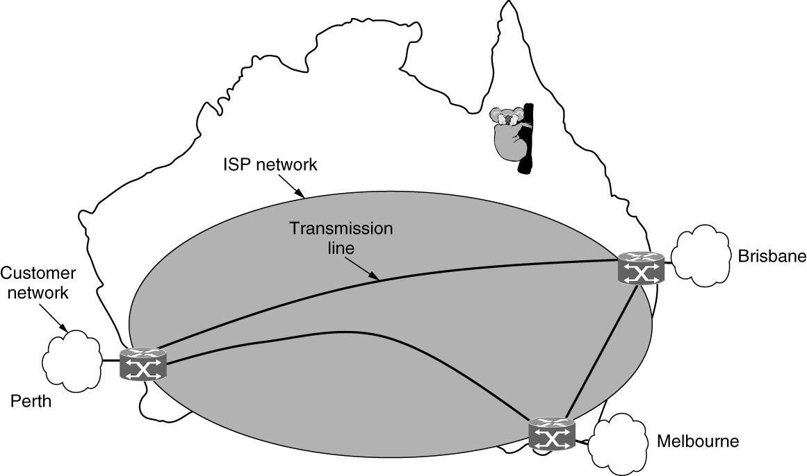

- **CDN:** Content Delivery Network，中文翻译为 内容分发网络。从根本上说，CDN 是一个策略性部署在全球各地的、由大量服务器组成的分布式网络系统。它的核心目标是快速、高效、可靠地将网络内容（如网页、图片、视频、文件等）分发给终端用户。
- **PAN:** Personal Area Network，个人局域网，一种覆盖范围非常小的计算机网络，通常用于连接一个人的工作空间内的各种电子设备。
- **LAN:** **局域网**是一种覆盖局部地理区域的计算机网络。这个“局部”区域通常范围有限，比如一栋办公楼、一个家庭、一所学校校园或者一个工厂车间。
  - Static: 提前把资源划分好，每个用户分到固定的一部分，互不干扰。 无论用户当前是否需要发送数据，分配给他的那部分资源都始终保留。
    - FDM (Frequency Division Multiplexing - 频分多路复用): 将整个信道的频率带宽分割成多个较小的、互不重叠的子频段，分配给不同的用户。
    - TDM (Time Division Multiplexing - 时分多路复用): 将通信的时间分割成一个个微小、固定长度的“时间片”（time slot），然后轮流将这些时间片分配给每个用户。
  - Dynamic: 按需分配资源，谁有数据要发送，就临时把信道分配给谁。 这种方式更加灵活和高效。
    - 集中式 (Centralized) 网络中存在一个中央控制实体，由它来统一决定下一个谁可以发送数据。所有设备都必须听从这个中央实体的调度。
    -  分散式 (Decentralized)  网络中没有中央控制实体。每台设备都遵循一套共同的协议，自己决定何时发送数据。
- **MAN:** **城域网**，A MAN (Metropolitan Area Network) covers a city
- **WAN:** 许多**广域网**实际上是互联网络，或者说是由多个网络组成的复合网络。

??? note "VPN & ISP"
    WAN 的两种“变体” (Varieties of WANs)

    #### a) VPN (Virtual Private Network - 虚拟专用网络)

    VPN 是一种技术，它允许你在一个**公共网络**（通常是互联网）上创建一个**私有的、加密的**通信通道。

    * **核心思想**：它不是建立新的物理线路，而是在现有的公共互联网上“虚拟地”创建出一条专属于你的私密隧道。所有通过这个隧道的数据都被加密，保证了安全性。
    * **优势 (Advantage): 复用资源 (Reuse of resource)**
        * 正如幻灯片所说，最大的优势在于它**复用**了现有的互联网基础设施。公司不需要花费巨资去铺设跨洋光缆来连接两个国家的办公室，只需要让这两个办公室都接入互联网，然后通过 VPN 技术建立安全连接即可，极大地节约了成本。
    * **劣势 (Disadvantage): 对底层资源缺乏控制 (A lack of control over the underlying resources)**
        * 因为你使用的是公共互联网，所以你无法控制网络的实际物理路径、带宽和稳定性。如果互联网在某个区域出现拥堵或故障，你的 VPN 连接质量也会随之下降。你只能依赖于你的互联网服务提供商（ISP）去解决问题。

    #### b) ISP (Internet Service Provider - 互联网服务提供商)

    ISP 是提供互联网接入服务的公司（例如，中国电信、中国移动、新加坡的 Singtel、美国的 Comcast 等）。

    幻灯片将 ISP 列为一种“变体”，可以理解为：构建和运营广域网的主体。普通用户或企业正是通过向 ISP 付费来接入互联网这个最大的 WAN。ISP 内部的网络本身就是一个巨大的、复杂的广域网。

    幻灯片接着介绍了 ISP 网络中两个核心的概念：

    * **路由算法 (The routing algorithm)**
        * **定义**：这是网络层面**全局性**的决策，用来确定数据包从源头到目的地的**最佳完整路径**。

    * **转发算法 (The forwarding algorithm)**
        * **定义**：这是单个路由器**局部性**的决策，即当一个数据包到达路由器时，路由器根据其内部的“转发表”（forwarding table）来决定**下一步**该把这个包发往哪个相邻的路由器。
    
