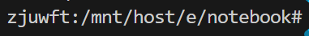
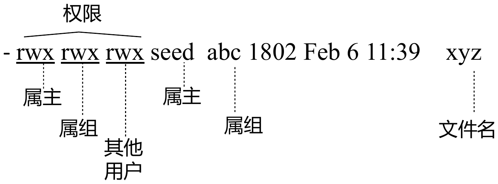

# **Linux 系统安全基础**
## **1 用户与用户组**
### 1.1 用户
- Unix 系统将用户 ID(user_id) 信息存储在密码文件(/etc/passwd)中
- id 很大程度决定用户级别
    - 其他因素：组ID（权限可以被授予整个用户组，而不是单独为每个用户设置）；文件权限模式（rwx）；EUID/EGID（一个程序需要比运行它的用户更高的权限来执行特定任务）
- 用户登录时操作系统为其创建初始进程，并将该进程的用户 ID 设置为记录中的第三字段值，**子进程将继承此用户 ID**。
- 每当进程尝试访问资源时，操作系统会核查用户 ID（及其他权限信息）以决定是否授权访问。

!!! example
    ```
    root:x:0:0:root:/root:/bin/bash
    seed:x:1000:1000:SEED,,,:/home/seed:/bin/bash
    ```

    - 每条记录对应一个用户的账户信息
    - 各字段分用冒号分隔
      - 首字段：用户名
      - 第二字段：原用于存储哈希密码的第二字段现被替换为字母’x’，表示实际密码存储于shadow文件中。
      - 第三字段：user_id
      - 第四字段：主用户组 ID（虽然可能与uid相同，但本质独立）
      - 每个用户记录的最后字段指定了命令名称及其路径，否则用户登录时无法执行任何操作。普通用户通常是shell程序。
          - 特殊用户：命令字段通常/usr/sbin/nologin或/bin/false，普通用户不应该登陆这些账户，因此这两个命令会立即终止执行（如bin）

- **超级用户**：root 的用户ID为0。任何具有 uid=0 的进程都将获得超级用户特权。
    - 将 /etc/passwd 文件中任意用户记录的用户 ID 字段修改为零，即便该用户名称并非 root，其本质上已成为超级用户。
    - 多数 shell 程序使用井号（#）作为 root 用户的提示符。（行业惯例）
        
- **添加用户**：直接在 /etc/passwd 和 /etc/shadow 文件（shadow 文件存储加密后的密码）中新增用户记录。亦可使用 adduser 命令添加用户，该命令实则是底层工具 useradd 的前端封装。
    - `sudo adduser user_name`

    !!! warning
        手动编辑 /etc/passwd 和 /etc/shadow 非常危险，不推荐；
- **切换用户账户**：`su`命令
    ```
    seed@VM:~$ su bob
    Password:
    ```

### 1.2 用户组
- 创建用户账户时，系统为其分配**主用户组**
- 用户创建文件时，其主用户组将自动成为该文件的属组
- 除了所属的主用户组外，用户还可以隶属于多个附加用户组。
- 查看当前用户所属的组别
    - 查阅 /etc/group (grep seed /etc/group)
    - `groups`
    - `id`
- **用户组管理**
    1. `sudo addgroup alpha #添加新组`
    2. `sudo usermod -a -G alpha seed #add seed to alpha`

    或修改 /etc/group

## **2 权限与访问控制列表**
!!! note
    许多资源（客体）需要被保护，以确保只有授权用户（主体）才能访问它们。这种对资源访问的控制在计算机安全领域被称为访问控制。

    - 访问控制列表
    - 基于能力的访问控制
    - 基于权限的访问控制
    - 基于角色的访问控制

### **2.1 传统权限模型**
- 传统权限模型中，分三类用户（owner/group/other），分别设置权限
- 权限设置 rwxrwxrwx 表示所有用户均具备读/写/执行权限；若权限变为 rw-r—–，则表示仅 seed 用户拥有读写权限，abc组成员拥有读取权限，其他用户不享有任何权限。
    

**目录权限的特殊性**

- r: 列出目录内容（ls）
- w: 目录内创建文件和子目录
- x：进入该目录（cd）

**权限修改**

- 每个用户类别的权限由三位二进制表示，可用八进制数字对应：例如 rwx 对应 7（二进制的 111），r– 对应 4（二进制的 100）。因此权限组合 rwxr-xr-x 可表示为 755。若需为文件设置此权限，可执行 `chmod 755 filename`

**默认文件权限机制**

- 文件创建时的默认权限由进程的 umask 值决定，该值用于屏蔽新文件不应设置的权限位。
- umask 命令查看和设置当前进程的 umask 值
  
```
Initial (0666)      rw- rw- rw-
                    110 110 110 
umask   (0022)      000 010 010
---------------------------------
Final permission    110 100 100
                    rw- r-- r--
```

### **2.2 访问控制列表 （ACLs）**

- ACL 允许文件所有者或特权用户向特定主体（用户或组）授予权限
- 传统的权限模型可以被视为ACL的一种特殊情况，其中列表长度固定为 3，每个列表项的主体分别是所有者、组和其他用户。
- getfacl 查看文件的 ACL 
- 通过 setfacl 命令向该列表添加更多权限。
    - -m 选项用于修改文件或目录的 ACL
    - -x 选项则用于删除 ACL 条目。

    ```
    setfacl {-m, -x} {u, g}:<name>:[r, w, x] <file, directory>
    ```

- 行 🅰 表示有效权限掩码（mask），该掩码会限制授予所有组和指定用户的最大有效权限（文件所有者和其他用户的权限不受此掩码影响）。
- 当文件或目录定义了 ACL 时，使用列表命令`ls -l`查看时会发现权限字符串末尾显示一个加号（+）标志。

## **3 特权命令执行**
### **3.1 使用 sudo 命令**
- 普通用户默认无权使用 sudo，除非获得 sudo 的授权。授权存储在 /etc/sudoers 文件中
- 获取 root shell 的方式：
    - sudo -s
    - sudo bash
    - sudo su
- 权限降级（以其他用户身份运行命令）：sudo -u bob 命令

### **3.2 set-uid 程序和安全问题**
set-uid标志位激活时，任何执行该命令的用户都将以命令所有者的权限运行程序。若命令所有者是 root 用户，则该命令将获得 root 权限执行。

### **3.3 POSIX 能力机制**
该机制将 root 特权拆分为多个独立的能力单元（capabilities），每个单元可单独启用或禁用，避免Set-UID 机制允许普通用户以 root 的所有权限运行命令，即便该命令仅需 root 权限的一小部分。

- **设置文件能力**：`sudo setcap CAP_DAC_READ_SEARCH=ep mybash`（为自定义的 shell 程序 mybash 赋予 CAP_DAC_READ_SEARCH 能力）
    - +ep：设置“有效位” (effective) 和“允许位” (permitted)
- **例子**: dumpcap被赋予cap_net_admin,cap_net_raw+eip；ping被赋予cap_net_raw+ep

## **4 身份认证**
### **4.1 密码认证**
Unix系统将密码文件拆分为两个文件：实际哈希密码存入仅root可读的/etc/shadow文件，而原始密码文件仍保持全局可读。这种设计既保证了普通程序的正常运行，又限制了对哈希密码的访问权限。

- 无效值说明：用户的密码字段可能包含非有效哈希值的字符串，例如!或*。这种情况下，用户将无法使用密码登录。
    ```
    root:!:18590:0:99999:7:::
    ```