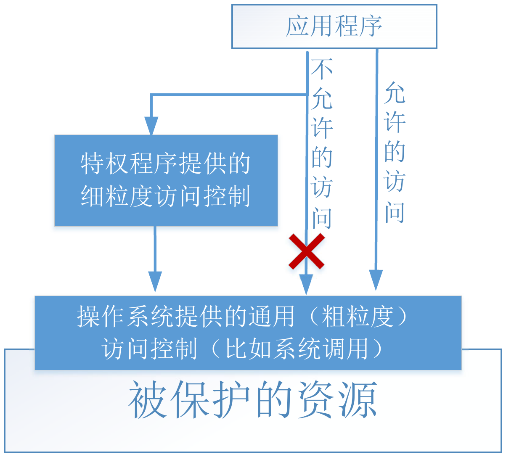
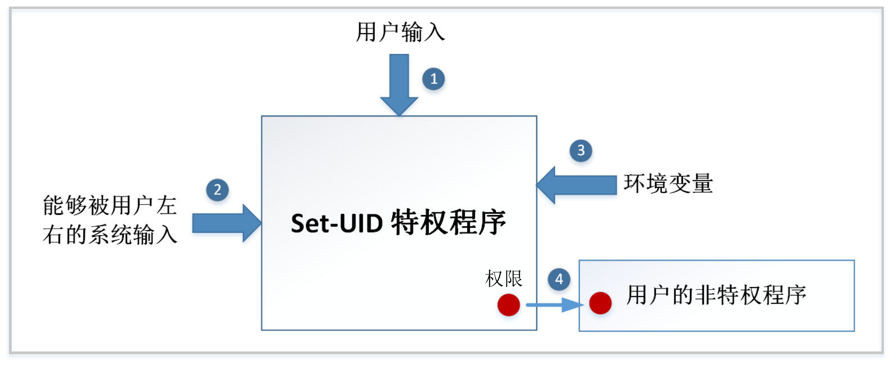

# **Set-UID 特权程序原理与攻击**

## 1. **核心概念：为什么需要特权程序**

### 1.1 **密码困境 (The Password Dilemma)**

-   **问题**: 用户的密码哈希存储在 `/etc/shadow` 文件中，该文件只有 `root` 用户有权写入。但普通用户需要能够修改自己的密码。
-   **粗暴的方案 (不安全)**: 让 `/etc/shadow` 文件对所有用户可写。这会导致任何用户都能修改别人的密码，造成严重安全漏洞。
-   **理想的方案 (过于复杂)**: 操作系统实现细粒度的访问控制，允许用户只修改文件中属于自己的那一行记录。大多数操作系统没有实现这种复杂机制。
-   **现实的方案**: 操作系统采用“两层设计”，在文件级访问控制之上，引入**特权程序**。


### **1.2 特权程序：受控的“缺口”**

特权程序是一个由 `root` 拥有的特殊程序，普通用户可以执行它。当执行时，该程序会临时获得 `root` 权限，以完成特定的、预设的任务（如修改密码），从而在不授予用户完整 `root` 权限的情况下，安全地完成特权操作。

**两种主要形式:**

1.  **守护进程 (Daemon)**: 一个以 `root` 身份在后台持续运行的服务。用户通过发送请求来让它完成特权任务。
2.  **Set-UID 程序**: 普通用户执行时，进程的**有效用户ID (Effective UID)** 会临时变为程序文件所有者（通常是 `root`）的ID，从而获得相应权限。

---

## 2. **Set-UID 机制详解**

### 2.1 **真实UID vs 有效UID**

在 Unix 系统中，一个进程拥有多个ID，其中最关键的是：

-   **真实用户ID (Real UID, RUID)**: 启动该进程的用户的ID。它代表了“你是谁”。
-   **有效用户ID (Effective UID, EUID)**: 操作系统进行权限检查时使用的ID。它代表了“你现在拥有什么权限”。

**工作原理:**

-   **普通程序**: RUID 和 EUID 相同，都是执行者的用户ID。
-   **Set-UID 程序**:
    1.  文件权限上有一个特殊的 **Set-UID 比特位** (`chmod 4755 ...` 中的 `4` 就是设置该位)。
    2.  当用户执行一个 `root` 拥有的 Set-UID 程序时：
        -   进程的 RUID 是该用户的ID (如 `1000`)。
        -   进程的 EUID 变为程序文件所有者的ID (即 `root` 的 `0`)。
    3.  由于权限检查基于 EUID，该进程因此获得了 `root` 权限，可以执行受保护的操作。

!!! example
    1.  **准备一个归属于 root 的程序 `myid`**
        ```bash
        $ cp /bin/id ./myid
        $ sudo chown root myid
        ```
    2.  **未设置 Set-UID 位 (普通程序)**
        ```bash
        $ ./myid
        # EUID 和 RUID 相同
        uid=1000(seed) gid=1000(seed) groups=1000(seed)
        ```
    3.  **设置 Set-UID 位**
        ```bash
        $ sudo chmod 4755 myid
        $ ./myid
        # EUID 变为 0 (root)
        uid=1000(seed) gid=1000(seed) euid=0(root) groups=...
        ```

!!! warning
    chown 命令会自动清空 Set-UID 比特，需要再次运行 chmod 命令来设置 Set-UID 比特。
> **核心安全前提**: Set-UID 机制的安全性建立在一个假设上：**用户只能执行程序预先编写好的代码，而不能执行任意代码。** 攻击的本质就是想办法打破这个假设。将 /bin/sh 或 vi 变成set-uid不是安全做法。

### **2.2 Set-GID 机制**
Set-UID 机制也可以用在用户组上，这被称为 Set-GID。即一个进程有真实组 ID 和有效组 ID，访问控制使用有效组 ID。与UID类似。

## **3. Set-UID 程序的攻击面**

特权程序的攻击面主要在于所有程序能够接收**输入**的地方。如果输入没有被严格校验，就可能被利用来改变程序的行为。


### **3.1 显式输入 (用户直接提供)**
-   **缓冲区溢出/格式化字符串**: 恶意构造的输入可能覆盖内存，执行恶意代码。
-   **逻辑漏洞**: 如早期 `chsh` 程序的漏洞，用户输入一个包含换行符的 shell 路径，可以在 `/etc/passwd` 中伪造一条新的 `root` 用户记录。

### **3.2 系统输入 (间接控制)**
-   用户虽然没有直接提供输入，但可以控制程序运行的环境，从而影响程序从系统获取的“输入”。
-   **竞态条件 (Race Condition)**: 常见于操作 `/tmp` 目录下的文件。攻击者可以在程序检查文件和使用文件的时间间隙，将一个正常文件用符号链接（软链接）替换为 `/etc/shadow` 等敏感文件。

### **3.3 环境变量 (隐藏的输入)**
-   环境变量是影响程序行为的“隐形”输入，极易被开发者忽略。
-   **`PATH` 环境变量攻击**:
    -   如果一个 Set-UID 程序使用 `system("ls")` 而非 `system("/bin/ls")` 来调用命令。
    -   攻击者可以修改 `PATH` 环境变量，将一个包含恶意 `ls` 程序的目录放在最前面。
    -   `system()` 函数通过 shell 查找命令，会优先找到并执行攻击者的恶意程序，且该程序将以 `root` 权限运行。

### **3.4 权限泄漏 (Privilege Leaking)**
-   **原理**: 程序在拥有特权时（EUID=0）获取了某种系统资源（如一个可写的文件描述符），然后在放弃特权后（EUID=RUID）忘记释放该资源。

!!! example
    ```c
    // 1. 以 root 权限打开一个受保护文件
    fd = open("/etc/zzz", O_RDWR); // fd = 3

    // 2. 永久放弃 root 特权
    setuid(getuid());

    // 3. 执行一个 shell
    execve("/bin/sh", ...);
    ```

!!! note
    - getuid() 获取的是真实用户ID (Real UID)。
    - setuid() 主要用来永久性地设置所有与用户相关的ID（真实、有效和保存的）。
    - geteuid() 获取的是有效用户ID (Effective UID)。
    - seteuid() 用来可逆地、临时地只设置有效用户ID (Effective UID)。
    - 
-   **攻击**: 在获得的 shell 中，虽然是普通用户权限，但文件描述符 `3` 仍然有效且指向 `/etc/zzz`。攻击者可以通过 `echo "malicious content" >&3` 来写入这个受保护的文件。
-   **真实案例**: OS X 的 `DYLD_PRINT_TO_FILE` 环境变量漏洞，允许 `su` 等程序在降权前打开任意文件，导致文件描述符泄漏给普通用户。

---

## 4. **调用外部程序**

### 4.1 不安全的方式: `system()`
-   **工作原理**: `system("cmd string")` 实际上是调用 `/bin/sh -c "cmd string"`。它将整个命令字符串交给 shell 去解析和执行。
-   **巨大风险**: Shell 是一个功能强大的解释器，它会处理特殊字符，如 `;`（命令分隔符）、`|`（管道）、`>`（重定向）等。
-   **攻击实例**:
    ```c
    // 假设程序接收用户输入 argv[1]，并执行 cat
    sprintf(command, "/bin/cat %s", argv[1]);
    system(command);
    ```
    当用户输入 ` "anyfile ; /bin/sh" ` 时，`system()` 实际执行的是两个命令：
    1.  `/bin/cat anyfile` (可能会失败，不重要)
    2.  `/bin/sh` (这将以 `root` 权限启动一个 shell)

!!! warning
    在 Ubuntu 16.04 和 Ubuntu 20.04 虚拟机上，/bin/sh 实际上是一个指向 /bin/dash 的链接文件。 dash 实现了一个保护机制，当它发现自己在一个 Set-UID 的进程里运行时，会立刻把有效用户 ID 变成实际用户 ID，因此主动放弃了特权。

    - 解决：` sudo ln -sf /bin/zsh /bin/sh`
### 4.2 安全的方式: `execve()`
-   **工作原理**: `execve()` 是一个直接的**系统调用**，它不会经过 shell。
-   **数据与代码分离**:
    -   `execve(path, argv, envp)`
    -   `path`: 要执行的程序路径 (**代码**)。
    -   `argv`: 一个字符串数组，包含程序名和所有参数 (**数据**)。
-   **安全性**: 攻击者输入的 ` "anyfile ; /bin/sh" ` 会被当作一个**单一的、完整的文件名参数**传递给 `cat` 程序，而不会被解释为多个命令。`cat` 会报告找不到名为 `"anyfile ; /bin/sh"` 的文件，攻击失败。

> #### **安全原则：数据与代码分离**
> 用户的输入应严格作为数据处理，绝不能被意外地解释为可执行的代码。`system()` 模糊了数据和代码的界限，而 `execve()` 强制将它们分离。

---

## 5. 防御策略：最小特权原则

> **最小特权原则**: 系统的每个程序和用户都应该只使用完成其任务所必需的最小权限集合。

### 5.1 限制授予的权限 (Limit *what*)
-   不要轻易授予完整的 `root` 权限。
-   使用 **POSIX Capabilities** 将 `root` 的超能力分解为更小的、独立的权限（如 `CAP_NET_ADMIN` 用于网络管理），按需分配。

### 5.2 限制权限使用时机 (Limit *when*)
-   **临时禁用**: 在不需要特权的代码段，使用 `seteuid(getuid())` 临时将有效ID切换为真实ID，事后可恢复。
-   **永久禁用**: 当特权任务完成后，使用 `setuid(getuid())` 永久放弃 `root` 权限，此操作不可逆。

### 5.3 限制权限使用范围 (Limit *where*)
-   **代码分离**: 将需要特权的、简单的代码逻辑，与不需要特权的、复杂的代码逻辑分离到不同的进程中。
-   **经典案例: Wireshark**
    -   **Wireshark (UI)**: 复杂（数百万行代码），负责解析和显示数据包，运行在**普通用户权限**下。
    -   **dumpcap (抓包工具)**: 简单（代码量小得多），只负责抓取网络数据包，拥有抓包所需的 **POSIX Capabilities** 特权。
    -   **优点**: 即使复杂的 Wireshark 主程序被攻破，攻击者也无法获得系统权限，因为该进程本身就没有特权。攻击面被大大缩小。