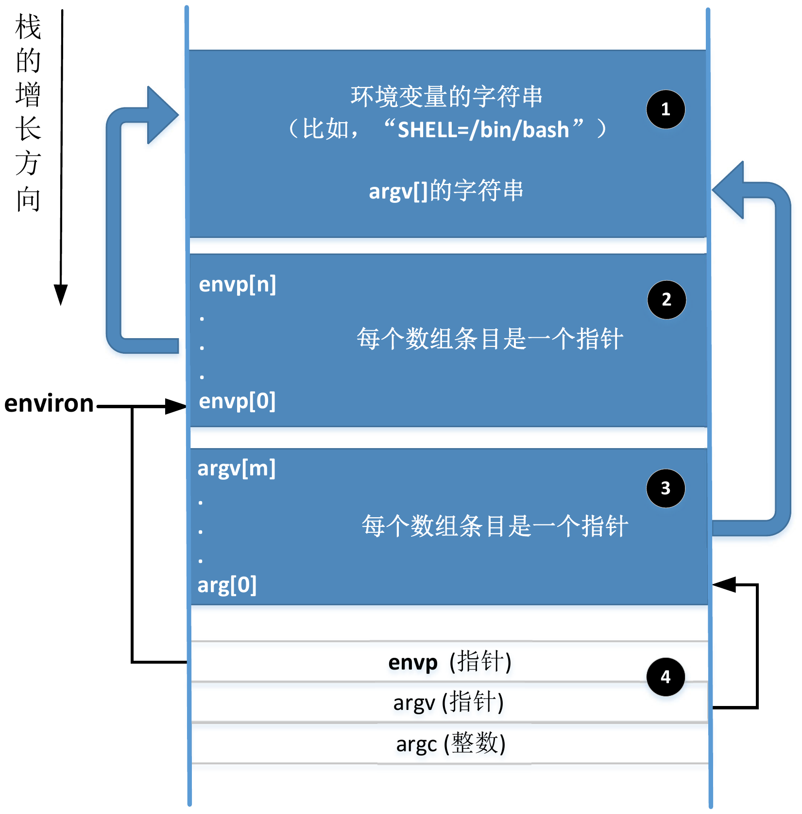
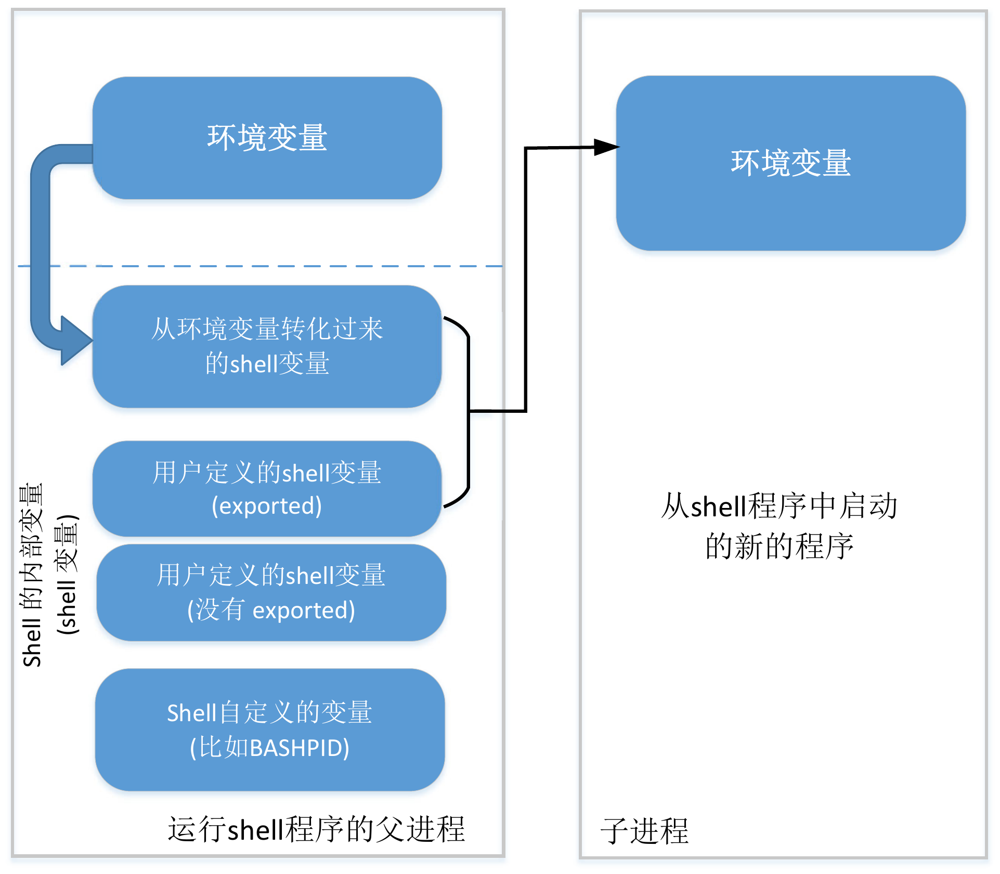
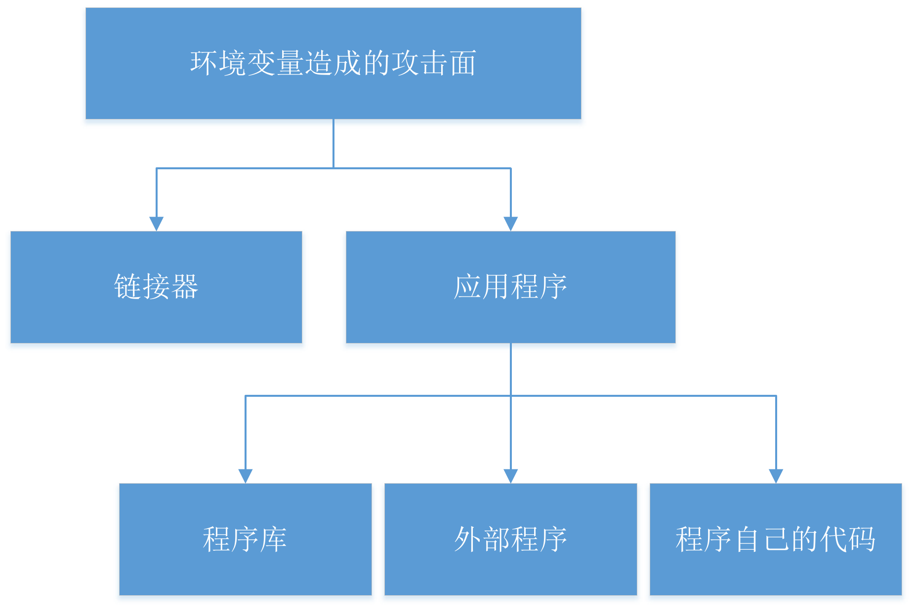
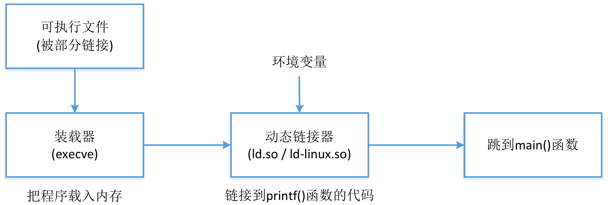
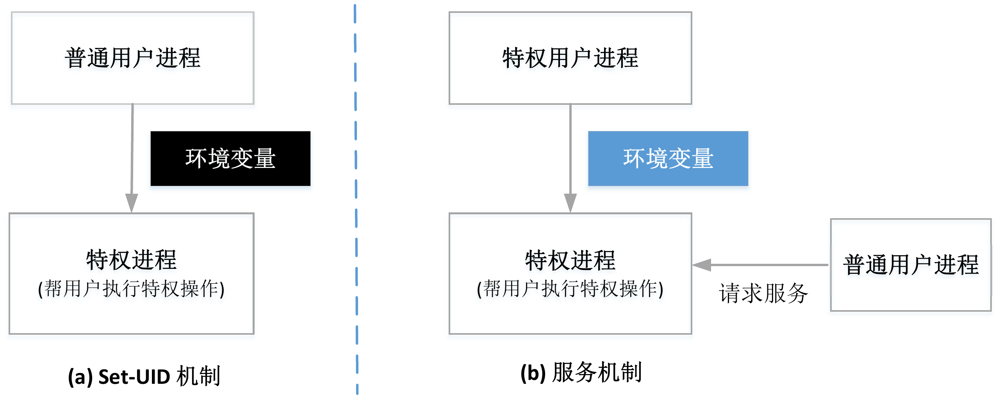

# **通过环境变量实现攻击**

## 1. 核心概念：环境变量是“隐藏的输入”

环境变量是存储在进程内存中的键值对，它们可以影响程序的行为。对于特权程序而言，它们是极其危险的**隐式输入**，因为：

-   **开发者难以察觉**: 很多时候，环境变量是被程序所依赖的库函数、动态链接器或外部程序使用的，在主程序代码中完全不可见。
-   **缺乏校验**: 由于开发者意识不到这些输入的存在，他们通常不会对其进行安全校验。
-   **用户完全可控**: 攻击者可以在执行特权程序之前，任意设置或修改环境变量。

### 1.1 **访问环境变量**
main() 函数的第三个参数指向了环境变量数组。因此，在 main() 中，我们可以使用 envp[] 数组来获取环境变量值。

- 局部变量 envp 只能在 main() 函数中使用
- 环境变量可通过全局变量 environ 访问（指向环境变量数组），**更推荐**
- 程序也可以用 getenv(var_name) 函数来获取一个具体的环境变量的值。这个函数实际上是在 environ 数组中搜索指定环境变量的值。程序也可以使用 putenv(), setenv(), 和 unsetenv() 来分别增加、修改和删除环境变量。

### 1.2 **进程获取环境变量方式**
- fork(): 子进程继承父进程所有环境变量
- execve(): 进程内存被新程序覆盖，所有环境变量丢失，若想传递环境变量需要显式传递
  - `int execve(const char *filename, char *const argv[], char *const envp[])`，若不传递环境变量可以设为null

### 1.3 **环境变量在内存中的位置**
2、3为指针数组，指向1的一个位置。4是main的栈帧，分别指向参数数组、环境变量数组的起始位置。**全局变量 environ 指向环境变量数组的起始位置。**

!!! warning
    如果环境变量发生变化，标记 ❶ 和 ❷ 的区域空间可能不够，整个环境变量块可能会移到其他位置去（一般来说是堆）。这个时候，全局变量 environ 也需要做相应地修改，但是，**main 函数的第三个参数 envp 却不会改变**。这样 envp 将一直指向旧的环境变量而非更新后的环境变量。程序可以使用 putenv() 和 setenv() 等函数来改变环境变量。调用这些函数都有可能导致环境变量块位置发生变化。
### 1.4 **Shell变量 vs. 环境变量** 
shell 程序开始时，shell 程序为进程中的每个环境变量创建一个同名的 shell 变量（值也相同），可以通过 shell 变量获取环境变量的值，但对 shell 变量的修改不会影响到同名的环境变量，反之亦然。

-   **Shell 变量**:
    -   是 Shell 进程**内部**维护的变量。
    -   修改它**不会**影响同名的环境变量。
    -   只对当前 Shell 生效。
-   **环境变量**:
    -   是进程传递给其**子进程**的一组变量。
    -   由 Shell 进程根据其内部的 Shell 变量创建。
    -   **只有被 `export` 标记的 Shell 变量**，才会成为子进程的环境变量。`export LOGNAME3=BOB`

!!! warning
    攻击者通过 `export` 命令，可以将一个自定义的 Shell 变量“注入”到即将执行的 Set-UID 程序的运行环境中。

---

## 2. **环境变量带来的攻击面**

- **链接器**：多数操作系统中，使用环境变量查找程序库的位置
- **程序库**：大部分程序从外部程序库调用函数，不会对环境变量的值做合法性检查
- **外部程序**：外部程序也许会使用一些调用程序本身并未使用的环境变量，因此整个程序的攻击面将被放大，风险也将随之增加。
- **程序自己的代码**：代码本身对环境变量做了错误假设
### 2.1 **通过动态链接器 (`ld.so`)**
!!! note
    **静态链接**：连接器将程序代码和包含 printf()等函数的程序库代码及所有依赖的函数都链接起来，编译时加 -static

    **动态链接**：支持动态链接的程序库被称为共享库，.so 后缀，流程如图；可以通过 ldd 查看程序依赖的共享库。动态链接器本身也是共享库。

    

**原理**:
动态链接发生在程序运行时，动态链接器 (`ld.so`) 负责查找并加载程序所需的共享库（`.so` 文件）。为了方便开发，链接器允许用户通过环境变量指定额外的库搜索路径或预加载库。

**关键环境变量**:

-   `LD_PRELOAD`: 指定一个或多个共享库，链接器会**最优先**从这些库中加载函数。
-   `LD_LIBRARY_PATH`: 指定一个目录列表，链接器会在这里查找共享库。

**攻击流程**:

1.  **识别目标**: 找到一个 Set-UID 程序调用的标准库函数（例如 `sleep()`）。
2.  **创建恶意库**: 编写一个与目标函数同名但包含恶意代码（如 `system("/bin/sh")`）的函数，并将其编译成一个共享库（如 `mylib.so`）。
3.  **注入环境变量**: 设置 `export LD_PRELOAD=./mylib.so`。
4.  **执行**: 运行 Set-UID 程序。链接器会优先加载 `mylib.so`，当程序调用 `sleep()` 时，执行的将是攻击者的恶意代码，并且是以 `root` 权限运行。

> #### **内置防御机制**
> 现代的动态链接器非常智能。当它检测到一个进程是 Set-UID 或 Set-GID 状态时（即真实UID ≠ 有效UID），它会**自动忽略** `LD_PRELOAD` 和 `LD_LIBRARY_PATH` 这两个危险的环境变量，从而使上述攻击失效。

> #### **真实世界的失败案例: OS X `dyld`**
> 尽管有上述防御，但新的环境变量仍可能引入漏洞。OS X 10.10 引入了 `DYLD_PRINT_TO_FILE` 变量，允许动态链接器将日志写入指定文件。攻击者可将其设置为 `/etc/sudoers` 等受保护文件，并运行 `su` 等 Set-UID 程序。`dyld` 以 `root` 权限打开该文件，但在 `su` 程序降权后**忘记关闭**，导致文件描述符泄漏，使得普通用户获得了对 `/etc/sudoers` 的写权限。

---

### 2.2 **通过外部程序调用**

**原理**:
当 Set-UID 程序需要调用外部命令时，如果实现方式不当，环境变量会严重影响其行为。

**不安全方式: `system()` 函数**
-   `system("cmd")` 的本质是启动一个 shell (`/bin/sh`)，然后让 shell 去执行 `cmd`。
-   这意味着攻击面扩大到了整个 shell，shell 的行为受到大量环境变量的影响。

**经典案例: `PATH` 环境变量攻击**

1.  **漏洞代码**: 一个 Set-UID 程序调用 `system("cal")` 而不是 `system("/bin/cal")`。
2.  **攻击准备**:
    -   攻击者在自己的目录下创建一个名为 `cal` 的恶意可执行文件（例如，内容是 `system("/bin/bash -p")`）。
    -   攻击者修改 `PATH` 环境变量，将当前目录 `.` 置于最前：`export PATH=.:$PATH`。
3.  **执行**: 运行 Set-UID 程序。shell 在根据 `PATH` 搜索 `cal` 命令时，会首先找到并执行攻击者的恶意版本，从而以 `root` 权限启动一个 shell。

**安全方式: `execve()` 函数**
-   `execve()` 是一个直接的系统调用，它**不会**启动 shell。
-   它严格区分要执行的**程序**和传递给程序的**参数**。
-   因此，它不受 `PATH` 环境变量的影响（除非在代码中显式使用 `execvp` 等变体），是调用外部程序的首选安全方法。

---

### 2.3 **其他攻击向量**

-   **通过程序库**: 某些库函数自身会使用环境变量。例如，`gettext()` 函数（用于国际化）使用 `NLSPATH` 等变量来定位语言数据库。攻击者可以伪造一个数据库，从而控制 `printf` 等函数的格式化字符串，触发格式化字符串漏洞。
-   **通过程序自身代码**: 程序直接使用 `getenv()` 获取环境变量。如果程序信任 `getenv("PWD")` 返回的是一个合法的路径名，但攻击者可以将其设置为一个超长字符串，就可能触发缓冲区溢出漏洞。

---

## 3. **防御与架构选择**

### 3.1 **防御措施**
-   **最小化攻击面**: 优先使用 `execve()` 而非 `system()` 调用外部程序。
-   **校验输入**: 绝不信任任何环境变量的内容。在使用前必须进行严格的长度和格式检查。
-   **使用安全函数**: 使用 `secure_getenv()`（glibc 提供），它在 Set-UID 环境下会自动返回 `NULL`，强制开发者处理特权场景。

### 3.2 **架构对比：Set-UID vs. 服务 (Daemon)**

从安全角度看，**服务模型远优于 Set-UID 模型**。

-   **Set-UID 模型**:
    -   特权进程 (子进程) 由**不可信的普通用户进程** (父进程) 启动。
    -   **环境变量直接从不可信的父进程继承**，构成巨大的攻击面。

-   **服务/守护进程模型**:
    -   特权服务由**可信的系统进程**（如 `systemd`）在系统启动时创建。
    -   其环境变量来源是**可信和可控的**。
    -   普通用户通过定义良好的 IPC (进程间通信) 接口与服务交互，而不是直接启动它。攻击者无法通过环境变量影响服务。

**结论**: 由于环境变量带来的固有风险，现代安全优先的系统（如 Android）已经完全抛弃了 Set-UID 机制，全面转向基于服务的特权模型。