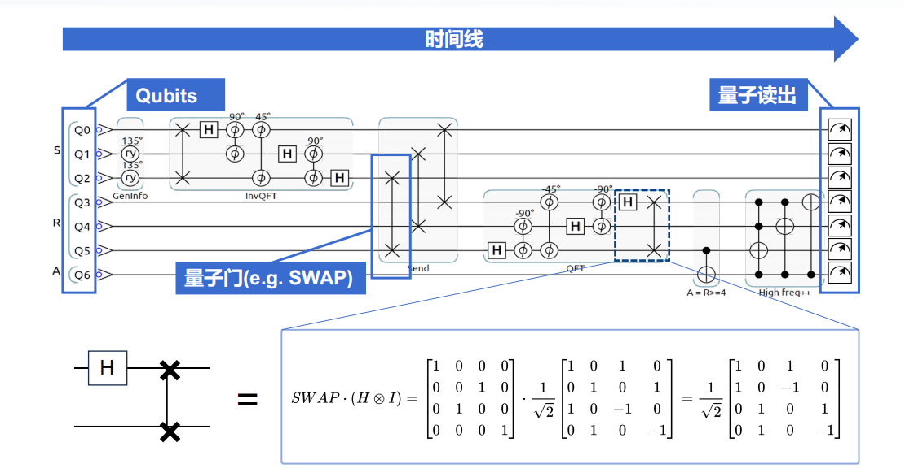

# 量子计算与线性代数核心概念笔记

!!! note "核心思想"
    量子计算的底层数学语言就是**线性代数**。理解量子力学中的概念，本质上是理解它们在线性代数中的对应关系。
    **预修要求: 线性代数! 线性代数! 线性代数!**

---

## 1. 量子比特 (Qubit) - 状态即向量

量子计算中最基本的信息单元是量子比特（Qubit）。它的状态可以用一个向量来精确描述。

### 1.1. 计算基态

任何一个量子比特的状态都可以由两个最基础的状态——**计算基态** $|0\rangle$ 和 $|1\rangle$ ——来表示。

在线性代数中，它们被定义为一组**单位正交基**（Orthonormal Basis），并表示为列向量：

$$ | 0 \rangle = \begin{pmatrix} 1 \\ 0 \end{pmatrix} \quad , \quad |1\rangle = \begin{pmatrix} 0 \\ 1 \end{pmatrix} $$

-   **单位（归一化）**: 向量的长度为1。
-   **正交**: 向量之间相互垂直（它们的内积为0）。这代表了 $|0\rangle$ 和 $|1\rangle$ 是完全可以区分的测量结果。

### 1.2. 叠加态

与经典比特不同，量子比特可以处在 $|0\rangle$ 和 $|1\rangle$ 的**线性叠加**状态。一个通用的量子比特状态 $|\psi\rangle$ 可以写为：

$$ |\psi\rangle = \alpha|0\rangle + \beta|1\rangle $$

其对应的向量形式为：

$$ |\psi\rangle = \alpha \begin{pmatrix} 1 \\ 0 \end{pmatrix} + \beta \begin{pmatrix} 0 \\ 1 \end{pmatrix} = \begin{pmatrix} \alpha \\ \beta \end{pmatrix} $$

-   **$\alpha$ 和 $\beta$** 是**复数**，被称为**概率幅**（Amplitudes）。
-   它们描述了测量时，量子比特**坍缩**到基态的概率：
    -   测量到 $|0\rangle$ 的概率是 $P(0) = |\alpha|^2$
    -   测量到 $|1\rangle$ 的概率是 $P(1) = |\beta|^2$
-   概率之和必须为1，因此它们必须满足归一化条件： $|\alpha|^2 + |\beta|^2 = 1$。

---

## 2. 量子门 - 操作即矩阵

对量子比特进行的操作被称为**量子门**。在线性代数中，每一个量子门都对应一个**矩阵**。将量子门作用于一个量子比特，等价于用门所对应的矩阵**左乘**量子比特的状态向量。

### 2.1. 案例：X门 (量子非门)

X门的功能类似于经典计算中的**NOT门**，它可以翻转量子比特的状态。

-   **目标**: $X|0\rangle = |1\rangle$ 并且 $X|1\rangle = |0\rangle$
-   **矩阵表示**:
  
    $$ X = \begin{pmatrix} 0 & 1 \\ 1 & 0 \end{pmatrix} $$

-   **线性代数验证**:
  
    $$X|0\rangle = \begin{pmatrix} 0 & 1 \\ 1 & 0 \end{pmatrix} \begin{pmatrix} 1 \\ 0 \end{pmatrix} = \begin{pmatrix} 0 \\ 1 \end{pmatrix} = |1\rangle$$
    
    $$X|1\rangle = \begin{pmatrix} 0 & 1 \\ 1 & 0 \end{pmatrix} \begin{pmatrix} 0 \\ 1 \end{pmatrix} = \begin{pmatrix} 1 \\ 0 \end{pmatrix} = |0\rangle$$

-   **对叠加态的作用**: 量子门的线性性质是其强大之处。
  
    $$ X|\psi\rangle = X \begin{pmatrix} \alpha \\ \beta \end{pmatrix} = \begin{pmatrix} \beta \\ \alpha \end{pmatrix} = \beta|0\rangle + \alpha|1\rangle $$
    X门的作用是**交换了状态向量中 $|0\rangle$ 和 $|1\rangle$ 的概率幅**。

### 2.2. 案例：H门 (哈达玛门)

H门是创造**叠加态**的关键。

-   **矩阵表示**:

    $$ H = \frac{1}{\sqrt{2}} \begin{pmatrix} 1 & 1 \\ 1 & -1 \end{pmatrix} $$

-   **核心作用**:
    -   $H|0\rangle = \frac{1}{\sqrt{2}}(|0\rangle + |1\rangle)$  (创造了等概率的叠加态)
    -   $H|1\rangle = \frac{1}{\sqrt{2}}(|0\rangle - |1\rangle)$  (创造了带有相位的叠加态)

!!! success "关键特性"
    所有单量子比特门都可以由一个 $2 \times 2$ 的**幺正矩阵**（Unitary Matrix）来表示。幺正矩阵能保证在变换过程中，向量的长度始终为1，即总概率守恒。

---

## 3. 多量子比特系统 - 组合即张量积

当系统包含多个量子比特时，我们需要一个更大的向量空间来描述整个系统的组合状态。这个组合的数学工具就是**张量积 (Tensor Product, ⊗)**。

-   **规则**: 将第一个矩阵的每一个元素，乘以整个第二个矩阵，形成一个分块矩阵。
  
    $$ A \otimes B = \begin{pmatrix} a_{11}B & a_{12}B \\ a_{21}B & a_{22}B \end{pmatrix} $$

-   **案例分析 **:
    一个双比特电路上，先对第一个比特施加H门（第二个比特不变，即施加I门），然后对两个比特施加SWAP门。

    

    1.  **第一步操作 (H ⊗ I)**:
   
        $$ H \otimes I = \frac{1}{\sqrt{2}} \begin{pmatrix} 1 & 1 \\  1 & -1 \end{pmatrix} \otimes \begin{pmatrix} 1 & 0 \\ 0 & 1 \end{pmatrix} = \frac{1}{\sqrt{2}} \begin{pmatrix} 1 \cdot I & 1 \cdot I \\ 1 \cdot I & -1 \cdot I \end{pmatrix} = \frac{1}{\sqrt{2}} \begin{pmatrix} 1 & 0 & 1 & 0 \\ 0 & 1 & 0 & 1 \\ 1 & 0 & -1 & 0 \\ 0 & 1 & 0 & -1 \end{pmatrix} $$

    2.  **第二步操作 (SWAP)**:
        SWAP门用于交换两个量子比特的状态，其矩阵为：
    
        $$ SWAP = \begin{pmatrix} 1 & 0 & 0 & 0 \\ 0 & 0 & 1 & 0 \\ 0 & 1 & 0 & 0 \\ 0 & 0 & 0 & 1 \end{pmatrix} $$

    3.  **最终等效矩阵**: 操作顺序对应矩阵从右到左相乘。
   
        $ U_{total} = (SWAP) \cdot (H \otimes I) $
        这个乘法的结果就是将 $(H \otimes I)$ 矩阵的**第二行和第三行交换**，得到PPT中的最终结果。

---

## 4. 测量 - 从量子到经典

量子计算过程是演化，而要获得最终结果，必须进行**测量**。

-   测量是一个**概率性**过程。对于一个2比特系统状态 $|\psi\rangle = \alpha_{00}|00\rangle + \alpha_{01}|01\rangle + \alpha_{10}|10\rangle + \alpha_{11}|11\rangle$，测量得到 $|01\rangle$ 的概率为 $|\alpha_{01}|^2$。
-   测量会使量子态**坍缩**到你所测量的那个基态上。
-   为了得到可靠的概率分布，需要对同一个量子电路**多次运行和测量**，最终得到如PPT中柱状图所示的测量分布。这是获得问题解的**必须步骤**。

---

## 5. 术语对照表：量子力学 vs. 线性代数

| 量子力学术语 (Quantum Mechanics) | 线性代数术语 (Linear Algebra) | 简要说明 |
| :--- | :--- | :--- |
| **态矢量** (State Vector) | **向量** (Vector) | 描述量子系统状态的数学对象。 |
| **算符** (Operator) | **矩阵** (Matrix) | 对量子态进行操作的数学工具。 |
| **线性算符** (Linear Operator) | **线性变换** (Linear Transformation) | 保持向量加法和标量乘法不变的变换。 |
| **右矢** (ket) |$\| a \rangle$ | **列向量** (Column Vector) | 量子态的基本表示。 |
| **左矢** (bra) |$\langle a \|$ | **行向量** (Row Vector) | 列向量的共轭转置。 |
| $\langle a\|b \rangle$ | a和b向量的**内积** (Inner Product) | 计算一个态在另一个态上的投影幅度。 |
| $\|a\rangle\langle b\|$ | a和b的**张量积**构成的投影矩阵 | 一个向量到另一个向量方向的投影操作。 |
| **本征态** (Eigenstate) | **特征向量** (Eigenvector) | 算符作用下，方向不变只做缩放的特殊态。 |
| **本征值** (Eigenvalue) | **特征值** (Eigenvalue) | 上述缩放的比例因子，代表可测量的物理量。 |
| **基态** (Ground State) | 最小本征态 (Eigenstate with Lowest Eigenvalue) | 能量最低、最稳定的本征态。 |
| **幺正算符** (Unitary Operator) | **正交/幺正矩阵** (Orthogonal/Unitary Matrix) | 保持向量长度（总概率）不变的可逆操作。 |
| **厄米矩阵** (Hermitian Matrix) | **自伴矩阵** (Self-adjoint Matrix) | 代表物理可观测量，其特征值必为实数。 |
| **线性叠加原理** (Superposition) | **线性组合性质** (Linearity) | 多个状态可以线性组合成一个新的有效状态。 |
| **投影算符** (Projection Operator) | **投影矩阵** (Projection Matrix) | 用于描述测量过程的数学工具。 |