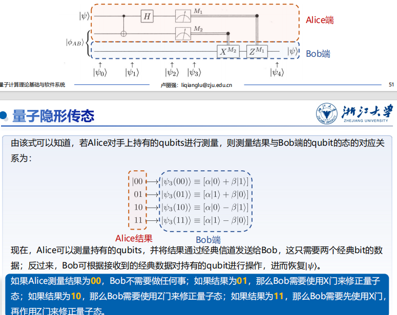
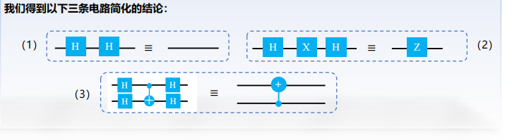

# 量子比特与量子门

## 1. 量子比特

### 量子术语与线性代数术语对照

| 量子力学术语        | 线性代数术语                  |
| :------------------ | :---------------------------- |
| 态矢量 (State Vector) | 向量 (Vector)                 |
| 本征态 (Eigenstate) | 特征向量 (Eigenvector)        |
| 本征值 (Eigenvalue) | 特征值 (Eigenvalue)           |
| 右矢 (ket) $\|a \rangle$ | 列向量 (Column Vector)        |
| 左矢 (bra) $\langle a\|$ | 行向量 (Row Vector)           |
| $\langle a\|b\rangle$ | $a$ 和 $b$ 向量的内积 (Inner Product) |
| $\|a\rangle\langle b\|$ | $a$ 和 $b$ 的外积构成的投影矩阵 |
| 基态 (Ground State) | 最小本征态 (Eigenstate with Lowest Eigenvalue) |
| 算符 (Operator)     | 矩阵 (Matrix)                 |
| 线性算符 (Linear Operator) | 线性变换 (Linear Transformation) |
| 幺正 (酉) 算符 (Unitary Operator) | 正交矩阵 (Orthogonal Matrix)  |
| 厄米矩阵 (Hermitian Matrix) | 自伴矩阵 (Self-adjoint Matrix) |
| 线性叠加原理 (Principle of Superposition) | 线性组合性质 (Linearity)      |
| 投影算符 (Projection Operator) | 投影矩阵 (Projection Matrix)  |

!!! note "幺正矩阵与厄米矩阵"
    *   **正交矩阵** (实数): $AA^T = I$
    *   **幺正矩阵** (复数): $UU^\dagger = I$ (其中 $\dagger$ 是共轭转置)
        *   在量子计算中至关重要，因其性质保证了量子态经过幺正算子后仍是一个有效的量子态。
    *   **厄米矩阵** (复数): $H = H^\dagger$
        *   其性质保证了本征值是实数，本征向量是正交的，这确保了量子系统的物理量是可观测的。

### 量子比特的物理实现

*   **叠加特性**: 电子自旋叠加、能量态叠加等物理过程的抽象就是量子比特的叠加特性。
    *   电子自旋向上和自旋向下存在叠加。
    *   原子的基态和激发态也存在叠加。
    *   经典微电子电路的CMOS开关的开闭承载了1比特的信息。

### DiVincenzo 判据 (量子计算机实现条件)

1.  具有可操控的量子比特，并具有可扩充性（可调控的二能级系统）。
2.  能够将量子比特的状态初始化为简单基准状态（设置 $|0\rangle$ 态或 $|1\rangle$ 态）。
3.  具有长相关退相干时间（确保充足的时间有效完成计算任务）。
4.  具有一组“通用”量子门（确保能够满足所有的计算任务需求）。
5.  能够测量特定量子比特（完成量子信息到经典信息的转换）。

### 量子态基本概念

*   **量子叠加态 (Superposition)**: 量子比特 (Qubits) 可以同时代表1和0的多种可能性组合。研究人员使用精密激光或微波束操纵，使量子比特处于叠加态。
*   **量子纠缠态 (Entanglement)**: 一对量子比特对的两个量子比特存在于单个量子状态。改变其中一个量子比特的状态时，另一个量子比特的状态会瞬间改变。

### 量子比特的叠加态

*   **量子比特**: 存在两个可能的状态 $|0\rangle$ 和 $|1\rangle$。与经典比特不同，量子比特可以处于 $|0\rangle$ 和 $|1\rangle$ 以外的状态，是状态的线性组合，称为叠加态。
*   **表示**: $|\psi\rangle = \alpha|0\rangle + \beta|1\rangle$
    *   $\alpha$ 和 $\beta$ 是复数 (振幅)，描述量子比特的叠加状态。
    *   $|0\rangle$ 和 $|1\rangle$ 是基矢态，构成二维复向量空间的正交基。
*   **归一化条件**: $|\alpha|^2 + |\beta|^2 = 1$
    *   量子比特的状态是二维复向量空间中的单位向量。
    *   向量各分量为复数，欧几里得范数为1。

### 量子比特的基矢态

*   除了 $|0\rangle$ 和 $|1\rangle$，任意两个单位正交基都可以作为量子态的基矢态。
*   **常用正交基**:
    *   $|+\rangle = \frac{1}{\sqrt{2}}(|0\rangle + |1\rangle)$
    *   $|-\rangle = \frac{1}{\sqrt{2}}(|0\rangle - |1\rangle)$
*   任意量子态都可以表示为这组基的线性组合: $|\psi\rangle = \alpha|+\rangle + \beta|-\rangle$

### 量子比特的向量表示

*   $|0\rangle$ 和 $|1\rangle$ 向量形式: $|0\rangle = \begin{bmatrix} 1 \\ 0 \end{bmatrix}$, $|1\rangle = \begin{bmatrix} 0 \\ 1 \end{bmatrix}$
*   $|+\rangle$ 和 $|-\rangle$ 向量形式: $|+\rangle = \frac{1}{\sqrt{2}}\begin{bmatrix} 1 \\ 1 \end{bmatrix}$, $|-\rangle = \frac{1}{\sqrt{2}}\begin{bmatrix} 1 \\ -1 \end{bmatrix}$
*   任意量子态 $|\psi\rangle = \alpha|0\rangle + \beta|1\rangle$ 向量形式: $|\psi\rangle = \begin{bmatrix} \alpha \\ \beta \end{bmatrix}$

### 量子态矢内积

*   **Bra-ket 表示法**: $| \psi \rangle$ 表示列向量，$\langle \psi |$ 表示其共轭转置行向量 $\begin{bmatrix} \alpha^* & \beta^* \end{bmatrix}$。
*   **内积**: $\langle \psi | \psi \rangle = \alpha^* \alpha + \beta^* \beta = 1$ (标量)
*   **一般定义**: $\langle a|b \rangle = a_0^* b_0 + a_1^* b_1 + \dots + a_n^* b_n$
*   **正交**: 两个向量的内积为0。
*   **欧几里得范数**: $|||v\rangle|| = \sqrt{\langle v|v \rangle}$

### 量子态的坍缩

*   当测量量子态时，会发生量子态的坍缩 (投影)。
*   对于 $|\psi\rangle = \alpha|0\rangle + \beta|1\rangle$，将以 $|\alpha|^2$ 的概率得到 $|0\rangle$ 态，以 $|\beta|^2$ 的概率得到 $|1\rangle$ 态。
*   **归一化条件**: $|\alpha|^2 + |\beta|^2 = 1$。

### 不可克隆原理 (Quantum No-Cloning Theorem)

*   **核心思想**: 不能创建一个完美的克隆 (拷贝) 任意未知的量子态。
*   **数学表示**: 不存在一个线性算符 $U$，可以将量子态 $|\psi\rangle$ 映射到相应的复制态 $|\psi\rangle|\psi\rangle$。
*   **意义**: 无法通过制作副本对量子态进行重复测量。

### 量子比特的几何表示 (Bloch 球)

*   **可视化**: 单量子比特的量子态可以可视化在一个球面中，称为 **Bloch 球**。
*   **表示**: $|\psi\rangle = \cos(\frac{\theta}{2})|0\rangle + e^{i\varphi} \sin(\frac{\theta}{2})|1\rangle$
    *   $\theta$ 和 $\varphi$ 是球坐标下的分量，且量子态的欧几里得范数为1。
*   **全局相位**: 量子态乘以一个单位模长的复数，只会引入一个全局相位，不会带来任何可观测的效应。
    *   $|\psi'\rangle = e^{i\xi}|\psi\rangle$ 与 $|\psi\rangle$ 物理等价。
*   **注意**: Bloch 球只能可视化 **单个量子比特** 的状态。

### 小结: 量子信息的无限与有限

*   **无限**: 一个量子比特的状态可以是Bloch球上的任意一点，复系数可以无限拓展，理论上一个量子比特的信息容量足以存储下一本书！
*   **有限**: 量子力学的基本假设限定了量子比特被测量后便会坍缩，单次测量只能获取一比特的信息。只有在测量了无数多个“完全相同”的量子比特后，才能确定 $\alpha$ 和 $\beta$。
*   **隐含信息**: 在一个量子比特的状态里，大自然隐藏了大量的“隐含信息”，这些信息会随着量子比特数的增长而指数增长。

---

## 2. 多量子比特

### 多量子比特叠加态

*   **两个量子比特**: 有四种基本状态 $|00\rangle, |01\rangle, |10\rangle, |11\rangle$。
*   **叠加态**: 可以是这些基本态的叠加: $|\psi\rangle = \alpha_{00}|00\rangle + \alpha_{01}|01\rangle + \alpha_{10}|10\rangle + \alpha_{11}|11\rangle$
*   **测量**: 测量量子系统，以 $|\alpha_x|^2$ 的概率得到 $|x\rangle$ 态。
*   **归一化**: $\sum_{x \in \{0,1\}^2} |\alpha_x|^2 = 1$。
*   **局部测量与坍缩**: 测量其中低位量子比特得到0，则状态坍缩并归一化。
*   **N个量子比特**: $2^N$ 种基本状态。

### 张量积 (Tensor Product / Kronecker Product)

*   **定义**: 用于组合向量空间的运算，将两个向量空间的向量合并成一个更大的向量空间。
*   **表示**: $V \otimes W$。结果是一个新的向量空间，其维度等于 $V$ 和 $W$ 的维度的乘积。
*   **示例**:
  
    *   向量表示: $\begin{bmatrix} \alpha \\ \beta \end{bmatrix} \otimes \begin{bmatrix} \gamma \\ \delta \end{bmatrix} = \begin{bmatrix} \alpha\gamma \\ \alpha\delta \\ \beta\gamma \\ \beta\delta \end{bmatrix}$
*   **作用**: 获得多个量子态的复合量子态，提供多量子比特的数学表示方法。

### 判断是否纠缠

*   **无关/可分态**: 如果一个多量子比特系统可以分解为多个单量子比特的张量积。
    *   例如: $\frac{1}{2}(|00\rangle + |01\rangle - |10\rangle - |11\rangle) = \frac{1}{\sqrt{2}}(|0\rangle - |1\rangle) \otimes \frac{1}{\sqrt{2}}(|0\rangle + |1\rangle)$
    *   这意味着第二个比特的状态与第一个比特无关。
*   **不可分/纠缠态**: 如果无法分解成多个单量子比特的张量积。
    *   例如: $\frac{1}{\sqrt{2}}(|00\rangle + |11\rangle)$
    *   第一个比特测得0，第二个比特一定为0；第一个比特测得1，第二个比特一定为1。

### 复合系统与多比特门

*   **编号与绘制**: 态矢量中的每个量子比特按从左到右顺序编号，并在量子电路图中从上至下绘制。
*   **多比特门**: 若将两个单量子门视作一个整体，可以通过张量积的形式构成一个双量子门。

### 量子优势案例

*   量子计算机可以通过同时尝试所有可能的“钥匙”来一次性解决问题 (如开锁)，而经典计算机需要依次尝试。
*   这种优势源于量子叠加态和量子纠缠态的特性。

### 贝尔态 (Bell States)

*   **定义**: 双量子比特系统中重要的纠缠态。
*   **四种贝尔态**:
    *   $|\phi^+\rangle = \frac{1}{\sqrt{2}}(|00\rangle + |11\rangle)$
    *   $|\phi^-\rangle = \frac{1}{\sqrt{2}}(|00\rangle - |11\rangle)$
    *   $|\psi^+\rangle = \frac{1}{\sqrt{2}}(|01\rangle + |10\rangle)$
    *   $|\psi^-\rangle = \frac{1}{\sqrt{2}}(|01\rangle - |10\rangle)$
*   **贝尔基**: 这四个贝尔态构成一个基底，任何双量子比特的量子态都可以表示为它们的线性组合。

---

## 3. 单量子门

### 引入: 量子非门 (Pauli-X 门)

*   **经典X门 (NOT门)**: 翻转电平信号 (0态和1态交换)。
*   **量子X门**: 作用是线性的，实现 $|0\rangle \rightarrow |1\rangle$ 的转变，互换复系数。
*   **矩阵表示**: $X = \begin{bmatrix} 0 & 1 \\ 1 & 0 \end{bmatrix}$
*   **结论**: 单量子比特的量子门可以由 $2 \times 2$ 的矩阵给出，其矩阵分量决定了量子门的行为。

### Hadamard 门 (H 门)

*   **基础量子门**: 将 $|0\rangle$ 和 $|1\rangle$ 转变为叠加态。
*   **矩阵表示**: $H = \frac{1}{\sqrt{2}}\begin{bmatrix} 1 & 1 \\ 1 & -1 \end{bmatrix}$
*   **作用**:
    *   $H|0\rangle = \frac{1}{\sqrt{2}}(|0\rangle + |1\rangle) = |+\rangle$
    *   $H|1\rangle = \frac{1}{\sqrt{2}}(|0\rangle - |1\rangle) = |-\rangle$
*   **几何意义**: 将量子态从z基到x基的转变；或在Bloch球上先绕z轴转180度再绕y轴转90度；或围绕x-z轴中界线旋转180度。

### Pauli 矩阵和 Pauli 门 (X, Y, Z)

*   **Pauli-X 矩阵**: $\sigma_x = \begin{bmatrix} 0 & 1 \\ 1 & 0 \end{bmatrix}$
*   **Pauli-Y 矩阵**: $\sigma_y = \begin{bmatrix} 0 & -i \\ i & 0 \end{bmatrix}$
*   **Pauli-Z 矩阵**: $\sigma_z = \begin{bmatrix} 1 & 0 \\ 0 & -1 \end{bmatrix}$
*   **作用**:
    *   X门: 实现 $|0\rangle \leftrightarrow |1\rangle$ 转变，相当于绕x轴旋转 $\pi$ 角度。
    *   Y门、Z门: 分别让量子态绕y轴和z轴旋转 $\pi$ 角度。

### 量子门与矩阵乘法

*   **量子计算本质**: 酉矩阵计算！
*   **表示**: $V' = UV$ (输出态 = 演化矩阵 $\cdot$ 输入态)
*   **可逆性**: $V = U^{-1}V'$
*   **正则性**: $||U|| = 1$
*   **量子门的例子**: Hadamard (H), Pauli-Y (Y), Pauli-Z (Z), CNOT。

### 厄米矩阵和酉矩阵 (重复，此处为总结)

*   **量子门的矩阵限制**: 只有酉矩阵才能用作表示一个量子门！
*   **厄米矩阵 ($A=A^\dagger$)**: 其性质保证了本征值是实数，本征向量是正交的，这确保了量子系统的物理量是可观测的。
*   **酉矩阵 ($UU^\dagger=I$)**: 其性质保证了作用在量子态上得到的结果仍然满足归一化条件 (合法量子态)；保持内积不变 (保持态矢量间的正交性质)。

### 相位旋转门 (P, S, T 门)

*   **作用**: 引入特定的相位因子，改变量子态的相对相位，但不改变其概率分布。
*   **应用**: 量子相位估计、量子傅里叶变换等。
*   **与Pauli门区别**: 不涉及量子比特的旋转操作，而是旋转相位。
*   **常见门**:
    *   **P门**: $P = \begin{bmatrix} 1 & 0 \\ 0 & e^{i\varphi} \end{bmatrix}$ (将量子比特的相位进行旋转，$\varphi$ 为输入参数)
    *   **S门**: $S = \begin{bmatrix} 1 & 0 \\ 0 & i \end{bmatrix}$ (P门的特例，$\varphi = \pi/2$)
    *   **T门**: $T = \begin{bmatrix} 1 & 0 \\ 0 & e^{i\pi/4} \end{bmatrix}$ (P门的特例，$\varphi = \pi/4$)

### 参数旋转门 ($R_x(\theta), R_y(\theta), R_z(\theta)$)

*   **基本门**: 允许根据给定参数执行量子态的旋转操作。
*   **常见门**: 绕X轴、Y轴和Z轴的旋转门，$\theta$ 是旋转角度。
    *   $R_x(\theta) = \begin{bmatrix} \cos(\frac{\theta}{2}) & -i\sin(\frac{\theta}{2}) \\ -i\sin(\frac{\theta}{2}) & \cos(\frac{\theta}{2}) \end{bmatrix}$
    *   $R_y(\theta) = \begin{bmatrix} \cos(\frac{\theta}{2}) & -\sin(\frac{\theta}{2}) \\ \sin(\frac{\theta}{2}) & \cos(\frac{\theta}{2}) \end{bmatrix}$
    *   $R_z(\theta) = \begin{bmatrix} e^{-i\theta/2} & 0 \\ 0 & e^{i\theta/2} \end{bmatrix}$
*   **应用**: 量子电路设计、量子机器学习 (如量子神经网络、变分量子算法)。

### 单量子比特操作分解

*   **问题**: 任何2x2的酉矩阵都可以表示一个量子门，但酉矩阵有无穷多个，需要制造这么多门吗？
*   **答案**: 不需要。任意一个2x2的酉矩阵都可以分解为:
    $U = e^{i\alpha} \begin{bmatrix} e^{-i\beta/2} & 0 \\ 0 & e^{i\beta/2} \end{bmatrix} \begin{bmatrix} \cos(\frac{\gamma}{2}) & -\sin(\frac{\gamma}{2}) \\ \sin(\frac{\gamma}{2}) & \cos(\frac{\gamma}{2}) \end{bmatrix} \begin{bmatrix} e^{-i\delta/2} & 0 \\ 0 & e^{i\delta/2} \end{bmatrix}$
    *   这个分解可以对任意单比特操作进行精确描述，这意味着只需要有限数量的基本门 (如旋转门和Pauli门) 即可实现任意单比特操作。

## 4. 多量子门

### 从XOR门到CNOT门

*   **经典XOR门**: “受控非门”；输入A是“控制端”，A为1时，XOR对B施加非门；A为0时，不施加非门。
*   **量子CNOT门 (Controlled-NOT Gate)**: 一种受控门。
    *   **控制比特**: 其状态决定目标比特是否翻转。
    *   **目标比特**: 当控制比特为 $|1\rangle$ 时翻转，为 $|0\rangle$ 时保持不变。
*   **矩阵表示**:
    $CNOT = \begin{bmatrix} 1 & 0 & 0 & 0 \\ 0 & 1 & 0 & 0 \\ 0 & 0 & 0 & 1 \\ 0 & 0 & 1 & 0 \end{bmatrix}$ (控制比特为q0，目标比特为q1)
*   **真值表 (非叠加态)**:
    | Input (c t) | Output (c t) |
    | :---------- | :----------- |
    | 0 0         | 0 0          |
    | 0 1         | 0 1          |
    | 1 0         | 1 1          |
    | 1 1         | 1 0          |

### 基于CNOT门制备贝尔态

*   **主要作用**: 制备纠缠态。
*   **制备 $|\phi^+\rangle = \frac{1}{\sqrt{2}}(|00\rangle + |11\rangle)$ 的电路**:
    1.  初始化 q0 和 q1 为 $|00\rangle$。
    2.  对 q0 施加 Hadamard 门 ($H$)，使 q0 处于叠加态。
    3.  对 q0 和 q1 施加 CNOT 门，q0 为控制比特，q1 为目标比特。
*   **结果**:
    $|00\rangle \xrightarrow{H \text{ on } q0} \frac{1}{\sqrt{2}}(|0\rangle + |1\rangle)|0\rangle = \frac{1}{\sqrt{2}}(|00\rangle + |10\rangle)$
    $\xrightarrow{CNOT} \frac{1}{\sqrt{2}}(|00\rangle + |11\rangle)$

### 量子隐形传态 (Quantum Teleportation)

*   **目的**: 将一个未知量子态从Alice传输给Bob。
*   **核心机制**:
    1.  Alice和Bob共享一个纠缠态 (如贝尔态)。
    2.  Alice拥有待传输的未知量子态 $|\psi\rangle$ 和纠缠对中的一个比特。
    3.  Alice对自己的两个比特 (未知态和纠缠态中的一个) 进行操作 (CNOT，Hadamard) 和测量。
    4.  Alice通过 **经典信道** 将测量结果 (2比特经典信息) 发送给Bob。
    5.  Bob根据收到的经典信息对自己的纠缠态比特进行操作 (X, Z 门)，恢复出Alice的未知量子态。
*   **关键点**:
    *   **不可克隆原理**: Alice无法直接复制未知态。
    *   **经典通信**: 传输过程中需要经典信道，因此量子隐形传态不能突破光速限制。
    *   **不是拷贝**: 最终实现了量子比特的传输，而不是拷贝，因为Alice端的原始量子态在测量后坍缩。

### SWAP门及CSWAP门

*   **SWAP门**: 交换两个量子比特的状态。
*   **矩阵表示**:
    $SWAP = \begin{bmatrix} 1 & 0 & 0 & 0 \\ 0 & 0 & 1 & 0 \\ 0 & 1 & 0 & 0 \\ 0 & 0 & 0 & 1 \end{bmatrix}$
*   **作用**: 生成和操作纠缠态，通过交换可以创建新的纠缠态。
*   **CSWAP门 (Controlled-SWAP / Fredkin门)**: 给SWAP门添加一个控制比特。当控制比特为 $|1\rangle$ 时，执行SWAP操作；否则不变。

### SWAP操作在硬件上的应用

*   **问题**: 现阶段量子计算机中，逻辑上相邻的量子比特在物理硬件上可能不相邻。
*   **解决方案**: SWAP操作可以将物理比特“交换”位置，从而实现对不相邻逻辑比特的多比特门操作。
*   **重要性**: 成为量子线路编译及优化中常用的技术。

### Toffoli门 (CCNOT / CCX 门)

*   **三量子比特门**: 在经典计算中执行AND逻辑操作。
*   **操作**: 如果前两个量子比特 (控制比特) 都处于 $|1\rangle$ 态，则对第三个量子比特 (目标比特) 执行非门操作；否则目标比特保持不变。
*   **矩阵表示**: $8 \times 8$ 矩阵，只在最后两行倒数第二列和倒数第一列对调。
*   **广义形式**: 可以有更多控制比特 (CCCNOT, CCCCNOT 等)。

### 量子计算的并行性

*   **基本特征**: 量子计算机可以同时计算 $f(x)$ 在多个 $x$ 取值下的函数值。
*   **映射**: $|x, y\rangle \rightarrow |x, y \oplus f(x)\rangle$ (其中 $\oplus$ 是模2加运算)。
*   **原理**: 利用叠加态，在单个电路中同时计算多个函数值。
*   **实现**: 对输入 $x$ 的每个比特施加Hadamard门，将其置于平衡叠加态 $\frac{1}{\sqrt{2^n}}\sum_x |x\rangle$。
*   **输出**: $\frac{1}{\sqrt{2^n}}\sum_x |x\rangle |f(x)\rangle$

### 从并行性到Deutsch算法

*   **问题**: 经典计算中，要确定一个未知函数 $f: \{0,1\} \rightarrow \{0,1\}$ 是常数函数 ($f(x)=0$ 或 $f(x)=1$) 还是平衡函数 ($f(0) \neq f(1)$)，至少需要2次查询。量子计算机能否更高效？
*   **Deutsch算法**:
    1.  **初始化**: 输入比特 $|0\rangle$ 和 $|1\rangle$，第二个比特通过Hadamard门得到 $|-\rangle = \frac{1}{\sqrt{2}}(|0\rangle - |1\rangle)$。
    2.  **Oracle操作**: 将 $U_f$ 作用在 $|x\rangle |-\rangle$ 上，利用性质 $|x\rangle |y \oplus f(x)\rangle = |x\rangle (-1)^{f(x)} |y\rangle$ 得到 $|x\rangle (-1)^{f(x)} |-\rangle$。
    3.  **Hadamard门**: 对第一个比特再施加Hadamard门。
    4.  **测量**: 测量第一个比特。
*   **结果**:
    *   如果测量结果是 $|0\rangle$，则 $f$ 是常数函数。
    *   如果测量结果是 $|1\rangle$，则 $f$ 是平衡函数。
*   **优势**: 只需 **一次计算、一次测量** 即可确定函数 $f$ 的全局性质，比经典计算 (至少2次) 更快。
*   **本质**: 通过精心选择函数以及变换，以优于经典计算的速度获取函数的全局信息。

### Oracle

*   **概念**: 在量子计算中，Oracle 代表一个功能，其行为已知 (输入输出关系)，但内部实现细节可能未知，被视为“黑盒”。
*   **作用**: 输入数据，输出 1 (yes) 或 0 (no)。
*   **要点**:
    *   尽可能快速高效。
    *   调用Oracle的次数尽可能少，减少算法复杂度。
*   **表示**:
    *   经典: $f: \{0,1\}^n \rightarrow \{0,1\}$
    *   量子: $f(|\psi\rangle) = |1\rangle$ (如 $|\psi\rangle = |1000\rangle$) 或 $|0\rangle$ (其它)。

### Oracle线路设计与简化

*   **设计**: 包含待判断的函数 $f(x)$，传入量子比特，输出可区分常量或平衡函数的量子比特。
    *   $U_f: |x\rangle |y\rangle \rightarrow |x\rangle |y \oplus f(x)\rangle$
    *   通常 InputA 固化为 $|0\rangle$ 作为辅助输入，OutputA 是真实操作结果。
*   **四种基本函数对应的线路**: $f(x)=0$, $f(x)=1$, $f(x)=x$, $f(x)=\neg x$。
*   **线路简化规则**:
    1.  $H \cdot H = I$ (Hadamard门自身逆)
    2.  $H \cdot X \cdot H = Z$
    3.  CNOT门的等效变换。

### 量子电路部署流程

*   **电路层编译**:
    1.  **量子程序**: 编写量子算法。
    2.  **量子电路 (逻辑电路)**: 硬件无关优化。
    3.  **量子电路 (物理电路)**: 硬件相关优化，将逻辑门映射到物理比特和它们的连接。
    4.  **板卡指令**: 将物理电路转换为量子硬件可执行的指令集。
*   **波形层编译**:
    1.  **脉冲**: 将板卡指令转换为具体的微波脉冲序列。
    2.  **量子真机**: 执行脉冲序列。
*   **波形生成**:
    *   每种基础门都有对应的波形。
    *   量子门转换为量子芯片可识别的波形是波形层编译的一部分。
    *   波形生成过程中量子门的时序不能改变，门的时序同时也是波形的时序。
    *   两比特量子门每个比特有两段波形，单门波形一般只有一段。