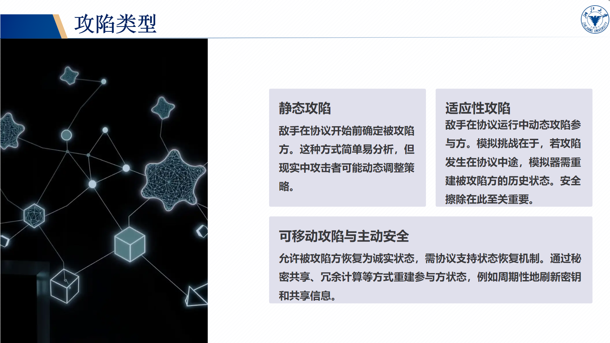

# 考试大纲
## 1 数论基础
### 模
### 群、环、域
  - 半群
    - 满足结合律的代数结构
  - 独异点
      - 含有幺元的半群
  - 群
    - 半群，有幺元，每个元素都有逆元
    - 没有零元（零元没有逆元）
  - 交换群/阿贝尔群
    - 满足交换律的群
  - 环
    - <R,+,*>有两个二元运算
    - <R,+>是阿贝尔群
    - <R,*>是半群
    - *对+可分配
  - 域
    - <F, +, *>, 有两个二元运算
    - <F, +, *>是环
    - <F - {o}, *>为阿贝尔群

??? note "gemini 详解"
    ## 半群 (Semigroup)

    **定义:** 一个集合 $S$ 和一个二元运算 $*$ (例如加法或乘法)，如果满足**结合律**，即对于任意 $a, b, c \in S$，都有 $(a * b) * c = a * (b * c)$，那么 $(S, *)$ 就构成一个半群。

    **例子:**

    * **(正整数集合 $\mathbb{Z}^+$ 在加法运算 $+$ 下)**
        * 集合：所有正整数 $\{1, 2, 3, ...\}$
        * 运算：普通加法 $+$
        * **满足结合律**: 对于任意正整数 $a, b, c$，都有 $(a + b) + c = a + (b + c)$。例如 $(2 + 3) + 4 = 5 + 4 = 9$，$2 + (3 + 4) = 2 + 7 = 9$。
        * 所以 $(\mathbb{Z}^+, +)$ 是一个半群。

    ---

    ## 独异点 (Monoid) / 含幺元的半群

    **定义:** 一个半群 $(M, *)$ 如果存在一个**幺元 (单位元)** $e \in M$，使得对于任意 $a \in M$，都有 $a * e = e * a = a$，那么 $(M, *)$ 就构成一个独异点。幺元是唯一的。

    **例子:**

    * **(自然数集合 $\mathbb{N}_0$ 在加法运算 $+$ 下)**
        * 集合：所有自然数 (包含0) $\{0, 1, 2, 3, ...\}$
        * 运算：普通加法 $+$
        * **满足结合律**: $(a + b) + c = a + (b + c)$ (已经是半群)。
        * **存在幺元**: $0$ 是幺元，因为对于任意自然数 $a$，$a + 0 = 0 + a = a$。
        * 所以 $(\mathbb{N}_0, +)$ 是一个独异点。

    * **(正整数集合 $\mathbb{Z}^+$ 在乘法运算 $\times$ 下)**
        * 集合：所有正整数 $\{1, 2, 3, ...\}$
        * 运算：普通乘法 $\times$
        * **满足结合律**: $(a \times b) \times c = a \times (b \times c)$。
        * **存在幺元**: $1$ 是幺元，因为对于任意正整数 $a$，$a \times 1 = 1 \times a = a$。
        * 所以 $(\mathbb{Z}^+, \times)$ 也是一个独异点。

    ---

    ## 群 (Group)

    **定义:** 一个独异点 $(G, *)$ 如果对于集合中的**每个元素** $a \in G$，都存在一个**逆元** $a^{-1} \in G$，使得 $a * a^{-1} = a^{-1} * a = e$ (其中 $e$ 是幺元)，那么 $(G, *)$ 就构成一个群。

    **例子:**

    * **(整数集合 $\mathbb{Z}$ 在加法运算 $+$ 下)**
        * 集合：所有整数 $\{..., -2, -1, 0, 1, 2, ...\}$
        * 运算：普通加法 $+$
        * **满足结合律**: $(a + b) + c = a + (b + c)$。
        * **存在幺元**: $0$ 是幺元 ($a + 0 = a$)。
        * **每个元素都有逆元**: 对于任意整数 $a$，其加法逆元是 $-a$，因为 $a + (-a) = (-a) + a = 0$。例如，$5$ 的逆元是 $-5$；$-3$ 的逆元是 $3$。
        * 所以 $(\mathbb{Z}, +)$ 是一个群。

    * **(非零有理数集合 $\mathbb{Q}^*$ 在乘法运算 $\times$ 下)**
        * 集合：所有非零有理数 (可以表示为 $p/q$ 的数，其中 $p, q$ 是整数，$q \neq 0$，且 $p/q \neq 0$)
        * 运算：普通乘法 $\times$
        * **满足结合律**: $(a \times b) \times c = a \times (b \times c)$。
        * **存在幺元**: $1$ 是幺元 ($a \times 1 = a$)。
        * **每个元素都有逆元**: 对于任意非零有理数 $a = p/q$，其乘法逆元是 $1/a = q/p$ (因为 $p \neq 0, q \neq 0$)，使得 $a \times (1/a) = (1/a) \times a = 1$。例如，$2/3$ 的逆元是 $3/2$。
        * 所以 $(\mathbb{Q}^*, \times)$ 是一个群。

        *注意图片中提到“没有零元（零元没有逆元）”，这通常是在讨论乘法群时的情况。在加法群中，零元是幺元，其逆元是自身。*

    ---

    ## 交换群 / 阿贝尔群 (Abelian Group)

    **定义:** 一个群 $(G, *)$ 如果还满足**交换律**，即对于任意 $a, b \in G$，都有 $a * b = b * a$，那么 $(G, *)$ 就构成一个交换群或阿贝尔群。

    **例子:**

    * **(整数集合 $\mathbb{Z}$ 在加法运算 $+$ 下)**
        * 它是一个群 (如上所述)。
        * **满足交换律**: 对于任意整数 $a, b$，都有 $a + b = b + a$。例如 $2 + 3 = 3 + 2 = 5$。
        * 所以 $(\mathbb{Z}, +)$ 是一个阿贝尔群。

    * **(非零有理数集合 $\mathbb{Q}^*$ 在乘法运算 $\times$ 下)**
        * 它是一个群 (如上所述)。
        * **满足交换律**: 对于任意非零有理数 $a, b$，都有 $a \times b = b \times a$。例如 $(2/3) \times (1/5) = (1/5) \times (2/3) = 2/15$。
        * 所以 $(\mathbb{Q}^*, \times)$ 也是一个阿贝尔群。

    **非交换群的例子 (了解即可):**

    * $n \times n$ 的可逆矩阵在矩阵乘法下构成一个群，但当 $n \ge 2$ 时，矩阵乘法通常不满足交换律，所以它是一个非交换群。

    ---

    ## 环 (Ring)

    **定义:** 一个集合 $R$ 和两个二元运算（通常记为加法 $+$ 和乘法 $*$)，$(R, +, *)$ 构成一个环，如果满足：
    1.  $(R, +)$ 是一个**阿贝尔群** (满足加法结合律、有加法幺元0、有加法逆元、满足加法交换律)。
    2.  $(R, *)$ 是一个**半群** (满足乘法结合律)。
    3.  乘法对加法满足**分配律**:
        * 左分配律: $a * (b + c) = (a * b) + (a * c)$
        * 右分配律: $(b + c) * a = (b * a) + (c * a)$
        对于所有 $a, b, c \in R$。

    **例子:**

    * **(整数集合 $\mathbb{Z}$ 在普通加法 $+$ 和普通乘法 $\times$ 下)**
        * 集合：所有整数 $\{..., -2, -1, 0, 1, 2, ...\}$
        * 运算：普通加法 $+$ 和普通乘法 $\times$
        * **$(\mathbb{Z}, +)$ 是阿贝尔群**: (已验证)。
        * **$(\mathbb{Z}, \times)$ 是半群**: 整数乘法满足结合律 $(a \times b) \times c = a \times (b \times c)$。 (实际上 $(\mathbb{Z}, \times)$ 还是一个独异点，因为有乘法幺元1，但环的定义只要求乘法是半群)。
        * **乘法对加法满足分配律**: 对于任意整数 $a, b, c$，$a \times (b + c) = (a \times b) + (a \times c)$ 且 $(b + c) \times a = (b \times a) + (c \times a)$。例如 $2 \times (3 + 5) = 2 \times 8 = 16$，$ (2 \times 3) + (2 \times 5) = 6 + 10 = 16$。
        * 所以 $(\mathbb{Z}, +, \times)$ 是一个环。

    * 其他常见的环的例子包括：有理数环 $(\mathbb{Q}, +, \times)$，实数环 $(\mathbb{R}, +, \times)$，复数环 $(\mathbb{C}, +, \times)$，以及模 $n$ 整数环 $(\mathbb{Z}_n, +, \times)$。

    ---

    ## 域 (Field)

    **定义:** 一个环 $(F, +, *)$ 如果满足以下额外条件，则构成一个域：
    1.  $(F, +, *)$ 是一个**交换环**，即乘法运算 $*$ 满足交换律 ($a * b = b * a$)。
    2.  环中存在**乘法幺元 $1_F \neq 0_F$** (其中 $0_F$ 是加法幺元)。
    3.  **除加法幺元 $0_F$ 外的所有元素都构成一个关于乘法 $*$ 的阿贝尔群**。也就是说，对于集合 $F - \{0_F\}$ (记为 $F^*$):
        * $(F^*, *)$ 是一个阿贝尔群。这意味着：
            * 乘法是封闭的 (两个非零元素相乘还是非零元素)。
            * 乘法是结合的 (已由环的定义保证)。
            * 存在乘法幺元 $1_F \in F^*$ (已由条件2保证)。
            * 每个 $a \in F^*$ 都有乘法逆元 $a^{-1} \in F^*$ 使得 $a * a^{-1} = 1_F$。
            * 乘法是交换的 (已由条件1保证)。

    **图片中的定义更简洁一些:**
    * $<F, +, *>$ 有两个二元运算
    * $<F, +, *>$ 是环
    * $<F - \{0\}, *>$ 为阿贝尔群 (这里 $\{0\}$ 指的是加法幺元)

    **例子:**

    * **(有理数集合 $\mathbb{Q}$ 在普通加法 $+$ 和普通乘法 $\times$ 下)**
        * 集合：所有有理数
        * 运算：普通加法 $+$ 和普通乘法 $\times$
        * **$(\mathbb{Q}, +, \times)$ 是一个环**: (可以验证，类似于整数环，但要注意有理数的加法逆元和乘法逆元的存在性)。
        * **乘法是交换的**: $a \times b = b \times a$ 对于所有有理数成立。
        * **存在乘法幺元 $1 \neq 0$**: $1$ 是乘法幺元， $0$ 是加法幺元。
        * **$(\mathbb{Q} - \{0\}, \times)$ 是一个阿贝尔群**: (已在群的例子中验证过 $\mathbb{Q}^* = \mathbb{Q} - \{0\}$ 在乘法下是阿贝尔群)。
        * 所以 $(\mathbb{Q}, +, \times)$ 是一个域。

    * **(实数集合 $\mathbb{R}$ 在普通加法 $+$ 和普通乘法 $\times$ 下)**
        * $(\mathbb{R}, +, \times)$ 是一个环。
        * 乘法是交换的。
        * 乘法幺元是 $1 \neq 0$。
        * $(\mathbb{R} - \{0\}, \times)$ 是一个阿贝尔群 (所有非零实数在乘法下构成阿贝尔群)。
        * 所以 $(\mathbb{R}, +, \times)$ 是一个域。

    * **(复数集合 $\mathbb{C}$ 在普通加法 $+$ 和普通乘法 $\times$ 下)**
        * 类似地，$(\mathbb{C}, +, \times)$ 也是一个域。

    **为什么整数环 $(\mathbb{Z}, +, \times)$ 不是域?**
    整数环满足交换性和有乘法幺元 $1 \neq 0$。但是，在 $\mathbb{Z} - \{0\}$ 中，并不是每个元素都有乘法逆元 *在整数集合中*。例如，$2 \in \mathbb{Z} - \{0\}$，但它的乘法逆元是 $1/2$，而 $1/2 \notin \mathbb{Z}$。只有 $1$ 和 $-1$ 在整数中有乘法逆元。因此，$(\mathbb{Z} - \{0\}, \times)$ 不是一个群。

## 2 规约的基本概念
- 把复杂问题分解为一系列更简单、已知如何解决的子问题。
- “背书”
??? note "gemini 详解"
    1.  **计算理论 (Computational Theory) / 复杂度理论 (Complexity Theory):**
        * 这是 "规约" 最经典和重要的应用之一。在这里，**问题 A 可以规约到问题 B (A reduces to B)**，意味着如果我们有一个能够解决问题 B 的算法（或“黑箱”），我们就可以利用它来解决问题 A。
        * **目的**：
            * **证明问题的难度**：如果我们知道问题 B 是难的（例如 NP-hard），并且我们可以将问题 B 规约到问题 A，那么问题 A 也至少和问题 B 一样难。
            * **设计算法**：如果我们有一个解决问题 B 的好算法，并且问题 A 可以规约到问题 B，我们就可以通过先将 A 转换为 B，然后用 B 的算法来解决 A。
        * **例子**：著名的例子是**多项式时间规约 (Polynomial-time reduction)**。例如，为了证明某个问题 X 是 NP-hard 的，我们通常会从一个已知的 NP-complete 问题 (如 SAT) 出发，展示 SAT 可以在多项式时间内规约到问题 X。这意味着如果你能高效解决 X，你就能高效解决 SAT。
        * **关键点**：规约本身消耗的资源（如时间、空间）必须比直接解决原始问题要少，或者在可接受的范围内（例如，多项式时间内）。

    2.  **Lambda 演算 (Lambda Calculus) / 函数式编程 / 重写系统 (Rewriting Systems):**
        * 在这种上下文中，"规约" 指的是**通过应用一系列定义好的规则来简化或计算一个表达式的过程**。
        * **例子**：
            * **Beta 规约 (β-reduction)**：在 Lambda 演算中，这是最核心的规约规则，用于函数应用。例如，表达式 `(λx. x + 1) 3` 可以通过 Beta 规约得到 `3 + 1`，进而得到 `4`。
            * 其他还有 Alpha 转换 (α-conversion)、Eta 转换 (η-conversion) 等。
        * **目标**：通常是达到一个**范式 (Normal Form)**，即不能再被规约的表达式，这通常代表了计算的结果。

    3.  **形式语言与自动机 (Formal Languages and Automata Theory):**
        * 在分析文法时，可能会有规约步骤，例如在 LR 解析中，"reduce" 操作是指当分析栈顶形成一个产生式的右部时，将其替换为该产生式的左部非终结符。

    4.  **一般问题解决 (General Problem Solving):**
        * 更广泛地说，规约可以指将一个复杂问题分解或转化为一系列更简单、已知如何解决的子问题的策略。

    5.  **数据处理/机器学习 (Data Processing / Machine Learning):**
        * **降维 (Dimensionality Reduction)** 有时也可能被泛泛地称为一种规约，即将高维数据转换为低维数据，同时保留重要信息。例如主成分分析 (PCA)。

    **总结一下，"规约" 的核心思想是 "转化" 和 "简化"：**

    * 将**未知**问题转化为**已知**问题。
    * 将**复杂**问题转化为**简单**问题。
    * 将**一般**形式转化为**标准**形式或**范式**。
## 3 EI-Gamal 加密及其安全证明
- 生成密钥算法Gen：$sk\leftarrow _\$Z_q$, $pk=g^{sk}$
- 加密算法：Enc，$c=(c_1,c_2)=(g^r,m\cdot pk^r)$
- 解密：Dec，$m=c_2/c_1^{sk}$
- 如果 DDH 问题在群 G 中是困难的，那么 ElGamal 加密方案是 IND-CPA 安全的。

??? note "DDH"
    - 群的生成元 g
    - g^a (a 是一个随机选择的秘密指数)
    - g^b (b 是另一个随机选择的秘密指数)
    - 一个“目标”元素 h
    DDH 问题的核心是：判断这个目标元素 h 究竟是 g^(ab)（即 a 和 b 的乘积作为指数），还是一个完全随机的群元素 g^c（其中 c 是一个与 a, b 无关的随机指数）？
??? note "gemini 详解"
    ### 1. ElGamal 加密方案概述  cryptography

    ElGamal 加密方案是基于循环群 G（例如，有限域上的乘法群的子群或椭圆曲线群）的离散对数问题的困难性，特别是其安全性依赖于 **Decisional Diffie-Hellman (DDH) 假设**。

    方案包含三个核心算法：

    * **密钥生成 (Gen)**:
        1.  选择一个 q 阶循环群 G 和一个生成元 g。
        2.  随机选择一个私钥 sk = s ∈ Z_q (其中 Z_q = {0, 1, ..., q-1} 是整数模 q 的集合)。
        3.  计算公钥 pk = g^s。
            * **公钥**: pk
            * **私钥**: sk

    * **加密 (Enc)**:
        1.  输入：公钥 pk，消息 m ∈ G。
        2.  随机选择一个临时密钥 r ∈ Z_q。
        3.  计算密文 c = (c1, c2)，其中：
            * c1 = g^r
            * c2 = m ⋅ pk^r = m ⋅ (g^s)^r = m ⋅ g^(sr)
        4.  输出密文 c = (c1, c2)。

    * **解密 (Dec)**:
        1.  输入：私钥 sk = s，密文 c = (c1, c2)。
        2.  计算消息 m̂：
            * m̂ = c2 / (c1^sk) = c2 ⋅ (c1^s)^(-1)
            (这里的除法表示乘以群中对应元素的逆元)
        3.  输出消息 m̂。

    ---

    ### 2. ElGamal 方案的正确性 ✔️

    为了验证解密的正确性，我们将加密后的消息进行解密：
    m̂ = c2 / (c1^sk)
    = (m ⋅ pk^r) / ((g^r)^s)
    = (m ⋅ (g^s)^r) / (g^(rs))
    = (m ⋅ g^(sr)) / (g^(rs))
    = m ⋅ g^(sr) ⋅ (g^(sr))^(-1)
    = m

    因此，Dec(Enc(pk, m; r), sk) = m，方案是正确的。

    ---

    ### 3. ElGamal 方案的 IND-CPA 安全性 🛡️

    **IND-CPA (Indistinguishability under Chosen Plaintext Attack) 安全性**意味着敌手即使可以选择任意明文进行加密并观察其密文，也无法区分两个特定明文（由敌手自己选择）中哪一个被加密了，其成功的概率不会显著高于随机猜测（即 1/2）。

    **Decisional Diffie-Hellman (DDH) 假设**:
    DDH 假设指出，在群 G 中，给定 (g, g^x, g^y)，要区分 g^(xy)（一个 DDH 元组的第四部分）和一个随机的群元素 g^z（其中 z 是随机选择的）在计算上是困难的。
    更形式地说，对于随机选择的 x, y, z ∈ Z_q，以下两个分布是计算上不可区分的：
    1.  DDH 元组分布: (g, g^x, g^y, g^(xy))
    2.  随机元组分布: (g, g^x, g^y, g^z)

    **定理 2.1**: 如果 DDH 问题在群 G 中是困难的，那么 ElGamal 加密方案是 IND-CPA 安全的。

    **证明思路 (归约证明)**:
    我们将通过归约法证明该定理。其核心思想是：**假设存在一个能够攻破 ElGamal 方案 IND-CPA 安全性的敌手 A，那么我们可以利用敌手 A 构造另一个算法 B，该算法 B 能够解决（攻破）DDH 问题。** 如果 DDH 问题被认为是困难的（即不存在高效的算法 B 能解决它），那么最初的假设（存在高效的敌手 A）必定是错误的，从而证明 ElGamal 方案是 IND-CPA 安全的。

    **构造算法 B (DDH 问题的解决者)**:
    算法 B 接收一个 DDH 挑战 (G, q, g, h1, h2, h3)，其中 (h1, h2, h3) 要么是 (g^x, g^y, g^(xy))（DDH 元组），要么是 (g^x, g^y, g^z)（随机元组），x, y, z 是未知的随机指数。B 的目标是判断它收到的是哪种元组。

    3.  **初始化**: B 将其 DDH 挑战的一部分 h1 设置为 ElGamal 的公钥，即 pk = h1，并将此 pk 交给敌手 A。
    4.  **A 的挑战**: 敌手 A 知道公钥 pk 后，选择两条它希望挑战的消息 m0, m1 ∈ G，并将它们发送给 B（模拟 IND-CPA 游戏中的挑战者）。
    5.  **B 构造密文**:
        * B 随机选择一个比特 b' ∈ {0, 1}。
        * B 使用其 DDH 挑战中的 h2 和 h3 来构造给 A 的挑战密文 (c1, c2)：
            * c1 = h2
            * c2 = m_b' ⋅ h3
        * B 将密文 (c1, c2) 发送给 A。
    6.  **A 的猜测**: A 接收到 (c1, c2) 后，进行计算并输出一个比特 b，表示它猜测 (c1, c2) 是 m0 还是 m1 的密文 (即 A 认为 b 是原始挑战中选择的那个比特)。
    7.  **B 的输出**:
        * 如果 A 的猜测 b 等于 B 随机选择的 b' (b = b')，则 B 输出 1 (表示它认为它收到的 (h1, h2, h3) 是一个 DDH 元组)。
        * 如果 b ≠ b'，则 B 输出 0 (表示它认为它收到的 (h1, h2, h3) 是一个随机元组)。

    **分析算法 B 的成功概率**:

    * **情况 1: B 收到的是 DDH 元组**
        此时，(h1, h2, h3) = (g^x, g^y, g^(xy))。
        B 提供给 A 的公钥 pk = h1 = g^x。
        B 构造的密文 (c1, c2) = (h2, m_b' ⋅ h3) = (g^y, m_b' ⋅ g^(xy))。
        注意到 pk^y = (g^x)^y = g^(xy)。所以，密文 (c1, c2) = (g^y, m_b' ⋅ pk^y)。
        这正好是一个对消息 m_b' 使用公钥 pk 和随机数 y 进行的合法 ElGamal 加密。
        由于 A 能够以 Pr[PubK_A,Π^(CPA) = 1] = 1/2 + ε(λ) 的概率成功攻破 IND-CPA 安全性 (其中 ε(λ) 是 A 的优势，一个不可忽略的函数)，这意味着当 A 收到 m_b' 的合法密文时，它猜对 b' (即 b=b') 的概率是 1/2 + ε(λ)。
        因此，在这种情况下，B 输出 1 的概率是 Pr[B outputs 1 | DDH tuple] = 1/2 + ε(λ)。

    * **情况 2: B 收到的是随机元组**
        此时，(h1, h2, h3) = (g^x, g^y, g^z)，其中 z 是独立于 x, y 的随机值。
        B 提供给 A 的公钥 pk = h1 = g^x。
        B 构造的密文 (c1, c2) = (h2, m_b' ⋅ h3) = (g^y, m_b' ⋅ g^z)。
        在这个密文中，c2 = m_b' ⋅ g^z。由于 g^z 是一个随机的群元素（因为 z 是随机的且独立于 x 和 y），那么 m_b' ⋅ g^z 也是一个随机的群元素，它完全掩盖了 m_b'。因此，这个密文 (c1, c2) 对于 A 来说不包含任何关于 b' 的信息。
        所以，A 只能随机猜测，其猜对 b' (即 b=b') 的概率是 1/2。
        因此，在这种情况下，B 输出 1 的概率是 Pr[B outputs 1 | Random tuple] = 1/2。

    **B 区分 DDH 元组和随机元组的能力**:
    算法 B 区分这两种输入的优势是：
    | Pr[B outputs 1 | DDH tuple] - Pr[B outputs 1 | Random tuple] |
    = | (1/2 + ε(λ)) - 1/2 |
    = | ε(λ) | = ε(λ)

    如果敌手 A 攻破 ElGamal 的 IND-CPA 安全性的优势 ε(λ) 是不可忽略的，那么算法 B 区分 DDH 元组和随机元组的优势 ε(λ) 也是不可忽略的。
    这就意味着，如果存在这样的敌手 A，我们就构造出了一个能以不可忽略的优势解决 DDH 问题的算法 B。

    **结论**:
    如果 DDH 问题在群 G 中是困难的（即不存在能以不可忽略优势区分 DDH 元组和随机元组的高效算法），那么就不可能存在能够以不可忽略优势攻破 ElGamal 方案 IND-CPA 安全性的敌手 A。因此，ElGamal 加密方案在 DDH 假设下是 IND-CPA 安全的。证毕。

## 4 Shamir 秘密分享

我们介绍的安全多方计算协议基于 **Shamir** 秘密分享方案。**Shamir** 秘密分享是一种基于有限域 F 上的多项式的秘密分享，要求参与方数 $n > t$。我们假设 $F = Z_p$，其中 $p$ 是一个大素数且 $n < p$。

首先，参与方选定 $n$ 个各不相同且不为 0 的值 $(\alpha_1, ..., \alpha_n)$，其中 $\alpha_i$ 各不相同且均不为 0。要分享某个值 $s \in F$，算法选择阶数最多为 $t$ 的随机多项式 $q_s(x) \in F[x]$，使得 $q_s(0) = s$，然后私下向参与方 $P_j$ 发送秘密份额 $s_j = q_s(\alpha_j)$。根据拉格朗日插值法可以证明，这种方法产生的秘密份额满足两个基本性质：(1) 任何 $t+1$ 组或更多的秘密份额可以重建秘密 $s$；(2) 任何 $t$ 组或更少的秘密份额不包含关于 $s$ 的信息。下面，我们进行详细说明。
**核心思想：**

拉格朗日插值法是一种多项式插值方法。它的核心思想是，对于平面上给定的 $l+1$ 个横坐标（x值）互不相同的点，我们可以唯一地确定一个次数不超过 $l$ 的多项式，使得这个多项式恰好穿过所有这些给定的点。拉格朗日插值法提供了一种直接构造出这个多项式的方法。

**内容解析：**

1.  **基本设定：**
    * 我们有 $l+1$ 个点，它们的横坐标分别是 $\alpha_1, \alpha_2, \dots, \alpha_{l+1}$。
    * 一个重要的前提条件是：所有这些横坐标 $\alpha_i$ 都互不相同，即对于任意 $i \neq j$，都有 $\alpha_i \neq \alpha_j$。
    * 我们希望找到一个多项式 $q(x)$，它的次数最多是 $l$（即至多 $l$ 次），并且这个多项式要经过所有这些给定的点。

2.  **拉格朗日插值多项式 $q(x)$ 的构造：**
    图片中给出了 $q(x)$ 的表达式：
    $$q(x) = \sum_{i=1}^{l+1} q(\alpha_i) \delta_i(x)$$
    * $q(\alpha_i)$：这是第 $i$ 个给定点的纵坐标（y值）。在实际应用中，这些通常是已知的数据点。
    * $\delta_i(x)$：这被称为**拉格朗日基函数**或**拉格朗日基本多项式**。它是整个构造方法的核心。

3.  **拉格朗日基函数 $\delta_i(x)$：**
    * **定义：** 对于每一个 $i$ (从 1 到 $l+1$)，都有一个对应的基函数 $\delta_i(x)$。这个基函数本身也是一个 $l$ 次多项式。
    * **关键性质：**
        * 当 $x = \alpha_i$ 时（即在第 $i$ 个给定的点的横坐标处），$\delta_i(\alpha_i) = 1$。
        * 当 $x = \alpha_j$ 且 $j \neq i$ 时（即在其他任何一个给定的点的横坐标处），$\delta_i(\alpha_j) = 0$。
    * **表达式：** 图片中给出了 $\delta_i(x)$ 的具体构造方法：
        $$\delta_i(x) = \prod_{1 \le j \le l+1, j \neq i} \frac{x - \alpha_j}{\alpha_i - \alpha_j}$$
        这个公式看起来复杂，但它的含义是：
        * 对于每一个 $\delta_i(x)$，我们构造一个连乘积。
        * 连乘积的每一项都是一个分式。
        * 分式的分子是 $(x - \alpha_j)$，其中 $\alpha_j$ 是**除了** $\alpha_i$ **之外**的其他所有给定点的横坐标。
        * 分式的分母是 $(\alpha_i - \alpha_j)$，即当前基函数对应的横坐标 $\alpha_i$ 与其他横坐标 $\alpha_j$ 的差。

**为什么这个方法有效？**

我们来验证一下构造出来的 $q(x)$ 是否真的经过了所有给定的点 $(\alpha_k, q(\alpha_k))$。
将 $x = \alpha_k$ (任意一个给定的横坐标) 代入 $q(x)$ 的表达式中：
$$q(\alpha_k) = \sum_{i=1}^{l+1} q(\alpha_i) \delta_i(\alpha_k)$$
根据 $\delta_i(x)$ 的性质：
* 如果 $i = k$，那么 $\delta_i(\alpha_k) = \delta_k(\alpha_k) = 1$。
* 如果 $i \neq k$，那么 $\delta_i(\alpha_k) = 0$。

所以，在上面的求和式中，只有当 $i=k$ 的那一项不为零：
$$q(\alpha_k) = q(\alpha_1) \cdot 0 + \dots + q(\alpha_k) \cdot 1 + \dots + q(\alpha_{l+1}) \cdot 0 = q(\alpha_k)$$
这表明，构造出来的多项式 $q(x)$ 在 $x=\alpha_k$ 处的取值确实是 $q(\alpha_k)$，也就是说，这个多项式确实经过了点 $(\alpha_k, q(\alpha_k))$。由于 $k$ 可以是 $1, 2, \dots, l+1$ 中的任意一个，所以这个多项式经过了所有给定的 $l+1$ 个点。（这里1~l+1指的是相对索引，即参与构建的点）

#### 拉格朗日插值法计算例子

**例子设定：**

1.  **参与者与阈值：**
    * 有 5 个参与者 $P_1, \dots, P_5$。
    * 允许的被攻击参与者数量（或多项式次数相关的参数）$t=2$。这意味着至少需要 $t+1 = 3$ 个参与者才能恢复秘密。多项式的次数将是 $t=2$。

2.  **运算域（Field）：**
    * 所有计算都在模 $11$ 的整数域 $Z_{11}$ 中进行。这意味着所有的数字（秘密、系数、份额）都是 $0$ 到 $10$ 之间的整数，运算结果超过 $10$ 或小于 $0$ 时，都要通过加减 $11$ 的倍数使其回到这个范围内。

3.  **秘密和公开点：**
    * 要分享的秘密是 $s=6$。
    * 为每个参与者 $P_i$ 分配的公开横坐标（x值）是 $\alpha_i$。这里 $\vec{\alpha} = (\alpha_1, \alpha_2, \alpha_3, \alpha_4, \alpha_5) = (1, 2, 3, 4, 5)$。

4.  **秘密多项式的构造：**
    * 分发者（Dealer）需要构造一个 $t=2$ 次的多项式 $h(x)$，使得 $h(0) = s$。
    * 多项式形式为 $h(x) = s + b_1 x + b_2 x^2$。
    * 分发者随机选择系数 $b_1, b_2$ 从 $Z_{11}$ 中选取。例子中，选择了 $b_1 = 7$ 和 $b_2 = 1$。
    * 因此，秘密多项式是：
        $h(x) = 6 + 7x + 1x^2 \pmod{11}$ (即 $h(x) = x^2 + 7x + 6 \pmod{11}$)

**份额的计算与分发：**

每个参与者 $P_i$ 得到一个份额 $( \alpha_i, s_i = h(\alpha_i) \pmod{11} )$。
* $s_1 = h(1) = 1^2 + 7(1) + 6 = 1 + 7 + 6 = 14 \equiv 3 \pmod{11}$
* $s_2 = h(2) = 2^2 + 7(2) + 6 = 4 + 14 + 6 = 24 \equiv 2 \pmod{11}$
* $s_3 = h(3) = 3^2 + 7(3) + 6 = 9 + 21 + 6 = 36 \equiv 3 \pmod{11}$
* $s_4 = h(4) = 4^2 + 7(4) + 6 = 16 + 28 + 6 = 50 \equiv 6 \pmod{11}$
* $s_5 = h(5) = 5^2 + 7(5) + 6 = 25 + 35 + 6 = 66 \equiv 0 \pmod{11}$

所以，五个份额的纵坐标（y值）分别是 $3, 2, 3, 6, 0$。

**秘密的重建：**

假设参与者 $P_3, P_4, P_5$ 合作来重建秘密。他们拥有的份额是：
* $P_3: (\alpha_3, s_3) = (3, 3)$
* $P_4: (\alpha_4, s_4) = (4, 6)$
* $P_5: (\alpha_5, s_5) = (5, 0)$

他们需要使用拉格朗日插值法来重建多项式 $h(x)$，然后计算 $h(0)$ 以得到秘密 $s$。
重建的多项式是 $h(x) = s_3 \delta_3(x) + s_4 \delta_4(x) + s_5 \delta_5(x)$，其中 $\delta_i(x)$ 是拉格朗日基函数。

1.  **计算拉格朗日基函数 $\delta_i(x)$ (模 $11$)**
    * **对于 $\delta_3(x)$:** (使用点 $\alpha_3=3, \alpha_4=4, \alpha_5=5$)
        $$\delta_3(x) = \frac{(x-\alpha_4)(x-\alpha_5)}{(\alpha_3-\alpha_4)(\alpha_3-\alpha_5)} = \frac{(x-4)(x-5)}{(3-4)(3-5)} \pmod{11}$$
        分母：$(3-4)(3-5) = (-1)(-2) = 2 \pmod{11}$。
        我们需要计算 $2^{-1} \pmod{11}$（即2的模11乘法逆元）。因为 $2 \times 6 = 12 \equiv 1 \pmod{11}$，所以 $2^{-1} \equiv 6 \pmod{11}$。
        分子：$(x-4)(x-5) = x^2 - 9x + 20 \equiv x^2 + 2x + 9 \pmod{11}$ (因为 $-9 \equiv 2 \pmod{11}$ and $20 \equiv 9 \pmod{11}$)。
        所以，$\delta_3(x) = (x^2 + 2x + 9) \times 6 = 6x^2 + 12x + 54 \equiv 6x^2 + x + 10 \pmod{11}$。

    * **对于 $\delta_4(x)$:** (使用点 $\alpha_3=3, \alpha_4=4, \alpha_5=5$)
        $$\delta_4(x) = \frac{(x-\alpha_3)(x-\alpha_5)}{(\alpha_4-\alpha_3)(\alpha_4-\alpha_5)} = \frac{(x-3)(x-5)}{(4-3)(4-5)} = \frac{x^2 - 8x + 15}{(1)(-1)} = -(x^2 - 8x + 15) \pmod{11}$$
        $\delta_4(x) = -x^2 + 8x - 15 \equiv 10x^2 + 8x + 7 \pmod{11}$ (因为 $-1 \equiv 10 \pmod{11}$ and $-15 \equiv -4 \equiv 7 \pmod{11}$)。

    * **对于 $\delta_5(x)$:** (使用点 $\alpha_3=3, \alpha_4=4, \alpha_5=5$)
        $$\delta_5(x) = \frac{(x-\alpha_3)(x-\alpha_4)}{(\alpha_5-\alpha_3)(\alpha_5-\alpha_4)} = \frac{(x-3)(x-4)}{(5-3)(5-4)} = \frac{x^2 - 7x + 12}{(2)(1)} = \frac{x^2 - 7x + 12}{2} \pmod{11}$$
        分子：$x^2 - 7x + 12 \equiv x^2 + 4x + 1 \pmod{11}$。
        我们知道 $2^{-1} \equiv 6 \pmod{11}$。
        所以，$\delta_5(x) = (x^2 + 4x + 1) \times 6 = 6x^2 + 24x + 6 \equiv 6x^2 + 2x + 6 \pmod{11}$。

2.  **重建多项式 $h(x)$：**
    $h(x) = s_3 \delta_3(x) + s_4 \delta_4(x) + s_5 \delta_5(x)$
    代入 $s_3=3, s_4=6, s_5=0$ 以及上面计算出的 $\delta_i(x)$：
    $h(x) = 3(6x^2 + x + 10) + 6(10x^2 + 8x + 7) + 0(6x^2 + 2x + 6) \pmod{11}$
    $h(x) = (18x^2 + 3x + 30) + (60x^2 + 48x + 42) \pmod{11}$
    在模 $11$ 下化简各项系数：
    $18 \equiv 7$, $3 \equiv 3$, $30 \equiv 8$
    $60 \equiv 5$, $48 \equiv 4$, $42 \equiv 9$
    $h(x) = (7x^2 + 3x + 8) + (5x^2 + 4x + 9) \pmod{11}$
    $h(x) = (7+5)x^2 + (3+4)x + (8+9) \pmod{11}$
    $h(x) = 12x^2 + 7x + 17 \pmod{11}$
    $h(x) = x^2 + 7x + 6 \pmod{11}$ (因为 $12 \equiv 1 \pmod{11}$ and $17 \equiv 6 \pmod{11}$)

3.  **得到秘密：**
    重建得到的多项式是 $h(x) = x^2 + 7x + 6 \pmod{11}$。
    秘密 $s$ 是 $h(0)$，即多项式的常数项。
    $s = h(0) = 6$。

这与原始秘密 $s=6$ 一致，表明秘密被成功重建。

**文档中的另一种表达方式（收集系数）：**

文档中还展示了先将 $h(x) = s_3\delta_3(x) + s_4\delta_4(x) + s_5\delta_5(x)$ 按 $x$ 的幂次整理，然后再代入 $s_3, s_4, s_5$ 的值：
$h(x) = (6s_3 + 10s_4 + 6s_5)x^2 + (s_3 + 8s_4 + 2s_5)x + (10s_3 + 7s_4 + 6s_5)$
代入 $s_3=3, s_4=6, s_5=0$:
* $x^2$ 的系数: $6(3) + 10(6) + 6(0) = 18 + 60 = 78 \equiv 1 \pmod{11}$
* $x$ 的系数: $1(3) + 8(6) + 2(0) = 3 + 48 = 51 \equiv 7 \pmod{11}$
* 常数项 ($s=h(0)$): $10(3) + 7(6) + 6(0) = 30 + 42 = 72 \equiv 6 \pmod{11}$

所以，$h(x) = 1x^2 + 7x + 6 \pmod{11}$，秘密 $s=6$。两种计算方式结果一致。

这个例子清晰地展示了即使只知道部分份额（满足阈值条件），也可以通过拉格朗日插值法完整地恢复出秘密多项式，并进而得到原始秘密。
## 5 1-out-of-2 OT 协议
- 不存在信息论安全的两方 OT 协议。
- OT 是完备的，即基于 OT 可以安全地计算任何函数
- OT 是对称的，即基于 OT 可以构造 OT′，其中 OT′ 的发送方是 OT 的接收方，OT′ 的接收方是 OT 的发送方
- 不能以黑盒的方式基于公钥加密构造 OT
- OT 可以基于增强陷门置换、DDH 假设、RSA 假设格密码构造。
- Rabin OT[10]
- 在 Rabin 的 OT 变种中，发送方 Ps 只有一个隐私输入 x, 接收方有 1/2 概率接收到 x，有 1/2 概率接收到 ⊥. 发送方不知道接收方的输出。随机 OT(random OT)。在随机 OT 中，发送方和接收方都没有任何输入。协议会给发送方输出(x0, x1) 并给接收方输出 (b, xb)，其中 x0, x1 是随机均匀选取的消息，b 是随机均匀选取的比特。OT 变种的等价性。值得注意的是，OT（第2.3.7节所定义的常见形式）、Rabin OT 和随机 OT 都是等价的。
## 6 1-out-of-N OT 协议
1-out-of-N-OT. 在这种 OT 中，Ps 有 N 个隐私输入 x0, . . . , xN−1，Pr 有一个隐私索引 b ∈ {0, . . . , N − 1}. Pr 的输出是 xb. 发送方 Ps 不知道 b，接收方 Pr 不知道 xb 以外的其他隐私输入。
## 7 IKNP OT 扩展协议
!!! danger "我不会救命"
    ### **IKNP 不经意传输扩展协议 (OT Extension) 笔记**

    #### **核心目标**
    以极高的效率执行海量（`m`次）的“二选一不经意传输”（1-out-of-2 OT）。它通过执行少量（`k`次）的、计算开销大的“基础OT”，来“扩展”生成`m`次计算开销极低的OT。

    #### **关键思想**
    用 `k` 次昂贵的**非对称密码操作**（在基础OT中）换取 `m` 次廉价的**对称密码操作**（哈希和异或），在 `m >> k` 的场景下实现巨大的性能提升。

    ---

    ### **一、参与方与初始输入**

    * **发送方 (`P_s`)**:
        * **输入**: `m` 组消息，每组为 `(x_{j,0}, x_{j,1})`，其中 `1 ≤ j ≤ m`。
    * **接收方 (`P_r`)**:
        * **输入**: 1个 `m` 比特的选择向量 `r = (r_1, r_2, ..., r_m)`，其中 `r_j ∈ {0, 1}`。
    * **公共参数**:
        * **安全参数 `k`**: 一个小整数（如128），决定了基础OT的数量和安全性。

    ---

    ### **二、协议流程分解**

    #### **Step 1: 初始化**
    * `P_s` (发送方): 内部生成一个 `k` 比特的随机向量 `s` 作为主密钥。
    * `P_r` (接收方): 内部生成一个 `m × k` 的随机二进制矩阵 `T`。

    #### **Step 2: 基础OT阶段 (核心交互)**
    此阶段通过 `k` 次标准的1-out-of-2 OT协议，建立起 `s` 和 `T` 之间的密码学关联。
    * **角色互换**: 在这 `k` 次基础OT中，`P_s` 扮演**接收方**，`P_r` 扮演**发送方**。
    * **执行过程**:
        1.  对于第 `i` 次OT（`1 ≤ i ≤ k`）：
            * `P_s` 使用其主密钥的第 `i` 位 `s_i` 作为**选择比特**。
            * `P_r` 使用其矩阵 `T` 的第 `i` **列** `T_i` 和 `T_i ⊕ r` 作为两条输入消息。
        2.  `P_s` 根据 `s_i` 的值，会收到 `T_i` 或 `T_i ⊕ r`。
    * **阶段成果**: `P_s` 将收到的 `k` 个列向量组合成一个新矩阵 `Q` (`m × k`)。

    #### **Step 3: 关联建立 (无交互)**
    执行完上一步后，`P_s` 持有的 `Q` 和 `P_r` 持有的 `T` 之间形成了如下关系（对于任意第 `j` 行）：

    `q_j = t_j ⊕ (r_j ⋅ s)`

    * `q_j` 和 `t_j` 分别是 `Q` 和 `T` 的第 `j` 行。
    * `r_j ⋅ s` 意为：若 `r_j=0`，结果是全0向量；若 `r_j=1`，结果是向量 `s`。
    * **隐私性**: 任何一方都无法仅凭自己手中的信息推断出对方的秘密输入 (`s` 或 `r`)。

    #### **Step 4: 扩展与加密 (高速执行)**
    此阶段无交互，`P_s` 为 `m` 组消息生成加密密钥并发送。
    * 对于每一行 `j` (`1 ≤ j ≤ m`)：
        1.  `P_s` 计算两个加密密钥：
            * `key_{j,0} = H(q_j)`  (*H为哈希函数*)
            * `key_{j,1} = H(q_j ⊕ s)`
        2.  `P_s` 加密消息：
            * `c_{j,0} = x_{j,0} ⊕ key_{j,0}`
            * `c_{j,1} = x_{j,1} ⊕ key_{j,1}`
        3.  `P_s` 将 `(c_{j,0}, c_{j,1})` 发送给 `P_r`。

    #### **Step 5: 解密**
    `P_r` 使用自己的信息 `T` 和 `r` 来解密所选的消息。
    * 对于收到的第 `j` 组加密消息：
        1.  `P_r` 计算唯一的解密密钥：
            * `key'_j = H(t_j)`
        2.  `P_r` 使用此密钥解密其选择的消息 `c_{j, r_j}`。

    * **正确性**:
        * 若 `r_j = 0`，则 `t_j = q_j`，因此 `key'_j` 等于 `key_{j,0}`，能成功解密 `c_{j,0}`。
        * 若 `r_j = 1`，则 `t_j = q_j ⊕ s`，因此 `key'_j` 等于 `key_{j,1}`，能成功解密 `c_{j,1}`。

    ---

    ### **三、核心优势总结**

    1.  **高效率**:
        * 计算开销：将 `m` 次昂贵的非对称操作，转化为 `k` 次非对称操作和 `m` 次廉价的对称操作（哈希/异或）。
        * 通信开销：主要集中在 `k` 次基础OT中，后续扩展阶段通信量小。
    2.  **安全性**:
        * 协议的安全性可规约到基础OT协议的安全性以及哈希函数的随机预言机模型。
    3.  **可扩展性**:
        * 非常适用于需要海量OT的场景，如安全多方计算（SMC）、隐私保护机器学习（PPML）等。
## 8 UC 安全框架

## 9 零知识证明及 Sigma 协议
??? note "Sigma 协议"
    一个典型的 **Σ-协议 (Sigma Protocol)**，它是一个三步的交互式证明系统。整个协议的目标是让**证明者 (Prover, P)** 向**验证者 (Verifier, V)** 证明一件事，同时不泄露证明所依赖的秘密。

    ### 协议目标

    * **公开信息 (陈述)**: 所有人都能看到一组值 `(g, ck, pk, c, c1, c2)`，它们都属于某个数学群 `G`。
    * **秘密信息 (见证)**: 只有证明者P知道三个秘密数字 `m, s, t`。
    * **待证明的关系 `R`**: 这些公开信息和秘密信息之间满足以下三个等式关系：
        1.  `c = g^m * ck^s`
        2.  `c1 = g^t`
        3.  `c2 = g^m * pk^t`

    **P 的目标**: 向 V 证明他确实知道满足上述条件的 `(m, s, t)`，但**绝不透露 `m, s, t` 的具体数值**。

    ---

    ### 协议流程详解（三步对话）

    整个协议就像一场精心设计的问答，分为“承诺-挑战-回应”三步。

    #### 第1步: 承诺 (Commitment) - 证明者 P

    证明者P不能直接把 `m,s,t` 发给验证者V，因为这会泄露秘密。所以，他必须用一种巧妙的方式“承诺”他知道这些秘密。

    1.  **选择随机“噪声”**: P 首先生成三个全新的、一次性的随机数 `m', s', t'`。这些随机数的作用就像“障眼法”或“一次性密码本”，用来掩盖真实的秘密。

    2.  **计算承诺值**: P 使用这些随机数，模仿那三个公开的等式关系，计算出三个“承诺值” `a1, a2, a3`。
        * `a1 = g^(m') * ck^(s')`  (模仿 `c = g^m * ck^s`)
        * `a2 = g^(t')`             (模仿 `c1 = g^t`)
        * `a3 = g^(m') * pk^(t')`  (模仿 `c2 = g^m * pk^t`)

    3.  **发送承诺**: P 将计算出的 `(a1, a2, a3)` 发送给 V。
        * **此时的意义**: P 相当于对 V 说：“我已经将我的知识和一些随机性混合，并锁在了这三个值 `a1, a2, a3` 中。我已经做出了我的承诺，不能再更改了。”

    #### 第2步: 挑战 (Challenge) - 验证者 V

    为了防止 P 作弊（比如 P 可能随便发送一些垃圾 `a1,a2,a3`），V 必须给出一个无法预测的**随机挑战**。

    1.  **生成随机数**: V 随机选择一个数 `e`。
    2.  **发送挑战**: V 将 `e` 发送给 P。
        * **此时的意义**: V 对 P 说：“现在，请根据我给出的这个随机挑战 `e`，来打开你刚才的承诺，证明它不是伪造的。”

    #### 第3步: 回应 (Response) - 证明者 P

    P 收到挑战 `e` 后，必须给出一个能同时关联起他的**秘密 `(m,s,t)`**、他的**随机数 `(m',s',t')`** 以及V的**挑战 `e`** 的回应。

    1.  **计算回应值**: P 进行如下计算：
        * `z1 = m' + e * m`  (将随机数 `m'` 和秘密 `m` 用挑战 `e` "捆绑" 在一起)
        * `z2 = s' + e * s`  (同上，捆绑 `s'` 和 `s`)
        * `z3 = t' + e * t`  (同上，捆绑 `t'` 和 `t`)

    2.  **发送回应**: P 将计算出的 `(z1, z2, z3)` 发送给 V。

    ---

    ### 最后一步: 验证 (Verification) - 验证者 V

    V 现在收齐了所有信息：承诺 `(a1,a2,a3)`、挑战 `e` 和回应 `(z1,z2,z3)`。他不需要知道任何秘密，只需用这些公开信息做数学检验即可。

    V 会验证以下三个等式是否**同时成立**：

    1.  **`g^z1 * ck^z2` 是否等于 `a1 * c^e` ?**
        * 这个等式巧妙地检验了第一个关系。`g^z1 * ck^z2` 包含了回应信息，而 `a1 * c^e` 包含了P的承诺和公开的陈述。如果P是诚实的，这个等式必然成立。

    2.  **`g^z3` 是否等于 `a2 * c1^e` ?**
        * 这个等式同理检验了第二个关系。

    3.  **`g^z1 * pk^z3` 是否等于 `a3 * c2^e` ?**
        * 这个等式检验了第三个关系。

    如果**所有三个等式都成立**，V 就输出 1 (接受)，他相信 P 确实知道秘密 `(m,s,t)`。
    如果**有任何一个等式不成立**，V 就输出 0 (拒绝)，认为 P 在撒谎或不知道秘密。

## 10 BGW 协议（半诚实安全）
- 使用了可验证秘密分享 (verifiable secret sharing)，对于 t < n/3 的（恶意的）被攻陷方，实现了完美的安全性

## 11 GMW 协议（半诚实安全）

（要考的不是这个）
- 将任意半诚实安全的协议转化为恶意安全的协议。
- GMW 编译器使用零知识证明技术，可以将任意的半诚实安全的协议转化为恶意安全的协议。零知识证明是密码学中的一个重要工具，它可以让证明者(prover) 向验证者 (verifier) 证明某个陈述 (statement) 为真，但不泄露陈述的正确性以外的任何信息。
??? note "GMW 编译器"
    ### GMW 编译器的“三步改造法”

    GMW 编译器通过增加以下三个步骤，来强制所有参与者“诚实地”执行原有的半诚实协议 `Π`。

    #### 1. 承诺 (Commitment)

    * **要做什么？** 在协议开始时，每个参与方 `Pᵢ` 必须先将自己的秘密输入 `xᵢ` “锁”在一个数字保险箱里，这个过程叫**承诺**。他将输入 `xᵢ` 和一个随机数 `pᵢ` 通过承诺函数 `Com` 生成一个承诺值 `cᵢ`，然后将 `cᵢ` 公开。
    * **为什么这么做？** 这是为了**防止参与者事后撒谎或更改输入**。承诺一旦公开，`xᵢ` 就被锁定了。由于承诺方案的“绑定性”，`Pᵢ` 无法在不被发现的情况下，找到另一个输入 `xᵢ'` 来对应同一个承诺 `cᵢ`。这确保了输入的唯一性和一致性。

    #### 2. 抛硬币 (Coin-Tossing)

    * **要做什么？** 在半诚实协议 `Π` 中，参与者可能需要使用随机数。为了防止恶意参与者不使用真随机数，而是使用一个精心挑选的数来攻击协议，GMW 采用了一个“协同抛硬币”的方案。要生成一个公共的随机数 `rᵢ`，需要所有参与者 `Pⱼ` 都贡献自己的一小部分随机数 `rᵢ,ⱼ`，最终的 `rᵢ` 是所有人贡献值的异或和 (`rᵢ = ⊕rᵢ,ⱼ`)。
    * **为什么这么做？** 这是为了**保证随机数的不可预测性和无偏性**。只要所有参与者中**至少有一个是诚实的**，他贡献的真随机数就会让最终的异或和 `rᵢ` 变成一个完美的真随机数。这样，任何单个的恶意方都无法操控协议中使用的随机性。

    #### 3. 用零知识证明 (ZKP) 执行协议

    * **要做什么？** 这是最关键的一步。在执行原协议 `Π` 的每一步时，当参与者 `Pᵢ` 需要发送一条消息时，他**必须**附带一个**零知识证明 (Zero-Knowledge Proof)**。
    * 这个证明需要向所有人证实：“我即将发送的这条消息，是严格按照协议 `Π` 的规定，使用我在第一步中承诺的输入 `xᵢ` 和我们在第二步中共同生成的随机数 `rᵢ` 计算得出的。我没有做任何手脚。”
    * **为什么这么做？** 这是为了**强制所有参与者诚实地遵守协议规则**。在半诚-实模型中，我们“假设”大家会遵守规则。而在 GMW 改造后的恶意模型中，我们不再需要这个假设。零知识证明变成了一个可被数学验证的“执法工具”，任何不按规则行事的人都无法生成有效的证明，从而会被立刻发现并踢出协议。

## 12 姚氏混淆电路协议（半诚实安全）
## 13 BMR 协议（半诚实安全）
## 14 BDOZ 协议和 SPDZ 协议
??? note "BDOZ 协议"

??? note "SPDZ 协议"
    好的，这两张图片展示的是在高级安全多方计算协议 **SPDZ** 中使用的两种核心的**零知识证明（Zero-Knowledge Proof, ZKP）**子协议。

这些ZKP协议的作用是**强制恶意参与者诚实地遵守协议规则**。我们来分别详细讲解。

---
### SPDZ协议简介（第二张图的开头）

    * **从 BDOZ 到 SPDZ**: 您之前问过的 BDOZ 协议使用“带认证的份额”来抵抗恶意攻击，但它的设置（离线）阶段可能效率不高。
    * **SPDZ 协议**: 这是一个非常有影响力的现代安全多方计算（SMPC）协议系列，以其四位作者 (Damgård, Pastro, Smart, Zakarias) 的姓氏首字母命名。SPDZ 的一大特点是区分了两个阶段：
        1.  **离线阶段 (Offline Phase)**: 预计算阶段，不依赖于具体输入，用于生成大量的Beaver三元组等计算原料。这个阶段可以比较慢。
        2.  **在线阶段 (Online Phase)**: 依赖于输入的真实计算阶段，速度极快。
    * **ZKP的作用**: 为了确保在“离线阶段”生成的三元组等原料是正确无误的（即没有被恶意参与方污染），SPDZ协议需要参与方对自己行为的每一步都提供零知识证明。图片中展示的 `Π_PoCM` 和 `Π_PoPK` 就是这类证明。

    ---
    ### 第一个协议: `Π_PoCM` (零知识证明：正确的密文乘法)

    这个协议的全称可以理解为 **Proof of Correct Multiplication**。

    * **目标**: 证明者P要向验证者V证明，三个加密值 `Aₖ`, `Bₖ`, `Cₖ` 之间满足一个特定的乘法关系 `Cₖ ≈ Aₖ * Bₖ`，但在这个过程中**完全不泄露 `Aₖ` 里面加密的明文 `aₖ`**。
        * 这里的 `Aₖ = Enc(aₖ)` 是对秘密值 `aₖ` 的加密。
        * `Bₖ` 在这个证明里被当作一个公开的常数。
        * `Cₖ = aₖ·Bₖ + Enc(rₖ)` 是 `aₖ` 乘以 `Bₖ` 再加上一个加密的随机数 `rₖ` 的结果。

    #### 工作流程（直观理解）

    这是一个典型的 **Σ-协议 (Sigma Protocol)**，遵循“承诺-挑战-回应”三步曲：

    1.  **第2步 - 承诺 (Commit)**: 证明者P首先不使用真实的 `aₖ`，而是用一堆随机数 `dₖ, sₖ, fₖ, yₖ` 构造出两个与原始计算结构类似的“伪加密值” `Dₖ` 和 `Fₖ`。这相当于他把自己的牌盖住，做出了一个承诺。
    2.  **第3步 - 挑战 (Challenge)**: 验证者V发送一个随机的挑战向量 `e`。这个挑战是不可预测的，用来防止P作弊。
    3.  **第4步 - 回应 (Response)**: P收到挑战 `e` 后，必须用一种特殊的方式“打开”自己的承诺。他将自己承诺时用的随机数（如`dₖ`）和真实的秘密值（如`aₖ`）通过挑战 `e` 线性地组合起来，得到回应 `zₖ, vₖ, xₖ, wₖ`。
    4.  **第5步 - 验证 (Verify)**: V进行最终的数学检验。他会用收到的回应值，结合P最初的承诺和挑战，去验证两个复杂的等式。
        * 这两个等式被设计得非常巧妙，利用了加密方案的**同态性**（即可在密文上进行运算）。
        * 只有当P在第2步和第4步中都完全诚实地按照规则计算时，这两个等式才能同时成立。任何欺骗行为都会导致等式验证失败。

    **一句话总结 `Π_PoCM`**: 它是SPDZ协议中的一个“质检员”，专门负责验证乘法相关的操作是否被诚实地执行了。

    ---

    ### 第二个协议: `Π_PoPK` (零知识证明：持有密文的明文知识)

    这个协议的全称可以理解为 **Proof of Plaintext Knowledge**，而且是**批量处理 (Batched)** 的版本。

    * **目标**: 证明者P要一次性地向验证者V证明，他知道**一大批（`u`个）密文 `C₁,...,Cᵤ` 中分别对应的明文 `x₁,...,xᵤ`**。
    * **核心优势**: 如果一个一个地证明，就需要执行 `u` 次独立的ZKP协议，效率很低。`Π_PoPK` 的目的是将这 `u` 个证明“打包”成一个，**实现批量验证**，从而大幅提升效率。

    #### 工作流程（直观理解）

    它使用了密码学中一种常见的“随机线性组合”技巧来实现批量处理：

    1.  **第2步 - 承诺**: P首先构造 `m` 个“伪密文” `Aᵢ` 作为承诺。
    2.  **第3步 - 挑战**: V不再是发送单个挑战值，而是发送一个**挑战向量 `d`**。
    3.  **第4步 - 回应**: P使用这个挑战向量 `d` 来构造一个特殊的矩阵 `M`，然后用这个矩阵将他所有的秘密明文 `x` 和随机数 `R` 进行“线性打包”，得到一个聚合后的回应 `z` 和 `T`。
    4.  **第5步 - 验证**: V只需验证**一个**关于 `z` 和 `T` 的聚合等式即可。这个等式的正确性，可以同时保证所有 `u` 个原始证明的正确性。

    **一句话总结 `Π_PoPK`**: 它是SPDZ协议中的一个“效率放大器”，通过批量处理技术，使得对大量秘密值的知识证明变得非常高效，是SPDZ协议能够走向实用的关键之一。

## 15 PSI 与 PIR 基本概念
隐匿求交 (Private Set Intersection, PSI)、隐匿信息检索 (Private Information Retrieval, PIR) 等协议，

- OT与PIR的区别：OT保护双方信息，PIR侧重不让服务器知道我查了什么

??? question "一定会考"
    n - 1 OT