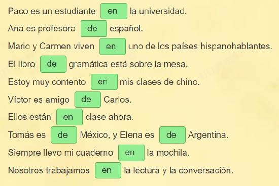

# 语法
## 第一单元
- 一个词有几个元音，就有几个音节
- 名词变复数
    - 元音结尾加-s amigo / amigos
    - 辅音：-es profesor / profesores
    - -z: z变c加-es， lápiz / lápices

- 名词的性
  - "o"结尾：阳性
  - "a" 阴性 sopa silla mesa
  - 辅音结尾的阳性名词，此为添加a构成阴性
    - profesor / profesora

| 人称 | llamo变化 |
| ---- | ---- |
|yo|me llamo|
|tú|te llamas|
|él, ella|se llama|
|nosotros, nosotras|nos llamamos|
|vosotros, vosotras|os llamáis|
|ellos, ellas, ustedes|se llaman|

### 不定冠词

||单数|复数|
| ---- | ---- | ---- |
|阳性|un|unos|
|阴性|una|unas|
## 第二单元
### 一、第一变位规则动词陈述式现在时的变位 (Presente del indicativo de los verbos regulares de la primera conjugación)
西班牙语的原形动词都以 -ar, -er 或 -ir 结尾。动词变位有规则和不规则之分。以 -ar 结尾的规则变位动词为第一变位动词。
第一变位规则动词的变位是去掉原形动词的词尾 -ar，然后在词根上加如下各人称的词尾：

| 人称 | 词尾 | 例词：estudiar |
| ---- | ---- | ---- |
| yo | -o | estudio |
| tú | -as | estudias |
| él, ella, usted | -a | estudia |
| nosotros, nosotras | -amos | estudiamos |
| vosotros, vosotras | -áis | estudiáis |
| ellos, ellas, ustedes | -an | estudian |

!!! note "符合此规则的单词"
    | 西语 | 中文 | 西语 | 中文|
    | ---- | ---- |---|---|
    | Bailar | 跳舞 | Enseñar | 教 |   
    | Estudiar | 学习 |Preguntar | 问 |
    | Amar | 爱 | Caminar | 走 |
    | Viajar | 旅游 |
### 二、不规则动词 ESTAR 和 TENER 的陈述式现在时变位 (Presente del indicativo de los verbos irregulares ESTAR y TENER)

| 人称 | estar | tener |
| ---- | ---- | ---- |
| yo | estoy | tengo |
| tú | estás | tienes |
| él, ella, usted | está | tiene |
| nosotros, nosotras | estamos | tenemos |
| vosotros, vosotras | estáis | tenéis |
| ellos, ellas, ustedes | están | tienen |

!!! note "estar 用法"
    表示位置/地点/行动/情况/感情

    **ser 表示永久条件； estar表示暂时情况**

!!! note "tener 用法"
    - 身体需要 tengo sed 渴
    - 有 tengo un gato 我有一只猫
    - 个人信息 tengo diez años 我有十岁
    - 义务 tengo que estudiar
        - tener que + 动词原形 必须做某事
### 三、名词的数 (Número del sustantivo) (II)
1. 以辅音结尾的名词，在变为复数形式时，词尾加 -es。
   - usted → ustedes
   - quién → quiénes
   - alemán → alemanes
2. 有些单词在从单数变为复数时，书写上会发生变化。
   - A. 为了保持原有的发音而改变字母。
     - lápiz → lápices
   - B. 为了保持原有的重读音节而去掉重音符号。
     - alemán → alemanes
     - conversación → conversaciones
   - C. 为了保持原有的重音而添加重音符号。
     - joven → jóvenes

!!! note
    **物主形容词需与所修饰的名词在 “数” 上保持一致**

    - ¿Son vuestros amigos?
    - ¿Son nuestras profesoras?
### UNIDAD 2 第二课

### 四、定冠词 (Artículo determinado)
1. **形式**
西班牙语中的定冠词有单数和复数与阳性和阴性之分。

|  | 单数 | 复数 |
| ---- | ---- | ---- |
| 阳性 | el | los |
| 阴性 | la | las |

!!! warning
    el $\neq$ él
2. **用法**
定冠词用在名词、数词或形容词之前，并与之保持性、数的一致。其功能之一是标出名词所指概念为已知或定指信息。
- 例：el profesor Ramirez；la lengua china；los estudiantes de español；las amigas de Susana
定冠词不重读，与名词连读，构成一个语音单位。
- 例：Él es el novio de la chica.；La profesora Ramirez es chilena.；Los tres profesores trabajan mucho.

### 五、介词 DE 和 EN 的用法 (Usos de las preposiciones DE y EN)
**de**
   - 表示所属或拥有 El coche de Juan 胡安的汽车
   - 来源或出处 Soy de México. 来自墨西哥
   - 材料或成分 Una mesa de madera. 由木材制成的桌子
   - 原因或动机 Estoy cansado de tanto trabajo 因为工作太多而疲倦
1. 介词 de 的主要用法之一是表示所属，用来回答 ¿de quién?, ¿de qué? 等提问。
    - ¿De quién es novio Rosa?
    - Ricardo es el novio de Rosa

2. 介词 de 后面出现单数阳性定冠词 el 时，应当缩写为 del。
   - 例：Ella es amiga del profesor González.；La novia del chico se llama Elena.

**en**

- 地点： Estoy en casa
- 时间： Nos vemos en mayo 五月见面
- 交通工具/出行方式：Viajamos en avión 乘飞机旅行
- 方式方法：Escribo la carta en español 用西班牙语写信
1. 介词 en 的主要用法之一是表示地点，用来回答以 ¿dónde? 提出的问题。

   - 例：Ahora estamos en China. （¿Dónde están ustedes?）；Enseño nuestra lengua en una universidad de este país. （¿Dónde enseñas vuestra lengua?）

## 第三单元

### 1 形容词的性、数及其与名词关系

1. 形容词与名词阴阳性保持一致
   1. 形容词词尾o->o/o->a
   2. 形容词词尾e：没有变化
2. 形容词与名词单复数一直
   1. 元音结尾：+s
   2. 辅音结尾：+es 

!!! note 
    一些形容词变复数时需要添加重音符号，或去掉重音符号
    
    inglés → ingleses

    joven → jóvenes

### 2 非重读物主形容词

| 人称         | 单数形式 - 阳性 | 单数形式 - 阴性 | 复数形式 - 阳性 | 复数形式 - 阴性 |
| ------------ | --------------- | --------------- | --------------- | --------------- |
| 第一人称单数 | mi（我的）| mi（我的）| mis（我的）| mis（我的）|
| 第二人称单数 | tu（你的）| tu（你的）| tus（你的）| tus（你的）|
| 第三人称单数 | su（他的，她的，您的，它的） | su（他的，她的，您的，它的） | sus（他的，她的，您的，它的） | sus（他的，她的，您的，它的） |
| 第一人称复数 | nuestro（我们的） | nuestra（我们的） | nuestros（我们的） | nuestras（我们的） |
| 第二人称复数 | vuestro（你们的） | vuestra（你们的） | vuestros（你们的） | vuestras（你们的） |
| 第三人称复数 | su（他们的，她们的，诸位的，它们的） | su（他们的，她们的，诸位的，它们的） | sus（他们的，她们的，诸位的，它们的） | sus（他们的，她们的，诸位的，它们的） |

### 3 不规则动词 IR 的陈述式现在时变位 

| 人称 | ir |
| ---- | ---- |
| yo | voy |
| tú | vas |
| él, ella, usted | va |
| nosotros, nosotras | vamos |
| vosotros, vosotras | vais |
| ellos, ellas, ustedes | van |

### 4 介词 A 的用法 (Uso de la preposición A)

介词 a 的最主要用法是表示方向或目的。

**例**  
Los hermanos de José van **a** la universidad.  
¿Adónde van ustedes?

**注意**  
介词a与dónde连用时，应合写为adonde。

介词 a 与定冠词 el 连用时缩合成 al。

**例**  
Los hermanos de José van *al* colegio.  
Ahora vamos *al* hospital.

### 五. 移行规则

当一个单词到行尾尚未写完，需要拆开，移至下一行行首时，须遵守下列规则：

1. 单词必须按照音节断开移行，同时在行尾的音节之后添加符号 “-”。

2. 音节较少的单词不要拆开移行，而要整个移至下一行。
    
    **例**  
    José tiene cuatro clases por la mañana.  
    Mis padres están muy ocupados, por eso regresan a casa tarde.

    
